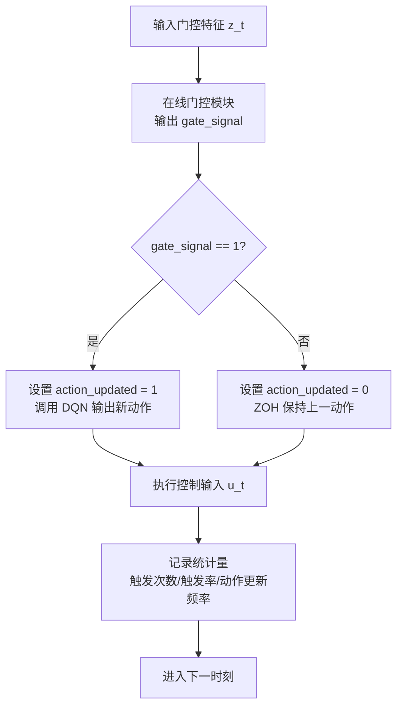
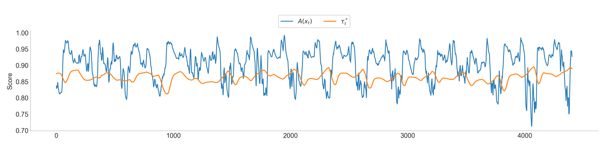
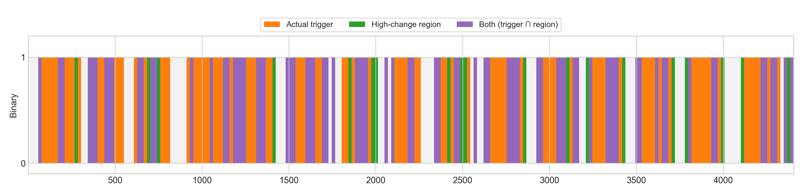
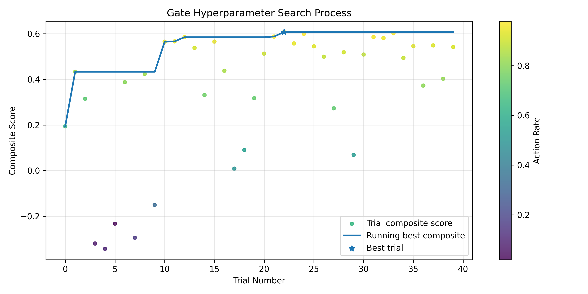

# 基于动态事件触发的 HVAC 强化学习预测控制方法

# 1. 引言

随着全球气候变化的加剧，建筑行业的节能减排已成为亟待解决的关键问题。相关统计数据显示，建筑能耗占全球终端能耗的 35% 以上，其中供暖、通风与空调系统（HVAC）不仅占据了建筑整体能耗的约 50%，也是电力需求侧响应的关键调节资源。在中央空调系统中，冷水机组作为核心耗能部件，其运行效率直接决定了系统的整体性能。优化冷冻水供水温度（$T_{\text{chws}}$）已被证明是平衡能耗与室内热舒适度的有效手段之一。然而，实际工程中的 HVAC 控制面临着严峻挑战：建筑热负荷受室外气象条件、室内人员流动及设备散热等多重动态因素的耦合影响，表现出高度的非线性、时变特性与大惯性滞后。

针对上述挑战，工业界与学术界长期依赖基于显式先验知识的控制范式。具体而言，以基于规则的控制（RBC）和比例-积分-微分（PID）为代表的传统方法，高度依赖工程师人工标定的静态参数模型与经验规则；而以模型预测控制（MPC）为代表的全局优化算法，则要求针对目标建筑构建高精度的机理或灰盒模型。尽管上述基于模型或显式规则的方法在特定稳态工况下表现良好，但真实建筑的热系统往往具有高度非线性与时变特性。在高度异构的实际工程场景中，针对不同建筑逐一进行系统辨识与精准建模不仅耗费巨大的时间与经济成本，且随着设备组件的长期磨损与建筑热特性的季节性漂移，固定参数的物理模型容易出现控制性能衰退。过度依赖显式环境模型与专家先验知识的传统范式难以自适应多变工况，亟待引入新型智能控制架构。

为克服上述传统控制的局限性，深度强化学习（Deep Reinforcement Learning, DRL）凭借其无模型的自适应决策能力，近年来在 HVAC 控制领域展现出了巨大潜力。DRL 能够通过与复杂时变环境的直接交互，自主学习并适应非线性工况；结合时序特征的预测型 DRL 更是进一步提升了智能体的前瞻预测能力，有效缓解了建筑大热惯性带来的控制滞后。然而，现有 DRL 在实际工程部署中仍受限于一个根本性的控制范式：固定时间步长控制（Time-Triggered Control, TTC）。在这种机制下，智能体严格按预设时钟周期进行强制性的状态采样与动作更新，忽略了建筑热负荷在时间维度上演变的非均匀特性。这种固定频率的驱动方式导致了响应速度与控制代价之间的固有矛盾：高频控制虽能迅速响应环境扰动，却会带来显著的计算开销与执行器机械磨损；低频控制虽能降低硬件损耗，却易造成控温精度下降。

针对 TTC 范式造成的计算开销与磨损问题，事件驱动控制（Event-Triggered Control, ETC）机制应运而生。ETC 基于按需决策理念，仅在系统状态发生显著偏离时激活控制更新。这种稀疏控制机制有效突破了时间步长的硬性约束，为缓解响应速度与控制代价之间的冲突提供了理想途径。然而，现有 ETC 方案主要依赖基于专家先验知识的静态规则，例如设定固定的温度死区或负荷波动阈值。这种静态触发机制在面对高度非线性且时变的真实建筑环境时缺乏动态适应能力，难以适应不同建筑的热惯性差异以及设备老化后的性能漂移，极易导致频繁误触发或控制响应迟滞现象。

理想的事件触发机制应降低对显式物理规则的依赖，将事件识别过程建模为基于流式状态数据分布的异常检测问题。关键控制时刻本质上体现为系统状态对历史稳态分布的显著偏离。因此，若能利用无监督学习技术在线捕捉状态分布特征，并以特征空间的分布距离作为动态触发信号，便能在不依赖人工设定的前提下实现对多变工况的自适应感知。基于此，本文提出了一种结合时序预测与无监督动态事件触发的新型 HVAC 控制框架（ET-PRL）。本文的主要贡献如下：

- **提出基于流式特征的无监督动态事件门控机制**：在 ET-PRL 框架中构建了融合多尺度异常追踪与双层自适应阈值的门控模块，摆脱了对静态人工规则的依赖，实现了对时变工况下非平稳扰动的自适应感知。
- **构建时序解耦的事件驱动预测型控制架构**：将事件门控机制无缝融入预测型强化学习框架，使策略网络仅在关键扰动时激活，并在平稳期依靠零阶保持器（ZOH）维持控制输出。该架构通过与预测状态特征的深度耦合，有效克服了稀疏按需执行带来的状态观测盲区与预测能力缺失。
- **实现控制精度与系统执行代价的有效折衷**：在真实冷水机组运行场景下的综合评估表明，本文所提框架能够在维持近乎无损的综合控制表现的前提下，有效抑制平稳工况下的高频无效调节。该实证结果不仅验证了按需控制机制在复杂非线性热力系统中的有效性，也为深度强化学习算法在实际工程中的低损耗边缘部署提供了可行的方案。

# 2. 相关工作

为应对建筑能耗激增与居住者热舒适需求之间的矛盾，传统控制策略旨在通过预设逻辑或反馈调节机制保障 HVAC 系统的鲁棒运行 [1]。基于规则的控制（RBC）作为经典范式，依赖预设的逻辑阈值或时间表，有效解决了系统的基础启停调度与模式切换问题 [2]；比例-积分-微分（PID）控制则通过误差反馈机制连续调整执行器状态，实现了对设定点的快速追踪 [3]。针对传统控制器参数固定、适应性差的局限性，已有研究引入遗传算法或模糊逻辑对 RBC 阈值及 PID 参数进行离线或在线寻优，以提升其在特定工况下的响应性能 [4]。尽管上述方法凭借其部署便捷性与高可靠性在工业界占据主导地位，但由于其本质上依赖静态规则或线性假设，难以有效捕捉现实建筑环境中的非线性耦合特征、动态时变扰动及大滞后特性，导致其在复杂多变的运维场景下，往往难以在能效优化与热舒适度保障之间取得理想的平衡 [5]。

为克服传统控制在非线性建模与动态适应上的瓶颈，数据驱动的计算范式逐渐成为解决复杂热环境控制问题的主流路径。其中，深度强化学习（DRL）凭借其强大的表征学习能力，能够在无需显式构建系统动力学方程的前提下，通过与环境的试错交互端到端地优化控制策略 [6]。以深度 Q 网络（DQN）和深度确定性策略梯度（DDPG）为代表的算法，成功实现了从高维传感数据到控制动作的映射，并在多区域协同优化任务中展现出优于传统策略的潜力 [7][8]。然而，标准 RL 框架主要基于当前状态进行反应式决策，在面对具有显著热惯性与大滞后的 HVAC 系统时，易因缺乏前瞻性导致控制滞后或系统振荡 [9]。为缓解该问题，近期研究尝试将长短期记忆网络（LSTM）等序列模型融入 DRL 框架，利用其捕捉长时序依赖的能力预测负荷波动或温度演变。通过将预测信息编码为增广状态，此类集成方法有效增强了智能体对环境演变的感知能力，改善了控制过程的平稳性 [10]。

在追求控制算法智能化的同时，如何通过机制创新降低计算负载与硬件损耗成为另一关键研究维度。事件驱动控制（Event-Triggered Control, ETC）作为一种高效执行范式，其核心在于按需响应的运行机理：系统仅在状态误差越限或特定事件发生时，才触发控制更新与通信传输 [11]。该机制有效消除了传统时间触发控制中的计算冗余，显著降低了执行器动作频率与通信开销 [12]。然而，现有 ETC 策略在工程实践中仍高度依赖基于专家经验的静态阈值逻辑 [13]。此类硬编码规则缺乏对非平稳建筑环境的泛化能力：面对建筑热工特性的漂移、多变气候条件及设备老化效应，固定阈值难以自适应调整，往往面临触发过于敏感导致计算资源浪费，或响应迟滞导致舒适度受损的双重挑战 [14]。这也为本文提出基于无监督学习的数据驱动动态事件定义机制提供了切入点。

本文将 HVAC 系统的事件触发机制建模为在线无监督异常检测过程，提出了一种耦合动态门控与预测型强化学习的按需控制框架（ET-PRL）。与依赖静态规则的传统方法及 ETC 相比，本文通过流式特征追踪与自适应阈值判定触发条件，摆脱了人工经验束缚，在面对长期运行的概念漂移时具备更稳健的感知能力。与固定时间步长的强化学习范式不同，本框架利用事件驱动机制解耦决策时序，在削减冗余推理与设备磨损的同时，依靠前瞻预测特征弥补了稀疏控制带来的观测盲区。通过上述设计，本文在真实建筑的非平稳工况下实现了控制精度与执行代价的有效折衷，为深度强化学习的低损耗工程部署提供了可行方案。

> [1] Chaya, P., et al. "Human-Centric Smart Energy Optimization and Automation System." 2025 3rd International Conference on Intelligent Cyber Physical Systems and Internet of Things (ICoICI). IEEE, 2025.
> 
> 
> [2] Choi, Youngsik, et al. "Optimization-informed rule extraction for HVAC system: A case study of dedicated outdoor air system control in a mixed-humid climate zone." *Energy and Buildings* 295 (2023): 113295.
> 
> [3] Lee, Dongkyu, Jinhwa Jeong, and Young Tae Chae. "Application of deep reinforcement learning for proportional–integral–derivative controller tuning on air handling unit system in existing commercial building." *Buildings* 14.1 (2023): 66.
> 
> [4] Chojecki, Adrian, Arkadiusz Ambroziak, and Piotr Borkowski. "Fuzzy controllers instead of classical PIDs in HVAC equipment: Dusting off a well-known technology and Today’s implementation for better energy efficiency and user comfort." *Energies* 16.7 (2023): 2967.
> 
> [5] Lu, Shengze, et al. "Exploring the comprehensive integration of artificial intelligence in optimizing HVAC system operations: A review and future outlook." *Results in Engineering* 25 (2025): 103765.
> 
> [6] Savino, Sabrina, et al. "Deploying deep reinforcement learning for low-level HVAC control in multi-zone buildings: A comparative study with ASHRAE G36 sequences." *Energy and Buildings* (2025): 116456.
> 
> [7] Wang, Man, and Borong Lin. "MF^ 2: Model-free reinforcement learning for modeling-free building HVAC control with data-driven environment construction in a residential building." *Building and Environment* 244 (2023): 110816.
> 
> [8] Zhuang, Dian, et al. "Data-driven predictive control for smart HVAC system in IoT-integrated buildings with time-series forecasting and reinforcement learning." *Applied Energy* 338 (2023): 120936.
> 
> [9] Kondath, Namitha, et al. "Enhancing Day-Ahead Cooling Load Prediction in Tropical Commercial Buildings Using Advanced Deep Learning Models: A Case Study in Singapore." *Buildings* 14.2 (2024): 397.
> 
> [10] Li, Kai, Wei Ni, and Falko Dressler. "LSTM-characterized deep reinforcement learning for continuous flight control and resource allocation in UAV-assisted sensor network." *IEEE Internet of Things Journal* 9.6 (2021): 4179-4189.
> 
> [11] Liu, Xinghua, et al. "Event‐triggered load frequency control of smart grids under deception attacks." *IET Control Theory & Applications* 15.10 (2021): 1335-1345.
> 
> [12] Xue, Zhouzhou, Zhaoxu Yu, and Shugang Li. "Event-triggered adaptive neural control for uncertain nontriangular nonlinear systems with time-varying delays." *International Journal of Control, Automation and Systems* 20.12 (2022): 4090-4099.
> 
> [13] Liu, Derong, et al. "Adaptive dynamic programming for control: A survey and recent advances." *IEEE Transactions on Systems, Man, and Cybernetics: Systems* 51.1 (2020): 142-160.
> 
> [14] Heer, Philipp, et al. "Comprehensive energy demand and usage data for building automation." *Scientific Data* 11.1 (2024): 469.
> 

# 3. 方法

## 3.1 总体框架

针对建筑HVAC系统存在的热惯性与响应滞后特性，以及运行工况随季节变化导致的分布漂移，传统依赖离线标定与静态阈值的事件控制方法在跨工况迁移时通常需要频繁再校准，进而增加工程维护成本。为此，本文提出一种将流式异常门控与深度强化学习耦合的按需控制框架，即事件触发预测型强化学习（Event-Triggered Predictive Reinforcement Learning, ET-PRL）。

如图1所示，ET-PRL 的核心思想是在保持控制目标与约束一致的前提下，通过事件触发机制降低强化学习策略在平稳阶段的无效推理调用频率，从而在计算开销与控制性能之间取得更优折衷。与依赖固定专家规则或离线训练分类器进行事件判别的做法不同，该框架采用无监督的在线门控策略，根据系统状态分布的统计偏离程度动态确定触发时刻。整体框架由以下三层机制组成：

1. **在线的流式异常门控机制（Fully Online Streaming Anomaly Gating Mechanism）**：面向长期运行中的概念漂移，构建无需离线训练的异常检测门控模块。该模块在线追踪状态的多尺度统计特征，并结合流式隔离深度与自适应阈值策略输出事件触发信号，实现控制事件的在线标定。
2. **预测型全局强化学习网络（Predictive Global Reinforcement Learning Network）**：面向系统级能效优化与动作选择，采用轻量级深度 Q 网络（DQN）学习控制策略；网络仅在门控机制判定发生关键动态事件时被激活，以减少平稳阶段的冗余推理计算。
3. **事件驱动执行与零阶保持（Event-Driven Execution with ZOH）**：在边缘部署场景下，系统将状态感知、事件判别、策略推理与动作执行构建为低时延闭环控制流程；在非触发时段，采用零阶保持器（Zero-Order Hold, ZOH）维持上一时刻控制指令，以降低控制切换频率并减小对执行机构与系统稳定性的不利影响。

## 3.2 基于流式特征追踪的动态事件系统定义

建筑空调系统在长期运行过程中受到气象扰动、设备性能退化和人员行为随机性的共同影响，其状态分布呈现显著非平稳性。基于固定阈值的事件判定方法难以适应该类时变环境，并易导致误触发或漏触发。基于此，本文将事件触发建模为在线无监督异常检测问题，通过实时刻画状态分布偏离程度定义动态触发时刻。

### 3.2.1 门控输入特征定义
为保证门控判定与控制状态建模在符号层面的一致性，本文将事件门控模块输入定义为三维特征向量，并在后续章节沿用该记号：
$$
z_t=[Q_{load}^t,\,T_{wb}^t,\,\hat{Q}_{load}^{t+1}],
$$
其中，$Q_{load}^t$ 表示当前时刻系统冷负荷，$T_{wb}^t$ 表示室外湿球温度，$\hat{Q}_{load}^{t+1}$ 表示对下一时刻冷负荷的短期预测值。上述设计不仅保证了状态表示的低维紧凑性，更同时融合了能够反映当前运行工况与短期前瞻演变趋势的关键特征信息，进而为实现后续的高效异常评分计算及合理触发判定奠定了统一的特征空间基础。

### 3.2.2 流式隔离深度与多尺度异常追踪
传统离线异常检测依赖静态样本库，在季节性漂移场景下稳定性有限。为此，本文采用流式隔离深度机制，对在线到达的门控输入特征 $z_t$ 进行实时异常评分。算法维护动态参考集合，并在每个时刻输出三类尺度分数：短时分数 $A_{\mathrm{short}}(z_t)$、中时分数 $A_{\mathrm{medium}}(z_t)$ 和长时分数 $A_{\mathrm{long}}(z_t)$。

综合异常分数定义为
$$
A(z_t)=w_{\mathrm{s}}A_{\mathrm{short}}(z_t)+w_{\mathrm{m}}A_{\mathrm{medium}}(z_t)+w_{\mathrm{l}}A_{\mathrm{long}}(z_t),
$$
其中 $w_{\mathrm{s}}, w_{\mathrm{m}}, w_{\mathrm{l}} \ge 0$ 且 $w_{\mathrm{s}}+w_{\mathrm{m}}+w_{\mathrm{l}}=1$ 分别代表对应时间尺度的融合权重。该多尺度加权分数结构旨在兼顾对于短时高频扰动的敏感响应以及对于中长期慢变漂移的稳健感知能力。

### 3.2.3 流式双层自适应阈值优化
为将连续异常分数转化为触发判定，本文构建双层自适应阈值机制，包括全局阈值与局部阈值两部分。

设最近 $W$ 个异常分数组成集合 $\mathcal{A}_t=\{A(z_{t-W+1}),\ldots,A(z_t)\}$。首先计算分位数阈值与鲁棒统计阈值：
$$
\tau_{q}^{(t)}=Q_q(\mathcal{A}_t), \quad
\tau_{\mathrm{mad}}^{(t)}=\operatorname{med}(\mathcal{A}_t)+\kappa \cdot c \cdot \operatorname{MAD}(\mathcal{A}_t),
$$
$$
\operatorname{MAD}(\mathcal{A}_t)=\operatorname{med}\left(\left|A-\operatorname{med}(\mathcal{A}_t)\right|\right),\quad A\in\mathcal{A}_t.
$$
其中，$Q_q(\cdot)$ 表示集合的 $q$ 分位数；$\operatorname{med}(\cdot)$ 表示中位数函数；$\operatorname{MAD}$ 为绝对中位差；$\kappa$ 为灵敏度调节系数；$c$ 为尺度一致性常数（在正态分布假设下通常取 $c \approx 1.4826$），用于使该项成为标准差的渐近无偏估计。

局部候选阈值由二者加权融合得到：
$$
\tau_{\mathrm{cand}}^{(t)}=\omega_q\tau_q^{(t)}+(1-\omega_q)\tau_{\mathrm{mad}}^{(t)}.
$$
其中，$\omega_q \in [0,1]$ 为加权系数，用以平衡分位数的稳健性与统计阈值的灵敏度。

随后采用局部更新率进行平滑更新（在满足最小样本条件后按固定步频执行）：
$$
\tau_{\mathrm{local}}^{(t)}=(1-\lambda_{\mathrm{local}})\tau_{\mathrm{local}}^{(t-1)}+\lambda_{\mathrm{local}}\tau_{\mathrm{cand}}^{(t)}.
$$
其中，$\lambda_{\mathrm{local}} \in (0,1]$ 为局部平滑更新率。

全局阈值跟踪局部阈值并采用指数移动平均更新：
$$
\tau_{\mathrm{global}}^{(t)}=(1-\lambda_{\mathrm{g}})\tau_{\mathrm{global}}^{(t-1)}+\lambda_{\mathrm{g}}\tau_{\mathrm{local}}^{(t)}.
$$
其中，$\lambda_{\mathrm{g}} \in (0,1]$ 为全局移动平均更新率，通常设定较小的值以捕捉长期趋势。

基础自适应阈值定义为
$$
\tilde{\tau}_t=\alpha\tau_{\mathrm{local}}^{(t)}+(1-\alpha)\tau_{\mathrm{global}}^{(t)}+b_{\mathrm{bias}},
$$
其中 $\alpha\in[0,1]$ 控制局部与全局阈值权重，$b_{\mathrm{bias}}$ 为稳态容限偏置项。

## 3.3 纯在线流式的事件级门控构建

基于第 3.2 节定义的门控输入、综合异常分数与双层自适应阈值，本文构建在线流式事件门控模块（Streaming Anomaly Gate）。该模块不依赖离线标签或预训练分类器，仅通过在线统计量更新完成触发判定与阈值校准。

在每个控制时刻，门控模块接收当前门控特征 $z_t$，计算异常分数 $A(z_t)$ 并执行二值触发检验：
$$
\tau_t^*=\operatorname{clip}(\tilde{\tau}_t+m_{\mathrm{hys}},0,1),
$$
$$
\mathrm{Trigger}(z_t)=\mathbb{I}\left(A(z_t)>\tau_t^*\right)\land\mathbb{I}\left(t-t_{\mathrm{last}}>\Delta_{\min}\right)
$$
其中，$m_{\mathrm{hys}}$ 为滞回边界，$\Delta_{\min}$ 为最小触发间隔。$\mathrm{Trigger}(z_t)=1$ 表示当前时刻触发控制更新，$\mathrm{Trigger}(z_t)=0$ 表示维持上一时刻控制动作。为表征触发强度，可定义边界距离
$$
\delta_t = |A(z_t)-\tau_t^*|,
$$
并采用单调映射函数获得触发置信度用于后验分析。每次判定后，异常分数与阈值统计量均在线更新，从而形成判断与更新一体化的闭环机制。

该门控结构通过按需触发减少平稳阶段的冗余决策调用，同时在分布漂移场景下保持阈值与触发频率的自适应稳定性，为后续强化学习策略的稀疏调用提供一致的事件接口。

## 3.4 面向全局控制策略的深度强化学习

在所提事件驱动控制框架中，全局控制器负责在判定为关键时刻（即 $\mathrm{Trigger}(z_t)=1$ ）时被激活并输出能效优化动作，而在平稳期或非关键时刻（即 $\mathrm{Trigger}(z_t)=0$ ）则不进行推理计算，而是由底层控制系统通过零阶保持器维持先前的控制指令。

为兼顾控制性能与边缘设备的部署开销，本文构建结合短期负荷预测信息的轻量级 DQN（Deep Q-Network）智能体。全局强化学习控制器在触发时刻接收系统完整状态信息，并以最小化能源消耗以及降低设备磨损为导向构建综合奖励函数，从而输出高层优化设定值（如冷冻水供水温度优化目标）。同时，该模块采用分层执行策略将高层无模型优化决策与底层实际设备的物理安全约束解耦，确保生成的动作在实际部署中的可行性与安全性。

### 3.4.1 马尔可夫决策过程建模

针对楼宇控制场景中状态高维、样本相关性强的问题，本文构建紧凑离散时间 MDP 模型 $\langle \mathcal{S}, \mathcal{A}, \mathcal{P}, \mathcal{R}, \gamma \rangle$。

状态空间定义为
$$
s_t = [Q_{load}^t, T_{wb}^t, \hat{Q}_{load}^{t+1}],
$$
其中 $Q_{load}^t$ 为当前冷负荷，$T_{wb}^t$ 为室外湿球温度，$\hat{Q}_{load}^{t+1}$ 为下一时刻冷负荷预测值。引入预测项可在不显式扩展长历史窗口的前提下提升策略前瞻性。

动作空间 $\mathcal{A}$ 设定为离散化供水温度设定点集合，智能体在时刻 $t$ 输出动作 $a_t\in\mathcal{A}$。为保证执行安全性，控制架构采用分层策略：高层强化学习模块负责设定点优化，底层规则模块负责机组启停及最小运行时长等约束执行。

奖励函数采用归一化加权形式
$$
r_t = \omega_{\eta} r_t^{\mathrm{energy}} + \omega_{\tau} r_t^{\mathrm{comfort}},
$$
其中 $\omega_{\eta},\omega_{\tau}\ge 0$ 且 $\omega_{\eta}+\omega_{\tau}=1$。能效项定义为
$$
r_t^{\mathrm{energy}} = 1 - \frac{P_t}{P_{\mathrm{ref}}},
$$
其中 $P_t$ 为机组实时功率，$P_{\mathrm{ref}}$ 为额定参考功率。舒适度项采用高斯径向基形式
$$
r_t^{\mathrm{comfort}} = \exp \left( -\frac{1}{2} \left( \frac{T_t - T_{\mathrm{set}}}{\sigma} \right)^2 \right),
$$
其中 $T_t$ 为实际供水温度，$T_{\mathrm{set}}$ 为目标设定温度，$\sigma$ 为舒适度敏感度参数。该奖励设计在节能目标与温控约束之间提供平滑权衡信号。

### 3.4.2 结合预测特征的轻量级 DQN 实现

考虑状态维度已压缩至关键特征子集，本文采用多层感知机构建轻量级 DQN 主体网络，以降低边缘部署场景下的推理延迟与存储开销；在实现层面，训练阶段遵循标准逐步交互流程，即在每个时间步执行动作选择、环境步进、经验回放写入与参数更新，而第 3.3 节事件门控机制仅用于事件驱动执行与评估阶段，在触发时更新动作、未触发时保持上一动作，从而在不改变 DQN 基本训练范式的前提下实现动作更新稀疏化，并为下一节在线事件驱动系统交互机制提供实现基础。

## 3.5 在线事件驱动系统交互机制

在在线运行阶段，系统按固定接口顺序完成事件驱动交互：首先输入门控特征 $z_t=[Q_{load}^t,\,T_{wb}^t,\,\hat{Q}_{load}^{t+1}]$ 至门控模块，获得门控输出信号 $\text{gate\_signal}$，并据此生成动作更新标志 $\text{action\_updated}$；当触发更新时调用策略网络输出新动作，当未触发时采用零阶保持器（Zero-Order Hold, ZOH）维持上一时刻控制指令，其执行律为
$$
u_t = \begin{cases}
\pi_{\mathrm{DQN}}(s_t), & \text{if } \mathrm{Trigger}(s_t) = 1 \\
u_{t-1}, & \text{if } \mathrm{Trigger}(s_t) = 0
\end{cases}
$$
同时记录触发次数、触发率与动作更新频率等统计量用于性能评估。该机制在保证控制连续性的前提下抑制平稳工况下的频繁调节，并降低执行器切换开销。

机制流程如图 X 所示。

图 X. 在线事件驱动控制机制流程图。系统在每个时刻按输入特征、门控判定、动作更新与执行、统计记录的顺序完成闭环交互；其中，触发分支调用 DQN 更新动作，非触发分支通过零阶保持维持控制连续性。

# 4. 实验及结果

## 4.1 实验设置与基准模型构建 (Experimental Setup and Baseline Construction)

### 4.1.1 仿真环境与数据集描述

1. 建筑热力系统建模
   
    本研究选取上海某真实商业建筑的暖通空调（HVAC）系统作为物理模型，利用 EnergyPlus 软件构建仿真环境。该模型已在课题组前期工作中通过实测数据完成了参数校验，能够准确反映系统的热力学特性。冷源系统配置为典型的一次泵定流量系统（Primary Constant Flow System），核心组件包括离心式冷水机组、冷冻水泵、冷却水泵及冷却塔。
    
    为准确模拟系统的能耗与热力学特性，本研究严格设定了各核心组件的额定参数。系统关键设备的设计参数汇总如表所示。
    
    | **设备名称** | **数量 (台)** | **额定功率(Pref, kW)** | **额定容量 / 流量** | **运行特性与关键参数** |
    | --- | --- | --- | --- | --- |
    | **离心式冷水机组** | 3 | 314 | 1760 kW (制冷量) | COP随负荷变化；  设定温度 $T_{set}=7\text{°C}$ (范围: $6\sim15\text{°C}$) |
    | **冷冻水泵** | 3 | 15 | 252 $m^3/h$ | 定速运行；  额定扬程: $15\ \text{m}$ |
    | **冷却水泵** | 3 | 55 | 366 $m^3/h$ | 定速运行；  额定扬程: $33\ \text{m}$ |
    | **冷却塔** | 3 | 16.5 | 392 $m^3/h$ | 变工况特性；  性能与湿球温度 $T_{wb}$ 强耦合 |
    
    基于表中的参数，冷冻水侧的热量传递过程遵循热力学基本定律。本研究在计算中采用标准水物性参数（比热容 $c_p = 4.2\ \text{kJ/(kg}\cdot\text{K)}$，密度 $\rho_{\text{water}} = 1000\ \text{kg}/\text{m}^3$），瞬时冷负荷计算公式如下：
    
    $$
    Q_{load} = \rho_{water} \cdot F_{chw} \cdot c_p \cdot (T_{chwr} - T_{chws})
    $$
    
    其中，$Q_{load}$ 表示建筑冷负荷需求（$\text{kW}$），$F_{chw}$ 为冷冻水流量，$T_{chwr}$ 与 $T_{chws}$ 分别代表冷冻水的回水与供水温度。该物理模型确保了仿真环境能够真实反映控制策略对系统热力状态的影响。
    
2. 气象与负荷数据集特征
   
    本研究采用基于上海地区典型气象年（TMY）生成的建筑冷负荷仿真数据集。采样间隔设为 $5\text{min}$。数据覆盖完整制冷季（7 月 1 日至 10 月 10 日），共 $102$ 天、$29,376$ 个时间步，包含日内周期与季节波动。统计结果显示，冷负荷峰值为 $5102.77\ \text{kW}$、标准差为 $962.02\ \text{kW}$（$CV=37.3\%$），室外湿球温度 $T_{wb}$ 分布于 $21\ \text{°C} \sim 28\ \text{°C}$。该数据特征可为事件触发策略在高波动工况下的实时性与鲁棒性评估提供有效支撑。

    在数据预处理阶段，针对原始仿真数据中的非物理性负值震荡异常（共 8 处）采用零值截断进行修正，并引入由 LSTM 模型生成的下一时刻负荷预测值（$\hat{Q}_{load}^{t+1}$）作为增强特征，以构建包含当前状态与未来趋势的状态表示。
    
3. 数据集划分
   
    为避免时间序列预测中的未来信息泄露（Data Leakage）问题，并确保实验结果的真实性，本研究严格采用时间序列顺序划分（Chronological Split）策略。数据集按时间顺序划分为训练集、验证集和测试集，比例设定为 70:15:15。
    

### 4.1.2 实验配置与超参数设置

本节给出实验中采用的核心超参数设置。为保证实验可复现性，表 1 所列参数在各组实验中保持一致。除特别说明外，系统采样间隔统一为 5 分钟。所有超参数均通过贝叶斯优化算法确定，并在验证集上完成性能筛选后固定用于后续对比实验。

1. **DQN 智能体 (DQN Agent)**：控制策略采用三层多层感知器结构 [256, 128, 64]，状态维度为 3，离散动作数量为 10。训练阶段采用经验回放与目标网络更新机制，并通过指数衰减的 $\epsilon$-greedy 策略平衡探索与利用。
2. **在线流式门控 (Streaming Anomaly Gate)**：门控模块由多尺度异常分数融合与双层阈值优化构成，实现在线触发判定。其关键参数包括局部窗口长度、全局指数平滑系数、阈值偏置项以及短/中/长时间尺度融合权重，用于平衡响应灵敏度与触发稳定性。

| **Module** | **Parameter Description** | **Symbol** | **Value** |
| --- | --- | --- | --- |
| **DQN Agent** | Learning rate | $\alpha$ | $0.0048$ |
|  | Discount factor | $\gamma$ | $0.962$ |
|  | Replay buffer size | $M$ | $20,000$ |
|  | Mini-batch size | $B$ | $178$ |
|  | Epsilon schedule | $\epsilon$ | $0.6109 \to 0.0045$ |
|  | Epsilon decay factor | $\lambda_{\epsilon}$ | $0.9947$ |
|  | Target update frequency | $C$ | $126$ steps |
|  | Network architecture | - | [256, 128, 64] |
|  | State dimension / action cardinality | - | $3 / 10$ |
| **Streaming Anomaly Gate** | Gate EMA Decay ($\lambda$ global) | $\lambda_{\mathrm{g}}$ | $0.0368$ |
|  | Local window size | $W$ | $187$ |
|  | Local update rate | $\lambda_{\mathrm{local}}$ | $0.7938$ |
|  | Reference samples | $N_{\mathrm{ref}}$ | $500$ |
|  | Base contamination | $\nu$ | $0.20$ |
|  | Threshold local alpha weight | $\alpha_{\mathrm{local}}$ | $0.669$ |
|  | Threshold Bias term | $b_{\mathrm{bias}}$ | $-0.106$ |
|  | Threshold quantile | $q$ | $0.5799$ |
|  | Threshold MAD scale | $\kappa$ | $1.0146$ |
|  | Threshold quantile weight | $\omega_q$ | $0.8996$ |
|  | Scale fusing weights (Short/Mid/Long) | $\mathbf{w}$ | $[0.36, 0.40, 0.23]$ |

### 4.1.3 评价指标体系 (Evaluation Metrics)

为全面评估事件触发预测型强化学习框架（ET-PRL）的性能，本研究构建了涵盖能耗效率、热舒适度、控制稀疏性及机制执行效率的多维度评价指标体系。此外，本文同时报告策略执行层统计量，以保障实验结果的完整性与可复现性。

1. 能耗效率指标 (Energy Efficiency Metrics)
   
    能耗效率是建筑能源管理的核心优化目标。本研究以冷水机组（Chiller）的运行功耗为主要计量对象。
    
    - 日均能耗 (Average Daily Energy Consumption, $E_{\text{daily}}$)：计算测试周期内的日平均耗电量（单位：kWh/day）：
      
        $$
          E_{\text{daily}} = \frac{1}{D} \sum_{d=1}^{D} \left( \sum_{t=1}^{T_d} P_{\text{chiller}}(t) \cdot \Delta t \right)
        $$
        
        其中，$D$ 为测试天数，$T_d$ 为第 $d$ 天的时间步总数，$\Delta t$ 为采样间隔（小时），$P_{\text{chiller}}(t)$ 为 $t$ 时刻机组的运行功率（kW）。
        
    - 相对节能率 (Relative Energy Saving Rate, $\eta_{\text{saving}}$)：用于量化 ET-PRL 相较于基准模型（Baseline）的节能效果：
      
        $$
          \eta_{\text{saving}} = \frac{E_{\text{baseline}} - E_{\text{ET-PRL}}}{E_{\text{baseline}}} \times 100\%
        $$
        
        其中 $E_{\text{baseline}}$ 和 $E_{\text{ET-PRL}}$ 分别代表基准策略与本文方法的累积能耗。

    - 平均冷机功率 (Average Chiller Power, $\bar{P}_{\text{chiller}}$)：用于反映整个测试周期的平均负载水平与运行强度：

        $$
            \bar{P}_{\text{chiller}} = \frac{1}{N} \sum_{t=1}^{N} P_{\text{chiller}}(t)
        $$

        其中 $N$ 为测试总步数。该指标与 $E_{\text{daily}}$ 在物理含义上相关，但分别表征单位时间强度与累计能耗。
    
2. 温度控制与稳定性指标 (Temperature Control & Stability Metrics)
   
    本研究采用冷冻水回水温度 $T_{\text{chwr}}$ 作为控制对象，目标区间设定为 $[15.0^\circ\mathrm{C}, 19.0^\circ\mathrm{C}]$。

    - 性能保持率 (Performance Preservation Rate, PPR)：专项评估事件驱动机制有效性的指标，量化 ET-PRL 在稀疏化控制动作条件下对固定步长密集控制策略整体性能的保留程度。其定义如下：
      
        $$
          \text{PPR} = \frac{R_{\text{event}}}{R_{\text{dense}}} \times 100\%
        $$
        
        其中，$R_{\text{event}}$ 与 $R_{\text{dense}}$ 分别为事件驱动策略与固定步长密集策略在同一测试周期内的累积奖励值。
        
    - 动作平滑度 (Action Smoothness, $\sigma_{\Delta a}$)：为量化控制动作对执行器的冲击强度，定义相邻时间步控制量变化的均值指标：
      
        $$
          \sigma_{\Delta a} = \frac{1}{N-1} \sum_{t=1}^{N-1} |a_{t+1} - a_t|
        $$
        
        该值越小，表明控制动作越平稳，能够有效避免执行器震荡（Oscillation）。
    
3. 控制稀疏性指标 (Control Sparsity Metrics)
   
    本类指标旨在量化事件驱动机制在降低通信负载与执行器磨损方面的效果。
    
    - 日均触发次数 (Daily Trigger Count, $N_{\text{daily}}$)：衡量控制频率的物理指标，反映平均每天执行控制动作的次数：
      
        $$
          N_{\text{daily}} = \frac{N_{\text{event}}}{D}
        $$
        
        该指标以有量纲的实物频次直接体现执行器的机械磨损风险。
        
    - 动作压缩比 (Actuation Compression Ratio, ACR)：
      
        $$
          \text{ACR} = \frac{N_{\text{fixed}}}{N_{\text{event}}}
        $$
        
        其中 $N_{\text{fixed}}$ 和 $N_{\text{event}}$ 分别为固定步长策略和事件驱动策略的动作总次数。ACR 值越大，表明事件驱动机制对控制动作的稀疏化效果越显著。

4. 机制与执行效率指标 (Mechanism & Execution Metrics)

    为综合刻画门控机制的运行行为与策略执行开销，本研究进一步报告以下执行层统计指标。

    - 平均步奖励 (Average Reward per Step, $\bar{R}_{\text{step}}$)：

        $$
        \bar{R}_{\text{step}} = \frac{1}{N} \sum_{t=1}^{N} r_t
        $$

        该指标用于衡量单位控制步长下的综合收益水平。

   - 事件触发率 (Event Trigger Rate, $r_{\text{trigger}}$)：

        $$
        r_{\text{trigger}} = \frac{N_{\text{event}}}{N}
        $$

        对于事件驱动策略，该指标直接反映门控触发密度。

下表汇总了本研究所采用的评价指标体系及其优化方向。

| **类别 (Category)** | **指标名称 (Metric)** | **符号 (Symbol)** | **单位 (Unit)** | **优化目标 (Goal)** |
| --- | --- | --- | --- | --- |
| **能耗效率** | 日均能耗 | $E_{\text{daily}}$ | kWh/day | Minimize |
|  | 相对节能率 | $\eta_{\text{saving}}$ | % | Maximize |
| **温度控制** | 动作平滑度 | $\sigma_{\Delta a}$ | - | Minimize |
|  | 性能保持率 | PPR | % | Maximize |
| **控制稀疏性** | 日均触发次数 | $N_{\text{daily}}$ | count/day | Minimize |
|  | 动作压缩比 | ACR | - | Maximize |
| **机制与执行效率** | 平均步奖励 | $\bar{R}_{\text{step}}$ | - | Maximize |
|  | 事件触发率 | $r_{\text{trigger}}$ | - | Minimize |

### 4.1.4 固定步长DQN基准模型性能 (Performance of Fixed-step DQN Baseline)

本节展示未引入事件触发机制的"固定步长 DQN"（Fixed-step DQN）的训练收敛过程与测试集性能。该模型在每个时间步均执行一次控制决策（$\Delta t = 5\text{ min}$），是本文所提 ET-PRL 框架的性能参照系（Performance Upper Bound）——后续对比实验中"事件驱动机制的控制性能损失"均相对于该基准计算。

**1. 训练动态与收敛性分析**

Fixed-step DQN 采用 4.1.2 节所述的超参数配置，在训练集上以逐步交互方式迭代训练，不包含任何稀疏化机制。训练共进行 80 个 Episode，每个 Episode 完整遍历训练集（20,546 步），以保证策略在全季节工况下得到充分更新。

**探索策略**：采用 $\varepsilon$-greedy 指数衰减探索，$\varepsilon$ 初始值为 0.6109，衰减系数为 0.9947（逐步衰减），下限为 0.0045。由于训练集单 Episode 步数较大，$\varepsilon$ 在第 1 个 Episode 内便已收敛至下限，后续所有 Episode 均以近贪婪模式（$\varepsilon \approx 0.0045$）执行动作选择，充分保证了策略的稳定开发（Exploitation）。

**训练奖励动态**：图 4-1-4 展示了训练奖励随 Episode 的变化趋势。Episode 1 的训练累积奖励为 8655，至 Episode 10 迅速提升至 9743，体现了早期的快速策略习得。此后奖励在约 $[9800, 10500]$ 区间内振荡波动，呈现出基于经验回放的离策略学习（Off-policy Learning）在目标网络异步更新周期（$C=126$ 步）下的典型涨落特征，但整体重心稳定无明显衰退，可认为策略已基本收敛。

图 4-1-4 Fixed-step DQN 训练奖励曲线

**验证集筛选与最优模型保存**：每 5 个 Episode 对验证集（4,402 步）进行一次贪婪评估，以最高验证奖励为准则选取最优模型参数。训练过程中验证奖励持续缓慢提升：Episode 1 时验证奖励为 1937，Episode 41 时为 1986，Episode 56 时为 2041，并在 Episode 71 时达到全训练周期最高值 $R_{\text{val}}^* = \mathbf{2041.8}$，该时刻对应的网络参数被保存为后续评估所用的最优基准模型。训练全程未触发早停机制，模型持续训练直至满 80 个 Episode，表明策略在验证集上仍有持续改善空间，采用验证集筛选对最终性能至关重要。

**2. 测试集性能**

以固定步长模式（每步更新，$\Delta t=5\text{ min}$，$r_{\text{trigger}}=1.0$）在测试集（4,404 步，约 15.3 天）上对最优基准模型进行评估，所得性能即为本框架可期望达到的控制上限。表 X 汇总了主要评价指标。

| **指标** | **符号** | **值** |
| --- | --- | --- |
| 测试集累积奖励 | $R_{\text{test}}$ | 2054.63 |
| 平均步奖励 | $\bar{R}_{\text{step}}$ | 0.4665 |
| 平均舒适度分数 | $\bar{r}^{\text{comfort}}$ | 0.6661 |
| 平均能效分数 | $\bar{r}^{\text{energy}}$ | 0.0060 |
| 平均冷机功率 | $\bar{P}_{\text{chiller}}$ | 312.13 kW |
| 动作更新总次数 | $N_{\text{fixed}}$ | 4404 |
| 动作更新频率 | $r_{\text{trigger}}$ | 1.0 |

从结果可以看出，Fixed-step DQN 在测试集上取得了较高且稳定的综合回报（$R_{\text{test}}=2054.63$，$\bar{R}_{\text{step}}=0.4665$），并在高频更新模式（每步更新）下保持了连续的控制响应能力。该基准策略为后续事件驱动稀疏控制提供了性能上限参照：在不引入动作稀疏化约束的条件下，模型能够充分释放策略网络的决策频率，从而形成对比 ET-PRL 时的上界性能基线。

上述测试集结果将作为第 4.2 节 ET-PRL 框架评估的参照基准。具体而言，ET-PRL 的性能保持率（PPR）与动作压缩比（ACR）均以 Fixed-step DQN 的 $R_{\text{test}}$ 和 $N_{\text{fixed}}$ 为分母计算，从而定量衡量事件驱动稀疏化在控制精度与执行频率之间的折衷效果。

## 4.2 ET-PRL 框架整体性能评估

在与第 4.1.4 节一致的测试集与评估协议下，本节对 ET-PRL 与 Fixed-step DQN 开展对比评估，系统考察两类策略在控制收益保持、能效表现与动作稀疏性方面的差异。

表 X 给出两种策略在测试集上的核心指标及相对变化率，其中 Fixed-step DQN 作为参照策略。

| **指标** | **Fixed-step DQN** | **ET-PRL (Ours)** | **变化率（相对 Fixed-step）** |
| --- | --- | --- | --- |
| 测试集累积奖励 ($R_{\text{test}}$) | 2054.63 | 2049.64 | $-0.24\%$ |
| 平均步奖励 ($\bar{R}_{\text{step}}$) | 0.4665 | 0.4654 | $-0.24\%$ |
| 平均冷机功率 ($\bar{P}_{\text{chiller}}$) | 312.13 kW | 317.56 kW | $+1.74\%$ |
| 动作更新总次数 ($N_{\text{event}}$) | 4404 | 3797 | $-13.78\%$ |
| 动作压缩比 (ACR) | 1.0 | 1.1599 | $+15.99\%$ |
| 性能保持率 (PPR) | 100% | 99.76% | $-0.24\%$ |

依据表 X，可得到以下结论。

1. **控制收益保持性较高**：ET-PRL 的测试集累积奖励仅下降 $0.24\%$（2054.63 → 2049.64），PPR 为 $99.76\%$。该结果表明，在引入事件驱动稀疏化后，整体控制收益基本保持稳定。
2. **能效代价可控**：平均冷机功率上升 $1.74\%$（312.13 kW → 317.56 kW），表明动作稀疏化带来一定能效代价，但其增幅低于动作更新频率的降幅。
3. **动作稀疏化效果明确**：动作更新次数由 4404 降至 3797（$-13.78\%$），ACR 提升至 1.1599，说明门控机制能够有效降低执行层更新密度。

综合来看，ET-PRL 在保持接近 Fixed-step DQN 控制性能的前提下，实现了显著的动作压缩，表明该框架在控制质量与执行代价之间取得了更优折衷，并验证了按需调用策略网络的设计目标。

## 4.3 动态事件门控机制的有效性与可解释性分析

本节围绕门控机制的可解释性展开：首先检验触发判据与扰动过程的时序对齐关系，其次刻画触发行为的统计规律。

### 4.3.1 触发判据与扰动过程的时序对齐验证

如图 4-3-1(a) 所示，异常分数 $A(z_t)$ 与动态阈值 $\tau_t^*$ 的时序关系用于检验门控判据 $A(z_t)>\tau_t^*$ 在时间轴上的成立情况。从曲线形态可见，在负荷快速变化阶段，$A(z_t)$ 往往跨越阈值并形成连续超阈值片段，说明门控机制能够对扰动阶段做出集中响应。在相对平稳阶段，$A(z_t)$ 多数时间位于阈值附近或阈值以下，表明触发判据不会持续激活策略更新。图 4-3-1(b) 进一步给出判据输出、实际触发序列与高变化区间标记的二值对照结果。三者在主要变化区间内呈现较高一致性，说明事件定义与系统动态变化具有较好的语义对应关系。结合两幅图可以认为，该门控机制能够在保证关键扰动覆盖的同时抑制平稳区间的冗余触发，为后续触发统计规律分析提供机制成立性的证据。

### 4.3.2 门控触发行为的统计特征分析

在确认触发判据具有时序一致性后，本节进一步从统计视角分析门控触发行为。为提高可读性，表 X 汇总核心触发统计量。

| 统计项 | 符号 | 均值 | 四分位数 $(Q_1,Q_2,Q_3)$ | 单位 |
| --- | --- | --- | --- | --- |
| 测试总步数 | $N$ | 4404 | - | 步 |
| 动作更新总次数 | $N_{\mathrm{event}}$ | 3797 | - | 次 |
| 触发间隔 | $\bar{\Delta t}_{\mathrm{event}}$ | 1.1599 | $(1.0,\ 1.0,\ 1.0)$ | 步 |
| 日触发次数 | $N_{\mathrm{daily}}$ | 237.31 | $(236.00,\ 244.50,\ 262.25)$ | 次/天 |
| 连续保持长度（ZOH） | $\bar{L}_{\mathrm{hold}}$ | 5.73 | $(1.0,\ 3.0,\ 7.0)$ | 步 |

由表 X 可见，门控机制在多数时段保持较快响应，同时在局部区间形成连续保持段，从而减少不必要的动作切换。该统计特征说明触发过程主要由状态变化驱动，而非由固定周期采样主导。

综上，4.3 节从高变化区间覆盖能力与触发统计规律两个方面形成一致证据。门控机制在关键扰动阶段保持较高覆盖率，并在平稳阶段维持较低触发密度，从而为 4.2 节的总体性能结果提供机制层面的解释。

## 4.4 消融实验与参数敏感性分析

为验证所提方法中各组成模块的实际贡献，并考察关键超参数变化对系统性能的影响，本节采用控制变量法分别开展关键模块消融实验与参数敏感性分析。除特别说明外，所有实验均保持训练配置、测试数据集以及评价指标一致。

### 4.4.1 关键模块消融实验

为分析多尺度异常融合机制与双层自适应阈值机制在整体框架中的作用，本节构建如下三组模型进行对比：

- **Without Multi-Scale Fusion**：移除多尺度异常融合机制，仅保留单尺度异常分数进行门控判定；
- **Without Dual-Threshold Mechanism**：移除双层自适应阈值机制，仅采用单阈值进行触发判定；
- **Full ET-PRL**：保留多尺度异常融合、双层自适应阈值及预测特征（$CL, Twb, CL\_predict$）的完整模型。

表 X 给出了不同模型在测试集上的消融实验结果。

| **方法** | $R_{\text{test}}$ | $N_{\text{event}}$ | ACR | PPR |
| --- | --- | --- | --- | --- |
| Without Multi-Scale Fusion | 2003.14 | 2177 | 2.0230 | 97.49% |
| Without Dual-Threshold Mechanism | 2011.73 | 1793 | 2.4562 | 97.91% |
| **Full ET-PRL** | **2013.35** | **1784** | **2.4686** | **97.99%** |

由表 X 可知，完整模型在测试回报、触发稀疏性与性能保持率等指标上均优于两组消融模型，说明所提框架中的关键模块均对最终性能具有正向贡献。具体而言，当移除双层自适应阈值机制后，$R_{\text{test}}$ 由 2013.35 降至 2011.73，$N_{\text{event}}$ 由 1784 增加至 1793，ACR 与 PPR 分别下降至 2.4562 和 97.91%。该结果表明，双层阈值机制能够在维持控制收益的同时，提高触发边界的稳定性，进而抑制冗余触发。

进一步地，当移除多尺度异常融合机制后，模型性能出现更明显退化：$R_{\text{test}}$ 降至 2003.14，$N_{\text{event}}$ 增加至 2177，ACR 下降至 2.0230，PPR 下降至 97.49%。这表明，单尺度异常表征难以同时兼顾短时扰动响应与中长期分布变化刻画，导致事件判定的有效性下降，并进一步削弱了事件驱动控制在减少动作更新次数方面的优势。

综合来看，多尺度异常融合机制主要负责增强门控模块对不同时间尺度动态变化的感知能力，而双层自适应阈值机制主要负责提高触发判定的稳健性与一致性。二者与预测特征共同构成互补的协同机制，是 Full ET-PRL 取得最优综合性能的重要原因。

### 4.4.2 参数敏感性分析

为避免基于单次试验得出偶然性结论，本节进一步针对在线流式门控模块开展参数敏感性分析，并结合多轮超参数优化日志讨论触发机制的可调控性及其性能权衡关系。

图 4-4-2 给出了在线流式门控模块在不同优化轮次下的搜索轨迹，用于展示超参数搜索过程中目标函数值与动作率之间的整体变化趋势，而非仅呈现单一最优点。

图中横轴表示超参数优化轮次，纵轴表示综合目标函数值，点的颜色表示对应参数组合下的动作更新率。由图可见，优化初期样本点分布较为分散，说明不同参数组合的性能差异较大；随着搜索推进，较优样本逐渐集中于较高目标函数值区域，表明优化过程能够逐步收敛到性能较优的参数区间。

同时，颜色分布表明，高动作更新率样本虽可能取得较高得分，但其优势并不稳定；在动作率约束引入后，兼具适度动作率与较高综合得分的参数组合更易保留下来。该结果说明，图 4-4-2 反映的是控制性能与触发稀疏性之间的折中优化过程。

由图 4-4-2 可见，门控模块优化过程呈现出较为明确的多目标权衡特征。通常情况下，较高的动作更新率有助于提升关键事件召回能力，但在引入动作率上限约束后，该类高频触发解会因惩罚项增加而失去优势。因此，最终可行解通常分布在兼顾触发密度、召回能力与误触发抑制效果的折中区域。

基于上述搜索结果，可得到以下两点结论。

1. **目标函数约束形式直接决定 PPR 与 ACR 的权衡形态**。多轮优化结果显示，不同约束设置将显著影响门控模块的触发策略：
    具体而言，可归纳为以下三个方面：
    - **以召回能力与误触发惩罚为主的约束设置**：当目标函数主要强调关键事件召回能力并同时抑制误触发时，所得最优解通常对应较高召回率（如 0.9709），能够较好保持控制性能，因此更适合作为主实验参数方案。
    - **进一步强化低动作率约束的设置**：当目标函数对动作更新频率施加更强限制时，最优解可能转向过度稀疏的触发模式。虽然动作更新次数显著减少，但漏触发风险同步上升，从而削弱整体控制有效性。
    - **引入动作率区间惩罚的折中设置**：当进一步在目标函数中加入动作率区间惩罚后，最优解通常重新回到可用区间，并在压缩率提升与性能保持之间形成折中。这表明门控模块具有较强的可调控性，但更高的稀疏性通常需要以一定的控制收益损失为代价。

2. **关键门控参数存在相对稳定的可用区间，可为工程部署提供参考**。结合主实验与多轮约束优化结果，可将较稳定的参数区间概括为：$W\in[86,210]$、$\alpha_{\text{local}}\in[0.44,0.67]$、$\lambda_g\in[0.036,0.048]$、$b_{\text{bias}}\in[-0.113,-0.106]$。其中，$W$ 为局部统计窗口长度，$\alpha_{\text{local}}$ 为局部阈值权重，$\lambda_g$ 为全局平滑更新系数，$b_{\text{bias}}$ 为触发偏置项。从作用机理看，$W$ 与 $\alpha_{\text{local}}$ 主要调节响应速度与触发稳定性之间的平衡，$b_{\text{bias}}$ 则主要决定整体触发密度水平。因此，若部署目标侧重控制收益保持，可优先采用主实验参数组；若部署目标更强调降低动作更新频率，则可选择附加动作率约束条件下得到的参数方案。

综上，参数敏感性分析表明，本文所提框架并不依赖单一的点状最优参数，而是在具有明确物理含义与工程可解释性的参数区间内实现性能与触发稀疏性的可控折衷。该结论说明所提方法在跨建筑场景迁移时具备较好的再标定潜力与部署灵活性。

# 5. 总结
