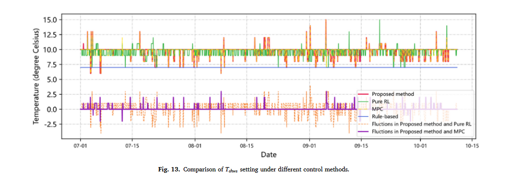
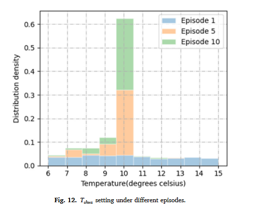

## 5.2 实验结果分析

1. 整体性能分析

2. 冷却水设定分析
    动作分布与波动对比
    

    不同阶段动作分布变化，体现策略自适应能力
    

    稀疏性分析
        - 冷负荷曲线 + 动作设定值曲线
        - 雷达图
3. 能耗分析
    单机功率密度分布图
    累积能耗对比图

4. 消融实验分析
    - 双阈值机制消融（去除全局阈值、去除局部阈值）
    - 多尺度异常追踪消融（去除中/长尺度、去除短/长尺度、去除短/中尺度）

5. 参数敏感性分析
    - 阈值判定参数敏感性
    - 统计结构参数敏感性
    - 近最优解域与稳定区间分析

6. 动态事件门控机制的可解释性分析