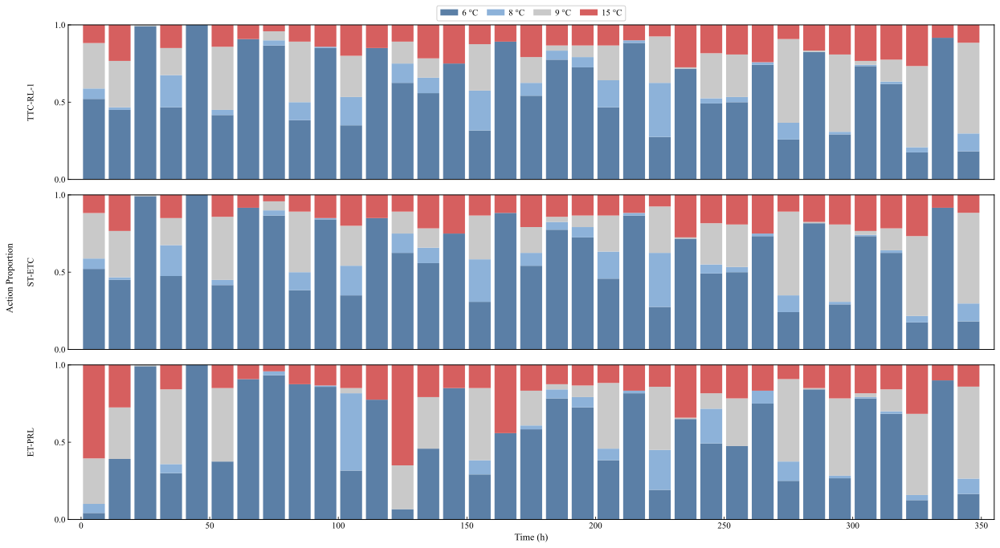
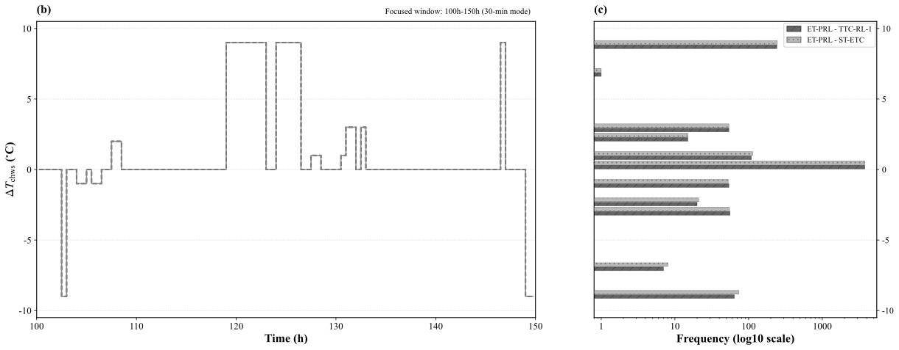
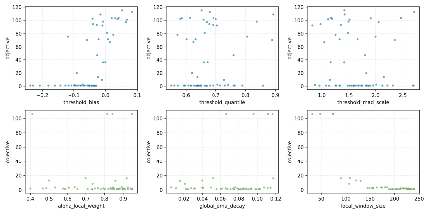

# 基于动态事件触发的 HVAC 强化学习预测控制方法

# 1. 引言

随着全球气候变化的加剧，建筑行业的节能减排已成为亟待解决的关键问题。相关统计数据显示，建筑能耗占全球终端能耗的35%以上，其中供暖、通风与空调（HVAC）系统不仅占据了建筑整体能耗的约50%，也是电力需求侧响应的关键调节资源。在中央空调系统中，冷水机组作为核心耗能部件，其运行效率直接决定了系统的整体性能。优化冷冻水供水温度（$T_{\text{chws}}$）已被证明是平衡能耗与室内热舒适度的有效手段之一。然而，实际工程中的HVAC控制面临着严峻挑战：建筑热负荷受室外气象条件、室内人员流动及设备散热等多重动态因素的耦合影响，系统具有高度的非线性、时变性及大惯性滞后特征。

针对上述挑战，工业界与学术界长期依赖基于显式先验知识的控制范式。具体而言，以基于规则的控制（RBC）和比例-积分-微分（PID）为代表的传统方法，高度依赖工程师人工标定的静态参数与经验规则；而以模型预测控制（MPC）为代表的全局优化算法，则要求针对目标建筑构建高精度的机理或灰盒模型。尽管上述基于模型或显式规则的方法在特定稳态工况下表现良好，但在高度异构的实际工程场景中，针对不同建筑逐一进行系统辨识与精准建模不仅耗费巨大的时间与经济成本，且随着设备组件的长期磨损与建筑热特性的季节性漂移，固定参数的物理模型容易出现控制性能衰退。过度依赖显式环境模型与专家先验知识的传统范式难以自适应多变工况，亟待引入新型智能控制架构。

为克服传统控制的局限性，深度强化学习（Deep Reinforcement Learning, DRL）凭借其无模型的自适应决策能力，近年来在HVAC控制领域展现出广阔的应用前景。DRL能够通过与复杂时变环境的直接交互，自主学习并适应非线性工况；结合时序特征的预测型DRL进一步提升了智能体的前瞻预测能力，有效缓解了建筑大热惯性带来的控制滞后。然而，现有DRL在实际工程部署中仍受限于固定时间步长控制（Time-Triggered Control, TTC）这一根本性范式。在该机制下，智能体严格按预设时钟周期进行状态采样与动作更新，忽略了建筑热负荷在时间维度上演变的非均匀特性。这种固定频率驱动方式导致了响应速度与控制代价之间的固有矛盾：高频控制虽能迅速响应环境扰动，却会带来显著的计算开销与执行器机械磨损；低频控制虽能降低硬件损耗，却易造成控温精度下降。

为缓解TTC范式带来的计算冗余与设备磨损问题，事件驱动控制（Event-Triggered Control, ETC）机制应运而生。ETC基于按需决策理念，仅在系统状态发生显著偏离时激活控制更新。这种稀疏控制机制有效突破了时间步长的硬性约束，为平衡响应速度与控制代价提供了可行途径。然而，现有ETC方案主要依赖基于专家经验的静态规则，例如设定固定的温度死区或负荷波动阈值。静态触发机制在面对高度非线性且时变的真实建筑环境时缺乏动态适应能力，难以适应不同建筑的热惯性差异以及设备老化后的性能漂移，极易导致频繁误触发或控制响应迟滞现象。

基于上述动机，本文提出了一种结合时序预测与无监督动态事件触发的新型HVAC控制框架（ET-PRL）。本文的主要贡献如下：

- **提出基于流式特征的无监督动态事件门控机制**：在ET-PRL框架中构建了融合多尺度异常追踪与双层自适应阈值的门控模块，摆脱了对静态人工规则的依赖，实现了对时变工况下非平稳扰动的自适应感知。
- **构建时序解耦的事件驱动预测型控制架构**：将事件门控机制无缝融入预测型强化学习框架，使策略网络仅在关键扰动时激活，并在平稳期依靠零阶保持器（ZOH）维持控制输出。该架构通过与预测状态特征的深度耦合，有效克服了稀疏按需执行带来的状态观测盲区与预测能力缺失。
- **实现控制精度与系统执行代价的有效折衷**：基于真实冷水机组运行数据的综合评估表明，本文所提框架能够在可量化性能折衷范围内有效抑制平稳工况下的高频无效调节，并获得一定的节能收益。该实证结果不仅验证了按需控制机制在复杂非线性热力系统中的有效性，也为深度强化学习算法在实际工程中的低损耗边缘部署提供了可行的方案。

# 2. 相关工作

建筑 HVAC 系统在能效优化与热舒适保障之间的协同控制长期面临工程挑战。为应对建筑能耗增长与运行稳定性要求，传统研究主要采用基于规则的控制（RBC）与比例-积分-微分（PID）等经典方法 [1]。其中，Choi 等 [2] 通过优化信息驱动的规则提取提升了 HVAC 规则控制的可操作性，Lee 等 [3] 将深度强化学习用于 PID 参数整定以改善跟踪性能；此外，Chojecki 等 [4] 进一步引入模糊控制思想，增强了传统控制器在特定工况下的适应能力。尽管这类方法在工业场景中部署便捷、可靠性高，但其核心仍依赖静态规则或线性反馈假设，难以充分刻画建筑热环境中的非线性耦合、时变扰动与大滞后特征，因而在复杂运维条件下往往难以同时兼顾节能与舒适性 [5]。

为突破传统控制在建模与适应性方面的瓶颈，数据驱动方法逐步成为 HVAC 智能控制的重要方向。Savino 等 [6] 系统展示了深度强化学习在多区域低层控制中的应用潜力；Wang 与 Lin [7] 以及 Zhuang 等 [8] 分别基于 DQN/DDPG 等范式构建了从高维传感状态到控制动作的映射，验证了强化学习在复杂场景中的优化优势。然而，标准强化学习多采用基于当前观测的反应式决策，在具有显著热惯性与时滞的系统中容易出现控制滞后与振荡 [9]。为此，Li 等 [10] 将 LSTM 等时序模型融入决策过程，通过引入前瞻预测信息增强了策略对环境演化的感知能力，并在一定程度上改善了控制平稳性。

在控制策略由规则驱动向数据驱动持续演进的同时，如何降低冗余计算与执行机构磨损成为另一关键问题。Liu 等 [11] 与 Xue 等 [12] 的研究表明，事件驱动控制（ETC）通过“按需更新”机制，能够在状态越限或事件发生时才触发控制与通信，从而有效减少时间触发控制中的无效更新。与此同时，Liu 等 [13] 指出，现有 ETC 在工程落地中仍普遍依赖专家设定的静态阈值规则。面对建筑热特性漂移、气候波动与设备老化等非平稳因素，固定阈值往往难以兼顾灵敏性与稳定性，容易产生过度触发或响应迟滞，进而影响计算效率与舒适度表现 [14]。这也说明构建数据驱动的动态事件定义机制具有现实必要性。

基于上述研究进展，本文将 HVAC 事件触发过程重构为在线无监督异常检测问题，并提出耦合动态门控与预测型强化学习的按需控制框架（ET-PRL）。与依赖静态规则的传统方法及现有 ETC 方案相比，本文通过流式特征追踪与自适应阈值判定实现触发条件的动态更新，降低了对人工经验的依赖，并提升了对长期概念漂移的适应性。与固定步长强化学习不同，该框架进一步以事件驱动方式解耦决策时序，在削减冗余推理与设备磨损的同时，利用预测特征弥补稀疏控制下的观测盲区，最终在真实建筑非平稳工况中实现控制性能与执行代价的有效折衷。

> [1] Chaya, P., et al. "Human-Centric Smart Energy Optimization and Automation System." 2025 3rd International Conference on Intelligent Cyber Physical Systems and Internet of Things (ICoICI). IEEE, 2025.
> 
> 
> [2] Choi, Youngsik, et al. "Optimization-informed rule extraction for HVAC system: A case study of dedicated outdoor air system control in a mixed-humid climate zone." *Energy and Buildings* 295 (2023): 113295.
> 
> [3] Lee, Dongkyu, Jinhwa Jeong, and Young Tae Chae. "Application of deep reinforcement learning for proportional–integral–derivative controller tuning on air handling unit system in existing commercial building." *Buildings* 14.1 (2023): 66.
> 
> [4] Chojecki, Adrian, Arkadiusz Ambroziak, and Piotr Borkowski. "Fuzzy controllers instead of classical PIDs in HVAC equipment: Dusting off a well-known technology and Today’s implementation for better energy efficiency and user comfort." *Energies* 16.7 (2023): 2967.
> 
> [5] Lu, Shengze, et al. "Exploring the comprehensive integration of artificial intelligence in optimizing HVAC system operations: A review and future outlook." *Results in Engineering* 25 (2025): 103765.
> 
> [6] Savino, Sabrina, et al. "Deploying deep reinforcement learning for low-level HVAC control in multi-zone buildings: A comparative study with ASHRAE G36 sequences." *Energy and Buildings* (2025): 116456.
> 
> [7] Wang, Man, and Borong Lin. "MF^ 2: Model-free reinforcement learning for modeling-free building HVAC control with data-driven environment construction in a residential building." *Building and Environment* 244 (2023): 110816.
> 
> [8] Zhuang, Dian, et al. "Data-driven predictive control for smart HVAC system in IoT-integrated buildings with time-series forecasting and reinforcement learning." *Applied Energy* 338 (2023): 120936.
> 
> [9] Kondath, Namitha, et al. "Enhancing Day-Ahead Cooling Load Prediction in Tropical Commercial Buildings Using Advanced Deep Learning Models: A Case Study in Singapore." *Buildings* 14.2 (2024): 397.
> 
> [10] Li, Kai, Wei Ni, and Falko Dressler. "LSTM-characterized deep reinforcement learning for continuous flight control and resource allocation in UAV-assisted sensor network." *IEEE Internet of Things Journal* 9.6 (2021): 4179-4189.
> 
> [11] Liu, Xinghua, et al. "Event‐triggered load frequency control of smart grids under deception attacks." *IET Control Theory & Applications* 15.10 (2021): 1335-1345.
> 
> [12] Xue, Zhouzhou, Zhaoxu Yu, and Shugang Li. "Event-triggered adaptive neural control for uncertain nontriangular nonlinear systems with time-varying delays." *International Journal of Control, Automation and Systems* 20.12 (2022): 4090-4099.
> 
> [13] Liu, Derong, et al. "Adaptive dynamic programming for control: A survey and recent advances." *IEEE Transactions on Systems, Man, and Cybernetics: Systems* 51.1 (2020): 142-160.
> 
> [14] Heer, Philipp, et al. "Comprehensive energy demand and usage data for building automation." *Scientific Data* 11.1 (2024): 469.
> 

# 3. 方法

## 3.1 总体框架

针对建筑 HVAC 系统存在的热惯性与响应滞后特性，以及运行工况随季节变化导致的分布漂移，传统依赖离线标定与静态阈值的事件控制方法在跨工况迁移时通常需要频繁再校准，进而增加了工程维护成本。为此，本文提出一种将流式异常门控与深度强化学习耦合的按需控制框架，即事件触发预测型强化学习（Event-Triggered Predictive Reinforcement Learning, ET-PRL）。

如图 3 所示，ET-PRL 的核心思想是在保持控制目标与约束一致的前提下，通过事件触发机制降低强化学习策略在平稳阶段的无效推理调用频率，从而在计算开销与控制性能之间取得更优的折衷。与依赖固定专家规则或离线训练分类器进行事件判别的传统做法不同，该框架采用无监督的在线门控策略，根据系统状态分布的统计偏离程度动态确定触发时刻。整体框架由以下三层机制组成：

1. **在线流式异常门控机制**：面向长期运行中的概念漂移，构建无需离线训练的异常检测门控模块。该模块在线追踪状态的多尺度统计特征，并结合流式隔离深度与自适应阈值策略输出事件触发信号，实现控制事件的在线标定。
2. **预测型全局强化学习网络**：面向系统级能效优化与动作选择，采用轻量级深度 Q 网络（DQN）学习控制策略。该网络仅在门控机制判定发生关键动态事件时被激活，以减少平稳阶段的冗余推理计算。
3. **事件驱动执行与零阶保持**：在边缘部署场景下，系统将状态感知、事件判别、策略推理与动作执行构建为低时延的闭环控制流程。在非触发时段，采用零阶保持器（Zero-Order Hold, ZOH）维持上一时刻的控制指令，以降低控制切换频率并减小对执行机构与系统稳定性的不利影响。

> **图 3 占位：ET-PRL 总体框架图**

## 3.2 基于流式特征追踪的动态事件触发机制设计

本文将关键事件识别重定义为在线异常检测。其核心依据在于：在控制语义上，关键事件对应需要策略即时介入的工况突变；在统计语义上，该类时刻通常表现为状态样本相对常态分布的显著偏离。由此，事件判定可统一建模为偏离度检验问题，而不再依赖人工设定的静态规则。

设门控状态为 $s_t\in\mathbb{R}^d$，事件标签为 $e_t\in\{0,1\}$，时刻 $t$ 的常态参考分布记为 $\mathcal{P}^{\text{norm}}_t$。定义事件集合

$$
\mathcal{E}_t=\{s:\,d(s,\mathcal{P}^{\text{norm}}_t)>\delta_t\},\qquad
e_t=\mathbb{I}(s_t\in\mathcal{E}_t)
$$

其中，$d(\cdot)$ 为分布偏离度量，$\delta_t$ 为判别阈值。上述定义表明，事件识别本质上是对是否偏离常态区域的二值判定；当状态进入高偏离区域时触发策略更新，否则维持当前控制节奏。

为满足在线部署需求，本文采用异常分数函数 $A(s_t)$ 作为偏离度代理，并将集合判别转化为可计算的阈值比较：

$$
e_t=\mathbb{I}(A(s_t)>\tau_t)
$$

其中，$A(s_t)$ 越大表示偏离常态程度越高，$\tau_t$ 为触发阈值。该形式具有两点优势：一是可与流式统计量直接耦合，支持逐步更新；二是便于与后续门控逻辑统一，实现由异常评分到触发决策的端到端建模与实现。

考虑 HVAC 长周期运行中的气象扰动、设备老化与负荷行为漂移所导致的非平稳性，本文不采用固定阈值，而采用流式自适应更新机制：

$$
    au_t=\Phi\big(A(s_{1}),\ldots,A(s_{t-1})\big)
$$

其中，$\Phi(\cdot)$ 表示由历史异常分数驱动的阈值更新算子。该设计用于在灵敏性与稳定性之间取得平衡：在扰动增强时提高事件覆盖率，在平稳区间抑制冗余触发，从而降低误触发与漏触发风险。

(1) 门控输入特征定义

为保证门控判定与控制状态建模在物理语义与符号层面的一致性，本文将事件门控模块的输入定义为紧凑的三维特征向量：

$$s_t=[Q_{load}^t,\,T_{wb}^t,\,\hat{Q}_{load}^{t+1}]$$

其中，$Q_{load}^t$ 表示当前时刻系统冷负荷，$T_{wb}^t$ 表示室外湿球温度，$\hat{Q}_{load}^{t+1}$ 表示下一时刻系统冷负荷的短期预测值。

引入 $T_{wb}^t$ 的主要原因在于该变量能够同时表征外部温度与湿度条件，并直接约束冷却塔换热性能及系统排热上限。因此，$T_{wb}^t$ 可作为刻画外生气象扰动强度与方向的关键状态量，从而提升门控机制对环境非平稳变化的识别能力。

此外，引入 $\hat{Q}_{load}^{t+1}$ 的动机在于建筑热系统具有显著热惯性与控制滞后。若仅依赖当前观测量，门控判定通常滞后于工况变化。纳入一步前瞻负荷后，门控模块可提前感知负荷爬升或回落趋势，进而在关键变化阶段更早触发策略更新，降低稀疏触发条件下的响应滞后风险。

为在保持表征能力的同时控制特征维度并支撑在线门控的实时计算，本文在特征维度选择上未进一步引入管网流量、回水温度等附加变量，原因是在线异常检测在高维空间中易出现样本稀疏与距离退化，从而削弱统计判别稳定性并增加计算开销。

(2) 流式隔离深度与多尺度异常追踪

传统离线异常检测通常依赖静态样本库，在季节性工况漂移场景下稳定性受限。为此，本文采用流式隔离深度机制，对在线到达的门控输入特征 $s_t$ 进行实时异常评分。流式隔离深度算法（Streaming Isolation Depth）通过在滑动数据窗口上动态构建与更新隔离树结构，计算输入数据点在多棵树中的平均路径长度作为隔离程度度量。路径越短，数据点越容易被孤立，对应异常概率越高。该机制能够在不重新训练全局模型的条件下在线适应分布变化。

为便于形式化描述，下面给出隔离深度与异常分数的计算过程。隔离树通过递归随机选择特征与分割点来孤立数据点。对于输入点 $s_t$，在滑动参考窗口内的 $\psi$ 棵隔离树上分别执行搜索，记该点在第 $j$ 棵树上的路径长度为 $h_j(s_t)$，其中路径长度定义为从根节点到叶节点的边数。该点的平均隔离深度定义为：

$$h_{\mathrm{iso}}(s_t) = \frac{1}{\psi} \sum_{j=1}^{\psi} h_j(s_t)$$

进而转化为归一化的异常分数，其中 $m$ 为参考集样本数，$C(m)$ 为对应的平均路径长度基准：

$$A_{\mathrm{iso}}(s_t) = 2^{-\frac{h_{\mathrm{iso}}(s_t)}{C(m)}}$$

标准化常数计算为 $C(m) = 2H(m-1) - 2(m-1)/m$，其中 $H(m-1)=\sum_{i=1}^{m-1}\frac{1}{i}$ 为调和级数。该形式将异常分数映射至 $(0,1)$ 区间：当数据点易被隔离时，路径较短，分数趋近于 1；当数据点难被隔离时，路径较长，分数趋近于 0。

为刻画不同时间尺度下的分布演化，算法维护三个不同规模的滑动参考窗口以生成多尺度动态参考集合。短时窗口 $\mathcal{W}_{\mathrm{short}}$ 包含最近 $n_s$ 个数据点，用于捕捉高频波动；中时窗口 $\mathcal{W}_{\mathrm{medium}}$ 包含最近 $n_m$ 个数据点，用于表征日内周期；长时窗口 $\mathcal{W}_{\mathrm{long}}$ 包含最近 $n_l$ 个数据点，用于描述季节性漂移，且参数满足 $n_s < n_m < n_l$。在各窗口上独立应用隔离树算法，并在每个时刻输出对应尺度的异常分数。记 $\kappa\in\{\mathrm{short},\mathrm{medium},\mathrm{long}\}$，对应窗口规模记为 $n_\kappa$，则有

$$A_{\kappa}(s_t)=2^{-\frac{h_{\mathrm{iso}}^{\kappa}(s_t)}{C(n_{\kappa})}}$$

各尺度分数均归一化至 $[0,1]$ 区间。综合异常分数定义为三类尺度分数的加权融合：

$$A(s_t)=w_{\mathrm{s}}A_{\mathrm{short}}(s_t)+w_{\mathrm{m}}A_{\mathrm{medium}}(s_t)+w_{\mathrm{l}}A_{\mathrm{long}}(s_t)$$

其中 $w_{\mathrm{s}}, w_{\mathrm{m}}, w_{\mathrm{l}} \ge 0$ 且 $w_{\mathrm{s}}+w_{\mathrm{m}}+w_{\mathrm{l}}=1$ 分别代表对应时间尺度的融合权重。

采用多尺度融合的原因在于，建筑 HVAC 系统通常同时受到短时扰动、日内周期变化和长期慢变漂移的共同影响。若仅依赖短时分数，门控机制虽能快速响应人员聚集、设备启停等局部突变，但更容易受到传感器高频噪声或正常瞬态波动的干扰，进而导致触发频率偏高。若仅依赖长时分数，虽然能够提供更稳健的历史参考基线，但对突发热扰动的响应可能不足。若仅结合短时与中时分数，则难以刻画季节更替、设备老化或结构热阻漂移引起的慢变过程。基于此，本文通过短、中、长三个时间尺度的加权融合，同时兼顾突发扰动感知、周期规律表征与长期基线跟踪，从而提高门控机制在非平稳场景下的适应性与鲁棒性。

(3) 流式双层自适应阈值优化

为将连续异常分数转化为稳健的控制触发判定，本文构建了包含局部阈值与全局阈值的双层自适应动态门限机制。若仅依托固定阈值或单一更新速率的自适应阈值，门控系统容易面临灵敏度与稳定性的权衡困境。更新过快会导致阈值被近期异常数据严重干扰，从而自身发生剧烈震荡并掩盖后续的真实异常；更新过慢则会在系统面临工作区间发生整体跃变时持续越限，进而导致频繁误触发和计算资源的无效损耗。为突破此类局限，本文引入了局部快变与全局慢变双阈值相耦合的自适应监控架构。

设最近 $W$ 个异常分数组成滑动历史窗口集合 $\mathcal{A}_t=\{A(s_{t-W+1}),\ldots,A(s_t)\}$。阈值估计的核心目标是在含噪非平稳流式数据中持续提取稳定且可迁移的判别基线。相较于易受异常离群点影响的传统均值和标准差，本模块优先提取反映非参数分布特性的稳健分位数阈值与鲁棒统计阈值：

$$\tau_{q}^{(t)}=Q_q(\mathcal{A}_t), \quad\tau_{\mathrm{mad}}^{(t)}=\operatorname{med}(\mathcal{A}_t)+\kappa \cdot c \cdot \operatorname{MAD}(\mathcal{A}_t)$$

$$\operatorname{MAD}(\mathcal{A}_t)=\operatorname{med}\left(\left|a-\operatorname{med}(\mathcal{A}_t)\right|\right),\quad a\in\mathcal{A}_t$$

其中，$Q_q(\cdot)$ 表示集合的高分位点；$\operatorname{med}(\cdot)$ 为中位数函数；绝对中位差（$\operatorname{MAD}$）的作用在于消除潜在持续型异常对系统离散程度估计的偏差干扰，以维持真实的稳健基线；$\kappa$ 为灵敏度调节系数，$c \approx 1.4826$ 为保证渐近无偏估计的分布一致性常数。上述构造的理论依据在于：分位数估计主要提供阈值位置的鲁棒锚点，而 $\operatorname{MAD}$ 提供尺度层面的鲁棒校正，两者融合可同时约束位置漂移与尺度膨胀带来的阈值失真。基于此，局部候选阈值由二者加权融合得到：

$$\tau_{\mathrm{cand}}^{(t)}=\omega_q\tau_q^{(t)}+(1-\omega_q)\tau_{\mathrm{mad}}^{(t)}$$

其中，$\omega_q \in [0,1]$ 为加权系数。该系数本质上控制分位数主导与尺度修正主导之间的权衡：$\omega_q$ 增大时阈值更侧重位置稳健性，$\omega_q$ 减小时阈值更敏感于离散程度变化。考虑到单步工况跳变可能带来的高频瞬态波动，系统不直接采纳单次候选值，而是引入一阶离散低通滤波对其进行局部平滑：

$$\tau_{\mathrm{local}}^{(t)}=(1-\lambda_{\mathrm{local}})\tau_{\mathrm{local}}^{(t-1)}+\lambda_{\mathrm{local}}\tau_{\mathrm{cand}}^{(t)}$$

式中，局部平滑更新率 $\lambda_{\mathrm{local}} \in (0,1]$ 能够在抑制短时噪声震荡的同时，使快变阈值保持对工况模式切换的快速跟踪。较大的 $\lambda_{\mathrm{local}}$ 对新样本赋予更高权重，有利于缩短阈值跟踪时滞；较小的 $\lambda_{\mathrm{local}}$ 则可增强对短时脉冲噪声的抑制能力。由此，局部阈值承担快速适配当前工况的功能。在局部阈值基础上，全局阈值作为历史稳态参考面，通过更强的迟滞效应进行指数移动跟踪：

$$\tau_{\mathrm{global}}^{(t)}=(1-\lambda_{\mathrm{g}})\tau_{\mathrm{global}}^{(t-1)}+\lambda_{\mathrm{g}}\tau_{\mathrm{local}}^{(t)}$$

这里设定 $\lambda_{\mathrm{g}} \ll \lambda_{\mathrm{local}}$，赋予全局阈值显著的迟滞平滑特性。这种双时间常数级联设计使其在局部特征随工况剧变时充当平滑缓冲，从而稳定跟踪由长期设备老化与季节迁移导致的系统深层演变趋势，并降低阈值被短时异常片段牵引的风险。

最终，基础自适应门控阈值由双层信号的耦合构建而成：

$$\tilde{\tau}_t=\alpha_{\mathrm{local}}\tau_{\mathrm{local}}^{(t)}+(1-\alpha_{\mathrm{local}})\tau_{\mathrm{global}}^{(t)}+b_{\mathrm{bias}}$$

其中，权重 $\alpha_{\mathrm{local}}\in[0,1]$ 用于调节局部阈值与全局阈值之间的融合比例。当 $\alpha_{\mathrm{local}}$ 增大时，系统更强调对局部工况变化的快速响应；当 $\alpha_{\mathrm{local}}$ 减小时，系统更强调长期基线的一致性与触发稳定性。$b_{\mathrm{bias}}$ 为偏置项。在运行状态高度平稳的阶段，例如夜间低负荷时段，系统方差与绝对中位差可能收敛至较小数值，导致阈值过度收缩。引入偏置项为系统设置绝对了触发下限，从而避免因阈值过小而产生高频误触发。

## 3.3 在线流式事件门控模块构建

与传统固定阈值与单条件越限触发策略不同，本模块采用异常强度判别与时间约束抑振的联合判定形式，其设计目标是在保证关键扰动覆盖率的同时抑制边界附近的抖振触发。前者通过比较 $A(s_t)$ 与自适应阈值实现对当前状态偏离程度的统计检验，后者通过最小触发间隔约束显式控制动作更新频率，避免在短时高频波动期间出现连续触发导致的执行器过度切换。

在每个控制时刻，门控模块接收当前门控特征 $s_t$，计算异常分数 $A(s_t)$ 并执行二值触发检验：

$$\tau_t^*=\operatorname{clip}(\tilde{\tau}_t+m_{\mathrm{hys}},0,1)$$

$$\mathrm{Trigger}(s_t)=\mathbb{I}\left(A(s_t)>\tau_t^*\right)\land\mathbb{I}\left(t-t_{\mathrm{last}}>\Delta_{\min}\right)$$

上式中，$\operatorname{clip}(\cdot, 0, 1)$ 表示将输入值约束在 0 到 1 区间内的截断函数；$m_{\mathrm{hys}}$ 为防止边界震荡的滞回容差；$\mathbb{I}(\cdot)$ 为逻辑指示函数，当括号内条件成立时取 1，否则取 0；$t_{\mathrm{last}}$ 记录系统上一次触发更新的时间步；$\Delta_{\min}$ 为设定的最小触发间隔。$\mathrm{Trigger}(s_t)=1$ 表示当前时刻触发控制更新，$\mathrm{Trigger}(s_t)=0$ 表示维持上一时刻控制动作。

为保证门控与控制策略在在线部署中的一致性，模块在每一时刻遵循先判定、后执行、再更新的时序协议：首先使用时刻 $t$ 的统计量计算触发结果并决定是否调用策略网络；随后将动作 $u_t$ 下发至执行层；最后将 $A(s_t)$ 与相关统计量写入窗口，用于时刻 $t+1$ 的阈值更新。该协议可避免同一步内先更新阈值再判定导致的判据前视偏差，确保门控逻辑满足严格因果性。

从工程部署角度看，该门控模块的额外开销主要来自标量统计更新与一次二值逻辑判定，不引入额外的大规模神经网络推理。在非触发时段，系统仅执行轻量级统计运算并保持上一控制指令，因此整体计算负载与动作切换频率可随触发率下降而同步降低。

## 3.4 基于动态阈值事件触发的预测型强化学习控制算法

在所提事件驱动控制框架中，全局控制器负责在判定为关键时刻，即 $\mathrm{Trigger}(s_t)=1$ 时，被激活并输出能效优化动作；而在平稳期或非关键时刻，即 $\mathrm{Trigger}(s_t)=0$ 时，则不进行推理计算，而是由底层控制系统通过零阶保持器维持先前的控制指令。

为兼顾控制性能与边缘设备的部署开销，本文构建结合短期负荷预测信息的轻量级 DQN（Deep Q-Network）智能体。全局强化学习控制器在触发时刻接收状态向量 $s_t$，并以降低能耗与保持温控性能为目标构建综合奖励函数，从而输出高层优化设定值，例如冷冻水供水温度设定点。同时，该模块采用分层执行策略，将高层无模型优化决策与底层设备的物理安全约束解耦，以保证生成动作在实际部署中的可行性与安全性。

(1) 任务建模与问题定义

针对楼宇控制场景中状态高维、样本相关性强的问题，本文构建紧凑离散时间马尔可夫决策过程（MDP）模型 $\langle \mathcal{S}, \mathcal{A}, \mathcal{P}, \mathcal{R}, \gamma \rangle$。环境状态空间定义为：

$$s_t = [Q_{load}^t, T_{wb}^t, \hat{Q}_{load}^{t+1}]$$

此处状态定义 $s_t$ 与前文所述的门控输入特征在物理信息层面上保持严格一致，包含当前冷负荷 $Q_{load}^t$、室外湿球温度 $T_{wb}^t$ 以及下一时刻冷负荷预测值 $\hat{Q}_{load}^{t+1}$。引入预测项可在不显式扩展长历史序列窗口的前提下有效提升策略的前瞻性。

动作空间 $\mathcal{A}$ 设定为离散化供水温度设定点集合，智能体在时刻 $t$ 输出动作 $a_t\in\mathcal{A}$。为保证执行安全性，控制架构采用分层策略：高层强化学习模块负责设定点优化，底层规则模块负责机组启停及最小运行时长等约束执行。

奖励函数采用归一化加权形式：

$$r_t = \omega_{\eta} r_t^{\mathrm{energy}} + \omega_{\tau} r_t^{\mathrm{track}}$$

其中 $\omega_{\eta},\omega_{\tau}\ge 0$ 且 $\omega_{\eta}+\omega_{\tau}=1$。能效项定义为：

$$r_t^{\mathrm{energy}} = 1 - \frac{P_t}{P_{\mathrm{ref}}}$$

其中 $P_t$ 为机组实时功率，$P_{\mathrm{ref}}$ 为额定参考功率。温控跟踪项采用高斯径向基形式进行连续平滑评估：

$$r_t^{\mathrm{track}} = \exp \left( -\frac{1}{2} \left( \frac{T_t - T_{\mathrm{set}}}{\sigma} \right)^2 \right)$$

其中 $T_t$ 为实际供水温度，$T_{\mathrm{set}}$ 为目标设定温度，$\sigma$ 为温控跟踪敏感度参数。

(2) 预测型强化学习决策机制

考虑状态维度已压缩至关键特征子集，本文采用多层感知机构建轻量级 DQN 主体网络，以降低边缘部署场景下的推理延迟与存储开销。在算法实现层面，训练阶段遵循标准 DQN 的逐步交互流程：智能体在每个时间步执行动作选择、环境步进、经验回放写入与网络参数更新。其一步时序差分目标可写为：

$$y_t = r_t + \gamma (1-d_t) \max_{a'\in\mathcal{A}} Q_{\theta^-}(s_{t+1}, a')$$

其中 $\theta$ 为在线网络参数，$\theta^-$ 为目标网络参数，$d_t\in\{0,1\}$ 为终止标记。网络优化采用均方误差损失：

$$\mathcal{L}(\theta)=\mathbb{E}_{(s_t,a_t,r_t,s_{t+1})\sim\mathcal{D}}\left[\left(y_t-Q_{\theta}(s_t,a_t)\right)^2\right]$$

其中 $\mathcal{D}$ 为经验回放缓冲区。该训练机制通过打破样本时序相关性并延迟目标值更新，提升了价值学习过程的数值稳定性。

训练阶段采用固定步长交互，主要基于两点考虑：其一，若仅在触发时采样，经验分布会过度集中于突发工况，从而削弱价值函数在平稳工况下的估计一致性；其二，固定步长能够维持状态-动作覆盖的连续性，提升经验回放与目标网络更新的数值稳定性。这种设计使策略网络在训练期间充分覆盖状态-动作空间，部署时再借助门控机制实现动作更新的稀疏化。

(3) 事件驱动在线执行算法

在在线运行阶段，系统按固定时钟步长完成特征采样，但通过事件驱动机制决定是否更新控制动作。具体流程如下：首先将提取的门控特征 $s_t$ 传递至流式门控模块，获得布尔型门控信号，并据此生成动作更新标志。当满足触发条件时，系统调用 DQN 策略网络前向推理输出新的控制设定点；当未满足触发条件时，系统采用零阶保持器维持上一时刻的控制指令。其执行律表述为：

$$u_t = \begin{cases}\pi_{\mathrm{DQN}}(s_t), & \text{if } \mathrm{Trigger}(s_t) = 1 \\u_{t-1}, & \text{if } \mathrm{Trigger}(s_t) = 0\end{cases}$$

最终在线执行流程的伪代码如下：

> 伪代码占位

# 4. 案例系统与仿真环境

## 4.1 建筑热力系统建模

本研究选取上海某真实商业建筑的暖通空调（HVAC）系统作为物理模型，利用 EnergyPlus 软件构建仿真环境。该模型已在前期研究中基于实测数据完成参数校验，验证了其对系统热力学特性的有效表征能力。冷源系统配置为典型的一次泵定流量系统（Primary Constant Flow System），核心组件包括离心式冷水机组、冷冻水泵、冷却水泵及冷却塔。

为准确模拟系统的能耗与热力学特性，本研究对各核心组件的额定参数进行了统一设定。系统关键设备的设计参数汇总见表 4-1。

表 4-1 HVAC 系统关键设备参数

| **设备名称** | **数量 (台)** | **额定功率(Pref, kW)** | **额定容量 / 流量** | **运行特性与关键参数** |
| --- | --- | --- | --- | --- |
| **离心式冷水机组** | 3 | 314 | 1760 kW (制冷量) | COP随负荷变化；  设定温度 $T_{set}=7\text{°C}$ (范围: $6\sim15\text{°C}$) |
| **冷冻水泵** | 3 | 15 | 252 $m^3/h$ | 定速运行；  额定扬程: $15\ \text{m}$ |
| **冷却水泵** | 3 | 55 | 366 $m^3/h$ | 定速运行；  额定扬程: $33\ \text{m}$ |
| **冷却塔** | 3 | 16.5 | 392 $m^3/h$ | 变工况特性；  性能与湿球温度 $T_{wb}$ 强耦合 |

基于上述参数，冷冻水侧的热量传递过程可由热力学守恒关系描述。本文在计算中采用标准水物性参数：比热容 $c_p = 4.2\ \text{kJ/(kg}\cdot\text{K)}$，密度 $\rho_{\text{water}} = 1000\ \text{kg}/\text{m}^3$。瞬时冷负荷计算公式为：

$$
Q_{load} = \rho_{\text{water}} \cdot F_{chw} \cdot c_p \cdot (T_{chwr} - T_{chws})
$$

其中，$Q_{load}$ 表示建筑冷负荷需求，$F_{chw}$ 为冷冻水流量，$T_{chwr}$ 与 $T_{chws}$ 分别表示冷冻水回水温度与供水温度。该物理建模过程保证了仿真环境能够较为真实地反映控制策略对系统热力状态的影响。

## 4.2 气象与负荷数据集特征

本研究采用基于上海地区典型气象年（Typical Meteorological Year, TMY）生成的建筑冷负荷仿真数据集，采样间隔设定为 $5\text{min}$。数据覆盖完整制冷季（7 月 1 日至 10 月 10 日），共计 $102$ 天、$29,376$ 个时间步，能够同时表征日内周期性波动与季节尺度变化。统计结果表明：冷负荷峰值为 $5102.77\ \text{kW}$，标准差为 $962.02\ \text{kW}$，变异系数（CV）为 $37.3\%$；室外湿球温度 $T_{wb}$ 分布于 $21\ \text{°C} \sim 28\ \text{°C}$。

图 4-2-1 展示了冷负荷与气象变量在不同时间尺度上的变化特征。图 4-2-1(a) 给出全季数据中选取的代表性 14 天连续片段，结果表明冷负荷（$Q_{load}$）与湿球温度（$T_{wb}$）在高负荷阶段总体呈同向变化，且 $Q_{load}$ 的昼夜振幅显著高于 $T_{wb}$。图 4-2-1(b) 给出按日内时刻聚合后的均值曲线，结果显示 $Q_{load}$ 在白天工作时段持续抬升并于夜间回落，而 $T_{wb}$ 的日内波动相对缓和。

图 4-2-2 进一步展示了关键变量的边际分布与联合分布特征。图 4-2-2(a) 表明冷负荷分布呈明显右偏与长尾特性，说明高负荷样本占比虽低但持续存在。图 4-2-2(b) 表明湿球温度主要集中于相对狭窄区间，刻画了外生气象扰动的有效波动边界。图 4-2-2(c) 的联合密度结果显示，$T_{wb}$ 与 $Q_{load}$ 的关系并非单一线性带状结构，而是在不同温度区间呈现异质性密度聚集。综合图 4-2-1 与图 4-2-2 可知，该数据集同时具备显著时序周期性与非线性联合分布特征，可为门控机制中的联合特征建模与动态判别提供数据依据。

在预处理阶段，针对原始仿真序列中出现的少量非物理负值（共 8 处），本文采用零值截断进行修正。为增强状态表征的前瞻性，进一步引入由 LSTM 模型生成的下一时刻负荷预测值 $\hat{Q}_{load}^{t+1}$ 作为增广特征，从而构建同时包含当前运行状态与短时演化趋势的输入表示。

为避免时间信息泄漏并贴合实际部署场景，本文采用严格的时间顺序划分（Chronological Split）策略，将数据集按时间先后划分为训练集、验证集与测试集，比例设定为 70:15:15。

# 5. 实验及结果

## 5.1 实验设置 (Experimental Setup)

(1) 实验配置与超参数设置

本节给出实验中采用的核心超参数设置。为保证实验可复现性，表 5-1 所列参数在各组实验中保持一致。除特别说明外，系统采样间隔统一为 5 分钟。所有超参数均通过贝叶斯优化算法确定，并在验证集上完成性能筛选后固定用于后续实验。

1. **DQN 智能体 (DQN Agent)**：控制策略采用三层多层感知器结构 [256, 128, 64]，状态维度为 3，离散动作数量为 10。训练阶段采用经验回放与目标网络更新机制，并通过指数衰减的 $\epsilon$-greedy 策略平衡探索与利用。
2. **在线流式门控 (Streaming Anomaly Gate)**：门控模块由多尺度异常分数融合与双层阈值优化构成，实现在线触发判定。其关键参数包括局部窗口长度、全局指数平滑系数、阈值偏置项以及短/中/长时间尺度融合权重，用于平衡响应灵敏度与触发稳定性。

表 5-1 关键超参数设置

| **Module** | **Parameter Description** | **Symbol** | **Value** |
| --- | --- | --- | --- |
| **DQN Agent** | Learning rate | $\alpha$ | $0.0048$ |
|  | Discount factor | $\gamma$ | $0.962$ |
|  | Replay buffer size | $M$ | $20,000$ |
|  | Mini-batch size | $B$ | $178$ |
|  | Epsilon schedule | $\epsilon$ | $0.6109 \to 0.0045$ |
|  | Epsilon decay factor | $\lambda_{\epsilon}$ | $0.9947$ |
|  | Target update frequency | $C$ | $126$ steps |
|  | Network architecture | - | [256, 128, 64] |
|  | State dimension / action cardinality | - | $3 / 10$ |
| **Streaming Anomaly Gate** | Gate EMA Decay ($\lambda$ global) | $\lambda_{\mathrm{g}}$ | $0.0625$ |
|  | Local window size | $W$ | $135$ |
|  | Local update rate | $\lambda_{\mathrm{local}}$ | $0.595659$ |
|  | Reference samples | $N_{\mathrm{ref}}$ | $700$ |
|  | Base contamination | $\nu$ | $0.310449$ |
|  | Threshold local alpha weight | $\alpha_{\mathrm{local}}$ | $0.675$ |
|  | Threshold Bias term | $b_{\mathrm{bias}}$ | $-0.043058$ |
|  | Threshold quantile | $q$ | $0.667542$ |
|  | Threshold MAD scale | $\kappa$ | $1.135275$ |
|  | Threshold quantile weight | $\omega_q$ | $0.575$ |
|  | Trigger hysteresis margin | $m_{\mathrm{hys}}$ | $0.021760$ |
|  | Min samples for threshold optimization | $N_{\min}$ | $70$ |
|  | Scale fusing weights (Short/Mid/Long) | $\mathbf{w}$ | $[0.55, 0.275, 0.175]$ |

(2) 评价指标体系 (Evaluation Metrics)

为全面评估事件触发预测型强化学习框架（ET-PRL）的性能，本研究构建了涵盖能耗效率、热舒适度、控制稀疏性及机制执行效率的多维度评价指标体系。此外，本文同时报告策略执行层统计量，以保障实验结果的完整性与可复现性。

1. 能耗效率指标 (Energy Efficiency Metrics)
   
    能耗效率是建筑能源管理的核心优化目标。本研究以冷水机组（Chiller）的运行功耗为主要计量对象。
    
    - 日均能耗 (Average Daily Energy Consumption, $E_{\text{daily}}$)：计算测试周期内的日平均耗电量（单位：kWh/day）：
      
        $$
          E_{\text{daily}} = \frac{1}{D} \sum_{d=1}^{D} \left( \sum_{t=1}^{T_d} P_{\text{chiller}}(t) \cdot \Delta t \right)
        $$
        
        其中，$D$ 为测试天数，$T_d$ 为第 $d$ 天的时间步总数，$\Delta t$ 为采样间隔（小时），$P_{\text{chiller}}(t)$ 为 $t$ 时刻机组的运行功率（kW）。
        
    - 相对节能率 (Relative Energy Saving Rate, $\eta_{\text{saving}}$)：用于量化任一待评估方法相较统一比较基线的节能效果：
      
        $$
          \eta_{\text{saving}}^{(i)} = \frac{E_{\text{base}} - E_{i}}{E_{\text{base}}} \times 100\%
        $$
        
        其中 $E_{\text{base}}$ 为统一比较基线的累积能耗，$E_i$ 为第 $i$ 个方法的累积能耗。

    - 平均冷机功率 (Average Chiller Power, $\bar{P}_{\text{chiller}}$)：用于反映整个测试周期的平均负载水平与运行强度：

        $$
            \bar{P}_{\text{chiller}} = \frac{1}{N} \sum_{t=1}^{N} P_{\text{chiller}}(t)
        $$

        其中 $N$ 为测试总步数。该指标与 $E_{\text{daily}}$ 在物理含义上相关，但分别表征单位时间强度与累计能耗。
    
2. 温度控制与稳定性指标 (Temperature Control & Stability Metrics)
   
    本研究采用冷冻水回水温度 $T_{\text{chwr}}$ 作为控制对象，目标区间设定为 $[15.0^\circ\mathrm{C}, 19.0^\circ\mathrm{C}]$。

    - 性能保持率 (Performance Preservation Rate, PPR)：专项评估事件驱动机制有效性的指标，量化 ET-PRL 在稀疏化控制动作条件下对固定步长密集控制策略整体性能的保留程度。其定义如下：
      
        $$
          \text{PPR} = \frac{R_{\text{event}}}{R_{\text{dense}}} \times 100\%
        $$
        
        其中，$R_{\text{event}}$ 与 $R_{\text{dense}}$ 分别为事件驱动策略与固定步长密集策略在同一测试周期内的累积奖励值。
        
    - 动作平滑度 (Action Smoothness, $\sigma_{\Delta a}$)：为量化控制动作对执行器的冲击强度，定义相邻时间步控制量变化的均值指标：
      
        $$
          \sigma_{\Delta a} = \frac{1}{N-1} \sum_{t=1}^{N-1} |a_{t+1} - a_t|
        $$
        
        该值越小，表明控制动作越平稳，能够有效避免执行器震荡（Oscillation）。
    
3. 控制稀疏性指标 (Control Sparsity Metrics)
   
    本类指标旨在量化事件驱动机制在降低通信负载与执行器磨损方面的效果。

    - 动作更新总次数 (Total Action Updates, $N_{\text{update}}$)：用于统计测试周期内控制动作实际发生更新的总次数：

        $$
          N_{\text{update}} = \sum_{t=2}^{N} \mathbb{I}(a_t \neq a_{t-1})
        $$

        其中，$\mathbb{I}(\cdot)$ 为指示函数。固定步长策略下通常有 $N_{\text{update}}\approx N$，事件驱动策略下通常有 $N_{\text{update}}\ll N$。
    
    - 日均触发次数 (Daily Trigger Count, $N_{\text{daily}}$)：衡量控制频率的物理指标，反映平均每天执行控制动作的次数：

        $$
          N_{\text{daily}} = \frac{N_{\text{update}}}{D}
        $$

        该指标以有量纲的实物频次直接体现执行器的机械磨损风险。

    - 动作压缩比 (Actuation Compression Ratio, ACR)：

        $$
          \mathrm{ACR} = \frac{N_{\text{fixed}}}{N_{\text{update}}}
        $$

        其中 $N_{\text{fixed}}$ 和 $N_{\text{update}}$ 分别为固定步长策略和待评估策略的动作更新总次数。ACR 值越大，表明事件驱动机制对控制动作的稀疏化效果越显著。

    - 动作减少率 (Action Reduction Rate, ARR)：用于表征待评估策略相对固定步长策略减少的动作更新比例：

        $$
          \mathrm{ARR}=\left(1-\frac{N_{\text{update}}}{N_{\text{fixed}}}\right)\times 100\% = \left(1-\frac{1}{\mathrm{ACR}}\right)\times 100\%
        $$

        ARR 值越大，表示动作更新压缩越充分，工程可解释性更直观。

    为综合刻画门控机制的运行行为与策略执行开销，本研究进一步报告以下执行层统计指标。

    - 总奖励 (Cumulative Test Reward, $R_{\text{test}}$)：

        $$
        R_{\text{test}} = \sum_{t=1}^{N} r_t
        $$

        该指标用于衡量测试周期内策略的总体控制收益。

    - 平均步奖励 (Average Reward per Step, $\bar{R}_{\text{step}}$)：

        $$
        \bar{R}_{\text{step}} = \frac{R_{\text{test}}}{N_{\text{update}}} = \frac{\sum_{t=1}^{N} r_t}{N_{\text{update}}}
        $$

        其中，$N_{\text{update}}$ 表示动作实际更新次数（固定步长策略中 $N_{\text{update}}=N$，事件驱动策略中通常 $N_{\text{update}}\ll N$）。该指标用于衡量单位动作更新开销对应的平均控制收益。

表 5-2 汇总了本研究所采用的评价指标体系及其优化方向。

表 5-2 评价指标体系与优化方向

| **类别 (Category)** | **指标名称 (Metric)** | **符号 (Symbol)** | **单位 (Unit)** | **优化目标 (Goal)** |
| --- | --- | --- | --- | --- |
| **能耗效率** | 日均能耗 | $E_{\text{daily}}$ | kWh/day | Minimize |
|  | 相对节能率 | $\eta_{\text{saving}}$ | % | Maximize |
|  | 平均冷机功率 | $\bar{P}_{\text{chiller}}$ | kW | Minimize |
| **温度控制** | 动作平滑度 | $\sigma_{\Delta a}$ | - | Minimize |
|  | 性能保持率 | PPR | % | Maximize |
| **控制稀疏性** | 日均触发次数 | $N_{\text{daily}}$ | count/day | Minimize |
|  | 动作更新总次数 | $N_{\text{update}}$ | count | Minimize |
|  | 动作压缩比 | ACR | - | Maximize |
|  | 动作减少率 | ARR | % | Maximize |
| **机制与执行效率** | 总奖励 | $R_{\text{test}}$ | - | Maximize |
| **机制与执行效率** | 平均步奖励 | $\bar{R}_{\text{step}}$ | - | Maximize |

(3) 基线策略训练稳定性与模型选择

为保证后续多策略测试对比的可解释性，本文对时间触发强化学习基线（Time-Triggered Reinforcement Learning Baseline, TTC-RL）的训练稳定性进行独立验证。训练阶段采用固定步长 1（即 TTC-RL-1）进行 80 个回合（Episode）交互，并在每个回合结束后于验证集执行贪婪评估。模型选择遵循验证集累计奖励最大准则。结果显示，验证集奖励在训练前期快速上升后进入平台区，并于 Episode 71 达到峰值 $R_{\text{val}}^*=\mathbf{2041.8}$；后续回合虽存在小幅波动，但未出现持续下降趋势。基于该验证结果，本文选取 Episode 71 对应参数作为测试阶段的统一训练参照。需要说明的是，除 PID 外，其余方法均基于该 TTC-RL 训练模型，仅在动作更新时间调度与触发机制上存在差异。

图 5-1-1 TTC-RL 基线训练奖励曲线

## 5.2 实验结果分析

(1) 整体性能分析

本文在统一测试集与评估协议下比较五类策略，重点分析部署稀疏性与能效表现之间的关系。综合对比结果见表 5-3。具体而言，PID 采用经典反馈控制，TTC-RL-1 采用每步更新，TTC-RL-2 采用隔步更新，ST-ETC 采用静态阈值事件触发更新，ET-PRL 采用动态事件触发更新。

为保证跨方法比较的一致性，本文选取 TTC-RL-1 作为统一比较基线，用于计算相对节能率 $\eta_{\text{saving}}$、性能保持率 PPR、动作压缩比 ACR 与动作减少率 ARR。对于 PID 基线，由于其优化目标与强化学习奖励函数不一致且不共享奖励口径，仅报告能耗、功率、动作频次与平滑度等可比指标。

表 5-3 多控制策略综合对比结果

| **策略** | **日均能耗 $E_{daily}$ (kWh/day)** | **相对节能率 $\eta_{saving}$ (%)** | **平均功率 $\bar{P}_{chiller}$ (kW)** | **日均动作次数 $N_{daily}$** | **动作更新总次数 $N_{update}$** | **ACR** | **动作减少率 ARR (%)** | **动作平滑度 $\sigma_{\Delta a}$** | **总奖励 $R_{test}$** | **平均步奖励 $\bar{R}_{step}$** | **PPR (%)** |
| --- | --- | --- | --- | --- | --- | --- | --- | --- | --- | --- | --- |
| PID | 6238.86 | 16.72 | 259.95 | 288.00 | 4404 | - | - | 0.3250 | - | - | - |
| TTC-RL-1 | 7491.14 | - | 312.13 | 288.00 | 4404 | - | - | 0.8101 | 2054.63 | 0.4665 | - |
| TTC-RL-2 | 7489.98 | 0.02 | 312.08 | 144.00 | 2202 | 2.0000 | 50.00 | 0.5617 | 2022.76 | 0.9186 | 98.45 |
| ST-ETC | 7485.44 | 0.08 | 311.89 | 230.52 | 3525 | 1.2496 | 19.96 | 0.7711 | 2052.42 | 0.5822 | 99.89 |
| ET-PRL(Ours) | 7331.85 | 2.13 | 305.49 | 133.80 | 2046 | 2.1525 | 53.54 | 0.6014 | 1939.74 | 0.9481 | 94.41 |

由表 5-3 可见，与 TTC 触发范式相比，ET-PRL 在能效与动作稀疏性等可比工程指标上均表现更优。相较密集时间触发基线 TTC-RL-1，ET-PRL 的动作更新总次数由 4404 降至 2046，对应 ARR 为 53.54%，日均能耗由 7491.14 kWh/day 降至 7331.85 kWh/day，降幅为 2.13%。相较稀疏时间触发基线 TTC-RL-2，ET-PRL 的动作更新总次数由 2202 降至 2046，降幅为 7.08%，日均能耗由 7489.98 kWh/day 降至 7331.85 kWh/day，降幅约为 2.11%。该结果表明，动态事件触发机制能够在保持节能收益的同时，实现更优的控制性能和更高的动作稀疏性。

在事件触发策略内部，与静态阈值事件触发基线 ST-ETC 相比，ET-PRL 的动作更新总次数由 3525 降至 2046，降幅为 41.96%，日均能耗由 7485.44 kWh/day 降至 7331.85 kWh/day，降幅为 2.05%。该结果表明，动态事件触发机制在触发时机选择上较静态阈值触发更具灵活性，并在降低动作更新频次的同时维持节能有效性。

尽管 ET-PRL 在可比工程指标上仍弱于 PID，但与 TTC-RL-1 相比，其与 PID 的差距已明显收敛。以日均能耗为例，ET-PRL 与 PID 的差距为 1092.99 kWh/day，低于 TTC-RL-1 与 PID 的差距 1252.28 kWh/day。平均功率指标亦呈现一致结论，ET-PRL 与 PID 的差距为 45.54 kW，优于 TTC-RL-1 的 52.18 kW。由此可见，ET-PRL 在保持稀疏更新优势的同时，在能效表现上较其他强化学习基线更接近工业可部署控制水平。

在奖励维度上，ET-PRL 的总奖励为 1939.74，低于 TTC-RL-1 的 2054.63、TTC-RL-2 的 2022.76 和 ST-ETC 的 2052.42。与此同时，其平均步奖励为 0.9481，高于 TTC-RL-1 的 0.4665、TTC-RL-2 的 0.9186 和 ST-ETC 的 0.5822。该结果表明，在稀疏触发条件下，ET-PRL 的单位动作更新收益更高。需要说明的是，PID 与强化学习方法在奖励口径上不可直接比较，因此总奖励与 PPR 不作为 PID 的对比依据。

(2) 冷冻水供水温度设定分析

本节从冷冻水供水温度设定值 $T_{\mathrm{chws}}$ 的动作轨迹出发，对不同策略的控制行为进行深度对比。由于动作空间与离散化 $T_{\mathrm{chws}}$ 设定值之间存在一一映射关系，动作序列的分布特征可直接反映各控制方法在测试阶段的温度调节倾向与执行节奏。考虑到宏观时间窗分布特征与微观时间序列轨迹属于不同分析维度，本文分别通过图 5-2-4 与图 5-2-5 展开独立论述。

在展开宏观分布分析前，需特别指出前期数据统计结果：静态阈值事件触发策略 ST-ETC 与时间触发基线策略 TTC-RL-1 在动作输出上的等效比率高达 99.2%。该结果表明，ST-ETC 虽在更新频率上实现了稀疏化，但其整体控制策略分布与 TTC-RL-1 仍呈高度一致。基于此，图 5-2-4 将 TTC-RL-1 与 ST-ETC 的宏观动作分布合并展示，以突出基线策略与 ET-PRL 在状态按需重分配机制上的本质差异；微观执行层面的差异则在图 5-2-5 中进行专项分析。

图 5-2-4 ET-PRL、TTC-RL-1 与 ST-ETC 的 $T_{\mathrm{chws}}$ 窗口分布对比（每个柱表示 10 小时窗口内动作比例）

图 5-2-4 显示，在 0-50h 与 200-250h 等典型低负荷时段，ET-PRL 在 15°C 较高设定温度区间的动作占比显著提升。该现象表明，在系统冷量需求较弱工况下，ET-PRL 倾向于主动上调 $T_{\mathrm{chws}}$，从而获取更优节能收益。进一步对比基线策略可见，ET-PRL 在不同时间窗内的动作占比会随外源工况变化而发生更显著的动态重构。由此可知，ST-ETC 主要体现为时间维度上的降频采样，宏观策略分布适应性变化有限；而 ET-PRL 依托动态事件触发门控机制，可实现针对非稳态工况的设定温度自适应调配。

图 5-2-5 事件触发局部响应与全局差值频次统计

为进一步剥离事件触发判定逻辑与底层动作执行表现，图 5-2-5(a) 采用上下级联结构，并选取 65h-85h 的典型工况窗口展示系统局部瞬态行为。上层给出系统冷负荷演化轨迹并标记事件触发时刻，下层给出对应时段内 ET-PRL 与 TTC-RL-1 的绝对 $T_{\mathrm{chws}}$ 设定值阶梯轨迹。结果表明，ET-PRL 在多数时段维持较长平稳输出台阶，仅在门控单元判定出现关键扰动时更新设定值；相比之下，TTC-RL-1 始终表现出更高频的时间触发更新。

图 5-2-5(b) 从全局统计视角给出两种事件驱动策略相对 TTC-RL-1 的设定温度差值频次分布。统计结果显示，ST-ETC 的非零差值频数较低且高度集中，而 ET-PRL 在非零差值区域呈现明显长尾分布。这进一步说明，ET-PRL 并未退化为静态降采样器，而是在维持控制稀疏性的前提下实现了具有实质优化意义的动作空间探索与重构。

在动作稀疏性方面，本文进一步量化了控制更新的时序特征。结果显示，ET-PRL 的触发间隔均值为 2.117 步，中位数为 1 步；日均触发次数为 127.88 次，四分位区间为 [112.50, 146.25]；连续动作保持长度均值为 10.53 步，中位数为 3.50 步。

图 5-2-3 动作更新间隔分布统计

由图 5-2-3 可见，动作更新间隔在频数分布上呈现短间隔高频与长间隔长尾的结构特征。在热负荷快速波动或工况切换阶段，更新间隔收敛至较小取值区间，体现了流式门控机制对突发扰动的高灵敏响应能力；在负荷平稳阶段，更新间隔显著拉长。上述结果共同表明，ET-PRL 在控制响应性与执行稀疏性之间实现了稳定折衷，能够在有效应对环境非线性扰动的同时降低无效计算负担与执行机构机械磨损。

(3) 消融实验分析

为验证所提框架中各组成模块的实际贡献，本部分采用控制变量法开展消融实验。除特别说明外，各组实验均保持训练配置、测试数据集与评价指标一致。当前消融共包含 6 组策略，分别用于考察双阈值退化、单尺度退化以及完整模型在统一比较基线下的表现。

表 5-4 汇总了不同策略在测试集上的结果。各方法的相对节能率、动作压缩比与性能保持率均以固定步长策略 TTC-RL-1 为统一比较基线计算。

表 5-4 关键模块消融实验结果

| **方法** | $R_{\text{test}}$ | $N_{\text{update}}$ | $N_{\text{daily}}$ | $E_{\text{daily}}$ (kWh/day) | ACR | PPR |
| --- | --- | --- | --- | --- | --- | --- |
| Without Global Threshold | 1958.05 | 2257 | 147.60 | 7367.57 | 1.9513 | 95.30% |
| Without Local Threshold | 1977.54 | 2251 | 147.20 | 7409.42 | 1.9565 | 96.25% |
| Without Medium/Long Scales | 1951.74 | 1822 | 119.15 | 7363.03 | 2.4171 | 94.99% |
| Without Short/Long Scales | 2041.96 | 3891 | 254.45 | 7484.70 | 1.1318 | 99.38% |
| Without Short/Medium Scales | 2032.01 | 4334 | 283.42 | 7431.26 | 1.0162 | 98.90% |
| **Full ET-PRL** | **1978.09** | **2250** | **147.14** | **7400.92** | **1.9573** | **96.28%** |

由表 5-4 可知，不同消融策略呈现出显著的响应性与稳健性权衡。首先，在双阈值机制内部，Without Global Threshold 的日均能耗最低，为 7367.57 kWh/day，但其总奖励仅为 1958.05，PPR 为 95.30%，均低于 Without Local Threshold。相比之下，Without Local Threshold 的 PPR 提升至 96.25%，总奖励提升至 1977.54，同时日均能耗上升至 7409.42 kWh/day。该结果表明，局部阈值主要提供快速响应能力，全局阈值主要提供长期稳定约束，二者在门控判定中具有互补作用。

其次，在单尺度异常分数消融中，Without Medium/Long Scales 的触发压缩能力最强，$N_{\text{daily}}$ 为 119.15，ACR 为 2.4171，日均能耗降至 7363.03 kWh/day，但 PPR 仅为 94.99%，且总奖励最低。该结果说明，单独依赖短尺度分数可增强稀疏化与节能表现，但会带来一定控制收益损失。Without Short/Long Scales 的 PPR 最高，为 99.38%，总奖励也达到 2041.96，但 $N_{\text{daily}}$ 上升至 254.45，ACR 降至 1.1318，说明其稀疏化能力较弱。Without Short/Medium Scales 则进一步接近固定步长更新，$N_{\text{daily}}$ 升至 283.42，ACR 仅为 1.0162，表明仅依赖长尺度分数难以有效识别局部扰动。

最后，Full ET-PRL 在当前消融组中表现出更均衡的综合性能，其 $R_{\text{test}}$ 为 1978.09，$N_{\text{update}}$ 为 2250，$N_{\text{daily}}$ 为 147.14，$E_{\text{daily}}$ 为 7400.92 kWh/day，ACR 为 1.9573，PPR 为 96.28%。与 Without Global Threshold 相比，完整模型在保持相近动作稀疏性的同时获得更高总奖励与更高 PPR。与 Without Local Threshold 相比，完整模型在控制收益上保持优势且能耗未明显恶化。综合而言，局部阈值与全局阈值并非替代关系，而是分别对应短期波动响应与长期稳定约束；多尺度异常分数进一步提供了跨时间尺度的判别信息。三者协同后，ET-PRL 能在控制收益、能耗表现与动作稀疏性之间实现更稳定的折衷。

(4) 参数敏感性分析

为评估 ET-PRL 门控机制对超参数扰动的稳健性，本文对在线异常门控关键参数开展敏感性分析。结合第 3.2 节与第 3.3 节的机制定义，相关参数可归纳为两类。其一为阈值判定参数，包括阈值偏置项、分位数阈值、MAD（Median Absolute Deviation）尺度系数、阈值局部更新率与触发滞回边际，主要影响触发边界的位置与判定严格程度。其二为统计结构参数，包括局部窗口长度、全局指数滑动平均衰减率（EMA decay）、参考样本规模与阈值优化最小样本数，主要影响门控对分布漂移的响应尺度与更新稳定性。

第一阶段优化结果显示，阈值判定参数对触发稀疏性与性能保持能力具有显著影响。最优参数组合为阈值偏置项 -0.0431、分位数阈值 0.6675、MAD 尺度系数 1.1353、阈值局部更新率 0.5957、触发滞回边际 0.0218。该结果表明，在本研究数据条件下，门控边界需在分位数统计与鲁棒离散度估计之间实现平衡，并通过适度负偏置与滞回约束降低阈值邻域的高频切换。进一步地，当阈值设定偏松时，触发频次上升并趋近时间触发范式；当阈值设定偏紧时，必要更新被抑制，性能保持能力下降。因此，阈值判定参数宜在受约束区间内进行联合优化，而不宜采用单参数极端调节策略。

从近最优解分布看，在目标函数值较最优值放宽 10% 的可行区域内，阈值偏置项稳定落在 -0.0431 至 -0.0329，分位数阈值稳定落在 0.6338 至 0.6675，污染率参数稳定落在 0.2571 至 0.3104。该结果进一步说明，阈值判定参数并非单点可行，而是在有限区间内存在可复现的稳定解域。

第二阶段优化结果表明，统计结构参数主要决定门控对短期扰动与长期漂移的折衷方式。最优参数组合为局部权重 0.9486、全局 EMA 衰减率 0.0819、局部窗口长度 227、参考样本规模 910、阈值优化最小样本数 104。相较默认配置，局部窗口长度由 135 增加至 227，参考样本规模由 700 增加至 910，说明更充分的历史统计有助于抑制短时噪声对异常分数的放大效应。与此同时，较高局部权重意味着阈值融合更强调近期信息，而适中的全局平滑项为长期趋势提供稳定约束。阈值优化最小样本数的提高则进一步说明，阈值更新依赖足够样本支持，以降低冷启动阶段随机波动造成的估计偏差。

进一步地，在目标函数值放宽 10% 的近最优区域中，局部权重集中于 0.8965 至 0.9486，全局 EMA 衰减率集中于 0.0745 至 0.0819，局部窗口长度集中于 225 至 227。该分布表明，统计结构参数的有效区间相对收敛，门控机制在该区间内表现出较好的配置稳定性。

如图 5-2-1 所示，第一阶段与第二阶段的关键参数在近最优目标值邻域内呈现出稳定区间，表明 ET-PRL 门控参数并非单点可行，而是存在可复现的有效解域。

图 5-2-1 门控关键参数敏感性与近最优解域

综上，ET-PRL 的参数敏感性本质上体现为触发稀疏性与控制保持能力之间的结构化权衡。过低阈值会导致更新过密，过高阈值会削弱对负荷变化的及时响应；局部窗口长度、参考样本规模与局部-全局融合权重共同决定该权衡在跨工况条件下的稳定性。由此可见，本框架的性能改进并非来源于单一参数取值，而是由阈值判定、统计平滑与多尺度分数融合的协同机制共同实现。

# 6. 总结

