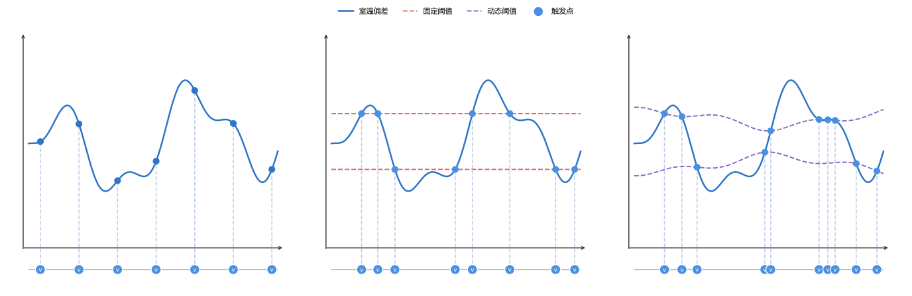
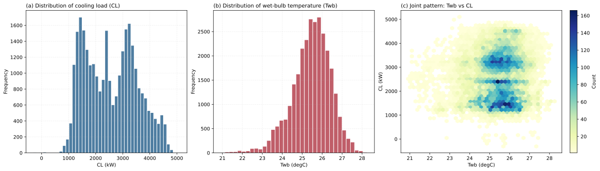
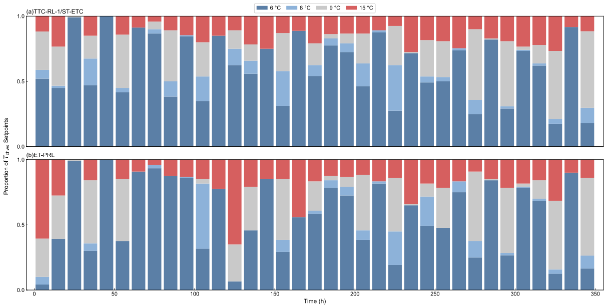
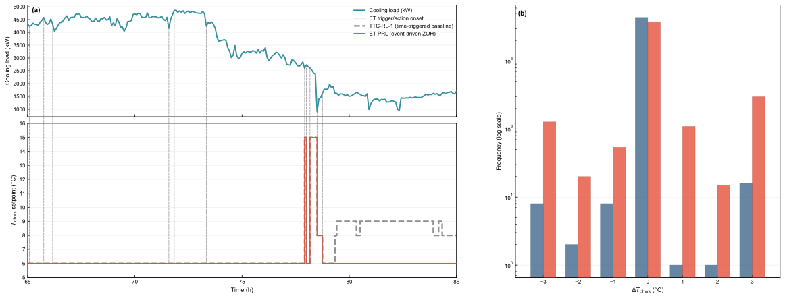
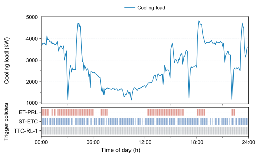
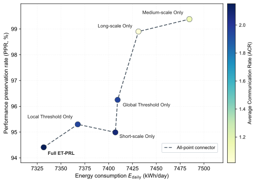
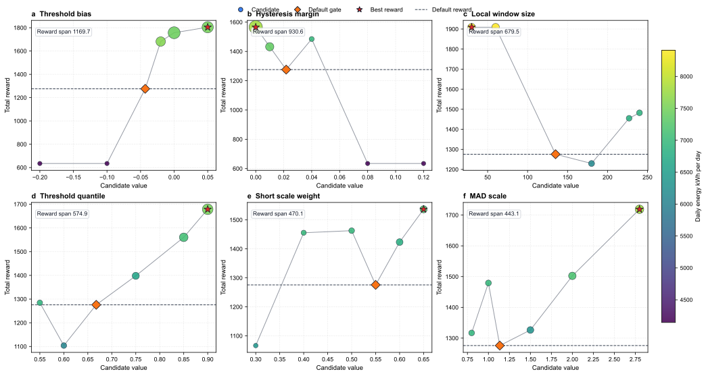

# 基于动态事件触发的 HVAC 强化学习预测控制方法 / HVAC Predictive Control Method Based on Dynamic Event Triggering

# 1. 引言 / Introduction

随着全球气候变化的加剧，建筑行业的节能减排已成为亟待解决的关键问题。相关统计数据显示，建筑能耗占全球终端能耗的 35% 以上，其中供暖、通风与空调（HVAC）系统不仅占据了建筑整体能耗的约 50%，也是电力需求侧响应的关键调节资源 [1]。在中央空调系统中，冷水机组作为核心耗能部件，其运行效率直接决定了系统的整体性能。然而，实际工程中的 HVAC 控制面临着严峻挑战：建筑热负荷受室外气象条件、室内人员流动及设备散热等多重动态因素的耦合影响，系统具有高度的非线性、时变性及大惯性滞后特征 [2]。

As global climate change intensifies, reducing energy consumption and emissions in the building sector has become an urgent priority. Statistics show that buildings account for over 35 percent of global energy consumption, and heating, ventilation, and air conditioning (HVAC) systems are responsible for about 50 percent of this building energy use and also serve as key resources for demand response where the chiller is the main energy consuming component, and its operating efficiency directly determines the overall system performance to some extent [1]. However, in real engineering scenarios, building thermal load is affected by several changing factors, including outdoor weather, occupant activity, equipment heat release and so on, while the HVAC system is nonlinear, changes over time, and has strong thermal inertia with delayed response, which makes HVAC control challenging [2].

为克服传统控制的局限性，深度强化学习（Deep Reinforcement Learning, DRL）凭借其无模型的自适应决策能力，近年来在 HVAC 控制领域展现出广阔的应用前景。DRL 能够通过与复杂时变环境的直接交互，自主学习并适应非线性工况 [3]；结合时序特征的预测型 DRL 进一步提升了智能体的前瞻预测能力，有效缓解了建筑大热惯性带来的控制滞后 [4]。然而，现有 DRL 在实际工程部署中仍受限于固定时间步长控制（Time-Triggered Control, TTC）这一根本性范式。在该机制下，智能体严格按预设时钟周期进行状态采样与动作更新，忽略了建筑热负荷在时间维度上演变的非均匀特性 [5]。这种固定频率驱动方式导致了响应速度与控制代价之间的固有矛盾：高频控制虽能迅速响应环境扰动，却会带来显著的计算开销与执行器机械磨损；低频控制虽能降低硬件损耗，却易造成控温精度下降 [6]。

Nowadays, deep reinforcement learning (DRL) has shown strong potential in HVAC control because it can make adaptive decisions without relying on a predefined model. By interacting directly with complex and changing environments, DRL can learn and adapt to nonlinear operating conditions [3]. Moreover, Predictive DRL further advances by using temporal features, which improves the agent's ability to anticipate future changes and helps reduce the control lag caused by the large thermal inertia of buildings [4]. However, in practical deployment, current DRL methods are still limited by the common time triggered control (TTC) scheme, where the agent samples states and updates actions at a fixed clock cycle which ignores the fact that building thermal loads do not evolve at a uniform rate over time [5]. As a result, there is an inherent trade-off between response speed and control cost: frequent updates can react quickly to disturbances, but they also increase computation cost and actuator wear, while infrequent updates reduce wear but often hurt temperature control accuracy [6].

为缓解 TTC 范式带来的计算冗余与设备磨损问题，事件驱动控制（Event-Triggered Control, ETC）机制应运而生 [7]。ETC 基于按需决策理念，仅在系统状态发生显著偏离时激活控制更新 [8]。这种稀疏控制机制有效突破了时间步长的硬性约束，为平衡响应速度与控制代价提供了可行途径。基于这一优势，已有研究在深度强化学习中引入 ETC 范式以进一步优化系统运行。这类方法在触发特定的预设事件时调整控制策略，有助于在热舒适度与能源消耗之间实现更好的平衡 [9]。然而，现有 ETC 方案主要依赖基于专家经验的静态规则，例如设定固定的温度死区或负荷波动阈值 [10]。静态触发机制在面对高度非线性且时变的真实建筑环境时缺乏动态适应能力，难以适应不同建筑的热惯性差异以及设备老化后的性能漂移，极易导致频繁误触发或控制响应迟滞现象 [11]。

The event triggered control (ETC) mechanism was developed to reduce the extra computation and equipment wear caused by TTC [7]. By updating the control system only when the system state changes significantly, ETC overcomes the constraint of TTC and provides a practical way to balance response speed and control cost [8]. Building on this advantage, prior studies have introduced ETC into DRL, where the control policy is updated when specific predefined events are triggered, which helps balance thermal comfort and energy consumption [9]. However, most existing ETC methods still rely on static rules set by experts, such as fixed temperature deadbands or load fluctuation thresholds [10]. Such static triggering schemes cannot adapt well to real building environments that are highly nonlinear and time varying. They also struggle to handle differences in thermal inertia across buildings and performance drift caused by equipment aging, which can lead to frequent false triggers or delayed control responses [11].

考虑到上述问题，有必要引入可随系统运行状态动态调整的阈值机制，使触发边界由基于固定经验的预设规则转变为依据偏离信号演化过程的自适应判定。如图 1 所示，图中比较了固定间隔、固定阈值与动态阈值三种策略对同一室温偏差信号轨迹的响应：固定间隔策略以恒定节奏更新，固定阈值策略仅在偏离越过预设边界时触发，而动态阈值策略则根据偏离趋势持续调整边界，在扰动增强时触发更密集，在相对平稳时段触发更稀疏。这种行为使得控制响应性与执行代价之间的平衡更加有效。

With respect to the above problems, a thresholding mechanism that can adapt to the current operating state of the system is considered, so that the triggering boundary is determined not by fixed empirical rules but by an adaptive criterion driven by the evolution of the deviation signal, as illustrated in Figure 1. The figure compares how fixed-interval, fixed-threshold, and dynamic-threshold strategies respond to the same room temperature deviation trajectory: the fixed-interval strategy updates at a constant cadence, the fixed-threshold strategy triggers only when the deviation crosses a preset boundary, and the dynamic-threshold strategy continuously adjusts its boundary according to the deviation trend, leading to denser updates during intensified disturbances and sparser updates during relatively steady periods. This behavior enables a more effective balance between control responsiveness and execution cost.


**图1** 固定间隔、固定阈值与动态阈值三种更新策略对比。上排为室温偏差信号与不同触发阈值的关系；下排为触发时刻的分布。虚线标记表示触发时刻。

基于上述动机，本文提出了一种基于无监督动态事件门控的事件触发预测强化学习控制框架（Event-Triggered Predictive Reinforcement Learning with Unsupervised Dynamic Event Gating, ET-PRL），将时间序列预测、无监督动态事件门控与强化学习决策过程相结合。ET-PRL 采用数据驱动的方法，从运行数据中动态学习触发规则，并在触发时激活预测型强化学习策略网络输出控制动作，从而能够在不同的建筑特性和运行条件下实现自适应灵敏度。通过将预测特征、自适应门控机制与强化学习控制器深度耦合，该框架在关键干扰期间保持完全控制能力，同时在稳定期间抑制冗余更新。本文的主要贡献如下：

Driven by the above motivations, this paper proposes a new HVAC control framework, Event-Triggered Predictive Reinforcement Learning with Unsupervised Dynamic Event Gating (ET-PRL), that combines time series prediction with unsupervised dynamic event gating in a deep reinforcement learning setting. ET-PRL learns event-triggering rules online from operational data through a data-driven method and activates a predictive reinforcement learning policy network to generate control actions when critical events are detected, allowing control sensitivity to adapt to different building characteristics and operating conditions. By integrating predictive features, adaptive gating, and the reinforcement learning controller into a unified framework, the method preserves full control capability during major disturbances while reducing redundant updates during stable periods. The main contributions of this paper are as follows:

- **提出基于流式特征的无监督动态事件门控机制**：在 ET-PRL 框架中构建了融合多尺度异常追踪与双层自适应阈值的门控模块，摆脱了对静态人工规则的依赖，实现了对时变工况下非平稳扰动的自适应感知。

- **We propose an unsupervised dynamic event gating mechanism based on streaming features**: We build a gating module that combines multi scale anomaly tracking with a two layer adaptive threshold. This removes the need for static manual rules and allows the system to automatically adapt to irregular disturbances under changing operating conditions.

- **构建时序解耦的事件驱动预测型控制架构**：将事件门控机制无缝融入预测型强化学习框架，使策略网络仅在关键扰动时激活，并在平稳期依靠零阶保持器（ZOH）维持控制输出。该架构通过与预测状态特征深度耦合，有效补偿稀疏按需执行导致的信息缺失，并进一步增强策略的前瞻性决策能力。

- **We construct a time decoupled, event driven predictive control framework**: The event gating mechanism is smoothly integrated into predictive reinforcement learning. The policy network is activated only during critical disturbances, while a zero order hold (ZOH) maintains the control output during stable periods. Through deep coupling with predictive state features, this framework effectively compensates for information loss caused by sparse on demand execution and further improves the policy's anticipatory decision making capability.

- **实现控制精度与执行代价的量化优化折衷**：基于102天真实冷水机组运行数据，我们通过系统对比、消融与敏感性分析量化证明了所提方法在动作更新次数上降低53.54%、日均能耗由7491降至7332 kWh/day（节能2.13%），且在保持94.41%基线性能下表现稳定，说明该方法具备鲁棒性与工程可部署性。

- **Quantified optimization trade off between control accuracy and execution cost**: Using 102 days of real chiller operation data, systematic comparisons, ablation and sensitivity studies show that the proposed method reduces action updates by 53.54%, lowers average daily energy consumption from 7491 to 7332 kWh/day (2.13% energy saving), and retains 94.41% of baseline performance, demonstrating robustness and practical deployability.

# 2. 相关工作 / Related Work

建筑 HVAC 系统在能效优化与热舒适保障之间的协同控制长期面临工程挑战。为应对建筑能耗增长与运行稳定性要求，传统研究主要采用基于规则的控制（RBC）与比例 - 积分 - 微分（PID）等经典方法 [12]。其中，Choi 等 [13] 通过优化信息驱动的规则提取提升了 HVAC 规则控制的可操作性，Lee 等 [14] 将深度强化学习用于 PID 参数整定以改善跟踪性能；此外，Chojecki 等 [15] 进一步引入模糊控制思想，增强了传统控制器在特定工况下的适应能力。Tang 等 [16] 提出了一种物理感知深度学习嵌入的模型预测控制（MPC）方法，通过构建建筑热动态模型并在滚动时域内求解约束优化问题，实现了能耗、舒适度与设备运行约束的显式协调。尽管这些方法在工业场景中部署便捷、可靠性高，或能够在模型准确时取得较优控制效果，但其核心仍依赖静态规则、线性反馈假设或高精度预测模型，难以充分刻画建筑热环境中的非线性耦合、时变扰动与大滞后特征，因而在复杂运维条件下往往难以同时兼顾节能与舒适性 [17]。

Coordinated control of energy efficiency and thermal comfort in building HVAC systems has long been a major engineering challenge. To address rising building energy demand and requirements for stable operation, early studies mainly relied on classic methods such as rule-based control (RBC) and proportional-integral-derivative (PID) control [12]. Choi et al. [13] improved the practicality of HVAC rule-based control through optimization-informed rule extraction. Lee et al. [14] used deep reinforcement learning to tune PID parameters and improve tracking performance. Chojecki et al. [15] further introduced fuzzy control to improve adaptability under specific operating conditions. Tang et al. [16] proposed a physics-aware deep learning-embedded model predictive control (MPC) approach, which builds predictive models of building thermal dynamics and solves constrained optimization problems over a receding horizon to explicitly coordinate energy use, comfort, and equipment constraints. Although these methods are easy to deploy and reliable in industrial scenarios, or can achieve strong control performance when the model is accurate, they still depend on static rules, linear feedback assumptions, or high-fidelity predictive models. As a result, they have limited ability to represent nonlinear coupling, time-varying disturbances, and long thermal delays in buildings, and they often struggle to maintain both energy savings and comfort under complex operation and maintenance conditions [17].

为突破传统控制在建模与适应性方面的瓶颈，数据驱动方法逐步成为 HVAC 智能控制的重要方向。其中，强化学习能够在不依赖精确物理模型的情况下，通过与建筑环境的试错交互学习运行状态与控制动作之间的优化映射，因而逐渐被用于建筑能耗管理、HVAC 控制与需求响应等任务 [18]。Savino 等 [19] 系统展示了深度强化学习在多区域底层控制中的应用潜力；Wang 与 Lin [20] 以及 Zhuang 等 [21] 分别基于 DQN/DDPG 等范式构建了从高维传感状态到控制动作的映射，验证了强化学习在复杂场景中的优化优势。然而，强化学习多采用基于当前观测的反应式决策，在具有显著热惯性与时滞的系统中容易出现控制滞后与振荡 [22]。为此，Li 等 [23] 将 LSTM 等时序模型融入决策过程，通过引入前瞻预测信息增强了策略对环境演化的感知能力，并在一定程度上改善了控制平稳性；He 等 [24] 进一步面向冷机群优化，将 LSTM 负荷预测与 DQN 控制相结合，构建了无模型的预测型强化学习框架，表明引入预测信息能够在保持强化学习自适应性的同时提升控制前瞻性。需要指出的是，现有 RL 及预测型 RL 方法在执行层面仍普遍遵循固定时间步长控制（TTC）范式，即按预设周期进行状态采样与动作更新，难以根据负荷扰动强弱自适应调整决策频率，因而存在冗余计算、执行机构磨损之间的固有矛盾 [25]。

To overcome the modeling and adaptability limits of traditional control, data-driven methods have become an important direction for intelligent HVAC control. Among them, reinforcement learning can learn optimized mappings between operating states and control actions through trial-and-error interaction with the building environment without requiring an accurate physical model, and has therefore been increasingly applied to building energy management, HVAC control, and demand response tasks [18]. Savino et al. [19] demonstrated the potential of deep reinforcement learning for low-level control in multi-zone buildings. Wang et al. [20] and Zhuang et al. [21] used DQN- and DDPG-based frameworks to learn mappings from high-dimensional sensor states to control actions, confirming the optimization benefits of reinforcement learning in complex scenarios. However, most reinforcement learning methods rely mainly on current observations, which can lead to control delay and oscillation in systems with strong thermal inertia and time lag [22]. To mitigate this issue, Li et al. [23] integrated temporal models such as LSTM into the decision process, improving awareness of system evolution and partially improving control stability; He et al. [24] further developed a model-free PRL method for chiller plant optimization by combining LSTM-based load prediction with DQN control, showing that predictive information can improve control foresight while preserving the adaptability of RL. Nevertheless, existing RL and PRL methods still generally follow the TTC paradigm at the execution level, where states are sampled and actions are updated at preset intervals. This makes it difficult to adapt the decision frequency to the intensity of load disturbances and leads to an inherent conflict between redundant computation and actuator wear [25].

在控制策略由规则驱动向数据驱动持续演进的同时，如何降低冗余计算与执行机构磨损成为另一关键问题。Liu 等 [26] 与 Xue 等 [27] 的研究表明，事件驱动控制（ETC）通过按需更新机制，能够在状态越限或事件发生时才触发控制与通信，从而有效减少时间触发控制中的无效更新。进一步地，Fu 等 [9] 提出了事件驱动深度强化学习控制方法 ED-DQN，将事件触发机制引入多区域住宅建筑 HVAC 控制，使智能体仅在预设事件发生时更新控制动作，从而减少固定步长控制下的冗余决策。Liu 等 [28] 指出，现有 ETC 在工程落地中仍普遍依赖专家设定的静态阈值规则。面对建筑热特性漂移、气候波动与设备老化等非平稳因素，固定阈值往往难以兼顾灵敏性与稳定性，容易产生过度触发或响应迟滞，进而影响计算效率与舒适度表现 [29]。

As control strategies have evolved from rule-driven to data-driven methods, reducing redundant computation and actuator wear has become another key issue. Liu et al. [26] and Xue et al. [27] showed that event-triggered control (ETC) updates control and communication only when the state exceeds a threshold or a defined event occurs, thereby reducing unnecessary updates in TTC. Fu et al. [9] further proposed ED-DQN, an event-driven deep reinforcement learning control method for multi-zone residential building HVAC systems, which introduces event triggering into DRL so that the agent updates control actions only when predefined events occur, thereby reducing redundant decisions under fixed-step control. Liu et al. [28] pointed out that ETC methods in practical deployment still rely heavily on expert-defined static threshold rules. Under non-stationary factors such as drift in building thermal characteristics, climate variation, and equipment aging, fixed thresholds usually cannot balance sensitivity and stability, which can lead to excessive triggering or delayed responses and thus weaken computational efficiency and comfort performance [29].

基于上述研究进展，本文将 HVAC 事件触发过程重构为在线无监督异常检测问题，并提出耦合动态门控与预测型强化学习的按需控制框架（ET-PRL）。与依赖静态规则的传统方法及现有 ETC 方案相比，本文通过流式特征追踪与自适应阈值判定实现触发条件的动态更新，降低了对人工经验的依赖，并提升了对长期漂移的适应性。与固定步长强化学习不同，该框架进一步以事件驱动方式解耦决策时序，在削减冗余推理与设备磨损的同时，利用预测特征弥补稀疏控制带来的状态信息缺失，最终在真实建筑非平稳工况中实现控制性能与执行代价的有效折衷。

Building on these studies, this paper reformulates HVAC event triggering as an online unsupervised anomaly detection problem and proposes ET-PRL, an on-demand framework that combines dynamic gating with predictive reinforcement learning. Compared with traditional static-rule methods and existing ETC schemes, ET-PRL introduces streaming feature tracking and adaptive thresholding to update triggering conditions dynamically, reducing dependence on manual tuning and improving adaptability to long-term drift. Unlike fixed-step reinforcement learning, the framework further decouples decision timing through event-driven execution, thereby reducing redundant inference and equipment wear while using predictive features to compensate for the loss of state information caused by sparse control. As a result, ET-PRL achieves a practical balance between control performance and execution cost under non-stationary building operating conditions.

# 3. 方法 / Methodology

针对建筑 HVAC 系统存在的热惯性与响应滞后特性，以及运行工况随季节变化导致的分布漂移，传统依赖离线标定与静态阈值的事件控制方法在跨工况迁移时通常需要频繁再校准，进而增加了工程维护成本。为此，本文提出一种将流式异常门控与深度强化学习耦合的按需控制框架，即事件触发预测型强化学习（Event-Triggered Predictive Reinforcement Learning, ET-PRL）。

Given the thermal inertia and delayed response of building HVAC systems, together with distribution shift caused by seasonal changes in operating conditions, traditional event-triggered control methods that rely on offline calibration and static thresholds usually require frequent recalibration when transferred across scenarios, which increases engineering maintenance cost. To address this issue, this paper proposes ET-PRL, an on-demand control framework that couples streaming anomaly gating with DRL.

> **图2 占位：ET-PRL 总体框架图**
> **Figure 2 placeholder: Overall ET-PRL framework**
>
> 对图 2 中内容的描述

## 3.1 基于流式特征追踪的动态事件触发机制设计 / Dynamic Event Triggering Design Based on Streaming Feature Tracking

在事件驱动控制范式中，控制更新的激活取决于对关键事件的判定，即系统运行状态显著偏离常态工况、需要控制动作即时介入的时刻。现有方法多依赖人工预设的静态规则来界定此类事件，难以适应建筑 HVAC 系统的非线性时变特性。本文将关键事件识别重定义为在线异常检测问题。具体而言，在控制语义上，关键事件对应需要控制动作即时介入的工况突变；在统计语义上，该类时刻通常表现为状态样本相对常态分布的显著偏离。由此，事件判定可统一建模为偏离度检验问题，而不再依赖人工设定的静态规则。

In event-triggered control, activating a control update depends on identifying critical events, that is, moments when the system state deviates significantly from normal operation and demands prompt control action. Most existing methods define such events using manually preset static rules, which are difficult to adapt to nonlinear and time-varying characteristics of building HVAC systems. We reformulate critical event identification as an online anomaly detection problem. Specifically, in control terms, critical events correspond to abrupt operating condition shifts that require immediate control intervention, while in statistical terms, such moments usually appear as significant deviations of state samples from the normal distribution. Therefore, event judgment can be uniformly modeled as a deviation test rather than relying on manually defined static rules.

设系统状态特征向量为 $s_t\in\mathbb{R}^d$，事件标签为 $e_t\in\{0,1\}$，时刻 $t$ 的常态参考分布记为 $\mathcal{P}^{\text{norm}}_t$。定义事件集合

$$
\mathcal{E}_t=\{s:\,d(s,\mathcal{P}^{\text{norm}}_t)>\delta_t\},\qquad
e_t=\mathbb{I}(s_t\in\mathcal{E}_t) \tag{1}
$$

其中，$\mathbb{I}(\cdot)$ 为指示函数，条件成立时取 1，否则取 0；$d(\cdot)$ 为分布偏离度量，$\delta_t$ 为判别阈值。上述定义表明，事件识别本质上是对是否偏离常态区域的二值判定；当状态进入高偏离区域时触发控制动作更新，否则维持当前控制动作。

Let the system state feature vector be $s_t\in\mathbb{R}^d$, the event label be $e_t\in\{0,1\}$, and the normal reference distribution at time step $t$ be denoted by $\mathcal{P}^{\text{norm}}_t$. The event set is defined as Equation (1):

$$
\mathcal{E}_t=\{s:\,d(s,\mathcal{P}^{\text{norm}}_t)>\delta_t\},\qquad
e_t=\mathbb{I}(s_t\in\mathcal{E}_t) \tag{1}
$$

where $\mathbb{I}(\cdot)$ is the indicator function that equals 1 when the condition holds and 0 otherwise; $d(\cdot)$ denotes the distribution deviation metric, and $\delta_t$ is the decision threshold. This definition shows that event detection is essentially a binary test of whether the current state deviates from the normal region. The control action is updated when the state enters a high-deviation region; otherwise, the current control action is maintained.

为将偏离度检验转化为可流式更新的标量判据，本文采用异常分数函数 $A(s_t)$ 作为分布偏离度量 $d(s,\mathcal{P}^{\text{norm}}_t)$ 的标量化代理，并将集合判别转化为可计算的阈值比较：

$$
e_t=\mathbb{I}(A(s_t)>\tau_t) \tag{2}
$$

其中，$A(s_t)$ 越大表示偏离常态程度越高，$\tau_t$ 为触发阈值，对应于公式 (1) 中判别阈值 $\delta_t$ 在异常分数空间中的可计算形式。该形式具有两点优势：其一，可与流式统计量直接耦合，支持逐时间步在线更新；其二，便于与后续门控逻辑统一，实现由异常评分到触发决策的一体化建模与实现。

To convert distribution-level deviation testing into a scalar decision rule that can be updated in a streaming manner, an anomaly score function $A(s_t)$ is used as a scalar proxy for the distribution deviation metric $d(s,\mathcal{P}^{\text{norm}}_t)$, and the set-based rule is converted into a computable threshold comparison as Equation (2).

$$
e_t=\mathbb{I}(A(s_t)>\tau_t) \tag{2}
$$

where a larger $A(s_t)$ indicates a stronger deviation from normal behavior, and $\tau_t$ is the trigger threshold, which is the computable counterpart of the decision threshold $\delta_t$ in Eq. (1) expressed in the anomaly score space. This form has two advantages: First, it can be directly coupled with streaming statistics and updated step by step. Second, it is naturally consistent with the subsequent gating logic and enables integrated modeling and implementation from anomaly scoring to trigger decision.

考虑 HVAC 长周期运行中的气象扰动、设备老化与负荷行为漂移所导致的非平稳性，本文不采用固定阈值，而采用流式自适应更新机制：

$$
    \tau_t=\Phi\big(A(s_{1}),\ldots,A(s_{t-1})\big) \tag{3}
$$

其中，$\Phi(\cdot)$ 表示由历史异常分数驱动的阈值更新算子。该设计旨在平衡灵敏性与稳定性：在扰动增强时提升事件检出率，在平稳区间抑制冗余触发，从而降低误触发与漏触发风险。

Considering the non-stationarity caused by weather disturbances, equipment aging, and load behavior drift during long-term HVAC operation, the threshold is updated through a streaming adaptive mechanism rather than fixed value as Equation (3):

$$
    \tau_t=\Phi\big(A(s_{1}),\ldots,A(s_{t-1})\big) \tag{3}
$$

where $\Phi(\cdot)$ denotes the threshold update operator driven by historical anomaly scores which balances sensitivity and stability. It increases event coverage when disturbances intensify and suppresses redundant triggering during steady periods, thereby reducing the risk of false triggers and missed triggers.

(1) 系统状态特征定义

(1) Definition of System State Features

事件门控模块与强化学习控制器共享同一状态特征输入。本文将该输入定义为紧凑的三维特征向量：

$$s_t=[Q_{load}^t,\,T_{wb}^t,\,\hat{Q}_{load}^{t+1}] \tag{4}$$

其中，$Q_{load}^t$ 表示当前时刻系统冷负荷，$T_{wb}^t$ 表示室外湿球温度，$\hat{Q}_{load}^{t+1}$ 表示下一时刻系统冷负荷的短期预测值。

The event gating module and the reinforcement learning controller share the same state feature which is defined as a compact three-dimensional feature vector as Equation (4):

$$s_t=[Q_{load}^t,\,T_{wb}^t,\,\hat{Q}_{load}^{t+1}] \tag{4}$$

where, at the time step $t$, $Q_{load}^t$ denotes the system cooling load, $T_{wb}^t$ denotes the outdoor wet-bulb temperature, and $\hat{Q}_{load}^{t+1}$ denotes the one-step-ahead short-term prediction of the system cooling load.

引入 $T_{wb}^t$ 的主要原因在于该变量能够同时表征外部温度与湿度条件，并直接约束冷却塔换热性能及系统排热上限，因此可作为刻画外生气象扰动强度与方向的关键状态量，从而提升门控机制对环境非平稳变化的识别能力；此外，引入 $\hat{Q}_{load}^{t+1}$ 的动机在于建筑热系统具有显著热惯性与控制滞后，若仅依赖当前观测量门控判定通常滞后于工况变化，纳入一步前瞻负荷后可提前感知负荷爬升或回落趋势，进而在关键变化阶段更早触发策略更新，降低稀疏触发条件下的响应滞后风险；为在保持表征能力的同时控制特征维度并支撑在线门控的实时计算，本文未进一步引入管网流量、回水温度等附加变量，原因是在线异常检测在高维空间中易出现样本稀疏与距离退化，从而削弱统计判别稳定性并增加计算开销。

The main reason for selecting $T_{wb}^t$ is that it can capture both ambient temperature and humidity and directly constrain cooling tower heat transfer performance and the upper limit of system heat rejection. It therefore serves as a key state variable for characterizing the intensity and direction of exogenous weather disturbances, which improves the ability of the gating mechanism to detect non-stationary environmental changes. Moreover, $\hat{Q}_{load}^{t+1}$ is selected because building thermal systems exhibit strong thermal inertia and control delay. If the gating mechanism relies only on current observations, trigger decisions usually lag behind operating condition shifts. By incorporating one-step-ahead load information, the gating module can sense rising or falling load trends earlier to some extent and trigger control action updates earlier during critical transitions, thereby reducing the risk of delayed response under sparse triggering.

(2) 流式隔离深度与多尺度异常追踪

(2) Streaming Isolation Depth and Multi-Scale Anomaly Tracking

传统离线异常检测通常依赖静态样本库，在季节性工况漂移场景下稳定性受限。为此，本文采用流式隔离深度机制，对在线到达的系统状态特征 $s_t$ 进行实时异常评分。流式隔离深度算法（Streaming Isolation Depth）通过在滑动数据窗口上动态构建与更新隔离树结构，计算输入数据点在多棵树中的平均路径长度作为隔离程度度量。路径越短，数据点越容易被孤立，对应异常概率越高。该机制能够在不重新训练全局模型的条件下在线适应分布变化。

Traditional offline anomaly detection usually depends on a static sample library and is less stable under seasonal operating drift. To address this issue, a streaming isolation depth mechanism is deployed to score anomalies of the online system state feature $s_t$ in real time. Streaming Isolation Depth dynamically builds and updates isolation tree structures over sliding data windows, and uses the average path length of a sample across multiple trees to measure its degree of isolation. A shorter path means the sample is easier to isolate and therefore more likely to be anomalous. This mechanism can adapt to distribution changes online without retraining a global model.

隔离树通过递归随机选择特征与分割点来孤立数据点。对于输入点 $s_t$，在滑动参考窗口内的 $\psi$ 棵隔离树上分别执行搜索，记该点在第 $j$ 棵树上的路径长度为 $h_j(s_t)$，其中路径长度定义为从根节点到叶节点的边数。该点的平均隔离深度定义为：

$$h_{\mathrm{iso}}(s_t) = \frac{1}{\psi} \sum_{j=1}^{\psi} h_j(s_t) \tag{5}$$

进而转化为归一化的异常分数，其中 $m$ 为参考集样本数，$C(m)$ 为对应的平均路径长度基准：

$$A_{\mathrm{iso}}(s_t) = 2^{-\frac{h_{\mathrm{iso}}(s_t)}{C(m)}} \tag{6}$$

Each isolation tree isolates data points by recursively selecting random features and split state points. For a state point $s_t$, search is performed on $\psi$ isolation trees built from the sliding reference window, and $h_j(s_t)$ denotes the path length on the $j$-th tree, where the path length is defined as the number of edges from the root node to the leaf node. The average isolation depth of the sample is defined as Equation (5):

$$h_{\mathrm{iso}}(s_t) = \frac{1}{\psi} \sum_{j=1}^{\psi} h_j(s_t) \tag{5}$$

Thereafter, $h_{\mathrm{iso}}(s_t)$ is further converted into a normalized anomaly score as Equation (6), where $m$ is the number of samples in the reference set and $C(m)$ is the corresponding baseline for average path length.

$$A_{\mathrm{iso}}(s_t) = 2^{-\frac{h_{\mathrm{iso}}(s_t)}{C(m)}} \tag{6}$$

标准化常数计算为 $C(m) = 2H(m-1) - \frac{2(m-1)}{m}$，其中 $H(m-1)=\sum\limits_{i=1}^{m-1}\frac{1}{i}$ 为调和级数。该形式将异常分数映射至 $(0,1)$ 区间：当数据点易被隔离时，路径较短，分数趋近于 1；当数据点难被隔离时，路径较长，分数趋近于 0。

The normalization constant is computed as $C(m) = 2H(m-1) - \frac{2(m-1)}{m}$, where $H(m-1)=\sum\limits_{i=1}^{m-1}\frac{1}{i}$ is the harmonic series which maps the anomaly score to the interval $(0,1)$: shorter paths yield scores closer to 1, indicating easy isolation, whereas longer paths yield scores closer to 0, indicating difficulty of isolation.

算法维护三个不同规模的滑动参考窗口以生成多尺度动态参考集合。短时窗口 $\mathcal{W}_{\mathrm{short}}$ 包含最近 $n_s$ 个数据点，用于捕捉高频波动；中时窗口 $\mathcal{W}_{\mathrm{medium}}$ 包含最近 $n_m$ 个数据点，用于表征日内周期；长时窗口 $\mathcal{W}_{\mathrm{long}}$ 包含最近 $n_l$ 个数据点，用于描述季节性漂移，且参数满足 $n_s < n_m < n_l$。在各窗口上独立应用隔离树算法，并在每个时刻输出对应尺度的异常分数。记 $\kappa\in\{\mathrm{short},\mathrm{medium},\mathrm{long}\}$，对应窗口规模记为 $n_\kappa$，则有

$$A_{\kappa}(s_t)=2^{-\frac{h_{\mathrm{iso}}^{\kappa}(s_t)}{C(n_{\kappa})}} \tag{7}$$

各尺度分数均归一化至 $[0,1]$ 区间。综合异常分数定义为三类尺度分数的加权融合：

$$A(s_t)=w_{\mathrm{s}}A_{\mathrm{short}}(s_t)+w_{\mathrm{m}}A_{\mathrm{medium}}(s_t)+w_{\mathrm{l}}A_{\mathrm{long}}(s_t) \tag{8}$$

其中 $w_{\mathrm{s}}, w_{\mathrm{m}}, w_{\mathrm{l}} \ge 0$ 且 $w_{\mathrm{s}}+w_{\mathrm{m}}+w_{\mathrm{l}}=1$ 分别代表对应时间尺度的融合权重。

The computation process maintains three sliding reference windows of different sizes to form multi-scale dynamic reference sets. The short window $\mathcal{W}_{\mathrm{short}}$ contains the most recent $n_s$ data points and is used to capture high-frequency fluctuations. The medium window $\mathcal{W}_{\mathrm{medium}}$ contains the most recent $n_m$ data points and is used to represent the intraday cycle. The long window $\mathcal{W}_{\mathrm{long}}$ contains the most recent $n_l$ data points and is used to describe seasonal drift, with $n_s < n_m < n_l$. Isolation trees are applied independently to each window, and an anomaly score is produced at each scale at every time step. Let $\kappa\in\{\mathrm{short},\mathrm{medium},\mathrm{long}\}$ and let $n_\kappa$ denote the corresponding window size. The corresponding scale-specific anomaly score is given by Equation (7):

$$A_{\kappa}(s_t)=2^{-\frac{h_{\mathrm{iso}}^{\kappa}(s_t)}{C(n_{\kappa})}} \tag{7}$$

All scale-specific scores are normalized to the interval $[0,1]$. The overall anomaly score is defined as a weighted fusion of the three scale-specific scores as Equation (8).

$$A(s_t)=w_{\mathrm{s}}A_{\mathrm{short}}(s_t)+w_{\mathrm{m}}A_{\mathrm{medium}}(s_t)+w_{\mathrm{l}}A_{\mathrm{long}}(s_t) \tag{8}$$

where $w_{\mathrm{s}}, w_{\mathrm{m}}, w_{\mathrm{l}} \ge 0$ and $w_{\mathrm{s}}+w_{\mathrm{m}}+w_{\mathrm{l}}=1$, which represent the fusion weights of the corresponding time scales.

本文通过短、中、长三个时间尺度的加权融合来构建综合异常分数。其中，短时尺度主要用于捕捉高频扰动，中时尺度用于表征日内周期变化，长时尺度用于跟踪季节性漂移与长期慢变过程。该多尺度融合机制使门控模块能够同时响应局部突发扰动与系统级慢变趋势，避免单一尺度统计在非平稳工况下出现的灵敏性不足或过触发问题，从而提升门控机制在跨工况场景下的适应性与鲁棒性。

We construct the composite anomaly score through weighted fusion of the short, medium, and long time scales. The short-term scale primarily captures high-frequency disturbances, the medium-term scale characterizes intraday periodic variations, and the long-term scale tracks seasonal drift and long-term slow processes. This multi-scale fusion mechanism enables the gating module to jointly respond to local abrupt disturbances and system-level slow-varying trends, avoiding the insufficient sensitivity or excessive triggering that a single-scale statistic may exhibit under non-stationary operating conditions, thereby improving the adaptability and robustness of the gating mechanism across diverse operating scenarios.

(3) 流式双层自适应阈值优化

(3) Streaming Two-Layer Adaptive Threshold Optimization

本文构造局部 - 全局双层自适应阈值。具体而言，首先在滑动窗口内基于上分位数与绝对中位差分别估计异常分数经验分布的上尾边界，并加权融合为候选阈值；随后对该候选阈值进行局部指数平滑，得到能够快速跟踪近期工况变化的局部阈值；最后引入更新速率更慢的全局阈值，为长期漂移提供平滑基线约束。最终，触发阈值并非由单一统计量给出，而是由局部阈值与全局阈值共同决定。

The local-global two-layer adaptive threshold is constructed as follows. Starting from the empirical anomaly score distribution within the sliding window, upper-tail boundaries are first estimated separately using the upper quantile and the median absolute deviation (MAD), and then combined into a candidate threshold through weighted fusion. Local exponential smoothing is then applied to this candidate threshold, yielding a local threshold that tracks recent operating condition changes. To capture longer-term trends, a global threshold with a slower update rate is introduced to provide a smooth baseline constraint against drift. Finally, the triggering threshold is determined by combining both the local and global components rather than relying on a single statistic.

为降低异常样本对位置统计量和尺度统计量的影响，本文采用两类鲁棒统计量构造候选阈值：基于上分位数的阈值 $\tau_q^{(t)}$ 与基于绝对中位差（MAD）的阈值 $\tau_{\mathrm{mad}}^{(t)}$。前者表征异常分数经验分布的上尾位置，后者刻画围绕中位数的稳健离散度，二者定义如下：

$$\tau_{q}^{(t)}=Q_q(\mathcal{A}_t) \tag{9a}$$

$$\begin{aligned}
\tau_{\mathrm{mad}}^{(t)} &= \operatorname{med}(\mathcal{A}_t)+\kappa \cdot c \cdot \operatorname{MAD}(\mathcal{A}_t) \\
&= \operatorname{med}(\mathcal{A}_t)+\kappa \cdot c \cdot\operatorname{med}\left(\left\{\left|a-\operatorname{med}(\mathcal{A}_t)\right|:a\in\mathcal{A}_{t}\right\}\right)
\end{aligned} \tag{9b}$$

其中，$\mathcal{A}_t=\{A(s_{t-W+1}),\ldots,A(s_t)\}$ 表示长度为 $W$ 的异常分数滑动窗口，$W$ 为窗口长度；$Q_q(\cdot)$ 表示分位点为 $q$ 的经验分位数，且 $q\in(0.5,1)$；$\operatorname{med}(\cdot)$ 为中位数函数；$\kappa$ 为灵敏度调节系数；$c \approx 1.4826$ 为高斯分布下的正常一致性校正常数。$\tau_q^{(t)}$ 主要表征异常分数经验分布的上尾位置，而 $\tau_{\mathrm{mad}}^{(t)}$ 则根据窗口内分数的稳健离散程度对该边界进行修正。

To reduce the influence of anomalous samples on location and scale statistics, we employ two robust statistics to construct the candidate threshold: an upper-quantile-based threshold $\tau_q^{(t)}$ and a MAD based threshold $\tau_{\mathrm{mad}}^{(t)}$. The former captures the upper-tail position of the empirical anomaly score distribution, while the latter characterizes the robust dispersion around the median. They are defined as Equations (9a) and (9b):

$$\tau_{q}^{(t)}=Q_q(\mathcal{A}_t) \tag{9a}$$

$$\begin{aligned}
\tau_{\mathrm{mad}}^{(t)} &= \operatorname{med}(\mathcal{A}_t)+\kappa \cdot c \cdot \operatorname{MAD}(\mathcal{A}_t) \\
&= \operatorname{med}(\mathcal{A}_t)+\kappa \cdot c \cdot\operatorname{med}\left(\left\{\left|a-\operatorname{med}(\mathcal{A}_t)\right|:a\in\mathcal{A}_{t}\right\}\right)
\end{aligned} \tag{9b}$$

where $\mathcal{A}_t=\{A(s_{t-W+1}),\ldots,A(s_t)\}$ denotes the anomaly score sliding window of length $W$; $Q_q(\cdot)$ is the empirical quantile at level $q\in(0.5,1)$; $\operatorname{med}(\cdot)$ is the median function; $\kappa$ is the sensitivity coefficient; and $c \approx 1.4826$ is the consistency constant for Gaussian distributions. The threshold $\tau_q^{(t)}$ primarily characterizes the upper-tail position of the empirical anomaly score distribution, whereas $\tau_{\mathrm{mad}}^{(t)}$ refines this boundary according to the robust dispersion of scores within the window.

在此基础上，本文构造局部候选阈值，用于给出当前窗口下的触发阈值估计：

$$\tau_{\mathrm{cand}}^{(t)}=\omega_q\tau_q^{(t)}+(1-\omega_q)\tau_{\mathrm{mad}}^{(t)} \tag{10}$$

其中，$\omega_q \in [0,1]$ 为融合权重。$\omega_q$ 较大时，候选阈值更接近上尾分位边界，因此更依赖当前异常分数是否超过历史窗口中的高分位水平；$\omega_q$ 较小时，候选阈值更强调 MAD 所反映的稳健波动尺度，因此对分数分布的扩张或收缩更为敏感。

On this basis, we construct the local candidate threshold to provide an initial estimate of the triggering boundary for the current window as Equation (10):

$$\tau_{\mathrm{cand}}^{(t)}=\omega_q\tau_q^{(t)}+(1-\omega_q)\tau_{\mathrm{mad}}^{(t)} \tag{10}$$

where $\omega_q \in [0,1]$ is the fusion weight. A larger $\omega_q$ shifts the candidate threshold closer to the upper-quantile boundary, making the criterion more dependent on whether the current anomaly score exceeds the high-quantile level within the historical window. A smaller $\omega_q$ places greater emphasis on the robust fluctuation scale reflected by MAD, thereby increasing sensitivity to expansion or contraction of the score distribution.

由于 $\tau_{\mathrm{cand}}^{(t)}$ 仍可能受到单时刻尖峰扰动的影响，本文进一步对其进行快时间尺度上的指数平滑，得到局部阈值：

$$\tau_{\mathrm{local}}^{(t)}=(1-\lambda_{\mathrm{local}})\tau_{\mathrm{local}}^{(t-1)}+\lambda_{\mathrm{local}}\tau_{\mathrm{cand}}^{(t)} \tag{11}$$

式中，$\lambda_{\mathrm{local}} \in (0,1]$ 为局部更新率，$\tau_{\mathrm{local}}^{(0)}$ 取首个完整滑动窗口上得到的候选阈值。该步骤通过一阶平滑在阈值响应性与抗抖动性之间取得折衷。$\lambda_{\mathrm{local}}$ 较大时，局部阈值更快跟随近期工况切换；$\lambda_{\mathrm{local}}$ 较小时，局部阈值对短时脉冲噪声更不敏感。

As $\tau_{\mathrm{cand}}^{(t)}$ may still be affected by single-step spike disturbances, we further apply exponential smoothing on a fast timescale to obtain the local threshold as Equation (11):

$$\tau_{\mathrm{local}}^{(t)}=(1-\lambda_{\mathrm{local}})\tau_{\mathrm{local}}^{(t-1)}+\lambda_{\mathrm{local}}\tau_{\mathrm{cand}}^{(t)} \tag{11}$$

where $\lambda_{\mathrm{local}} \in (0,1]$ is the local update rate, and $\tau_{\mathrm{local}}^{(0)}=\tau_{\mathrm{cand}}^{(t_0)}$ with $t_0$ denoting the first time step at which a complete sliding window is available. By applying first-order smoothing, this design achieves a trade-off between threshold responsiveness and resistance to jitter. A larger $\lambda_{\mathrm{local}}$ enables the local threshold to follow recent operating condition transitions more rapidly, whereas a smaller $\lambda_{\mathrm{local}}$ makes the local threshold less sensitive to short-duration impulsive noise.

若系统因季节变化、设备老化或运行边界迁移而发生缓慢漂移，局部阈值可能被长期变化逐步牵引，从而削弱对持续分布偏移的识别能力。因此，本文进一步在更慢时间尺度上构造全局阈值，作为长期基线参考：

$$\tau_{\mathrm{global}}^{(t)}=(1-\lambda_{\mathrm{global}})\tau_{\mathrm{global}}^{(t-1)}+\lambda_{\mathrm{global}}\tau_{\mathrm{local}}^{(t)} \tag{12}$$

其中，$\tau_{\mathrm{global}}^{(0)}=\tau_{\mathrm{local}}^{(0)}=\tau_{\mathrm{cand}}^{(t_0)}$（$t_0$ 为首个完整滑动窗口可用时的时间步），且 $\lambda_{\mathrm{global}} \ll \lambda_{\mathrm{local}}$，以保证全局阈值具有更强的平滑性与迟滞性。

When the system undergoes slow drift due to seasonal variation, equipment aging, or shifts in operating boundaries, the local threshold may be gradually pulled by long-term changes, thereby weakening its ability to detect sustained distributional shifts. We therefore construct a global threshold on a slower timescale as a long-term baseline reference as Equation (12):

$$\tau_{\mathrm{global}}^{(t)}=(1-\lambda_{\mathrm{global}})\tau_{\mathrm{global}}^{(t-1)}+\lambda_{\mathrm{global}}\tau_{\mathrm{local}}^{(t)} \tag{12}$$

where $\tau_{\mathrm{global}}^{(0)}=\tau_{\mathrm{local}}^{(0)}=\tau_{\mathrm{cand}}^{(t_0)}$ and $\lambda_{\mathrm{global}} \ll \lambda_{\mathrm{local}}$, ensuring that the global threshold exhibits stronger smoothness and hysteresis.

最终，流式双层自适应阈值由局部阈值与全局阈值融合得到：

$$\tilde{\tau}_t=\alpha_{\mathrm{local}}\tau_{\mathrm{local}}^{(t)}+(1-\alpha_{\mathrm{local}})\tau_{\mathrm{global}}^{(t)}+b_{\mathrm{bias}} \tag{13}$$

其中，$\alpha_{\mathrm{local}}\in[0,1]$ 控制短期信息与长期信息的融合比例：当其增大时，最终阈值更偏向近期工况，响应更灵敏；当其减小时，最终阈值更偏向长期基线，判定更稳定。$b_{\mathrm{bias}}$ 为整体平移校正项，用于补偿有限窗口估计在不同运行阶段下可能带来的系统性偏差。特别是在夜间低负荷等高度平稳阶段，若仅依赖局部与全局统计量，触发边界可能在窗口效应下出现偏置并导致边界附近频繁切换；引入该项有助于提升判据的稳健性。

The final streaming two-layer adaptive threshold is obtained by fusing the local and global thresholds as Equation (13):

$$\tilde{\tau}_t=\alpha_{\mathrm{local}}\tau_{\mathrm{local}}^{(t)}+(1-\alpha_{\mathrm{local}})\tau_{\mathrm{global}}^{(t)}+b_{\mathrm{bias}} \tag{13}$$

where $\alpha_{\mathrm{local}}\in[0,1]$ controls the blending ratio between short-term and long-term information. Increasing $\alpha_{\mathrm{local}}$ shifts the final threshold toward recent operating conditions, yielding more responsive triggering behavior; decreasing it shifts the threshold toward the long-term baseline, yielding more stable judgment. The term $b_{\mathrm{bias}}$ is a global offset correction that compensates for potential systematic bias arising from finite-window estimation at different operating stages. During highly stable phases such as nighttime low-load periods, the triggering boundary computed from local and global statistics alone may exhibit bias under window effects, leading to frequent boundary oscillations, incorporating this offset therefore improves the robustness of the decision criterion.

## 3.2 在线流式事件门控模块构建 / Online Streaming Event Gating Module Construction

在获得基础自适应门控阈值 $\tilde{\tau}_t$ 后，门控模块进一步将其转化为实际触发判据。与传统固定阈值和单条件越限触发策略不同，本模块采用异常强度判别与时间约束抑振的联合判定形式，目标是在保证关键扰动覆盖率的同时抑制边界附近的抖振触发。前者通过比较 $A(s_t)$ 与自适应阈值实现对当前状态偏离程度的阈值判定，后者通过最小触发间隔约束显式控制动作更新频率，避免短时高频波动引发连续触发，进而导致执行器过度切换。

After obtaining the basic adaptive gating threshold $\tilde{\tau}_t$, we further convert it into an actionable triggering criterion. Unlike traditional fixed-threshold or single-condition exceedance triggering strategies, our gating module employs a joint determination form that combines anomaly intensity discrimination with time-constraint oscillation suppression. The objective is to guarantee coverage of critical disturbances while suppressing chatter triggering near threshold boundaries. The former component evaluates the current state deviation by comparing $A(s_t)$ against the adaptive threshold, whereas the latter explicitly regulates the action update frequency through a minimum trigger interval constraint. This design prevents consecutive triggering caused by short-term high-frequency fluctuations, which would otherwise lead to excessive actuator switching.

在每个控制时刻，门控模块接收当前系统状态特征 $s_t$，计算异常分数 $A(s_t)$ 并执行二值触发判定：

$$\tau_t^*=\operatorname{clip}(\tilde{\tau}_t+m_{\mathrm{hys}},0,1) \tag{14}$$

$$\mathrm{Trigger}(s_t)=\mathbb{I}\left(A(s_t)>\tau_t^*\right)\land\mathbb{I}\left(t-t_{\mathrm{last}}>\Delta_{\min}\right) \tag{15}$$

上式中，$\tilde{\tau}_t$ 为式 (13) 给出的流式双层自适应阈值；$\operatorname{clip}(\cdot, 0, 1)$ 表示将输入值约束在 0 到 1 区间内的截断函数；$m_{\mathrm{hys}}$ 为滞回裕度，用于防止阈值边界附近的触发信号反复翻转；$t_{\mathrm{last}}$ 记录系统上一次触发控制动作更新的时间步；$\Delta_{\min}$ 为设定的最小触发间隔。$\mathrm{Trigger}(s_t)=1$ 表示当前时刻触发控制动作的重新生成，$\mathrm{Trigger}(s_t)=0$ 表示维持上一时刻的控制指令。

At each control time step, the gating module receives the current system state feature $s_t$, computes the anomaly score $A(s_t)$, and performs a binary trigger determination as Equations (14) and (15):

$$\tau_t^*=\operatorname{clip}(\tilde{\tau}_t+m_{\mathrm{hys}},0,1) \tag{14}$$

$$\mathrm{Trigger}(s_t)=\mathbb{I}\left(A(s_t)>\tau_t^*\right)\land\mathbb{I}\left(t-t_{\mathrm{last}}>\Delta_{\min}\right) \tag{15}$$

In these equations, $\tilde{\tau}_t$ is the streaming dual-layer adaptive threshold defined in Eq. (13). The function $\operatorname{clip}(\cdot, 0, 1)$ constrains the input value to the interval $[0,1]$. The term $m_{\mathrm{hys}}$ is a hysteresis margin that prevents the trigger signal from repeatedly flipping near the threshold boundary. The variable $t_{\mathrm{last}}$ records the time step at which the system last triggered a control action update, and $\Delta_{\min}$ is the specified minimum trigger interval. When $\mathrm{Trigger}(s_t)=1$, the gating module triggers PRL module to generate a new control action for the current time step; when $\mathrm{Trigger}(s_t)=0$, the control command from the previous time step is held via a zero-order hold.

无论 $\mathrm{Trigger}(s_t)$ 取值如何，门控模块均在每个时间步执行异常分数窗口维护与双层阈值递推更新。具体而言，在执行式 (15) 的触发判定后，将当前异常分数 $A(s_t)$ 追加至滑动窗口 $\mathcal{A}_t$，并按式 (10)–(13) 依次更新候选阈值、局部阈值与全局阈值，为下一时刻的判定提供最新的统计参考基线。该设计保证门控模块的阈值估计始终基于最新观测，避免因触发稀疏化导致统计量对工况变化感知滞后，进而保障在平稳期结束、扰动重新增强时能够及时恢复触发灵敏性。

Regardless of the value of $\mathrm{Trigger}(s_t)$, the gating module executes anomaly score window maintenance and dual-layer threshold recursive update at every time step. Specifically, after performing the trigger determination in Eq. (15), we append the current anomaly score $A(s_t)$ to the sliding window $\mathcal{A}_t$ and sequentially update the candidate threshold, local threshold, and global threshold according to Eqs. (10) to (13), thereby providing the most recent statistical reference baseline for the next time step. This design ensures that the gating module's threshold estimation is always grounded in the latest observations, thereby preventing the statistics from lagging behind operating condition changes due to trigger sparsification and guaranteeing trigger sensitivity is promptly restored once a stable period ends and disturbances intensify.

## 3.3 基于动态阈值事件触发的预测型强化学习控制算法 / Predictive RL Control Algorithm with Dynamic Event Triggering

基于上述门控模块提供的触发判定信号，为兼顾控制性能与在线计算开销，本文构建结合短期负荷预测信息的轻量级 DQN 智能体作为强化学习控制器。该控制器在触发时刻接收状态向量 $s_t$，通过复合奖励函数引导智能体在降低能耗与维持温控性能之间实现优化平衡，输出冷冻水供水温度设定点。同时，该模块采用分层执行策略，将高层无模型优化决策与底层设备的物理运行约束解耦，确保生成动作满足机组启停与最小运行时长等工程约束。

Building on the trigger signal produced by the gating module, we construct a lightweight DQN agent augmented with short-term load prediction as the RL controller, balancing control performance against online computational cost. At each trigger instant the controller receives the state vector $s_t$ and, guided by a composite reward function, outputs a chilled water supply temperature setpoint that trades off energy reduction with temperature tracking quality. The module adopts a hierarchical execution strategy that decouples the high-level model-free optimization decisions from the low-level physical operating constraints of the equipment, ensuring that the generated actions satisfy engineering requirements such as unit start/stop sequencing and minimum run-time durations.

**(1) 任务建模与问题定义 / Task formulation and problem definition**

针对建筑 HVAC 控制中状态维度高、样本间存在强时序关联的问题，本文采用紧凑表征并构建马尔可夫决策过程模型 $\langle \mathcal{S}, \mathcal{A}, \mathcal{P}, \mathcal{R}, \gamma \rangle$，其中 $\mathcal{S}$ 为状态空间，$\mathcal{A}$ 为动作空间，$\mathcal{P}$ 为状态转移概率核，$\mathcal{R}$ 为奖励函数，$\gamma$ 为折扣因子。状态空间 $\mathcal{S}$ 中的状态向量定义为：

Building HVAC control involves high-dimensional states with strong temporal correlations among samples. To address this, we adopt a compact state representation and formulate the problem as a Markov decision process (MDP) $\langle \mathcal{S}, \mathcal{A}, \mathcal{P}, \mathcal{R}, \gamma \rangle$, where $\mathcal{S}$ denotes the state space, $\mathcal{A}$ the action space, $\mathcal{P}$ the state transition probability kernel, $\mathcal{R}$ the reward function, and $\gamma$ the discount factor. The state vector in $\mathcal{S}$ is defined as Equation (16):

$$s_t = [Q_{load}^t, T_{wb}^t, \hat{Q}_{load}^{t+1}] \tag{16}$$

此处 MDP 状态定义 $s_t$ 与式 (4) 中门控模块的状态特征向量保持一致。引入预测项 $\hat{Q}_{load}^{t+1}$，通过紧凑状态表征实现前瞻感知，避免引入长历史序列堆叠，其隐含的长期信息缺失由门控机制的多尺度统计量进行补偿。

This MDP state definition is consistent with the feature vector used by the gating module in Eq. (4). The predictive term $\hat{Q}_{load}^{t+1}$ provides anticipatory awareness through a compact representation, eliminating the need to stack long historical sequences. The long-horizon information that is implicitly omitted is compensated by the multi-scale statistics maintained within the gating mechanism.

动作空间 $\mathcal{A}$ 设定为离散化供水温度设定点集合，智能体在时刻 $t$ 输出动作 $a_t\in\mathcal{A}$。为保证执行安全性，控制架构采用分层策略：高层强化学习模块负责设定点优化，底层规则模块负责机组启停及最小运行时长等约束执行。

The action space $\mathcal{A}$ is defined as a discretized set of supply temperature setpoints, and the agent outputs an action $a_t\in\mathcal{A}$ at time step $t$. To ensure execution safety, the control architecture follows a hierarchical strategy: the upper-level RL module handles setpoint optimization, while a lower-level rule-based module enforces constraints such as unit start/stop sequencing and minimum run-time requirements.

奖励函数采用加权组合形式：

$$r_t = \omega_{\eta} r_t^{\mathrm{energy}} + \omega_{\tau} r_t^{\mathrm{track}} \tag{17}$$

其中 $\omega_{\eta},\omega_{\tau}\ge 0$ 且 $\omega_{\eta}+\omega_{\tau}=1$。能效项定义为 Equation (18)：

$$r_t^{\mathrm{energy}} = 1 - \frac{P_t}{P_{\mathrm{ref}}} \tag{18}$$

其中 $P_t$ 为机组瞬时运行功率，$P_{\mathrm{ref}}$ 为额定功率。温控跟踪项采用高斯径向基函数对设定点跟踪精度进行连续量化，定义为 Equation (19)：

$$r_t^{\mathrm{track}} = \exp \left( -\frac{1}{2} \left( \frac{T_t - T_{\mathrm{set}}}{\sigma} \right)^2 \right) \tag{19}$$

其中 $T_t$ 为实际供水温度，$T_{\mathrm{set}}$ 为目标设定温度，$\sigma$ 为高斯核带宽参数，决定奖励函数对温度偏差的敏感程度。

The reward function takes a weighted combination form as Equation (17):

$$r_t = \omega_{\eta} r_t^{\mathrm{energy}} + \omega_{\tau} r_t^{\mathrm{track}} \tag{17}$$

where $\omega_{\eta},\omega_{\tau}\ge 0$ and $\omega_{\eta}+\omega_{\tau}=1$. The energy efficiency term is defined as Equation (18)

$$r_t^{\mathrm{energy}} = 1 - \frac{P_t}{P_{\mathrm{ref}}} \tag{18}$$

where $P_t$ is the instantaneous operating power of the chiller unit and $P_{\mathrm{ref}}$ is the rated power. The temperature tracking term employs a Gaussian radial basis function to provide a continuous measure of setpoint tracking accuracy, defined as Equation (19):

$$r_t^{\mathrm{track}} = \exp \left( -\frac{1}{2} \left( \frac{T_t - T_{\mathrm{set}}}{\sigma} \right)^2 \right) \tag{19}$$

where $T_t$ is the actual supply water temperature, $T_{\mathrm{set}}$ is the target setpoint temperature, and $\sigma$ is the Gaussian kernel bandwidth that controls the sensitivity of the reward to temperature deviations.

**(2) 预测型 DQN 网络架构与训练过程 / Predictive DQN network architecture and training procedure**

鉴于本文采用的紧凑状态表征，采用三层全连接网络作为 DQN 的 Q 函数逼近器，以降低边缘部署场景下的推理延迟与存储开销。训练阶段遵循标准 DQN 交互流程：在每个时间步，智能体选择动作并与环境交互，随后将转移元组 $(s_t, a_t, r_t, s_{t+1})$ 写入经验回放缓冲区 $\mathcal{D}$ 并从中采样小批量用于 Q 网络参数更新。其一步时序差分目标可写为：

$$y_t = r_t + \gamma (1-d_t) \max_{a'\in\mathcal{A}} Q_{\theta^-}(s_{t+1}, a') \tag{20}$$

其中 $d_t\in\{0,1\}$ 为回合终止标记，取 1 时表示当前步 $t$ 为回合终止步，$(1-d_t)$ 保证终止步不执行未来价值回传；$\theta$ 为在线网络参数，$\theta^-$ 为目标网络参数。网络优化采用均方误差损失：

$$\mathcal{L}(\theta)=\mathbb{E}_{(s_t,a_t,r_t,s_{t+1})\sim\mathcal{D}}\left[\left(y_t-Q_{\theta}(s_t,a_t)\right)^2\right] \tag{21}$$

网络通过最小化该损失函数使 Q 值逐步逼近时序差分目标 $y_t$，从而实现对动作价值函数的迭代校正。该训练机制通过打破样本时序相关性并延迟目标值更新，提升了价值函数估计的训练稳定性。

训练阶段以固定时间步长收集数据，以确保经验回放缓冲区覆盖各类运行工况，维持状态 - 动作空间的充分采样与目标网络更新的训练稳定性。部署阶段则将控制动作更新交由门控机制按需触发，实现推理稀疏化。

Given the compact state representation adopted here, we employ a three-layer fully connected network as the Q-function approximator for DQN, which reduces both inference latency and memory overhead in edge deployment scenarios. During training, the agent follows the standard DQN interaction loop: at each time step it selects an action, interacts with the environment, and writes the resulting transition tuple $(s_t, a_t, r_t, s_{t+1})$ into the experience replay buffer $\mathcal{D}$, from which a mini-batch is sampled to update the Q-network parameters. The one-step temporal difference (TD) target is given by Equation (20):

$$y_t = r_t + \gamma (1-d_t) \max_{a'\in\mathcal{A}} Q_{\theta^-}(s_{t+1}, a') \tag{20}$$

where $d_t\in\{0,1\}$ is an episode termination flag that equals 1 when step $t$ is the final step of an episode, and the factor $(1-d_t)$ prevents future value backpropagation at terminal steps; $\theta$ denotes the online network parameters and $\theta^-$ the target network parameters. The network is optimized by minimizing the mean squared error loss as Equation (21):

$$\mathcal{L}(\theta)=\mathbb{E}_{(s_t,a_t,r_t,s_{t+1})\sim\mathcal{D}}\left[\left(y_t-Q_{\theta}(s_t,a_t)\right)^2\right] \tag{21}$$

Minimizing this loss drives the Q-values toward the TD targets $y_t$, enabling iterative refinement of the action-value function. This training mechanism improves the stability of value function estimation by breaking temporal correlations among samples and delaying target value updates.

During training, data are collected at a fixed time step interval to ensure that the replay buffer covers diverse operating conditions, maintaining thorough sampling of the state-action space and stable target network updates. During deployment, however, control action updates are delegated to the gating mechanism and triggered on demand, thereby achieving sparse inference.

**(3) 事件驱动在线执行算法 / Event-driven online execution algorithm**

在在线运行阶段，系统按固定时钟步长完成特征采样，但通过事件驱动机制决定是否更新控制动作。具体流程如下：将当前系统状态特征 $s_t$ 传递至流式门控模块，获得触发判定信号 $\mathrm{Trigger}(s_t)$。当满足触发条件时，系统调用 DQN 策略网络输出新的控制设定点；当未满足触发条件时，控制指令由零阶保持器维持，即 $u_t = u_{t-1}$。其中 $\pi_{\mathrm{DQN}}(s_t)=\arg\max_{a\in\mathcal{A}}Q_{\theta}(s_t,a)$ 为训练好的 DQN 策略网络在状态 $s_t$ 下输出的贪心动作。执行律表述为：

In the online operating phase, the system performs feature sampling at a fixed clock interval but relies on the event-driven mechanism to decide whether to update the control action. The procedure is as follows. The current state feature $s_t$ is passed to the streaming gating module, which produces a trigger decision signal $\mathrm{Trigger}(s_t)$. When the trigger condition is satisfied, the system invokes the DQN policy network to generate a new control setpoint; otherwise, the control command is held by a zero-order hold (ZOH), i.e., $u_t = u_{t-1}$. Here, $\pi_{\mathrm{DQN}}(s_t)=\arg\max_{a\in\mathcal{A}}Q_{\theta}(s_t,a)$ denotes the greedy action selected by the trained DQN policy network given state $s_t$. The execution law is expressed as Equation (22):

$$u_t = \begin{cases}\pi_{\mathrm{DQN}}(s_t), & \mathrm{Trigger}(s_t) = 1 \\u_{t-1}, & \mathrm{Trigger}(s_t) = 0\end{cases} \tag{22}$$

最终的在线执行流程如下：

The complete online execution procedure is summarized below.

**Algorithm 1.** Event-Triggered Predictive RL (ET-PRL) Online Control Procedure

```
Require: Trained policy network π_DQN, gate parameters Ω = {w_s, w_m, w_l, q, κ, ω_q, λ_local, λ_global, α_local, b_bias, W, N_ref, ν} as defined in Eqs. (7) to (8) and Eqs. (9a) to (13), min trigger interval Δ_min, total steps T
Require: Initial action u_0, last trigger time t_last ← −∞, anomaly score sliding window A_t of length W, derived trigger threshold τ_t* computed at each step via Eqs. (9a) to (15)
1: for t = 1 to T do
2:     Collect Q_load^t, T_wb^t, Q̂_load^(t+1), form state s_t = [Q_load^t, T_wb^t, Q̂_load^(t+1)]
3:     Compute anomaly scores A_short(s_t), A_medium(s_t), A_long(s_t) on short/medium/long windows
4:     Fuse to obtain overall anomaly score:
5:     A(s_t) = w_s·A_short(s_t) + w_m·A_medium(s_t) + w_l·A_long(s_t)
6:     Compute candidate local threshold from sliding window A_t:
7:     τ_cand^(t) = ω_q·τ_q^(t) + (1−ω_q)·τ_mad^(t)
8:     Update local threshold: τ_local^(t) = (1−λ_local)·τ_local^(t−1) + λ_local·τ_cand^(t)
9:     Update global threshold: τ_global^(t) = (1−λ_global)·τ_global^(t−1) + λ_global·τ_local^(t)
10:    τ̃_t = α_local·τ_local^(t) + (1−α_local)·τ_global^(t) + b_bias
11:    τ_t^* = clip(τ̃_t + m_hys, 0, 1)
12:    if A(s_t) > τ_t^* ∧ (t − t_last) > Δ_min then
13:        u_t ← π_DQN(s_t); t_last ← t
14:    else
15:        u_t ← u_(t−1)
16:    end if
17:    Execute u_t; append A(s_t) to sliding window A_{t+1} for use in the next time step's threshold computation
18: end for
```

# 4. 案例系统与仿真环境

## 4.1 建筑热力系统建模

本研究选取上海某真实商业建筑的暖通空调（HVAC）系统作为物理模型，利用 EnergyPlus 软件构建仿真环境。该模型已在前期研究中基于实测数据完成参数校验，验证了其对系统热力学特性的有效表征能力。冷源系统配置为典型的一次泵定流量系统（Primary Constant Flow System），核心组件包括离心式冷水机组、冷冻水泵、冷却水泵及冷却塔。

为准确模拟系统的能耗与热力学特性，本研究对各核心组件的额定参数进行了统一设定。系统关键设备的设计参数汇总见表 4-1。

表 4-1 HVAC 系统关键设备参数

| **设备名称** | **数量 (台)** | **额定功率 (Pref, kW)** | **额定容量 / 流量** | **运行特性与关键参数** |
| --- | --- | --- | --- | --- |
| **离心式冷水机组** | 3 | 314 | 1760 kW (制冷量) | COP 随负荷变化；<br> 设定温度 $T_{set}=7\text{°C}$ (范围：$6\sim15\text{°C}$) |
| **冷冻水泵** | 3 | 15 | 252 $m^3/h$ | 定速运行；<br> 额定扬程：$15\ \text{m}$ |
| **冷却水泵** | 3 | 55 | 366 $m^3/h$ | 定速运行；<br> 额定扬程：$33\ \text{m}$ |
| **冷却塔** | 3 | 16.5 | 392 $m^3/h$ | 变工况特性；<br> 性能与湿球温度 $T_{wb}$ 强耦合 |

基于上述参数，冷冻水侧的热量传递过程可由热力学守恒关系描述。本文在计算中采用标准水物性参数：比热容 $c_p = 4.2\ \text{kJ/(kg}\cdot\text{K)}$，密度 $\rho_{\text{water}} = 1000\ \text{kg}/\text{m}^3$。瞬时冷负荷计算公式为：

$$
Q_{load} = \rho_{\text{water}} \cdot F_{chw} \cdot c_p \cdot (T_{chwr} - T_{chws})
$$

其中，$Q_{load}$ 表示建筑冷负荷需求，$F_{chw}$ 为冷冻水流量，$T_{chwr}$ 与 $T_{chws}$ 分别表示冷冻水回水温度与供水温度。该物理建模过程保证了仿真环境能够较为真实地反映控制策略对系统热力状态的影响。

## 4.2 气象与负荷数据集特征

本研究采用基于上海地区典型气象年（Typical Meteorological Year, TMY）生成的建筑冷负荷仿真数据集，采样间隔设定为 $5\text{min}$。数据覆盖完整制冷季（7 月 1 日至 10 月 10 日），共计 $102$ 天、$29,376$ 个时间步，能够同时表征日内周期性波动与季节尺度变化。统计结果表明：冷负荷峰值为 $5102.77\ \text{kW}$，标准差为 $962.02\ \text{kW}$，变异系数（CV）为 $37.3\%$；室外湿球温度 $T_{wb}$ 分布于 $21\ \text{°C} \sim 28\ \text{°C}$。

图3展示了冷负荷与气象变量在不同时间尺度上的变化特征。图3(a) 给出全季数据中选取的代表性 14 天连续片段，结果表明冷负荷（$Q_{load}$）与湿球温度（$T_{wb}$）在高负荷阶段总体呈同向变化，且 $Q_{load}$ 的昼夜振幅显著高于 $T_{wb}$。图3(b) 给出按日内时刻聚合后的均值曲线，结果显示 $Q_{load}$ 在白天工作时段持续抬升并于夜间回落，而 $T_{wb}$ 的日内波动相对缓和。

图4进一步展示了关键变量的边际分布与联合分布特征。图4(a) 表明冷负荷分布呈明显右偏与长尾特性，说明高负荷样本占比虽低但持续存在。图4(b) 表明湿球温度主要集中于相对狭窄区间，刻画了外生气象扰动的有效波动边界。图4(c) 的联合密度结果显示，$T_{wb}$ 与 $Q_{load}$ 的关系并非单一线性带状结构，而是在不同温度区间呈现异质性密度聚集。综合图3与图4可知，该数据集同时具备显著时序周期性与非线性联合分布特征，可为门控机制中的联合特征建模与动态判别提供数据依据。




在预处理阶段，针对原始仿真序列中出现的少量非物理负值（共 8 处），本文采用零值截断进行修正。为增强状态表征的前瞻性，进一步引入由 LSTM 模型生成的下一时刻负荷预测值 $\hat{Q}_{load}^{t+1}$ 作为增广特征，从而构建同时包含当前运行状态与短时演化趋势的输入表示。

为避免时间信息泄漏并贴合实际部署场景，本文采用严格的时间顺序划分（Chronological Split）策略，将数据集按时间先后划分为训练集、验证集与测试集，比例设定为 70:15:15。

# 5. 实验及结果

## 5.1 实验设置 (Experimental Setup)

(1) 实验配置与超参数设置

本节给出实验中采用的核心超参数设置。为保证实验可复现性，表 5-1 所列参数在各组实验中保持一致。除特别说明外，系统采样间隔统一为 5 分钟。所有超参数均通过贝叶斯优化算法确定，并在验证集上完成性能筛选后固定用于后续实验。

1. **DQN 智能体 (DQN Agent)**：控制策略采用三层多层感知器结构 [256, 128, 64]，状态维度为 3，离散动作数量为 10。训练阶段采用经验回放与目标网络更新机制，并通过指数衰减的 $\epsilon$-greedy 策略平衡探索与利用。
2. **在线流式门控 (Streaming Anomaly Gate)**：门控模块由多尺度异常分数融合与双层阈值优化构成，实现在线触发判定。其关键参数包括局部窗口长度、全局指数平滑系数、阈值偏置项以及短/中/长时间尺度融合权重，用于平衡响应灵敏度与触发稳定性。

表 5-1 关键超参数设置

| **Module** | **Parameter Description** | **Symbol** | **Value** |
| --- | --- | --- | --- |
| **DQN Agent** | Learning rate | $\alpha$ | $0.0048$ |
|  | Discount factor | $\gamma$ | $0.962$ |
|  | Replay buffer size | $M$ | $20,000$ |
|  | Mini-batch size | $B$ | $178$ |
|  | Epsilon schedule | $\epsilon$ | $0.6109 \to 0.0045$ |
|  | Epsilon decay factor | $\lambda_{\epsilon}$ | $0.9947$ |
|  | Target update frequency | $C$ | $126$ steps |
|  | Network architecture | - | [256, 128, 64] |
|  | State dimension / action cardinality | - | $3 / 10$ |
| **Streaming Anomaly Gate** | Global update rate | $\lambda_{\mathrm{global}}$ | $0.0625$ |
|  | Local window size | $W$ | $135$ |
|  | Local update rate | $\lambda_{\mathrm{local}}$ | $0.595659$ |
|  | Reference samples | $N_{\mathrm{ref}}$ | $700$ |
|  | Base contamination | $\nu$ | $0.310449$ |
|  | Threshold local alpha weight | $\alpha_{\mathrm{local}}$ | $0.675$ |
|  | Threshold bias correction term | $b_{\mathrm{bias}}$ | $-0.043058$ |
|  | Threshold quantile | $q$ | $0.667542$ |
|  | Threshold MAD scale | $\kappa$ | $1.135275$ |
|  | Threshold quantile weight | $\omega_q$ | $0.575$ |
|  | Trigger hysteresis margin | $m_{\mathrm{hys}}$ | $0.021760$ |
|  | Min samples for threshold optimization | $N_{\min}$ | $70$ |
|  | Scale fusing weights (Short/Mid/Long) | $\mathbf{w}$ | $[0.55, 0.275, 0.175]$ |

(2) 评价指标体系 (Evaluation Metrics)

为全面评估事件触发预测型强化学习框架（ET-PRL）的性能，本研究构建了涵盖能耗效率、热舒适度、控制稀疏性及机制执行效率的多维度评价指标体系。此外，本文同时报告策略执行层统计量，以保障实验结果的完整性与可复现性。

1. 能耗效率指标 (Energy Efficiency Metrics)
   
    能耗效率是建筑能源管理的核心优化目标。本研究以冷水机组（Chiller）的运行功耗为主要计量对象。
    
    - 日均能耗 (Average Daily Energy Consumption, $E_{\text{daily}}$)：计算测试周期内的日平均耗电量（单位：kWh/day）：
      
        $$
         E_{\text{daily}} = \frac{1}{D} \sum_{d=1}^{D} \left( \sum_{t=1}^{T_d} P_{\text{chiller}}(t) \cdot \Delta t \right)
        $$
        
        其中，$D$ 为测试天数，$T_d$ 为第 $d$ 天的时间步总数，$\Delta t$ 为采样间隔（小时），$P_{\text{chiller}}(t)$ 为 $t$ 时刻机组的运行功率（kW）。
        
    - 相对节能率 (Relative Energy Saving Rate, $\eta_{\text{saving}}$)：用于量化任一待评估方法相较统一比较基线的节能效果：
      
        $$
         \eta_{\text{saving}}^{(i)} = \frac{E_{\text{base}} - E_{i}}{E_{\text{base}}} \times 100\%
        $$
        
        其中 $E_{\text{base}}$ 为统一比较基线的累积能耗，$E_i$ 为第 $i$ 个方法的累积能耗。

    - 平均冷机功率 (Average Chiller Power, $\bar{P}_{\text{chiller}}$)：用于反映整个测试周期的平均负载水平与运行强度：

        $$
            \bar{P}_{\text{chiller}} = \frac{1}{N} \sum_{t=1}^{N} P_{\text{chiller}}(t)
        $$

        其中 $N$ 为测试总步数。该指标与 $E_{\text{daily}}$ 在物理含义上相关，但分别表征单位时间强度与累计能耗。
    
2. 温度控制与稳定性指标 (Temperature Control & Stability Metrics)
   
    本研究采用冷冻水供水温度（代码记录字段 `chiller_supply_temp`）作为控制对象，目标区间设定为 $[15.0^\circ\mathrm{C}, 19.0^\circ\mathrm{C}]$。

    - 性能保持率 (Performance Preservation Rate, PPR)：专项评估事件驱动机制有效性的指标，量化 ET-PRL 在稀疏化控制动作条件下对固定步长密集控制策略整体性能的保留程度。其定义如下：
      
        $$
          \text{PPR} = \frac{R_{\text{event}}}{R_{\text{dense}}} \times 100\%
        $$
        
        其中，$R_{\text{event}}$ 与 $R_{\text{dense}}$ 分别为事件驱动策略与固定步长密集策略在同一测试周期内的累积奖励值。
        
    - 动作平滑度 (Action Smoothness, $\sigma_{\Delta a}$)：为量化控制动作对执行器的冲击强度，定义相邻时间步控制量变化的均值指标：
      
        $$
         \sigma_{\Delta a} = \frac{1}{N-1} \sum_{t=1}^{N-1} |a_{t+1} - a_t|
        $$
        
        该值越小，表明控制动作越平稳，能够有效避免执行器震荡（Oscillation）。
    
3. 控制稀疏性指标 (Control Sparsity Metrics)
   
    本类指标旨在量化事件驱动机制在降低通信负载与执行器磨损方面的效果。

    - 动作更新总次数 (Total Action Updates, $N_{\text{update}}$)：用于统计测试周期内控制动作实际发生更新的总次数：

        $$
         N_{\text{update}} = \sum_{t=2}^{N} \mathbb{I}(a_t \neq a_{t-1})
        $$

        其中，$\mathbb{I}(\cdot)$ 为指示函数。固定步长策略下通常有 $N_{\text{update}}\approx N$，事件驱动策略下通常有 $N_{\text{update}}\ll N$。
    
    - 日均触发次数 (Daily Trigger Count, $N_{\text{daily}}$)：衡量控制频率的物理指标，反映平均每天执行控制动作的次数：

        $$
         N_{\text{daily}} = \frac{N_{\text{update}}}{D}
        $$

        该指标以有量纲的实物频次直接体现执行器的机械磨损风险。

    - 动作压缩比 (Actuation Compression Ratio, ACR)：

        $$
          \mathrm{ACR} = \frac{N_{\text{fixed}}}{N_{\text{update}}}
        $$

        其中 $N_{\text{fixed}}$ 和 $N_{\text{update}}$ 分别为固定步长策略和待评估策略的动作更新总次数。ACR 值越大，表明事件驱动机制对控制动作的稀疏化效果越显著。

    - 动作减少率 (Action Reduction Rate, ARR)：用于表征待评估策略相对固定步长策略减少的动作更新比例：

        $$
          \mathrm{ARR}=\left(1-\frac{N_{\text{update}}}{N_{\text{fixed}}}\right)\times 100\% = \left(1-\frac{1}{\mathrm{ACR}}\right)\times 100\%
        $$

        ARR 值越大，表示动作更新压缩越充分，工程可解释性更直观。

    为综合刻画门控机制的运行行为与策略执行开销，本研究进一步报告以下执行层统计指标。

    - 总奖励 (Cumulative Test Reward, $R_{\text{test}}$)：

        $$
        R_{\text{test}} = \sum_{t=1}^{N} r_t
        $$

        该指标用于衡量测试周期内策略的总体控制收益。

    - 平均步奖励 (Average Reward per Step, $\bar{R}_{\text{step}}$)：

        $$
        \bar{R}_{\text{step}} = \frac{R_{\text{test}}}{N_{\text{update}}} = \frac{\sum_{t=1}^{N} r_t}{N_{\text{update}}}
        $$

        其中，$N_{\text{update}}$ 表示动作实际更新次数（固定步长策略中 $N_{\text{update}}=N$，事件驱动策略中通常 $N_{\text{update}}\ll N$）。该指标用于衡量单位动作更新开销对应的平均控制收益。

评价指标体系与优化方向见附录表 A。

(3) 基线策略训练稳定性与模型选择

为保证后续多策略测试对比的可解释性，本文对时间触发强化学习基线（Time-Triggered Reinforcement Learning Baseline, TTC-RL）的训练稳定性进行独立验证。训练阶段采用固定步长 1（即 TTC-RL-1）进行 80 个回合（Episode）交互，并在每个回合结束后于验证集执行贪婪评估。模型选择遵循验证集累计奖励最大准则。结果显示，验证集奖励在训练前期快速上升后进入平台区，并于 Episode 71 达到峰值 $R_{\text{val}}^*=\mathbf{2041.8}$；后续回合虽存在小幅波动，但未出现持续下降趋势。基于该验证结果，本文选取 Episode 71 对应参数作为测试阶段的统一训练参照。需要说明的是，除 RBC、PID 外，其余方法均基于该 TTC-RL 训练模型，仅在动作更新时间调度与触发机制上存在差异。


图5 TTC-RL 基线训练奖励曲线

## 5.2 实验结果分析

(1) 整体性能分析

本文在统一测试集与评估协议下比较六类策略，以分析控制稀疏性与能效之间的关系。各策略设置如下：PID 为基于供水温度误差闭环的离散控制，RBC 为固定供水设定值规则控制，TTC-RL-1 为每步更新，TTC-RL-2 为隔步更新，ST-ETC 为静态阈值事件触发更新，ET-PRL 为动态事件触发更新。综合对比结果见表 5-3。

为保证跨方法比较的一致性，本文以 TTC-RL-1 作为统一比较基线，计算相对节能率 $\eta_{\text{saving}}$、性能保持率 PPR、动作压缩比 ACR 与动作减少率 ARR。考虑表格信息密度，表 5-3 在控制稀疏性维度仅保留动作更新总次数 $N_{\text{update}}$ 与动作减少率 ARR，$N_{\text{daily}}$ 与 ACR 在正文中补充说明。由于 PID 的优化目标为设定值跟踪而非最大化强化学习复合奖励，且其奖励定义与强化学习策略不一致，因此仅报告能耗、功率、动作频次与平滑度等可比指标。

表 5-3 多控制策略综合对比结果

| **策略** | **日均能耗 $E_{daily}$ (kWh/day)** | **相对节能率 $\eta_{saving}$ (%)** | **平均功率 $\bar{P}_{chiller}$ (kW)** | **动作更新总次数 $N_{update}$** | **动作减少率 ARR (%)** | **动作平滑度 $\sigma_{\Delta a}$** | **总奖励 $R_{test}$** | **平均步奖励 $\bar{R}_{step}$** | **PPR (%)** |
| --- | --- | --- | --- | --- | --- | --- | --- | --- | --- |
| PID | 8486.90 | -13.29 | 353.62 | - | - | 0.1669 | - | - | - |
| RBC | 8548.72 | -14.12 | 356.20 | - | - | - | - | - | - |
| TTC-RL-1 | 7491.14 | - | 312.13 | 4404 | - | 0.8101 | 2054.63 | 0.4665 | - |
| TTC-RL-2 | 7489.98 | 0.02 | 312.08 | 2202 | 50.00 | 0.5617 | 2022.76 | 0.9186 | 98.45 |
| ST-ETC | 7485.44 | 0.08 | 311.89 | 3525 | 19.96 | 0.7711 | 2052.42 | 0.5822 | 99.89 |
| ET-PRL | 7331.85 | 2.13 | 305.49 | 2046 | 53.54 | 0.6014 | 1939.74 | 0.9481 | 94.41 |

由表 5-3 可见，在以 TTC-RL-1 为统一基线的强化学习策略组内，ET-PRL 同时实现了更高的稀疏性与更低的能耗。具体而言，TTC-RL-2 将动作更新总次数由 4404 降至 2202（ARR=50.00%），但相对节能率仅为 0.02%；ST-ETC 的 ARR 为 19.96%，相对节能率为 0.08%。相比之下，ET-PRL 在动作更新总次数降至 2046（ARR=53.54%）的同时，相对节能率提升至 2.13%。按测试周期折算，TTC-RL-1、TTC-RL-2、ST-ETC 与 ET-PRL 的 $N_{\text{daily}}$ 分别为 288.00、144.00、230.51 与 133.80 次/日；对应 ACR 分别为 1.0000、2.0000、1.2494 与 2.1525。该结果说明，性能改善并非仅由降频幅度决定，而与触发时机和高价值决策状态的匹配程度密切相关。

在传统控制策略对照下，PID 与 RBC 的日均能耗分别为 8486.90 与 8548.72 kWh/day，均高于强化学习策略组（7331.85 至 7491.14 kWh/day）。其中，ET-PRL 的日均能耗最低，为 7331.85 kWh/day；相较于 PID 与 RBC，分别降低 1155.05 与 1216.87 kWh/day，对应降幅为 13.61% 与 14.24%。在功率指标上，ET-PRL 的平均功率 $\bar{P}_{\text{chiller}}=305.49$ kW，也低于 PID（353.62 kW）与 RBC（356.20 kW），表明其在本测试集上表现出一致的能效优势。

在执行品质方面，ET-PRL 的动作平滑度 $\sigma_{\Delta a}=0.6014$，较 TTC-RL-1（0.8101）下降 25.76%，较 ST-ETC（0.7711）下降 22.01%，说明其在抑制高频抖动、降低执行器频繁调节方面具有优势。该值略高于 TTC-RL-2（0.5617），反映 ET-PRL 在保持必要动作调整与抑制无效更新之间实现了相对平衡的折中。

在奖励指标方面，应区分累计收益与单位更新收益两类口径。ET-PRL 的总奖励 $R_{\text{test}}$ 为 1939.74，低于 TTC-RL-1 的 2054.63，对应 PPR 为 94.41%；但其平均步奖励 $\bar{R}_{\text{step}}$ 为 0.9481，为强化学习策略中最高，较 TTC-RL-1（0.4665）提升约 103.24%，较 ST-ETC（0.5822）提升约 62.85%，也高于 TTC-RL-2（0.9186）。该结果表明，ET-PRL 将有限动作更新预算集中在更高价值的决策时刻，在仅损失部分累计收益的情况下显著提升了单位更新效率，这与事件驱动控制追求按需高效干预的设计目标一致。

(2) 冷冻水供水温度设定值策略行为分析

在宏观分布层面，静态阈值策略 ST-ETC 与 TTC-RL-1 的动作等效比率达到 99.2%，说明其主要表现为更新频率稀疏化，而非价值函数驱动的策略重构。基于此，图6将 TTC-RL-1 与 ST-ETC 的宏观分布合并展示，用于突出 ET-PRL 在动作空间上的再分配特征。



图6 ET-PRL、TTC-RL-1 与 ST-ETC 的 $T_{\mathrm{chws}}$ 窗口分布对比（每个柱表示 10 小时窗口内动作比例）

图6显示，在 0-50h 与 200-250h 等典型低负荷时段，ET-PRL 在离散动作空间高温端（15°C）对应区间的动作占比显著提升。该行为与冷水机组变工况热力学特性一致：当建筑冷量需求较弱时，上调 $T_{\mathrm{chws}}$ 等效于提高蒸发温度，可降低压缩机压比并提升性能系数（COP），从而在不突破室内热舒适边界的前提下降低单位冷量耗电。需要指出的是，ST-ETC 与 ET-PRL 复用同一 TTC-RL-1 预训练 Q 网络与同一状态输入，因此二者均具备基于预测特征的价值评估能力。两者差异主要来自门控层：ST-ETC 的静态阈值在跨时段分布漂移下更易出现边界失配，在非关键时刻产生误触发并缩短高效设定值的连续保持时长；ET-PRL 的流式双层动态阈值可在线校正触发边界，过滤高频噪声触发，为高设定温度动作提供更连续的执行窗口，从而实现更显著的动作空间再分配。



图7 事件触发局部响应与全局差值频次统计

在微观轨迹层面，图7(a) 选取 65h-85h 典型窗口，显示 ET-PRL 呈现更长周期的阶梯保持，仅在关键扰动出现时更新设定值；TTC-RL-1 则维持高频时间触发更新。结合同一预训练 Q 网络这一前提可知，该差异并非源于策略网络能力差异，而是源于触发时机质量差异：ST-ETC 受静态边界约束，更易在边界附近误触发，导致控制序列被频繁打断并回退至与基线近似的保守输出；ET-PRL 通过双层动态阈值与最小触发间隔抑制噪声驱动更新，使预测型 Q 网络能够在低负荷窗口稳定维持长周期高效设定。

在全局差值统计层面，图7(b) 显示 ST-ETC 相对 TTC-RL-1 的非零差值占比仅为 0.82%，而 ET-PRL 的非零差值占比为 14.12%；对应全样本差值方差分别为 $0.446$ 与 $5.879$。这表明 ST-ETC 的动作输出仍高度黏附于基线策略，难以形成实质性的温度设定优化；ET-PRL 则在保持稀疏执行的同时实现了更充分的动作空间重构。

(3) 事件触发的控制稀疏性与时序动态分析

为克服单一绝对数值评估的局限性并全面展现控制行为的时域演化过程，本节在统一标准下对 ET-PRL、ST-ETC 与 TTC-RL-1 展开横向比较。为准确描述系统时序动态行为，首先明确两个关键指标：触发间隔（Trigger Interval）定义为相邻两次事件触发机制被激活，即事件触发指示器 $I_{\text{trigger}}=1$ 之间的时间步长；动作保持长度（Hold Length）定义为控制设定值 $T_{\mathrm{chws}}$ 连续维持在同一水平的时间步长。

上述两项指标在物理意义上存在显著差异。在事件触发机制被激活时，若策略网络输出的最优设定值与上一时刻一致，则会出现触发动作已执行但控制设定值未发生改变的现象。因此，在实际运行轨迹中，动作保持长度通常大于或等于触发间隔。

基于上述定义统计可得，ET-PRL 的触发间隔均值为 2.117 步，显著高于 ST-ETC 的 1.249 步与 TTC-RL-1 的 1.000 步；按自然日聚合统计的日均触发次数分别为 127.88 次、220.31 次与 275.25 次。在动作保持长度方面，ET-PRL 的均值为 11.56 步，同样高于 ST-ETC 的 7.89 步与 TTC-RL-1 的 7.57 步；其统计分布呈现显著长尾特征，第 95 百分位数 $P_{95}$ 达到 57.0 步，即约 4.75 小时，而 ST-ETC 与 TTC-RL-1 的对应值仅为 43.3 步与 42.9 步。上述结果表明，动态阈值门控机制在抑制控制系统冗余更新方面具备更优的持续静息能力。


图8 不同控制策略下动作更新间隔分布。主图展示了时间触发基线（TTC-RL-1）、静态事件触发控制（ST-ETC）以及本文提出的动态事件触发框架（ET-PRL）在各离散类别区间中的更新间隔占比。插图给出了间隔 $\ge 4$ 步的长尾分布放大视图。值得注意的是，ET-PRL 表现出显著长尾特征，在低扰动时段最大触发间隔达到 74 步。相比之下，TTC-RL-1 严格按每步更新（因此在尾部分箱中不出现），ST-ETC 的动作主要集中于短间隔区间，进一步凸显了所提动态门控机制在执行稀疏性方面的优势。

如图8所示，ET-PRL 的触发间隔分布呈现短间隔高频与长间隔长尾并存的结构特征，最大触发间隔达到 74 步。若以动作保持长度作为系统底层执行机构静息状态的衡量标准，其最大值可达 193 步，即约 16.08 小时。需要强调的是，此类超长保持现象并非源于控制器响应失效，而是智能体在低环境扰动窗口期内的主动静息行为。深入分析最长保持时间段内的系统状态可见，仅有 8.81% 的样本落入冷负荷变化量绝对值的极高变化区域，即变化量大于整体样本的第 85 百分位数 $q_{85}$；且该时间段内热舒适度评价指标（Thermal Comfort Score, $S_{\text{comfort}}$）的 10 分位数仍维持在 0.215，系统未出现热舒适度失稳塌陷。追溯系统运行日志可知，该最长保持段横跨测试集第 3 天 13:45 至第 4 天 05:45，其中约 61.1% 的时长处于夜间至凌晨非营业低谷时段。此时外部气象扰动强度与室内人员冷负荷需求均处于较低水平，建筑热力系统接近稳态基载工况。结合在线流式事件门控判定逻辑，该行为实质上属于满足热力约束条件下的策略休眠，而非被动系统停滞。

为揭示系统负荷动态变化与触发动作之间的时序映射关系，图9 进一步展示了典型单日工况（第 5 天）下的时序对齐结果。



图9 典型日负荷变化与触发时刻对齐关系（第5天，5 min采样）

对比可见，ET-PRL 的触发控制脉冲在负荷爬坡与突变阶段分布密集，而在夜间等平稳时段显著稀疏；相比之下，ST-ETC 由于采用固定判定边界，触发动作更趋密集，而 TTC-RL-1 呈现全时段无差别触发。

在全测试集评估尺度上，将冷负荷变化量绝对值大于系统整体第 85 百分位数 $q_{85}$ 的区间定义为高变化区，小于第 30 百分位数 $q_{30}$ 的区间定义为低变化区，即热平衡基载段。统计表明，ET-PRL 在高变化区的触发率达 0.707，在低变化区降至 0.350，两者比值为 2.02；同期 ST-ETC 的对应比值为 1.73，TTC-RL-1 则恒定为 1.00。为验证上述结论的鲁棒性，本文进一步放宽分位点阈值约束。当评价区间分别替换为第 80 与 20 百分位数组合、第 90 与 40 百分位数组合时，ET-PRL 的高低变化区触发率比值依然稳定在 1.91 与 2.02。

从系统能效优化的内在机理看，控制动作稀疏化带来的收益不仅体现在执行机构机械磨损的物理衰减，更体现在对冷水机组频繁调节所致瞬态能效惩罚的抑制。传统固定步长高频反馈控制会促使离心式冷水机组反复进入非稳态过渡阶段，偏离最优性能系数对应的稳态运行边界；而 ET-PRL 展现出的长时保持特性，为机组提供了更宽裕的连续稳态运行时间窗口。该工作模式能够规避由工况高频切换导致的额外能耗损失，实现设备损耗抑制与运行能效提升的协同优化。

综上所述，所提 ET-PRL 框架在时序动态行为上呈现扰动期敏捷响应、平稳期长时静息的非对称自适应特征。该特征印证了流式门控机制中多尺度异常分数融合在捕捉多频带时序扰动上的有效性，以及双层动态阈值在抑制边界控制震荡方面的积极作用，共同构成了具有较强物理可解释性的稀疏控制基础。

(4) 消融实验分析

为验证所提框架各组成模块的实际贡献，本节采用控制变量法开展消融实验。除特别说明外，各组实验保持一致的训练配置、测试数据集与评价协议。消融组共 6 种策略，用于分别考察双阈值退化、单尺度退化及完整模型在统一比较基线下的表现。表 5-4 汇总了不同策略在测试集上的结果。相关指标的计算基线均为固定步长策略 TTC-RL-1。

表 5-4 关键模块消融实验结果

| **方法** | $R_{\text{test}}$ | $N_{\text{update}}$ | $N_{\text{daily}}$ | $E_{\text{daily}}$ (kWh/day) | ACR | PPR |
| --- | --- | --- | --- | --- | --- | --- |
| TTC-RL-1 (Reference) | 2054.63 | 4404 | 288.00 | 7491.14 | 1.0000 | 100.00% |
| Local Threshold Only | 1958.05 | 2257 | 147.60 | 7367.57 | 1.9513 | 95.30% |
| Global Threshold Only | 1977.54 | 2251 | 147.20 | 7409.42 | 1.9565 | 96.25% |
| Short-scale Only | 1951.74 | 2122 | 138.77 | 7407.03 | 2.0754 | 94.99% |
| Medium-scale Only | 2041.96 | 3891 | 254.45 | 7484.70 | 1.1318 | 99.38% |
| Long-scale Only | 2032.01 | 4334 | 283.42 | 7431.26 | 1.0162 | 98.90% |
| **Full ET-PRL (Ours)** | **1939.74** | **2046** | **133.80** | **7331.85** | **2.1525** | **94.41%** |



图10 消融策略能耗-性能-稀疏性三目标权衡散点图（横轴为日均能耗，纵轴为 PPR；颜色表示 ACR；文本标签标注各消融策略）

由图10 可见，在以 $E_{\text{daily}}$ 最小化、PPR 与 ACR 最大化为目标的三目标权衡中，Full ET-PRL 位于低能耗-高稀疏性区域，并在 PPR 保持 94.41% 的前提下取得消融组最低 $E_{\text{daily}}$ 与最高 ACR，因此在当前样本集上表现为更接近理想综合折衷解的候选点。

在时序尺度消融方面，Short-scale Only 相比 Full ET-PRL 的 PPR 略高（94.99% vs 94.41%），但其 ACR 下降 3.58%（2.0754 vs 2.1525），且日均能耗增加 75.18 kWh/day（7407.03 vs 7331.85）。在本研究设定的舒适约束下，两者 PPR 均处于 94% 以上区间，0.58 个百分点的差异属于有限边际变化；与之对应，动作压缩能力下降与能耗增加会直接转化为执行层负担与运行成本上升。进一步地，Medium-scale Only 与 Long-scale Only 虽保持较高 PPR（99.38% 和 98.90%），但触发稀疏性显著退化（$N_{\text{daily}}$ 分别为 254.45 和 283.42），且能耗改善不明显（7484.70 和 7431.26 kWh/day）。该组结果表明，单一尺度统计难以同时兼顾短时扰动响应与长期漂移纠偏。

本研究采用紧凑的 3 维状态空间 $\left(Q_{\mathrm{load}}^{t},\ T_{wb}^{t},\ \hat{Q}_{\mathrm{load}}^{t+1}\right)$，未引入高维历史序列堆叠。该设计降低了在线推理开销，但也意味着长期历史信息需由门控机制补偿。若仅依赖短尺度统计，门控分数易对慢漂移产生同化，削弱对长期能效退化的识别能力。其物理含义在于：换季过程中建筑围护结构等效热阻与蓄热状态会缓慢变化，且冷机长期运行可能带来换热器污垢热阻累积，这些慢变量会逐步抬升系统达到同等供冷效果所需的有效冷量。短尺度门控可能将该慢性偏移同化为局部稳态基线，导致在应触发策略修正的阶段仍保持静息，进而使控制设定长期停留在局部稳定但全局非优区间（例如维持在较高设定温度 15°C 附近），并使机组持续运行于偏离最优 COP 的工况，最终表现为日均能耗上升。Full ET-PRL 通过引入中长尺度分数，为紧凑状态智能体提供隐式历史信息补偿，能够将慢性设备衰退与季节漂移重新识别为需干预事件，从而在季节尺度上维持全局能效下界。

在双阈值机制消融方面，Local Threshold Only 与 Global Threshold Only 的 ACR 分别为 1.9513 和 1.9565，均低于 Full ET-PRL 的 2.1525；其日均能耗分别为 7367.57 和 7409.42 kWh/day，也均高于 Full ET-PRL。机理上，Local Threshold Only 易出现短视跟随，即对短时扰动过敏而缺乏慢变量基线约束；Global Threshold Only 易出现响应滞后，即对分钟级外扰吸收不足并在后续需要更大幅度补偿控制。两类退化分别对应快速响应能力与长期稳态约束的单侧缺失。两者协同后，ET-PRL 才能在能耗、性能保持率与动作稀疏性之间实现稳定且可复现的综合优势。

(5) 参数敏感性分析

为评估 ET-PRL 门控机制对超参数扰动的稳健性，本文对在线异常门控关键参数开展敏感性分析。结合第 3.1 节与第 3.2 节的机制定义，相关参数可归纳为两类。其一为阈值判定参数，包括阈值偏置项、分位数阈值、MAD（Median Absolute Deviation）尺度系数、阈值局部更新率与触发滞回边际，主要影响触发边界的位置与判定严格程度。其二为统计结构参数，包括局部窗口长度、全局指数滑动平均衰减率（EMA decay）、参考样本规模与阈值优化最小样本数，主要影响门控对分布漂移的响应尺度与更新稳定性。

优化结果显示，阈值判定参数对触发稀疏性与性能保持能力具有显著影响。较优参数组合对应阈值偏置项 -0.0431、分位数阈值 0.6675、MAD 尺度系数 1.1353、阈值局部更新率 0.5957、触发滞回边际 0.0218。该结果表明，在本研究数据条件下，门控边界需在分位数统计与鲁棒离散度估计之间实现平衡，并通过适度负偏置与滞回约束降低阈值邻域的高频切换。进一步地，当阈值设定偏松时，触发频次上升并趋近时间触发范式；当阈值设定偏紧时，必要更新被抑制，性能保持能力下降。因此，阈值判定参数宜在受约束区间内进行联合优化，而不宜采用单参数极端调节策略。

从近最优解分布看，在目标函数值较最优值放宽 10% 的可行区域内，阈值偏置项稳定落在 -0.0431 至 -0.0329，分位数阈值稳定落在 0.6338 至 0.6675，污染率参数稳定落在 0.2571 至 0.3104。该结果进一步说明，阈值判定参数并非单点可行，而是在有限区间内存在可复现的稳定解域。

优化结果同时表明，统计结构参数主要决定门控对短期扰动与长期漂移的折衷方式。较优参数组合为局部权重 0.9486、全局 EMA 衰减率 0.0819、局部窗口长度 227、参考样本规模 910、阈值优化最小样本数 104。相较默认配置，局部窗口长度由 135 增加至 227，参考样本规模由 700 增加至 910，说明更充分的历史统计有助于抑制短时噪声对异常分数的放大效应。与此同时，较高局部权重意味着阈值融合更强调近期信息，而适中的全局平滑项为长期趋势提供稳定约束。阈值优化最小样本数的提高则进一步说明，阈值更新依赖足够样本支持，以降低冷启动阶段随机波动造成的估计偏差。

进一步地，在目标函数值放宽 10% 的近最优区域中，局部权重集中于 0.8965 至 0.9486，全局 EMA 衰减率集中于 0.0745 至 0.0819，局部窗口长度集中于 225 至 227。该分布表明，统计结构参数的有效区间相对收敛，门控机制在该区间内表现出较好的配置稳定性。

如图11 所示，各关键参数在近最优目标值邻域内均呈现出稳定区间，表明 ET-PRL 门控参数并非单点可行，而是存在可复现的有效解域。



图11 门控关键参数敏感性与近最优解域

综上，ET-PRL 的参数敏感性本质上体现为触发稀疏性与控制保持能力之间的结构化权衡。过低阈值会导致更新过密，过高阈值会削弱对负荷变化的及时响应；局部窗口长度、参考样本规模与局部-全局融合权重共同决定该权衡在跨工况条件下的稳定性。由此可见，本框架的性能改进并非来源于单一参数取值，而是由阈值判定、统计平滑与多尺度分数融合的协同机制共同实现。

# 6. 总结

# 附录 A 评价指标体系与优化方向

表 A 评价指标体系与优化方向

| **类别 (Category)** | **指标名称 (Metric)** | **符号 (Symbol)** | **单位 (Unit)** | **优化目标 (Goal)** |
| --- | --- | --- | --- | --- |
| **能耗效率** | 日均能耗 | $E_{\text{daily}}$ | kWh/day | Minimize |
|  | 相对节能率 | $\eta_{\text{saving}}$ | % | Maximize |
|  | 平均冷机功率 | $\bar{P}_{\text{chiller}}$ | kW | Minimize |
| **温度控制** | 动作平滑度 | $\sigma_{\Delta a}$ | - | Minimize |
|  | 性能保持率 | PPR | % | Maximize |
| **控制稀疏性** | 日均触发次数 | $N_{\text{daily}}$ | count/day | Minimize |
|  | 动作更新总次数 | $N_{\text{update}}$ | count | Minimize |
|  | 动作压缩比 | ACR | - | Maximize |
|  | 动作减少率 | ARR | % | Maximize |
| **机制与执行效率** | 总奖励 | $R_{\text{test}}$ | - | Maximize |
| **机制与执行效率** | 平均步奖励 | $\bar{R}_{\text{step}}$ | - | Maximize |

# References

[1] Arghand, Taha, et al. "Individually controlled localized chilled beam combined with chilled ceiling: Thermal environment." Building and Environment 282 (2025): 113322.

[2] Wu, Zeqing, et al. "AE-TD3 with adaptive expert guidance: towards responsive deep reinforcement learning for building HVAC control systems." Energy and Buildings (2025): 116744.

[3] Xia, Yihan, et al. "Federated accelerated deep reinforcement learning for multi-zone HVAC control in commercial buildings." IEEE Transactions on Smart Grid 16.3 (2025): 2599-2610.

[4] Wu, Zeqing, et al. "AE-TD3 with adaptive expert guidance: towards responsive deep reinforcement learning for building HVAC control systems." Energy and Buildings (2025): 116744.

[5] Xue, Zhouzhou, Zhaoxu Yu, and Shugang Li. "Event-triggered adaptive neural control for uncertain nontriangular nonlinear systems with time-varying delays." International Journal of Control, Automation and Systems 20.12 (2022): 4090-4099.

[6] Coraci, Davide, et al. "An innovative heterogeneous transfer learning framework to enhance the scalability of deep reinforcement learning controllers in buildings with integrated energy systems." Building simulation. Vol. 17. No. 5. Beijing: Tsinghua University Press, 2024.

[7] Gu, Zhou, Ruiyan Cao, and Engang Tian. "Reinforcement learning-based event-triggered optimal control of power systems with control input saturation." IEEE Transactions on Industrial Informatics 21.2 (2024): 1528-1536.

[8] Wang, Ke, Zhuo Tang, and Chaoxu Mu. "Dynamic event-triggered model-free reinforcement learning for cooperative control of multiagent systems." IEEE Transactions on Reliability 74.3 (2024): 3166-3179.

[9] Fu, Qiming, et al. "ED-DQN: An event-driven deep reinforcement learning control method for multi-zone residential buildings." Building and Environment 242 (2023): 110546.

[10] Li, Wenzhuo, Hangxin Li, and Shengwei Wang. "An event-driven multi-agent based distributed optimal control strategy for HVAC systems in IoT-enabled smart buildings." Automation in Construction 132 (2021): 103919.

[11] Wang, Xin, et al. "Observer-based event-triggered optimal control for nonlinear multiagent systems with input delay via reinforcement learning strategy." IEEE Transactions on Emerging Topics in Computational Intelligence 9.3 (2024): 2398-2409.

[12] Chaya, P., et al. "Human-Centric Smart Energy Optimization and Automation System." 2025 3rd International Conference on Intelligent Cyber Physical Systems and Internet of Things (ICoICI). IEEE, 2025.

[13] Choi, Youngsik, et al. "Optimization-informed rule extraction for HVAC system: A case study of dedicated outdoor air system control in a mixed-humid climate zone." Energy and Buildings 295 (2023): 113295.

[14] Lee, Dongkyu, Jinhwa Jeong, and Young Tae Chae. "Application of deep reinforcement learning for proportional–integral–derivative controller tuning on air handling unit system in existing commercial building." Buildings 14.1 (2023): 66.

[15] Chojecki, Adrian, Arkadiusz Ambroziak, and Piotr Borkowski. "Fuzzy controllers instead of classical PIDs in HVAC equipment: Dusting off a well-known technology and Today's implementation for better energy efficiency and user comfort." Energies 16.7 (2023): 2967.

[16] Tang, Lingfeng, et al. "Deeply flexible commercial building HVAC system control: A physics-aware deep learning-embedded MPC approach." Applied Energy 388 (2025): 125631.

[17] Lu, Shengze, et al. "Exploring the comprehensive integration of artificial intelligence in optimizing HVAC system operations: A review and future outlook." Results in Engineering 25 (2025): 103765.

[18] Fu, Qiming, et al. "Applications of reinforcement learning for building energy efficiency control: A review." Journal of Building Engineering 50 (2022): 104165.

[19] Savino, Sabrina, et al. "Deploying deep reinforcement learning for low-level HVAC control in multi-zone buildings: A comparative study with ASHRAE G36 sequences." Energy and Buildings (2025): 116456.

[20] Wang, Man, and Borong Lin. "MF^2: Model-free reinforcement learning for modeling-free building HVAC control with data-driven environment construction in a residential building." Building and Environment 244 (2023): 110816.

[21] Zhuang, Dian, et al. "Data-driven predictive control for smart HVAC system in IoT-integrated buildings with time-series forecasting and reinforcement learning." Applied Energy 338 (2023): 120936.

[22] Manjavacas, Antonio, et al. "An experimental evaluation of deep reinforcement learning algorithms for HVAC control." Artificial Intelligence Review 57.7 (2024): 173.

[23] Li, Kai, Wei Ni, and Falko Dressler. "LSTM-characterized deep reinforcement learning for continuous flight control and resource allocation in UAV-assisted sensor network." IEEE Internet of Things Journal 9.6 (2021): 4179-4189.

[24] Al Sayed, Khalil, et al. "Reinforcement learning for HVAC control in intelligent buildings: A technical and conceptual review." Journal of Building Engineering 95 (2024): 110085.

[25] He, Kun, et al. "Predictive control optimization of chiller plants based on deep reinforcement learning." Journal of Building Engineering 76 (2023): 107158.

[26] Liu, Xinghua, et al. "Event-triggered load frequency control of smart grids under deception attacks." IET Control Theory & Applications 15.10 (2021): 1335-1345.

[27] Xue, Zhouzhou, Zhaoxu Yu, and Shugang Li. "Event-triggered adaptive neural control for uncertain nontriangular nonlinear systems with time-varying delays." International Journal of Control, Automation and Systems 20.12 (2022): 4090-4099.

[28] Liu, Derong, et al. "Adaptive dynamic programming for control: A survey and recent advances." IEEE Transactions on Systems, Man, and Cybernetics: Systems 51.1 (2020): 142-160.

[29] Wang, Yuan, et al. "Dynamic event-triggered control for persistent dwell-time switched nonlinear multiagent systems with random packet loss." IEEE Transactions on Systems, Man, and Cybernetics: Systems 54.4 (2023): 2045-2054.
