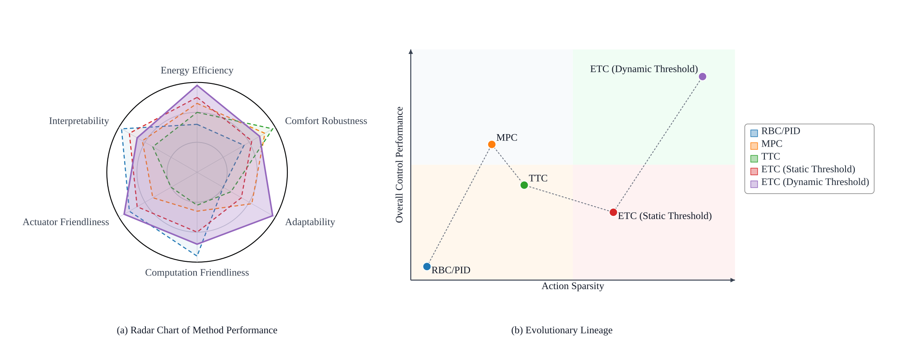
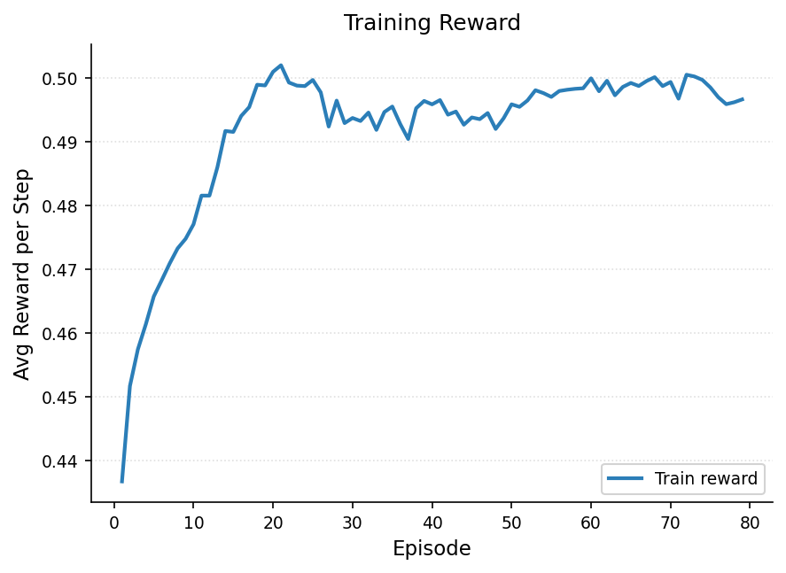

# 基于动态事件触发的 HVAC 强化学习预测控制方法

# 1. 引言

随着全球气候变化的加剧，建筑行业的节能减排已成为亟待解决的关键问题。相关统计数据显示，建筑能耗占全球终端能耗的35%以上，其中供暖、通风与空调（HVAC）系统不仅占据了建筑整体能耗的约50%，也是电力需求侧响应的关键调节资源。在中央空调系统中，冷水机组作为核心耗能部件，其运行效率直接决定了系统的整体性能。优化冷冻水供水温度（$T_{\text{chws}}$）已被证明是平衡能耗与室内热舒适度的有效手段之一。然而，实际工程中的HVAC控制面临着严峻挑战：建筑热负荷受室外气象条件、室内人员流动及设备散热等多重动态因素的耦合影响，系统具有高度的非线性、时变性及大惯性滞后特征。

针对上述挑战，工业界与学术界长期依赖基于显式先验知识的控制范式。具体而言，以基于规则的控制（RBC）和比例-积分-微分（PID）为代表的传统方法，高度依赖工程师人工标定的静态参数与经验规则；而以模型预测控制（MPC）为代表的全局优化算法，则要求针对目标建筑构建高精度的机理或灰盒模型。尽管上述基于模型或显式规则的方法在特定稳态工况下表现良好，但在高度异构的实际工程场景中，针对不同建筑逐一进行系统辨识与精准建模不仅耗费巨大的时间与经济成本，且随着设备组件的长期磨损与建筑热特性的季节性漂移，固定参数的物理模型容易出现控制性能衰退。过度依赖显式环境模型与专家先验知识的传统范式难以自适应多变工况，亟待引入新型智能控制架构。

为克服传统控制的局限性，深度强化学习（Deep Reinforcement Learning, DRL）凭借其无模型的自适应决策能力，近年来在HVAC控制领域展现出广阔的应用前景。DRL能够通过与复杂时变环境的直接交互，自主学习并适应非线性工况；结合时序特征的预测型DRL进一步提升了智能体的前瞻预测能力，有效缓解了建筑大热惯性带来的控制滞后。然而，现有DRL在实际工程部署中仍受限于固定时间步长控制（Time-Triggered Control, TTC）这一根本性范式。在该机制下，智能体严格按预设时钟周期进行状态采样与动作更新，忽略了建筑热负荷在时间维度上演变的非均匀特性。这种固定频率驱动方式导致了响应速度与控制代价之间的固有矛盾：高频控制虽能迅速响应环境扰动，却会带来显著的计算开销与执行器机械磨损；低频控制虽能降低硬件损耗，却易造成控温精度下降。

为缓解TTC范式带来的计算冗余与设备磨损问题，事件驱动控制（Event-Triggered Control, ETC）机制应运而生。ETC基于按需决策理念，仅在系统状态发生显著偏离时激活控制更新。这种稀疏控制机制有效突破了时间步长的硬性约束，为平衡响应速度与控制代价提供了可行途径。然而，现有ETC方案主要依赖基于专家经验的静态规则，例如设定固定的温度死区或负荷波动阈值。静态触发机制在面对高度非线性且时变的真实建筑环境时缺乏动态适应能力，难以适应不同建筑的热惯性差异以及设备老化后的性能漂移，极易导致频繁误触发或控制响应迟滞现象。

如图1所示，从多维控制能力与方法演进路径来看，现有控制范式在动作更新稀疏化与系统综合性能保持的协同优化方面尚存较大提升空间。理想的事件触发机制应降低对人工预设物理规则的依赖，将事件识别过程转化为基于流式状态数据分布的异常检测问题。关键控制时刻本质上体现为系统状态对历史稳态分布的显著偏离。因此，若能利用无监督学习技术在线捕捉状态分布特征，并以特征空间的分布距离作为动态触发信号，便能在不依赖人工设定的前提下实现对多变工况的自适应感知。

基于上述动机，本文提出了一种结合时序预测与无监督动态事件触发的新型HVAC控制框架（ET-PRL）。本文的主要贡献如下：

- **提出基于流式特征的无监督动态事件门控机制**：在ET-PRL框架中构建了融合多尺度异常追踪与双层自适应阈值的门控模块，摆脱了对静态人工规则的依赖，实现了对时变工况下非平稳扰动的自适应感知。
- **构建时序解耦的事件驱动预测型控制架构**：将事件门控机制无缝融入预测型强化学习框架，使策略网络仅在关键扰动时激活，并在平稳期依靠零阶保持器（ZOH）维持控制输出。该架构通过与预测状态特征的深度耦合，有效克服了稀疏按需执行带来的状态观测盲区与预测能力缺失。
- **实现控制精度与系统执行代价的有效折衷**：基于真实冷水机组运行数据的综合评估表明，本文所提框架能够在可量化性能折衷范围内有效抑制平稳工况下的高频无效调节，并获得一定的节能收益。该实证结果不仅验证了按需控制机制在复杂非线性热力系统中的有效性，也为深度强化学习算法在实际工程中的低损耗边缘部署提供了可行的方案。

# 2. 相关工作

为应对建筑能耗激增与居住者热舒适需求之间的矛盾，传统控制策略旨在通过预设逻辑或反馈调节机制保障 HVAC 系统的鲁棒运行 [1]。基于规则的控制（RBC）作为经典范式，依赖预设的逻辑阈值或时间表，有效解决了系统的基础启停调度与模式切换问题 [2]；比例-积分-微分（PID）控制则通过误差反馈机制连续调整执行器状态，实现了对设定点的快速追踪 [3]。针对传统控制器参数固定、适应性差的局限性，已有研究引入遗传算法或模糊逻辑对 RBC 阈值及 PID 参数进行离线或在线寻优，以提升其在特定工况下的响应性能 [4]。尽管上述方法凭借其部署便捷性与高可靠性在工业界占据主导地位，但由于其本质上依赖静态规则或线性假设，难以有效捕捉现实建筑环境中的非线性耦合特征、动态时变扰动及大滞后特性，导致其在复杂多变的运维场景下，往往难以在能效优化与热舒适度保障之间取得理想的平衡 [5]。

为克服传统控制在非线性建模与动态适应上的瓶颈，数据驱动的计算范式逐渐成为解决复杂热环境控制问题的主流路径。其中，深度强化学习（DRL）凭借其强大的表征学习能力，能够在无需显式构建系统动力学方程的前提下，通过与环境的试错交互端到端地优化控制策略 [6]。以深度 Q 网络（DQN）和深度确定性策略梯度（DDPG）为代表的算法，成功实现了从高维传感数据到控制动作的映射，并在多区域协同优化任务中展现出优于传统策略的潜力 [7][8]。然而，标准 RL 框架主要基于当前状态进行反应式决策，在面对具有显著热惯性与大滞后的 HVAC 系统时，易因缺乏前瞻性导致控制滞后或系统振荡 [9]。为缓解该问题，近期研究尝试将长短期记忆网络（LSTM）等序列模型融入 DRL 框架，利用其捕捉长时序依赖的能力预测负荷波动或温度演变。通过将预测信息编码为增广状态，此类集成方法有效增强了智能体对环境演变的感知能力，改善了控制过程的平稳性 [10]。

在控制方法由规则驱动向数据驱动与自适应决策持续演进的背景下，如何通过机制层设计协同降低计算开销与执行机构磨损，已成为该领域的重要研究问题。事件驱动控制（Event-Triggered Control, ETC）作为一种高效执行范式，其核心在于按需响应的运行机理：系统仅在状态误差越限或特定事件发生时，才触发控制更新与通信传输 [11]。该机制有效消除了传统时间触发控制中的计算冗余，显著降低了执行器动作频率与通信开销 [12]。然而，现有 ETC 策略在工程实践中仍高度依赖基于专家经验的静态阈值逻辑 [13]。此类硬编码规则缺乏对非平稳建筑环境的泛化能力：面对建筑热工特性的漂移、多变气候条件及设备老化效应，固定阈值难以自适应调整，往往面临触发过于敏感导致计算资源浪费，或响应迟滞导致舒适度受损的双重挑战 [14]。这也为本文提出基于无监督学习的数据驱动动态事件定义机制提供了切入点。

本文将 HVAC 系统的事件触发机制建模为在线无监督异常检测过程，提出了一种耦合动态门控与预测型强化学习的按需控制框架（ET-PRL）。与依赖静态规则的传统方法及 ETC 相比，本文通过流式特征追踪与自适应阈值判定触发条件，摆脱了人工经验束缚，在面对长期运行的概念漂移时具备更稳健的感知能力。与固定时间步长的强化学习范式不同，本框架利用事件驱动机制解耦决策时序，在削减冗余推理与设备磨损的同时，依靠前瞻预测特征弥补了稀疏控制带来的观测盲区。通过上述设计，本文在真实建筑的非平稳工况下实现了控制精度与执行代价的有效折衷，为深度强化学习的低损耗工程部署提供了可行方案。

> [1] Chaya, P., et al. "Human-Centric Smart Energy Optimization and Automation System." 2025 3rd International Conference on Intelligent Cyber Physical Systems and Internet of Things (ICoICI). IEEE, 2025.
> 
> 
> [2] Choi, Youngsik, et al. "Optimization-informed rule extraction for HVAC system: A case study of dedicated outdoor air system control in a mixed-humid climate zone." *Energy and Buildings* 295 (2023): 113295.
> 
> [3] Lee, Dongkyu, Jinhwa Jeong, and Young Tae Chae. "Application of deep reinforcement learning for proportional–integral–derivative controller tuning on air handling unit system in existing commercial building." *Buildings* 14.1 (2023): 66.
> 
> [4] Chojecki, Adrian, Arkadiusz Ambroziak, and Piotr Borkowski. "Fuzzy controllers instead of classical PIDs in HVAC equipment: Dusting off a well-known technology and Today’s implementation for better energy efficiency and user comfort." *Energies* 16.7 (2023): 2967.
> 
> [5] Lu, Shengze, et al. "Exploring the comprehensive integration of artificial intelligence in optimizing HVAC system operations: A review and future outlook." *Results in Engineering* 25 (2025): 103765.
> 
> [6] Savino, Sabrina, et al. "Deploying deep reinforcement learning for low-level HVAC control in multi-zone buildings: A comparative study with ASHRAE G36 sequences." *Energy and Buildings* (2025): 116456.
> 
> [7] Wang, Man, and Borong Lin. "MF^ 2: Model-free reinforcement learning for modeling-free building HVAC control with data-driven environment construction in a residential building." *Building and Environment* 244 (2023): 110816.
> 
> [8] Zhuang, Dian, et al. "Data-driven predictive control for smart HVAC system in IoT-integrated buildings with time-series forecasting and reinforcement learning." *Applied Energy* 338 (2023): 120936.
> 
> [9] Kondath, Namitha, et al. "Enhancing Day-Ahead Cooling Load Prediction in Tropical Commercial Buildings Using Advanced Deep Learning Models: A Case Study in Singapore." *Buildings* 14.2 (2024): 397.
> 
> [10] Li, Kai, Wei Ni, and Falko Dressler. "LSTM-characterized deep reinforcement learning for continuous flight control and resource allocation in UAV-assisted sensor network." *IEEE Internet of Things Journal* 9.6 (2021): 4179-4189.
> 
> [11] Liu, Xinghua, et al. "Event‐triggered load frequency control of smart grids under deception attacks." *IET Control Theory & Applications* 15.10 (2021): 1335-1345.
> 
> [12] Xue, Zhouzhou, Zhaoxu Yu, and Shugang Li. "Event-triggered adaptive neural control for uncertain nontriangular nonlinear systems with time-varying delays." *International Journal of Control, Automation and Systems* 20.12 (2022): 4090-4099.
> 
> [13] Liu, Derong, et al. "Adaptive dynamic programming for control: A survey and recent advances." *IEEE Transactions on Systems, Man, and Cybernetics: Systems* 51.1 (2020): 142-160.
> 
> [14] Heer, Philipp, et al. "Comprehensive energy demand and usage data for building automation." *Scientific Data* 11.1 (2024): 469.
> 

# 3. 方法

## 3.1 总体框架

针对建筑 HVAC 系统存在的热惯性与响应滞后特性，以及运行工况随季节变化导致的分布漂移，传统依赖离线标定与静态阈值的事件控制方法在跨工况迁移时通常需要频繁再校准，进而增加了工程维护成本。为此，本文提出一种将流式异常门控与深度强化学习耦合的按需控制框架，即事件触发预测型强化学习（Event-Triggered Predictive Reinforcement Learning, ET-PRL）。

如图 3 所示，ET-PRL 的核心思想是在保持控制目标与约束一致的前提下，通过事件触发机制降低强化学习策略在平稳阶段的无效推理调用频率，从而在计算开销与控制性能之间取得更优的折衷。与依赖固定专家规则或离线训练分类器进行事件判别的传统做法不同，该框架采用无监督的在线门控策略，根据系统状态分布的统计偏离程度动态确定触发时刻。整体框架由以下三层机制组成：

1. **在线流式异常门控机制**：面向长期运行中的概念漂移，构建无需离线训练的异常检测门控模块。该模块在线追踪状态的多尺度统计特征，并结合流式隔离深度与自适应阈值策略输出事件触发信号，实现控制事件的在线标定。
2. **预测型全局强化学习网络**：面向系统级能效优化与动作选择，采用轻量级深度 Q 网络（DQN）学习控制策略。该网络仅在门控机制判定发生关键动态事件时被激活，以减少平稳阶段的冗余推理计算。
3. **事件驱动执行与零阶保持**：在边缘部署场景下，系统将状态感知、事件判别、策略推理与动作执行构建为低时延的闭环控制流程。在非触发时段，采用零阶保持器（Zero-Order Hold, ZOH）维持上一时刻的控制指令，以降低控制切换频率并减小对执行机构与系统稳定性的不利影响。

> **图 3 占位：ET-PRL 总体框架图**
>
> 建议内容：展示“状态采样 -> 异常门控 -> 触发决策 -> DQN 推理/ZOH 保持 -> 执行反馈”的闭环结构，区分 Trigger=1 与 Trigger=0 两条路径。

## 3.2 基于流式特征追踪的动态事件触发机制设计

本文将关键事件识别重定义为在线异常检测。其核心依据在于：在控制语义上，关键事件对应需要策略即时介入的工况突变；在统计语义上，该类时刻通常表现为状态样本相对常态分布的显著偏离。由此，事件判定可统一建模为偏离度检验问题，而不再依赖人工设定的静态规则。

设门控状态为 $s_t\in\mathbb{R}^d$，事件标签为 $e_t\in\{0,1\}$，时刻 $t$ 的常态参考分布记为 $\mathcal{P}^{\text{norm}}_t$。定义事件集合

$$
\mathcal{E}_t=\{s:\,d(s,\mathcal{P}^{\text{norm}}_t)>\delta_t\},\qquad
e_t=\mathbb{I}(s_t\in\mathcal{E}_t)
$$

其中，$d(\cdot)$ 为分布偏离度量，$\delta_t$ 为判别阈值。上述定义表明，事件识别本质上是对是否偏离常态区域的二值判定；当状态进入高偏离区域时触发策略更新，否则维持当前控制节奏。

为满足在线部署需求，本文采用异常分数函数 $A(s_t)$ 作为偏离度代理，并将集合判别转化为可计算的阈值比较：

$$
e_t=\mathbb{I}(A(s_t)>\tau_t)
$$

其中，$A(s_t)$ 越大表示偏离常态程度越高，$\tau_t$ 为触发阈值。该形式具有两点优势：一是可与流式统计量直接耦合，支持逐步更新；二是便于与后续门控逻辑统一，实现由异常评分到触发决策的端到端建模与实现。

考虑 HVAC 长周期运行的非平稳性（气象扰动、设备老化与负荷行为漂移），本文不采用固定阈值，而采用流式自适应更新机制：

$$
    au_t=\Phi\big(A(s_{1}),\ldots,A(s_{t-1})\big)
$$

其中，$\Phi(\cdot)$ 表示由历史异常分数驱动的阈值更新算子。该设计用于在灵敏性与稳定性之间取得平衡：在扰动增强时提高事件覆盖率，在平稳区间抑制冗余触发，从而降低误触发与漏触发风险。

综上，事件触发任务可统一形式化为在线异常评分-动态阈值判别框架。该框架为后续门控输入构建、多尺度异常追踪与双层阈值优化提供统一的建模接口与理论起点。

(1) 门控输入特征定义

为保证门控判定与控制状态建模在物理语义与符号层面的一致性，本文将事件门控模块的输入定义为紧凑的三维特征向量，并在后续章节沿用该记号：

$$s_t=[Q_{load}^t,\,T_{wb}^t,\,\hat{Q}_{load}^{t+1}]$$

其中，$Q_{load}^t$ 表示当前时刻系统冷负荷，$T_{wb}^t$ 表示室外湿球温度，$\hat{Q}_{load}^{t+1}$ 表示下一时刻系统冷负荷的短期预测值。该状态空间的设计目标是在保持表征能力的同时控制特征维度，以支撑在线门控的实时计算。

引入 $T_{wb}^t$ 的主要原因在于该变量能够同时表征外部温度与湿度条件，并直接约束冷却塔换热性能及系统排热上限。因此，$T_{wb}^t$ 可作为刻画外生气象扰动强度与方向的关键状态量，从而提升门控机制对环境非平稳变化的识别能力。

此外，引入 $\hat{Q}_{load}^{t+1}$ 的动机在于建筑热系统具有显著热惯性与控制滞后。若仅依赖当前观测量，门控判定通常滞后于工况变化。纳入一步前瞻负荷后，门控模块可提前感知负荷爬升或回落趋势，进而在关键变化阶段更早触发策略更新，降低稀疏触发条件下的响应滞后风险。

在特征维度选择上，本文未进一步引入管网流量、回水温度等附加变量，原因是在线异常检测在高维空间中易出现样本稀疏与距离退化，从而削弱统计判别稳定性并增加计算开销。上述三维紧凑状态分别提供负荷基线、外生扰动边界与短期趋势信息，有助于在可解释性、判别鲁棒性与边缘部署效率之间取得更稳健的平衡。

(2) 流式隔离深度与多尺度异常追踪

传统离线异常检测通常依赖静态样本库，在季节性工况漂移场景下稳定性受限。为此，本文采用流式隔离深度机制，对在线到达的门控输入特征 $s_t$ 进行实时异常评分。流式隔离深度算法（Streaming Isolation Depth）通过在滑动数据窗口上动态构建与更新隔离树结构，计算输入数据点在多棵树中的平均路径长度作为隔离程度度量。路径越短，数据点越容易被孤立，对应异常概率越高。该机制能够在不重新训练全局模型的条件下在线适应分布变化。

为便于形式化描述，下面给出隔离深度与异常分数的计算过程。隔离树通过递归随机选择特征与分割点来孤立数据点。对于输入点 $s_t$，在滑动参考窗口内的 $\psi$ 棵隔离树上分别执行搜索，记该点在第 $j$ 棵树上的路径长度为 $h_j(s_t)$，其中路径长度定义为从根节点到叶节点的边数。该点的平均隔离深度定义为：

$$h_{\mathrm{iso}}(s_t) = \frac{1}{\psi} \sum_{j=1}^{\psi} h_j(s_t)$$

进而转化为归一化的异常分数（其中 $m$ 为参考集样本数，$C(m)$ 为对应的平均路径长度基准）：

$$A_{\mathrm{iso}}(s_t) = 2^{-\frac{h_{\mathrm{iso}}(s_t)}{C(m)}}$$

标准化常数计算为 $C(m) = 2H(m-1) - 2(m-1)/m$，其中 $H(m-1)=\sum_{i=1}^{m-1}\frac{1}{i}$ 为调和级数。该形式将异常分数映射至 $(0,1)$ 区间：当数据点易被隔离时（路径较短），分数趋近于 1；当数据点难被隔离时（路径较长），分数趋近于 0。

为刻画不同时间尺度下的分布演化，算法维护三个不同规模的滑动参考窗口以生成多尺度动态参考集合。短时窗口 $\mathcal{W}_{\mathrm{short}}$ 包含最近 $n_s$ 个数据点，用于捕捉高频波动；中时窗口 $\mathcal{W}_{\mathrm{medium}}$ 包含最近 $n_m$ 个数据点，用于表征日内周期；长时窗口 $\mathcal{W}_{\mathrm{long}}$ 包含最近 $n_l$ 个数据点，用于描述季节性漂移，且参数满足 $n_s < n_m < n_l$。在各窗口上独立应用隔离树算法，并在每个时刻输出对应尺度的异常分数：

$$A_{\mathrm{short}}(s_t) = 2^{-\frac{h_{\mathrm{iso}}^{\mathrm{short}}(s_t)}{C(n_s)}}, \quad A_{\mathrm{medium}}(s_t) = 2^{-\frac{h_{\mathrm{iso}}^{\mathrm{medium}}(s_t)}{C(n_m)}}, \quad A_{\mathrm{long}}(s_t) = 2^{-\frac{h_{\mathrm{iso}}^{\mathrm{long}}(s_t)}{C(n_l)}}$$

各尺度分数均归一化至 $[0,1]$ 区间。综合异常分数定义为三类尺度分数的加权融合：

$$A(s_t)=w_{\mathrm{s}}A_{\mathrm{short}}(s_t)+w_{\mathrm{m}}A_{\mathrm{medium}}(s_t)+w_{\mathrm{l}}A_{\mathrm{long}}(s_t)$$

其中 $w_{\mathrm{s}}, w_{\mathrm{m}}, w_{\mathrm{l}} \ge 0$ 且 $w_{\mathrm{s}}+w_{\mathrm{m}}+w_{\mathrm{l}}=1$ 分别代表对应时间尺度的融合权重。

采用多尺度融合的原因在于，建筑 HVAC 系统通常同时受到短时扰动、日内周期变化和长期慢变漂移的共同影响。若仅依赖短时分数，门控机制虽能快速响应人员聚集、设备启停等局部突变，但更容易受到传感器高频噪声或正常瞬态波动的干扰，进而导致触发频率偏高。若仅依赖长时分数，虽然能够提供更稳健的历史参考基线，但对突发热扰动的响应可能不足。若仅结合短时与中时分数，则难以刻画季节更替、设备老化或结构热阻漂移引起的慢变过程。基于此，本文通过短、中、长三个时间尺度的加权融合，同时兼顾突发扰动感知、周期规律表征与长期基线跟踪，从而提高门控机制在非平稳场景下的适应性与鲁棒性。

(3) 流式双层自适应阈值优化

为将连续异常分数转化为稳健的控制触发判定，本文构建了包含局部阈值与全局阈值的双层自适应动态门限机制。若仅依托固定阈值或单一更新速率的自适应阈值，门控系统容易面临灵敏度与稳定性的权衡困境。更新过快会导致阈值被近期异常数据严重干扰，从而自身发生剧烈震荡并掩盖后续的真实异常；更新过慢则会在系统面临工作区间发生整体跃变时持续越限，进而导致频繁误触发和计算资源的无效损耗。为突破此类局限，本文引入了局部（快变）与全局（慢变）双阈值相耦合的自适应监控架构。

具体实现中，设最近 $W$ 个异常分数组成滑动历史窗口集合 $\mathcal{A}_t=\{A(s_{t-W+1}),\ldots,A(s_t)\}$。阈值估计的核心目标是在含噪非平稳流式数据中持续提取稳定且可迁移的判别基线。相较于易受异常离群点影响的传统均值和标准差，本模块优先提取反映非参数分布特性的稳健分位数阈值与鲁棒统计阈值：

$$\tau_{q}^{(t)}=Q_q(\mathcal{A}_t), \quad\tau_{\mathrm{mad}}^{(t)}=\operatorname{med}(\mathcal{A}_t)+\kappa \cdot c \cdot \operatorname{MAD}(\mathcal{A}_t)$$

$$\operatorname{MAD}(\mathcal{A}_t)=\operatorname{med}\left(\left|a-\operatorname{med}(\mathcal{A}_t)\right|\right),\quad a\in\mathcal{A}_t$$

其中，$Q_q(\cdot)$ 表示集合的高分位点；$\operatorname{med}(\cdot)$ 为中位数函数；绝对中位差（$\operatorname{MAD}$）的作用在于消除潜在持续型异常对系统离散程度估计的偏差干扰，以维持真实的稳健基线；$\kappa$ 为灵敏度调节系数，$c \approx 1.4826$ 为保证渐近无偏估计的分布一致性常数。上述构造的理论依据在于：分位数估计主要提供阈值位置的鲁棒锚点，而 $\operatorname{MAD}$ 提供尺度层面的鲁棒校正，两者融合可同时约束位置漂移与尺度膨胀带来的阈值失真。基于此，局部候选阈值由二者加权融合得到：

$$\tau_{\mathrm{cand}}^{(t)}=\omega_q\tau_q^{(t)}+(1-\omega_q)\tau_{\mathrm{mad}}^{(t)}$$

其中，$\omega_q \in [0,1]$ 为加权系数。该系数本质上控制分位数主导与尺度修正主导之间的权衡：$\omega_q$ 增大时阈值更侧重位置稳健性，$\omega_q$ 减小时阈值更敏感于离散程度变化。考虑到单步工况跳变可能带来的高频瞬态波动，系统不直接采纳单次候选值，而是引入一阶离散低通滤波对其进行局部平滑：

$$\tau_{\mathrm{local}}^{(t)}=(1-\lambda_{\mathrm{local}})\tau_{\mathrm{local}}^{(t-1)}+\lambda_{\mathrm{local}}\tau_{\mathrm{cand}}^{(t)}$$

式中，局部平滑更新率 $\lambda_{\mathrm{local}} \in (0,1]$ 能够在抑制短时噪声震荡的同时，使快变阈值保持对工况模式切换的快速跟踪。较大的 $\lambda_{\mathrm{local}}$ 对新样本赋予更高权重，有利于缩短阈值跟踪时滞；较小的 $\lambda_{\mathrm{local}}$ 则可增强对短时脉冲噪声的抑制能力。由此，局部阈值承担快速适配当前工况的功能。在局部阈值基础上，全局阈值作为历史稳态参考面，通过更强的迟滞效应进行指数移动跟踪：

$$\tau_{\mathrm{global}}^{(t)}=(1-\lambda_{\mathrm{g}})\tau_{\mathrm{global}}^{(t-1)}+\lambda_{\mathrm{g}}\tau_{\mathrm{local}}^{(t)}$$

这里设定 $\lambda_{\mathrm{g}} \ll \lambda_{\mathrm{local}}$，赋予全局阈值显著的迟滞平滑特性。这种双时间常数级联设计使其在局部特征随工况剧变时充当平滑缓冲，从而稳定跟踪由长期设备老化与季节迁移导致的系统深层演变趋势，并降低阈值被短时异常片段牵引的风险。

最终，基础自适应门控阈值由双层信号的耦合构建而成：

$$\tilde{\tau}_t=\alpha_{\mathrm{local}}\tau_{\mathrm{local}}^{(t)}+(1-\alpha_{\mathrm{local}})\tau_{\mathrm{global}}^{(t)}+b_{\mathrm{bias}}$$

其中，权重 $\alpha_{\mathrm{local}}\in[0,1]$ 用于调节局部阈值与全局阈值之间的融合比例。当 $\alpha_{\mathrm{local}}$ 增大时，系统更强调对局部工况变化的快速响应；当 $\alpha_{\mathrm{local}}$ 减小时，系统更强调长期基线的一致性与触发稳定性。此外，$b_{\mathrm{bias}}$ 为稳态容限偏置项。在运行状态高度平稳的阶段（如夜间低负荷时段），系统方差与绝对中位差可能收敛至较小数值，导致阈值过度收缩。引入偏置项可为系统设置绝对触发下限，从而避免因阈值过小而产生高频误触发。

综上，双层自适应阈值机制并非对单一阈值规则的简单平滑扩展，而是通过鲁棒统计估计、双时间常数更新与结构化融合偏置三重设计，实现了在非平稳场景下对灵敏性、稳定性与抗噪性的协同优化。这一机制为后续事件触发判定提供了可解释且可调的统计基础。

## 3.3 在线流式事件门控模块构建

与传统固定阈值与单条件越限触发策略不同，本模块采用异常强度判别与时间约束抑振的联合判定形式，其设计目标是在保证关键扰动覆盖率的同时抑制边界附近的抖振触发。前者通过比较 $A(s_t)$ 与自适应阈值实现对当前状态偏离程度的统计检验，后者通过最小触发间隔约束显式控制动作更新频率，避免在短时高频波动期间出现连续触发导致的执行器过度切换。

在每个控制时刻，门控模块接收当前门控特征 $s_t$，计算异常分数 $A(s_t)$ 并执行二值触发检验：

$$\tau_t^*=\operatorname{clip}(\tilde{\tau}_t+m_{\mathrm{hys}},0,1)$$

$$\mathrm{Trigger}(s_t)=\mathbb{I}\left(A(s_t)>\tau_t^*\right)\land\mathbb{I}\left(t-t_{\mathrm{last}}>\Delta_{\min}\right)$$

上式中，$\operatorname{clip}(\cdot, 0, 1)$ 表示将输入值约束在 0 到 1 区间内的截断函数；$m_{\mathrm{hys}}$ 为防止边界震荡的滞回容差；$\mathbb{I}(\cdot)$ 为逻辑指示函数，当括号内条件成立时取 1，否则取 0；$t_{\mathrm{last}}$ 记录系统上一次触发更新的时间步；$\Delta_{\min}$ 为设定的最小触发间隔。$\mathrm{Trigger}(s_t)=1$ 表示当前时刻触发控制更新，$\mathrm{Trigger}(s_t)=0$ 表示维持上一时刻控制动作。

为保证门控与控制策略在在线部署中的一致性，模块在每一时刻遵循先判定、后执行、再更新的时序协议：首先使用时刻 $t$ 的统计量计算触发结果并决定是否调用策略网络；随后将动作 $u_t$ 下发至执行层；最后将 $A(s_t)$ 与相关统计量写入窗口，用于时刻 $t+1$ 的阈值更新。该协议可避免同一步内先更新阈值再判定导致的判据前视偏差，确保门控逻辑满足严格因果性。

从工程部署角度看，该门控模块的额外开销主要来自标量统计更新与一次二值逻辑判定，不引入额外的大规模神经网络推理。在非触发时段，系统仅执行轻量级统计运算并保持上一控制指令，因此整体计算负载与动作切换频率可随触发率下降而同步降低。这一性质使其适用于边缘侧长期在线运行场景，并为后续实验中的触发率、动作压缩比与性能保持率分析提供机制层解释。

该门控结构通过按需触发减少了平稳阶段的冗余决策调用，同时在分布漂移场景下保持了阈值与触发频率的自适应稳定性，为后续强化学习策略的稀疏调用提供了标准化的事件接口。

## 3.4 面向全局控制策略的深度强化学习

在所提事件驱动控制框架中，全局控制器负责在判定为关键时刻（即 $\mathrm{Trigger}(s_t)=1$ ）时被激活并输出能效优化动作，而在平稳期或非关键时刻（即 $\mathrm{Trigger}(s_t)=0$ ）则不进行推理计算，而是由底层控制系统通过零阶保持器维持先前的控制指令。

为兼顾控制性能与边缘设备的部署开销，本文构建结合短期负荷预测信息的轻量级 DQN（Deep Q-Network）智能体。全局强化学习控制器在触发时刻接收状态向量 $s_t$，并以降低能耗与保持温控性能为目标构建综合奖励函数，从而输出高层优化设定值（如冷冻水供水温度设定点）。同时，该模块采用分层执行策略，将高层无模型优化决策与底层设备的物理安全约束解耦，以保证生成动作在实际部署中的可行性与安全性。

需要说明的是，事件门控机制主要作用于在线执行阶段，而策略学习阶段仍采用固定步长的标准交互范式。此设计旨在避免仅在触发时采样，使经验分布过度偏向突发工况，从而影响价值函数在平稳工况下的估计一致性。通过将训练阶段的固定步长交互与部署阶段的事件触发执行相分离，策略网络能够在训练期间充分覆盖状态-动作空间，并在部署时借助门控机制实现动作更新稀疏化与计算负载压缩。

(1) 马尔可夫决策过程建模

针对楼宇控制场景中状态高维、样本相关性强的问题，本文构建紧凑离散时间马尔可夫决策过程（MDP）模型 $\langle \mathcal{S}, \mathcal{A}, \mathcal{P}, \mathcal{R}, \gamma \rangle$。环境状态空间定义为：

$$s_t = [Q_{load}^t, T_{wb}^t, \hat{Q}_{load}^{t+1}]$$

此处状态定义 $s_t$ 与前文所述的门控输入特征在物理信息层面上保持严格一致，包含当前冷负荷 $Q_{load}^t$、室外湿球温度 $T_{wb}^t$ 以及下一时刻冷负荷预测值 $\hat{Q}_{load}^{t+1}$。引入预测项可在不显式扩展长历史序列窗口的前提下有效提升策略的前瞻性。

动作空间 $\mathcal{A}$ 设定为离散化供水温度设定点集合，智能体在时刻 $t$ 输出动作 $a_t\in\mathcal{A}$。为保证执行安全性，控制架构采用分层策略：高层强化学习模块负责设定点优化，底层规则模块负责机组启停及最小运行时长等约束执行。

奖励函数采用归一化加权形式：

$$r_t = \omega_{\eta} r_t^{\mathrm{energy}} + \omega_{\tau} r_t^{\mathrm{track}}$$

其中 $\omega_{\eta},\omega_{\tau}\ge 0$ 且 $\omega_{\eta}+\omega_{\tau}=1$。能效项定义为：

$$r_t^{\mathrm{energy}} = 1 - \frac{P_t}{P_{\mathrm{ref}}}$$

其中 $P_t$ 为机组实时功率，$P_{\mathrm{ref}}$ 为额定参考功率。温控跟踪项采用高斯径向基形式进行连续平滑评估：

$$r_t^{\mathrm{track}} = \exp \left( -\frac{1}{2} \left( \frac{T_t - T_{\mathrm{set}}}{\sigma} \right)^2 \right)$$

其中 $T_t$ 为实际供水温度，$T_{\mathrm{set}}$ 为目标设定温度，$\sigma$ 为温控跟踪敏感度参数。该奖励设计在节能目标与设定点跟踪约束之间提供了平滑的权衡信号。

(2) 结合预测特征的轻量级 DQN 实现

考虑状态维度已压缩至关键特征子集，本文采用多层感知机构建轻量级 DQN 主体网络，以降低边缘部署场景下的推理延迟与存储开销。在算法实现层面，训练阶段遵循标准 DQN 的逐步交互流程：智能体在每个时间步执行动作选择、环境步进、经验回放写入与网络参数更新。其一步时序差分目标可写为：

$$y_t = r_t + \gamma (1-d_t) \max_{a'\in\mathcal{A}} Q_{\theta^-}(s_{t+1}, a')$$

其中 $\theta$ 为在线网络参数，$\theta^-$ 为目标网络参数，$d_t\in\{0,1\}$ 为终止标记。网络优化采用均方误差损失：

$$\mathcal{L}(\theta)=\mathbb{E}_{(s_t,a_t,r_t,s_{t+1})\sim\mathcal{D}}\left[\left(y_t-Q_{\theta}(s_t,a_t)\right)^2\right]$$

其中 $\mathcal{D}$ 为经验回放缓冲区。该训练机制通过打破样本时序相关性并延迟目标值更新，提升了价值学习过程的数值稳定性。

此外，第 3.3 节所述事件门控机制主要应用于模型在线部署与执行评估阶段。门控机制在触发时唤醒策略网络更新动作，在未触发时指令底层保持上一动作，从而在不改变 DQN 基础训练范式的前提下实现动作执行稀疏化。该价值学习保持连续、控制执行按需触发的耦合方式，既保留了强化学习的收敛稳定性，又实现了边缘部署场景下的低频动作更新目标，为下一节在线事件驱动交互机制提供实现基础。

## 3.5 在线事件驱动系统交互机制

在在线运行阶段，系统按固定时钟步长完成特征采样，但通过事件驱动机制决定是否更新控制动作。具体流程如下：首先将提取的门控特征 $s_t$ 传递至流式门控模块，获得布尔型门控信号，并据此生成动作更新标志。当满足触发条件时，系统调用 DQN 策略网络前向推理输出新的控制设定点；当未满足触发条件时，系统采用零阶保持器维持上一时刻的控制指令。其执行律表述为：

$$u_t = \begin{cases}\pi_{\mathrm{DQN}}(s_t), & \text{if } \mathrm{Trigger}(s_t) = 1 \\u_{t-1}, & \text{if } \mathrm{Trigger}(s_t) = 0\end{cases}$$

该机制在保证控制系统输入连续性的前提下，有助于抑制平稳工况下的频繁机械调节，并降低执行器切换开销。具体的闭环交互控制逻辑可结合图 6 与图 7 进行说明。

> **图 7 占位：执行时序示意图（事件触发 + ZOH 保持）**
>
> 建议内容：在统一时间轴上展示 Trigger 序列与控制输入 $u_t$ 的阶梯变化；触发时更新动作、非触发时保持上一动作，体现稀疏更新与连续执行。

# 4. 案例系统与仿真环境

## 4.1 建筑热力系统建模

本研究选取上海某真实商业建筑的暖通空调（HVAC）系统作为物理模型，利用 EnergyPlus 软件构建仿真环境。该模型已在课题组前期工作中通过实测数据完成了参数校验，能够准确反映系统的热力学特性。冷源系统配置为典型的一次泵定流量系统（Primary Constant Flow System），核心组件包括离心式冷水机组、冷冻水泵、冷却水泵及冷却塔。

为准确模拟系统的能耗与热力学特性，本研究严格设定了各核心组件的额定参数。系统关键设备的设计参数汇总如表所示。

| **设备名称** | **数量 (台)** | **额定功率(Pref, kW)** | **额定容量 / 流量** | **运行特性与关键参数** |
| --- | --- | --- | --- | --- |
| **离心式冷水机组** | 3 | 314 | 1760 kW (制冷量) | COP随负荷变化；  设定温度 $T_{set}=7\text{°C}$ (范围: $6\sim15\text{°C}$) |
| **冷冻水泵** | 3 | 15 | 252 $m^3/h$ | 定速运行；  额定扬程: $15\ \text{m}$ |
| **冷却水泵** | 3 | 55 | 366 $m^3/h$ | 定速运行；  额定扬程: $33\ \text{m}$ |
| **冷却塔** | 3 | 16.5 | 392 $m^3/h$ | 变工况特性；  性能与湿球温度 $T_{wb}$ 强耦合 |

基于表中的参数，冷冻水侧的热量传递过程遵循热力学基本定律。本研究在计算中采用标准水物性参数（比热容 $c_p = 4.2\ \text{kJ/(kg}\cdot\text{K)}$，密度 $\rho_{\text{water}} = 1000\ \text{kg}/\text{m}^3$），瞬时冷负荷计算公式如下：

$$
Q_{load} = \rho_{water} \cdot F_{chw} \cdot c_p \cdot (T_{chwr} - T_{chws})
$$

其中，$Q_{load}$ 表示建筑冷负荷需求（$\text{kW}$），$F_{chw}$ 为冷冻水流量，$T_{chwr}$ 与 $T_{chws}$ 分别代表冷冻水的回水与供水温度。该物理模型确保了仿真环境能够真实反映控制策略对系统热力状态的影响。

## 4.2 气象与负荷数据集特征

本研究采用基于上海地区典型气象年（Typical Meteorological Year, TMY）生成的建筑冷负荷仿真数据集，采样间隔设定为 $5\text{min}$。数据覆盖完整制冷季（7 月 1 日至 10 月 10 日），共计 $102$ 天、$29,376$ 个时间步，能够同时表征日内周期性波动与季节尺度变化。统计结果表明：冷负荷峰值为 $5102.77\ \text{kW}$，标准差为 $962.02\ \text{kW}$，变异系数（CV）为 $37.3\%$；室外湿球温度 $T_{wb}$ 分布于 $21\ \text{°C} \sim 28\ \text{°C}$。上述统计特征为后续评估事件触发策略在高波动工况下的实时响应能力与鲁棒性提供了数据基础。

在预处理阶段，针对原始仿真序列中少量（8 处）非物理性负值震荡异常，本文采用零值截断进行修正。与此同时，为增强状态表征的前瞻性，进一步引入由 LSTM 模型生成的下一时刻负荷预测值 $\hat{Q}_{load}^{t+1}$ 作为增广特征，从而构建同时包含当前运行状态与短时演化趋势的输入表示。

为避免时间信息泄漏并贴合实际部署场景，本文采用严格的时间顺序划分（Chronological Split）策略，将数据集按时间先后划分为训练集、验证集与测试集，比例设定为 70:15:15。

# 5. 实验及结果

## 5.1 实验设置 (Experimental Setup and Baseline Construction)

(1) 实验配置与超参数设置

本节给出实验中采用的核心超参数设置。为保证实验可复现性，表 1 所列参数在各组实验中保持一致。除特别说明外，系统采样间隔统一为 5 分钟。所有超参数均通过贝叶斯优化算法确定，并在验证集上完成性能筛选后固定用于后续实验。

1. **DQN 智能体 (DQN Agent)**：控制策略采用三层多层感知器结构 [256, 128, 64]，状态维度为 3，离散动作数量为 10。训练阶段采用经验回放与目标网络更新机制，并通过指数衰减的 $\epsilon$-greedy 策略平衡探索与利用。
2. **在线流式门控 (Streaming Anomaly Gate)**：门控模块由多尺度异常分数融合与双层阈值优化构成，实现在线触发判定。其关键参数包括局部窗口长度、全局指数平滑系数、阈值偏置项以及短/中/长时间尺度融合权重，用于平衡响应灵敏度与触发稳定性。

| **Module** | **Parameter Description** | **Symbol** | **Value** |
| --- | --- | --- | --- |
| **DQN Agent** | Learning rate | $\alpha$ | $0.0048$ |
|  | Discount factor | $\gamma$ | $0.962$ |
|  | Replay buffer size | $M$ | $20,000$ |
|  | Mini-batch size | $B$ | $178$ |
|  | Epsilon schedule | $\epsilon$ | $0.6109 \to 0.0045$ |
|  | Epsilon decay factor | $\lambda_{\epsilon}$ | $0.9947$ |
|  | Target update frequency | $C$ | $126$ steps |
|  | Network architecture | - | [256, 128, 64] |
|  | State dimension / action cardinality | - | $3 / 10$ |
| **Streaming Anomaly Gate** | Gate EMA Decay ($\lambda$ global) | $\lambda_{\mathrm{g}}$ | $0.0625$ |
|  | Local window size | $W$ | $135$ |
|  | Local update rate | $\lambda_{\mathrm{local}}$ | $0.595659$ |
|  | Reference samples | $N_{\mathrm{ref}}$ | $700$ |
|  | Base contamination | $\nu$ | $0.310449$ |
|  | Threshold local alpha weight | $\alpha_{\mathrm{local}}$ | $0.675$ |
|  | Threshold Bias term | $b_{\mathrm{bias}}$ | $-0.043058$ |
|  | Threshold quantile | $q$ | $0.667542$ |
|  | Threshold MAD scale | $\kappa$ | $1.135275$ |
|  | Threshold quantile weight | $\omega_q$ | $0.575$ |
|  | Trigger hysteresis margin | $m_{\mathrm{hys}}$ | $0.021760$ |
|  | Min samples for threshold optimization | $N_{\min}$ | $70$ |
|  | Scale fusing weights (Short/Mid/Long) | $\mathbf{w}$ | $[0.55, 0.275, 0.175]$ |

(2) 评价指标体系 (Evaluation Metrics)

为全面评估事件触发预测型强化学习框架（ET-PRL）的性能，本研究构建了涵盖能耗效率、热舒适度、控制稀疏性及机制执行效率的多维度评价指标体系。此外，本文同时报告策略执行层统计量，以保障实验结果的完整性与可复现性。

1. 能耗效率指标 (Energy Efficiency Metrics)
   
    能耗效率是建筑能源管理的核心优化目标。本研究以冷水机组（Chiller）的运行功耗为主要计量对象。
    
    - 日均能耗 (Average Daily Energy Consumption, $E_{\text{daily}}$)：计算测试周期内的日平均耗电量（单位：kWh/day）：
      
        $$
          E_{\text{daily}} = \frac{1}{D} \sum_{d=1}^{D} \left( \sum_{t=1}^{T_d} P_{\text{chiller}}(t) \cdot \Delta t \right)
        $$
        
        其中，$D$ 为测试天数，$T_d$ 为第 $d$ 天的时间步总数，$\Delta t$ 为采样间隔（小时），$P_{\text{chiller}}(t)$ 为 $t$ 时刻机组的运行功率（kW）。
        
    - 相对节能率 (Relative Energy Saving Rate, $\eta_{\text{saving}}$)：用于量化 ET-PRL 相较于基准模型（Baseline）的节能效果：
      
        $$
          \eta_{\text{saving}} = \frac{E_{\text{baseline}} - E_{\text{ET-PRL}}}{E_{\text{baseline}}} \times 100\%
        $$
        
        其中 $E_{\text{baseline}}$ 和 $E_{\text{ET-PRL}}$ 分别代表基准策略与本文方法的累积能耗。

    - 平均冷机功率 (Average Chiller Power, $\bar{P}_{\text{chiller}}$)：用于反映整个测试周期的平均负载水平与运行强度：

        $$
            \bar{P}_{\text{chiller}} = \frac{1}{N} \sum_{t=1}^{N} P_{\text{chiller}}(t)
        $$

        其中 $N$ 为测试总步数。该指标与 $E_{\text{daily}}$ 在物理含义上相关，但分别表征单位时间强度与累计能耗。
    
2. 温度控制与稳定性指标 (Temperature Control & Stability Metrics)
   
    本研究采用冷冻水回水温度 $T_{\text{chwr}}$ 作为控制对象，目标区间设定为 $[15.0^\circ\mathrm{C}, 19.0^\circ\mathrm{C}]$。

    - 性能保持率 (Performance Preservation Rate, PPR)：专项评估事件驱动机制有效性的指标，量化 ET-PRL 在稀疏化控制动作条件下对固定步长密集控制策略整体性能的保留程度。其定义如下：
      
        $$
          \text{PPR} = \frac{R_{\text{event}}}{R_{\text{dense}}} \times 100\%
        $$
        
        其中，$R_{\text{event}}$ 与 $R_{\text{dense}}$ 分别为事件驱动策略与固定步长密集策略在同一测试周期内的累积奖励值。
        
    - 动作平滑度 (Action Smoothness, $\sigma_{\Delta a}$)：为量化控制动作对执行器的冲击强度，定义相邻时间步控制量变化的均值指标：
      
        $$
          \sigma_{\Delta a} = \frac{1}{N-1} \sum_{t=1}^{N-1} |a_{t+1} - a_t|
        $$
        
        该值越小，表明控制动作越平稳，能够有效避免执行器震荡（Oscillation）。
    
3. 控制稀疏性指标 (Control Sparsity Metrics)
   
    本类指标旨在量化事件驱动机制在降低通信负载与执行器磨损方面的效果。
    
    - 日均触发次数 (Daily Trigger Count, $N_{\text{daily}}$)：衡量控制频率的物理指标，反映平均每天执行控制动作的次数：
      
        $$
          N_{\text{daily}} = \frac{N_{\text{event}}}{D}
        $$
        
        该指标以有量纲的实物频次直接体现执行器的机械磨损风险。
        
    - 动作压缩比 (Actuation Compression Ratio, ACR)：
      
        $$
          \text{ACR} = \frac{N_{\text{fixed}}}{N_{\text{event}}}
        $$
        
        其中 $N_{\text{fixed}}$ 和 $N_{\text{event}}$ 分别为固定步长策略和事件驱动策略的动作总次数。ACR 值越大，表明事件驱动机制对控制动作的稀疏化效果越显著。

4. 机制与执行效率指标 (Mechanism & Execution Metrics)

    为综合刻画门控机制的运行行为与策略执行开销，本研究进一步报告以下执行层统计指标。

    - 平均步奖励 (Average Reward per Step, $\bar{R}_{\text{step}}$)：

        $$
        \bar{R}_{\text{step}} = \frac{R_{\text{test}}}{N_{\text{update}}} = \frac{\sum_{t=1}^{N} r_t}{N_{\text{update}}}
        $$

        其中，$N_{\text{update}}$ 表示动作实际更新次数（固定步长策略中 $N_{\text{update}}=N$，事件驱动策略中通常 $N_{\text{update}}\ll N$）。该指标用于衡量单位动作更新开销对应的平均控制收益。

下表汇总了本研究所采用的评价指标体系及其优化方向。

| **类别 (Category)** | **指标名称 (Metric)** | **符号 (Symbol)** | **单位 (Unit)** | **优化目标 (Goal)** |
| --- | --- | --- | --- | --- |
| **能耗效率** | 日均能耗 | $E_{\text{daily}}$ | kWh/day | Minimize |
|  | 相对节能率 | $\eta_{\text{saving}}$ | % | Maximize |
| **温度控制** | 动作平滑度 | $\sigma_{\Delta a}$ | - | Minimize |
|  | 性能保持率 | PPR | % | Maximize |
| **控制稀疏性** | 日均触发次数 | $N_{\text{daily}}$ | count/day | Minimize |
|  | 动作压缩比 | ACR | - | Maximize |
| **机制与执行效率** | 平均步奖励 | $\bar{R}_{\text{step}}$ | - | Maximize |

## 5.2 实验结果分析

(1) 整体性能分析

本部分对 ET-PRL 与 Fixed-step DQN 开展整体性能对比。作为参照策略，Fixed-step DQN 在固定步长模式下训练 80 个 Episode，每个 Episode 为 20,546 步，并通过验证集贪婪评估筛选最优模型。训练过程中，策略奖励由 Episode 1 的 8655 快速提升至 Episode 10 的 9743，随后在约 $[9800, 10500]$ 区间内稳定波动，表现出离策略学习在目标网络异步更新下的典型收敛特征；验证奖励在 Episode 71 达到最高值 $R_{\text{val}}^*=\mathbf{2041.8}$。该结果表明，基线模型具备稳定收敛性，可作为后续事件驱动稀疏控制的性能上界参照。

图 5-2-1 Fixed-step DQN 训练奖励曲线

在与该基线一致的测试集与评估协议下，进一步评估 ET-PRL 在收益保持、能效表现与动作稀疏性方面的变化；相关基线与对比结果统一汇总于下表。

表 X 汇总了测试集上的核心对比结果。Fixed-step DQN 作为参照策略，ET-PRL 在冷启动条件下进行评估。

| **指标** | **Fixed-step DQN** | **ET-PRL (Ours)** | **变化率（相对 Fixed-step）** |
| --- | --- | --- | --- |
| 测试集累积奖励 ($R_{\text{test}}$) | 2054.63 | 1939.74 | $-5.59\%$ |
| 平均单次更新收益 ($\bar{R}_{\text{update}}$) | 0.4665 | 0.9481 | $+103.22\%$ |
| 平均冷机功率 ($\bar{P}_{\text{chiller}}$) | 312.13 kW | 305.49 kW | $-2.13\%$ |
| 动作更新总次数 ($N_{\text{event}}$) | 4404 | 2046 | $-53.54\%$ |
| 动作压缩比 (ACR) | 1.0 | 2.1525 | $+115.25\%$ |
| 性能保持率 (PPR) | 100% | 94.41% | $-5.59\%$ |
| 相对节能率 ($\eta_{\text{saving}}$) | 0% | 2.13% | $+2.13$ pct |

依据表 X，可得到如下结论。

1. **动作稀疏化效果显著**：ET-PRL 的动作更新次数由 4404 降至 2046（$-53.54\%$），对应 ACR 为 2.1525，表明该框架能够有效降低控制更新频率。
2. **单位更新收益显著提升**：按每次动作更新口径计算，平均单次更新收益由 0.4665 提升至 0.9481（$+103.22\%$），表明保留的更新动作具有更高收益密度。
3. **能效收益可量化**：平均冷机功率下降 $2.13\%$（312.13 kW → 305.49 kW），相对节能率为 $2.13\%$，说明该参数组在动作稀疏化的同时实现了一定能耗优化。

综合来看，该参数组在动作稀疏化、单位更新收益与能耗表现方面取得了协同增益；与此同时，测试集累积奖励与性能保持率分别下降 $5.59\%$，表明其在收益保持维度仍存在进一步优化空间。该结果体现了 ET-PRL 在控制性能与执行代价之间的可调折衷特性。

(2) ET-PRL 与静态阈值策略对比（占位）

本部分用于对比 ET-PRL 与静态阈值触发策略在相同测试集与评估协议下的性能差异。后续将补充统一参数设置、对照结果表及统计显著性分析。

(3) 消融实验分析

为验证所提方法中各组成模块的实际贡献，并考察关键超参数变化对系统性能的影响，本部分采用控制变量法分别开展关键模块消融实验与参数敏感性分析。除特别说明外，所有实验均保持训练配置、测试数据集以及评价指标一致。

(1) 关键模块消融实验

为分析多尺度异常融合机制与双层自适应阈值机制在整体框架中的作用，本节构建如下三组模型进行对比：

- **Without Multi-Scale Fusion**：移除多尺度异常融合机制，仅保留单尺度异常分数进行门控判定；
- **Without Dual-Threshold Mechanism**：移除双层自适应阈值机制，仅采用单阈值进行触发判定；
- **Full ET-PRL**：保留多尺度异常融合、双层自适应阈值及预测特征（$CL, Twb, CL\_predict$）的完整模型。

表 X 给出了不同模型在测试集上的消融实验结果。

| **方法** | $R_{\text{test}}$ | $N_{\text{event}}$ | ACR | PPR |
| --- | --- | --- | --- | --- |
| Without Multi-Scale Fusion | 2003.14 | 2177 | 2.0230 | 97.49% |
| Without Dual-Threshold Mechanism | 2011.73 | 1793 | 2.4562 | 97.91% |
| **Full ET-PRL** | **2013.35** | **1784** | **2.4686** | **97.99%** |

由表 X 可知，完整模型在测试回报、触发稀疏性与性能保持率等指标上均优于两组消融模型，说明所提框架中的关键模块均对最终性能具有正向贡献。具体而言，当移除双层自适应阈值机制后，$R_{\text{test}}$ 由 2013.35 降至 2011.73，$N_{\text{event}}$ 由 1784 增加至 1793，ACR 与 PPR 分别下降至 2.4562 和 97.91%。该结果表明，双层阈值机制能够在维持控制收益的同时，提高触发边界的稳定性，进而抑制冗余触发。

进一步地，当移除多尺度异常融合机制后，模型性能出现更明显退化：$R_{\text{test}}$ 降至 2003.14，$N_{\text{event}}$ 增加至 2177，ACR 下降至 2.0230，PPR 下降至 97.49%。这表明，单尺度异常表征难以同时兼顾短时扰动响应与中长期分布变化刻画，导致事件判定的有效性下降，并进一步削弱了事件驱动控制在减少动作更新次数方面的优势。

综合来看，多尺度异常融合机制主要负责增强门控模块对不同时间尺度动态变化的感知能力，而双层自适应阈值机制主要负责提高触发判定的稳健性与一致性。二者与预测特征共同构成互补的协同机制，是 Full ET-PRL 取得最优综合性能的重要原因。

(2) 参数敏感性分析

为降低基于单次试验得出偶然性结论的风险，本节针对在线流式门控模块开展参数敏感性分析，并结合 120 轮贝叶斯优化日志讨论触发机制的可调控性及其性能权衡关系。优化流程采用时间顺序切分的验证集内部复评策略：以验证集前 80%（3521 步）作为参数拟合子集（fit），后 20%（881 步）作为保留复评子集（holdout）进行独立评估，从而降低对单一验证样本分布的过拟合风险。

图 5-2-2 给出了在线流式门控模块在不同优化轮次下的搜索轨迹，用于展示超参数搜索过程中目标函数值与动作率之间的整体变化趋势，而非仅呈现单一最优点。

目标函数定义为：

$$
    \mathrm{objective}=\mathrm{action\_rate}+\mathrm{reward\_penalty}+\mathrm{energy\_penalty}
$$

其中，$\text{action\_rate}$、$\text{reward\_penalty}$ 和 $\text{energy\_penalty}$ 分别表示动作更新密度、收益惩罚项与能耗惩罚项。惩罚项采用二次约束形式：$\text{reward\_penalty}=4\left(\frac{\max(0,\text{reward\_drop\_ratio}-0.02)}{0.02}\right)^2$，$\text{energy\_penalty}=4\left(\frac{\max(0,\text{energy\_increase\_ratio}-0.01)}{0.01}\right)^2$。优化过程中采用收益下降与能耗上升的双重容忍约束（分别为 2% 与 1%）。由图可见，优化初期样本点分布较为分散，说明不同参数组合的性能差异较大；随着搜索推进，较优样本逐渐集中于低目标值区域，表明搜索过程能够逐步收敛到更优参数区间。

同时，颜色分布表明，过低动作率样本通常因收益惩罚升高而被抑制；在约束惩罚作用下，兼具中低动作率与可接受收益保持的参数组合更易保留下来。该结果说明，图 5-2-2 反映的是触发稀疏性与控制保持性之间的折中优化过程。

总体而言，门控模块优化过程呈现出明确的多目标权衡特征。较低动作率有助于降低执行频率，但过度稀疏会触发收益惩罚并恶化目标值，因此可行解通常分布在兼顾触发密度、收益保持与能耗约束的折中区域。

基于上述搜索结果，可得到以下两点结论。

1. **目标函数约束形式直接决定触发密度与收益保持的权衡形态**。在当前收益与能耗双重容忍约束下，最优参数在 fit 子集上取得 $\text{objective}=0.3462$、$\text{action\_rate}=0.3462$；对应检测指标为 $\text{recall}=0.3249$、$\text{precision}=0.4011$、$\text{FDR}=0.5989$。该结果表明，目标函数并非单纯追求极限低动作率，而是将收益退化风险显式纳入权衡。

2. **时间切分 holdout 复评验证了参数的泛化稳定性**。在 holdout 子集（881 步）上，最优参数对应 $\text{objective}=0.3337$、$\text{action\_rate}=0.3337$、$\text{recall}=0.3292$、$\text{precision}=0.6327$、$\text{FDR}=0.3673$。相较 fit 结果，$\text{objective}$ 差值为 -0.0125，$\text{recall}$ 提升 +0.0043，$\text{precision}$ 提升 +0.2315，说明该参数组在未参与优化的时间片段上未出现明显性能塌陷，具备较好的时序泛化能力。

综上，参数敏感性分析表明，本文所提框架并不依赖单一的点状最优参数，而是在具有明确物理含义与工程可解释性的参数区间内实现性能与触发稀疏性的可控折衷。该结论说明所提方法在跨建筑场景迁移时具备较好的再标定潜力与部署灵活性。

(4) 动态事件门控机制的有效性与可解释性分析

本部分围绕门控机制的可解释性展开：首先检验触发判据与扰动过程的时序对齐关系，其次刻画触发行为的统计规律。

(1) 触发判据与扰动过程的时序对齐验证

如图 5-2-3 所示，组合图从三个互补视角给出动作稀疏性的直观证据。子图 (a) 展示异常分数 $A(z_t)$ 与动态阈值 $\tau_t^*$ 的时序关系，并用高亮区域标注触发激活区间：当 $A(z_t)>\tau_t^*$ 时发生动作更新，否则由 ZOH 保持历史动作，从而在时间轴上形成“局部密集触发 + 长时保持空窗”的分段结构。子图 (b) 将触发脉冲与高变化区间进行二值对齐，可以观察到触发主要集中在高变化区内部及边缘，而低变化区仅保留少量必要更新，说明该机制并非随机降采样。子图 (c) 给出固定步长与事件驱动的累计动作更新轨迹：固定步长曲线近似线性增长，而事件驱动曲线增长斜率显著更低，二者间面积差直观对应被压缩的更新次数。以测试集为例，$N=4404$、$N_{\mathrm{event}}=2046$，对应动作稀疏率 $\rho_{\mathrm{sparse}}=1-\frac{N_{\mathrm{event}}}{N}=53.54\%$，ACR 为 2.1525。该结果表明 ET-PRL 在关键扰动阶段保持触发覆盖的同时，能够在平稳阶段有效抑制冗余动作更新。

(2) 门控触发行为的统计特征分析

在确认触发判据具有时序一致性后，本节进一步从统计视角分析门控触发行为。为提高可读性，表 X 汇总核心触发统计量。

| 统计项 | 符号 | 均值 | 四分位数 $(Q_1,Q_2,Q_3)$ | 单位 |
| --- | --- | --- | --- | --- |
| 测试总步数 | $N$ | 4404 | - | 步 |
| 动作更新总次数 | $N_{\mathrm{event}}$ | 2046 | - | 次 |
| 平均触发间隔 | $\bar{\Delta t}_{\mathrm{event}}$ | 2.1525 | - | 步 |
| 日触发次数 | $N_{\mathrm{daily}}$ | 133.80 | - | 次/天 |
| 动作平滑度 | $\sigma_{\Delta a}$ | 0.6014 | - | - |

由表 X 可见，门控机制平均触发间隔为 2.1525 步，较固定步长基线（每步更新）呈现显著稀疏触发特征。若以动作稀疏率 $\rho_{\mathrm{sparse}}=1-\frac{N_{\mathrm{event}}}{N}$ 度量，则本实验中 $\rho_{\mathrm{sparse}}=1-\frac{2046}{4404}=53.54\%$，即超过一半时间步无需动作更新。与此同时，动作平滑度相较固定步长基线由 0.8101 降至 0.6014，说明触发过程仍以状态变化为主导而非固定周期采样。

综上，本部分从高变化区间覆盖能力与触发统计规律两个方面形成一致证据。门控机制在关键扰动阶段保持较高覆盖率，并在平稳阶段维持较低触发密度，从而为 5.2 节的总体性能结果提供机制层面的解释。

# 6. 总结
