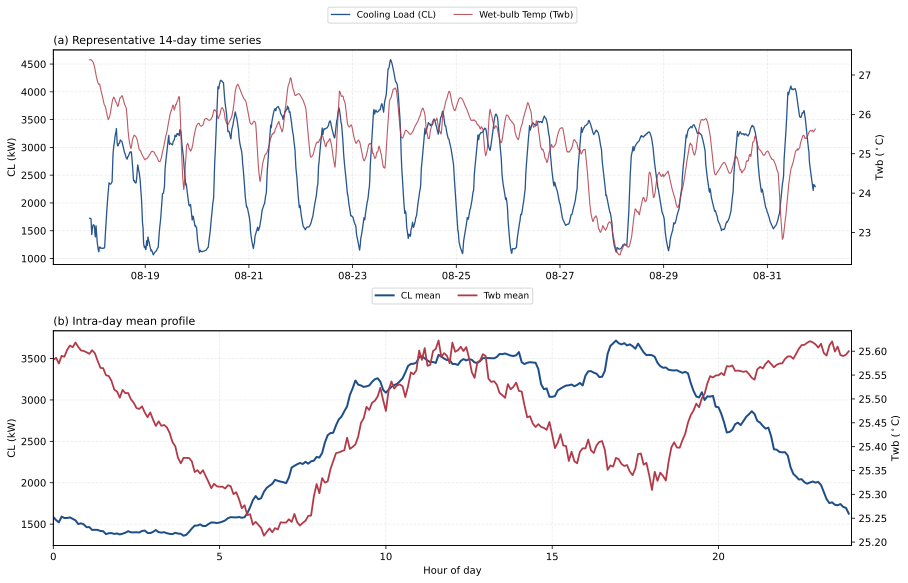
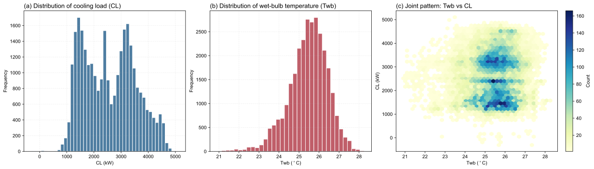
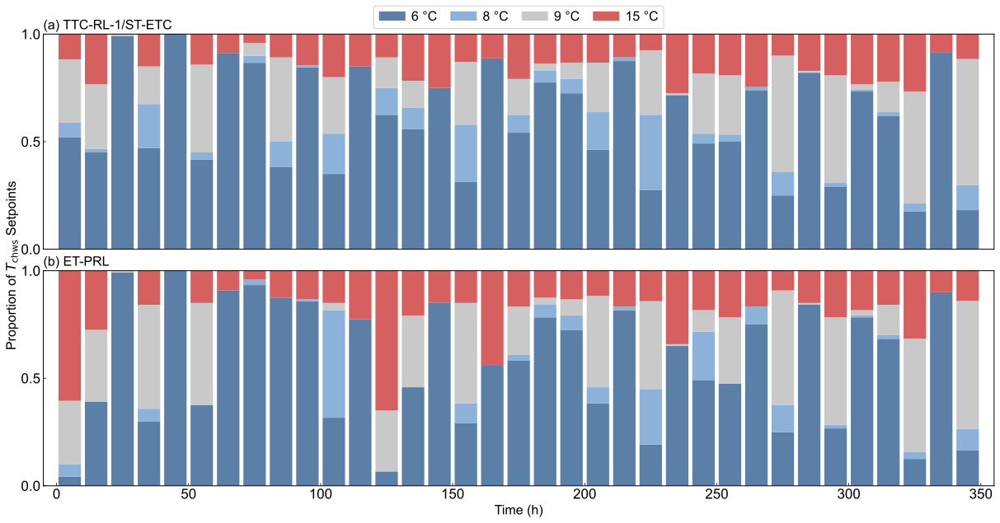
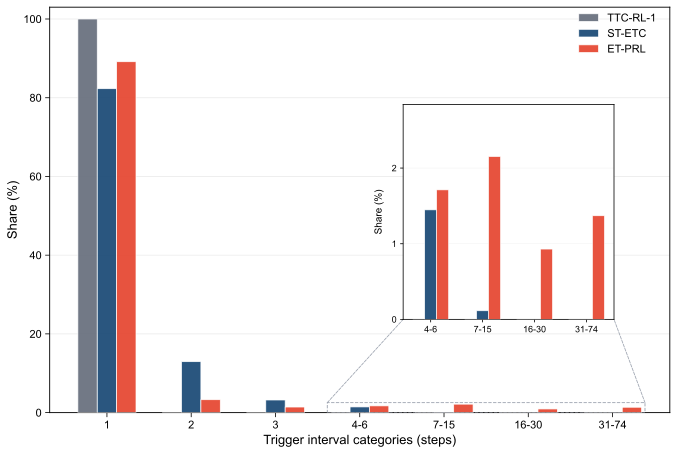

# 基于动态事件触发的 HVAC 强化学习预测控制方法 / HVAC Predictive Control Method Based on Dynamic Event Triggering

# 1. 引言 / Introduction

随着全球气候变化的加剧，建筑行业的节能减排已成为亟待解决的关键问题。相关统计数据显示，建筑能耗占全球终端能耗的 35% 以上，其中供暖、通风与空调（HVAC）系统不仅占据了建筑整体能耗的约 50%，也是电力需求侧响应的关键调节资源 [1]。在中央空调系统中，冷水机组作为核心耗能部件，其运行效率直接决定了系统的整体性能。然而，实际工程中的 HVAC 控制面临着严峻挑战：建筑热负荷受室外气象条件、室内人员流动及设备散热等多重动态因素的耦合影响，系统具有高度的非线性、时变性及大惯性滞后特征 [2]。

As global climate change intensifies, reducing energy consumption and emissions in the building sector has become an urgent priority. Statistics show that buildings account for over 35 percent of global energy consumption, and heating, ventilation, and air conditioning (HVAC) systems are responsible for about 50 percent of this building energy use and also serve as key resources for demand response where the chiller is the main energy consuming component, and its operating efficiency directly determines the overall system performance to some extent [1]. However, in real engineering scenarios, building thermal load is affected by several changing factors, including outdoor weather, occupant activity, equipment heat release and so on, while the HVAC system is nonlinear, changes over time, and has strong thermal inertia with delayed response, which makes HVAC control challenging [2].

为克服传统控制的局限性，深度强化学习（Deep Reinforcement Learning, DRL）凭借其无模型的自适应决策能力，近年来在 HVAC 控制领域展现出广阔的应用前景。DRL 能够通过与复杂时变环境的直接交互，自主学习并适应非线性工况 [3]；结合时序特征的预测型 DRL 进一步提升了智能体的前瞻预测能力，有效缓解了建筑大热惯性带来的控制滞后 [4]。然而，现有 DRL 在实际工程部署中仍受限于固定时间步长控制（Time-Triggered Control, TTC）这一根本性范式。在该机制下，智能体严格按预设时钟周期进行状态采样与动作更新，忽略了建筑热负荷在时间维度上演变的非均匀特性 [5]。这种固定频率驱动方式导致了响应速度与控制代价之间的固有矛盾：高频控制虽能迅速响应环境扰动，却会带来显著的计算开销与执行器机械磨损；低频控制虽能降低硬件损耗，却易造成控温精度下降 [6]。

Nowadays, deep reinforcement learning (DRL) has shown strong potential in HVAC control because it can make adaptive decisions without relying on a predefined model. By interacting directly with complex and changing environments, DRL can learn and adapt to nonlinear operating conditions [3]. Moreover, Predictive DRL further advances by using temporal features, which improves the agent's ability to anticipate future changes and helps reduce the control lag caused by the large thermal inertia of buildings [4]. However, in practical deployment, current DRL methods are still limited by the common time triggered control (TTC) scheme, where the agent samples states and updates actions at a fixed clock cycle which ignores the fact that building thermal loads do not evolve at a uniform rate over time [5]. As a result, there is an inherent trade-off between response speed and control cost: frequent updates can react quickly to disturbances, but they also increase computation cost and actuator wear, while infrequent updates reduce wear but often hurt temperature control accuracy [6].

为缓解 TTC 范式带来的计算冗余与设备磨损问题，事件驱动控制（Event-Triggered Control, ETC）机制应运而生 [7]。ETC 基于按需决策理念，仅在系统状态发生显著偏离时激活控制更新 [8]。这种稀疏控制机制有效突破了时间步长的硬性约束，为平衡响应速度与控制代价提供了可行途径。基于这一优势，已有研究在深度强化学习中引入 ETC 范式以进一步优化系统运行。这类方法在触发特定的预设事件时调整控制策略，有助于在热舒适度与能源消耗之间实现更好的平衡 [9]。然而，现有 ETC 方案主要依赖基于专家经验的静态规则，例如设定固定的温度死区或负荷波动阈值 [10]。静态触发机制在面对高度非线性且时变的真实建筑环境时缺乏动态适应能力，难以适应不同建筑的热惯性差异以及设备老化后的性能漂移，极易导致频繁误触发或控制响应迟滞现象 [11]。

The event triggered control (ETC) mechanism was developed to reduce the extra computation and equipment wear caused by TTC [7]. By updating the control system only when the system state changes significantly, ETC overcomes the constraint of TTC and provides a practical way to balance response speed and control cost [8]. Building on this advantage, prior studies have introduced ETC into DRL, where the control policy is updated when specific predefined events are triggered, which helps balance thermal comfort and energy consumption [9]. However, most existing ETC methods still rely on static rules set by experts, such as fixed temperature deadbands or load fluctuation thresholds [10]. Such static triggering schemes cannot adapt well to real building environments that are highly nonlinear and time varying. They also struggle to handle differences in thermal inertia across buildings and performance drift caused by equipment aging, which can lead to frequent false triggers or delayed control responses [11].

考虑到上述问题，有必要引入一种可随系统运行状态调整触发边界的动态阈值更新策略，使触发边界由基于固定经验的预设规则转变为依据偏离信号演化过程的自适应判定。在 HVAC 控制更新策略中，固定间隔更新策略以恒定节奏执行更新，无法区分扰动强弱时段；固定阈值更新策略虽可在偏离越限时触发响应，但其静态边界在面对时变工况时缺乏适应能力——阈值过松则平稳期冗余更新，过紧则扰动期响应迟滞。相比之下，动态阈值更新策略根据偏离趋势持续调整触发边界，在扰动增强时提升触发密度以保障响应性，在相对平稳时段降低触发频率以抑制冗余执行。这种自适应更新策略使得控制响应性与执行代价之间的平衡更加有效。

With respect to the above problems, a dynamic-threshold update strategy that can adapt to the current operating state of the system is considered, so that the triggering boundary is determined not by fixed empirical rules but by an adaptive criterion driven by the evolution of the deviation signal, as detailed in Figure 1. Among HVAC control update strategies, the fixed-interval update strategy executes updates at a constant cadence regardless of disturbance intensity. The fixed-threshold update strategy can trigger responses upon threshold exceedance, yet its static boundary lacks adaptability to time-varying operating conditions: too loose a threshold leads to redundant updates during steady periods, while too tight a threshold causes delayed responses during disturbances. In contrast, the dynamic-threshold update strategy continuously adjusts the triggering boundary according to the deviation trend, increasing update density during intensified disturbances to preserve responsiveness and reducing trigger frequency during relatively steady periods to suppress redundant execution. Therefore, the dynamic-threshold update strategy enables a more effective balance between control responsiveness and execution cost.


基于上述动机，本文提出了一种基于无监督动态事件门控的事件触发预测强化学习控制方法（Event-Triggered Predictive Reinforcement Learning with Unsupervised Dynamic Event Gating, ET-PRL），将时间序列预测、无监督动态事件门控与强化学习决策过程相结合。ET-PRL 采用数据驱动的方法，从运行数据中动态学习触发规则，并在触发时激活预测型强化学习策略网络输出控制动作，从而能够在不同的建筑特性和运行条件下实现自适应灵敏度。通过将预测特征、自适应门控机制与强化学习控制器深度耦合，该方法在关键干扰期间保持完全控制能力，同时在稳定期间抑制冗余更新。本文的主要贡献如下：

Driven by the above motivations, we propose a new HVAC control method, Event-Triggered Predictive Reinforcement Learning with Unsupervised Dynamic Event Gating (ET-PRL), that combines time series prediction with unsupervised dynamic event gating in a deep reinforcement learning setting. ET-PRL learns event-triggering rules online from operational data through a data-driven method and activates a predictive reinforcement learning policy network to generate control actions when critical events are detected, allowing control sensitivity to adapt to different building characteristics and operating conditions. By integrating predictive features, adaptive gating, and the reinforcement learning controller within a unified method, ET-PRL preserves full control capability during major disturbances while reducing redundant updates during stable periods. The main contributions of this paper are as follows:

- **提出基于流式特征的无监督动态事件门控机制**：在 ET-PRL 方法中构建了融合多尺度异常追踪与双层自适应阈值的门控模块，摆脱了对静态人工规则的依赖，实现了对时变工况下非平稳扰动的自适应感知。

- **We propose an unsupervised dynamic event gating mechanism based on streaming features**: We build a gating module that combines multi scale anomaly tracking with a two layer adaptive threshold. This removes the need for static manual rules and allows the system to automatically adapt to irregular disturbances under changing operating conditions.

- **构建时序解耦的事件驱动预测型控制方法**：将事件门控机制无缝融入预测型强化学习方法，使策略网络仅在关键扰动时激活，并在平稳期依靠零阶保持器（ZOH）维持控制输出。该方法通过与预测状态特征深度耦合，有效补偿稀疏按需执行导致的信息缺失，并进一步增强策略的前瞻性决策能力。

- **We construct a time decoupled, event driven predictive control method**: The event gating mechanism is smoothly integrated into predictive reinforcement learning. The policy network is activated only during critical disturbances, while a zero order hold (ZOH) maintains the control output during stable periods. Through deep coupling with predictive state features, this method effectively compensates for information loss caused by sparse on demand execution and further improves the policy's anticipatory decision making capability.

- **实现控制精度与执行代价的量化优化折衷**：基于102天真实冷水机组运行数据，我们通过系统对比、消融与敏感性分析量化证明了所提方法在动作更新次数上降低53.54%、日均能耗由7491降至7332 kWh/day（节能2.13%），且在保持94.41%基线性能下表现稳定，说明该方法具备鲁棒性与工程可部署性。

- **Quantified optimization trade off between control accuracy and execution cost**: Using 102 days of real chiller operation data, systematic comparisons, ablation and sensitivity studies show that the proposed method reduces action updates by 53.54%, lowers average daily energy consumption from 7491 to 7332 kWh/day (2.13% energy saving), and retains 94.41% of baseline performance, demonstrating robustness and practical deployability.

# 2. 相关工作 / Related Work

建筑 HVAC 系统在能效优化与热舒适保障之间的协同控制长期面临工程挑战。为应对建筑能耗增长与运行稳定性要求，传统研究主要采用基于规则的控制（Rule-Based Control, RBC）与比例 - 积分 - 微分控制（Proportional-Integral-Derivative, PID）等经典方法 [12]。其中，Choi 等 [13] 通过优化信息驱动的规则提取提升了 HVAC 规则控制的可操作性，Lee 等 [14] 将深度强化学习用于 PID 参数整定以改善跟踪性能；此外，Chojecki 等 [15] 进一步引入模糊控制思想，增强了传统控制器在特定工况下的适应能力。Tang 等 [16] 提出了一种物理感知深度学习嵌入的模型预测控制（Model Predictive Control, MPC）方法，通过构建建筑热动态模型并在滚动时域内求解约束优化问题，实现了能耗、舒适度与设备运行约束的显式协调。尽管这些方法在工业场景中部署便捷、可靠性高，或能够在模型准确时取得较优控制效果，但其核心仍依赖静态规则、线性反馈假设或高精度预测模型，难以充分刻画建筑热环境中的非线性耦合、时变扰动与大滞后特征，因而在复杂运维条件下往往难以同时兼顾节能与舒适性 [17]。

Coordinated control of energy efficiency and thermal comfort in building HVAC systems has long been a major engineering challenge. To address rising building energy demand and requirements for stable operation, early studies mainly relied on classic methods such as rule-based control (RBC) and proportional-integral-derivative (PID) control [12]. Choi et al. [13] improved the practicality of HVAC rule-based control through optimization-informed rule extraction. Lee et al. [14] used deep reinforcement learning to tune PID parameters and improve tracking performance. Chojecki et al. [15] further introduced fuzzy control to improve adaptability under specific operating conditions. Tang et al. [16] proposed a physics-aware deep learning-embedded model predictive control (MPC) approach, which builds predictive models of building thermal dynamics and solves constrained optimization problems over a receding horizon to explicitly coordinate energy use, comfort, and equipment constraints. Although these methods are easy to deploy and reliable in industrial scenarios, or can achieve strong control performance when the model is accurate, they still depend on static rules, linear feedback assumptions, or high-fidelity predictive models. As a result, they have limited ability to represent nonlinear coupling, time-varying disturbances, and long thermal delays in buildings, and they often struggle to maintain both energy savings and comfort under complex operation and maintenance conditions [17].

为突破传统控制在建模与适应性方面的瓶颈，数据驱动方法逐步成为 HVAC 智能控制的重要方向。其中，强化学习（Reinforcement Learning, RL）能够在不依赖精确物理模型的情况下，通过与建筑环境的试错交互学习运行状态与控制动作之间的优化映射，因而逐渐被用于建筑能耗管理、HVAC 控制与需求响应等任务 [18]。Savino 等 [19] 系统展示了深度强化学习在多区域底层控制中的应用潜力；Wang 与 Lin [20] 以及 Zhuang 等 [21] 分别基于深度 Q 网络（Deep Q-Network, DQN）和深度确定性策略梯度（Deep Deterministic Policy Gradient, DDPG）等范式构建了从高维传感状态到控制动作的映射，验证了强化学习在复杂场景中的优化优势。然而，强化学习多采用基于当前观测的反应式决策，在具有显著热惯性与时滞的系统中容易出现控制滞后与振荡 [22]。为此，Li 等 [23] 将长短期记忆网络（Long Short-Term Memory, LSTM）等时序模型融入决策过程，通过引入前瞻预测信息增强了策略对环境演化的感知能力，并在一定程度上改善了控制平稳性；He 等 [24] 进一步面向冷机群优化，将 LSTM 负荷预测与 DQN 控制相结合，构建了无模型的预测型强化学习框架，表明引入预测信息能够在保持强化学习自适应性的同时提升控制前瞻性。需要指出的是，现有 RL 及预测型 RL 方法在执行层面仍普遍遵循固定时间步长控制（TTC）范式，即按预设周期进行状态采样与动作更新，难以根据负荷扰动强弱自适应调整决策频率，因而存在冗余计算、执行机构磨损之间的固有矛盾 [25]。

To overcome the modeling and adaptability limits of traditional control, data-driven methods have become an important direction for intelligent HVAC control. Among them, reinforcement learning (RL) can learn optimized mappings between operating states and control actions through trial-and-error interaction with the building environment without requiring an accurate physical model, and has therefore been increasingly applied to building energy management, HVAC control, and demand response tasks [18]. Savino et al. [19] demonstrated the potential of deep reinforcement learning for low-level control in multi-zone buildings. Wang et al. [20] and Zhuang et al. [21] used Deep Q-Network (DQN) and Deep Deterministic Policy Gradient (DDPG) based frameworks to learn mappings from high-dimensional sensor states to control actions, confirming the optimization benefits of reinforcement learning in complex scenarios. However, most reinforcement learning methods rely mainly on current observations, which can lead to control delay and oscillation in systems with strong thermal inertia and time lag [22]. To mitigate this issue, Li et al. [23] integrated temporal models such as Long Short-Term Memory (LSTM) into the decision process, improving awareness of system evolution and partially improving control stability; He et al. [24] further developed a model-free predictive reinforcement learning (PRL) method for chiller plant optimization by combining LSTM-based load prediction with DQN control, showing that predictive information can improve control foresight while preserving the adaptability of RL. Nevertheless, existing RL and PRL methods still generally follow the TTC paradigm at the execution level, where states are sampled and actions are updated at preset intervals. This makes it difficult to adapt the decision frequency to the intensity of load disturbances and leads to an inherent conflict between redundant computation and actuator wear [25].

在控制策略由规则驱动向数据驱动持续演进的同时，如何降低冗余计算与执行机构磨损成为另一关键问题。Liu 等 [26] 与 Xue 等 [27] 的研究表明，事件驱动控制（ETC）通过按需更新机制，能够在状态越限或事件发生时才触发控制与通信，从而有效减少时间触发控制中的无效更新。进一步地，Fu 等 [9] 提出了事件驱动深度强化学习控制方法 ED-DQN，将事件触发机制引入多区域住宅建筑 HVAC 控制，使智能体仅在预设事件发生时更新控制动作，从而减少固定步长控制下的冗余决策。Liu 等 [28] 指出，现有 ETC 在工程落地中仍普遍依赖专家设定的静态阈值规则。面对建筑热特性漂移、气候波动与设备老化等非平稳因素，固定阈值往往难以兼顾灵敏性与稳定性，容易产生过度触发或响应迟滞，进而影响计算效率与舒适度表现 [29]。

As control strategies have evolved from rule-driven to data-driven methods, reducing redundant computation and actuator wear has become another key issue. Liu et al. [26] and Xue et al. [27] showed that event-triggered control (ETC) updates control and communication only when the state exceeds a threshold or a defined event occurs, thereby reducing unnecessary updates in TTC. Fu et al. [9] further proposed ED-DQN, an event-driven deep reinforcement learning control method for multi-zone residential building HVAC systems, which introduces event triggering into DRL so that the agent updates control actions only when predefined events occur, thereby reducing redundant decisions under fixed-step control. Liu et al. [28] pointed out that ETC methods in practical deployment still rely heavily on expert-defined static threshold rules. Under non-stationary factors such as drift in building thermal characteristics, climate variation, and equipment aging, fixed thresholds usually cannot balance sensitivity and stability, which can lead to excessive triggering or delayed responses and thus weaken computational efficiency and comfort performance [29].

基于上述研究进展，本文将 HVAC 事件触发过程重构为在线无监督异常检测问题，并提出耦合动态门控与预测型强化学习的按需控制方法，即基于无监督动态事件门控的事件触发预测型强化学习（Event-Triggered Predictive Reinforcement Learning with Unsupervised Dynamic Event Gating, ET-PRL）。与依赖静态规则的传统方法及现有 ETC 方案相比，本文通过流式特征追踪与自适应阈值判定实现触发条件的动态更新，降低了对人工经验的依赖，并提升了对长期漂移的适应性。与固定步长强化学习不同，该方法进一步以事件驱动方式解耦决策时序，在削减冗余推理与设备磨损的同时，利用预测特征弥补稀疏控制带来的状态信息缺失，最终在真实建筑非平稳工况中实现控制性能与执行代价的有效折衷。

Building on these studies, we reformulate HVAC event triggering as an online unsupervised anomaly detection problem and propose Event-Triggered Predictive Reinforcement Learning with Unsupervised Dynamic Event Gating (ET-PRL), an on-demand method that combines dynamic gating with predictive reinforcement learning. Compared with traditional static-rule methods and existing ETC schemes, ET-PRL introduces streaming feature tracking and adaptive thresholding to update triggering conditions dynamically, reducing dependence on manual tuning and improving adaptability to long-term drift. Unlike fixed-step reinforcement learning, the method further decouples decision timing through event-driven execution, thereby reducing redundant inference and equipment wear while using predictive features to compensate for the loss of state information caused by sparse control. As a result, ET-PRL achieves a practical balance between control performance and execution cost under non-stationary building operating conditions.

# 3. 方法 / Methodology

针对建筑 HVAC 系统存在的热惯性与响应滞后特性，以及运行工况随季节变化导致的分布漂移，传统依赖离线标定与静态阈值的事件控制方法在跨工况迁移时通常需要频繁再校准，进而增加了工程维护成本。为此，本文提出一种将流式异常门控与深度强化学习耦合的按需控制方法，即基于无监督动态事件门控的事件触发预测型强化学习（Event-Triggered Predictive Reinforcement Learning with Unsupervised Dynamic Event Gating, ET-PRL）。

Given the thermal inertia and delayed response of building HVAC systems, together with distribution shift caused by seasonal changes in operating conditions, traditional event-triggered control methods that rely on offline calibration and static thresholds usually require frequent recalibration when transferred across scenarios, which increases engineering maintenance cost. To address this issue, we propose Event-Triggered Predictive Reinforcement Learning with Unsupervised Dynamic Event Gating (ET-PRL), an on-demand control method that couples streaming anomaly gating with DRL.

> **图2 占位：ET-PRL 总体方法图**
> **Figure 2 placeholder: Overall ET-PRL method diagram**
>
> 对图 2 中内容的描述

## 3.1 基于流式特征追踪的动态事件触发机制设计 / Dynamic Event Triggering Design Based on Streaming Feature Tracking

在事件驱动控制范式中，控制更新的激活取决于对关键事件的判定，即系统运行状态显著偏离常态工况、需要控制动作即时介入的时刻。现有方法多依赖人工预设的静态规则来界定此类事件，难以适应建筑 HVAC 系统的非线性时变特性。本文将关键事件识别重定义为在线异常检测问题。具体而言，在控制语义上，关键事件对应需要控制动作即时介入的工况突变；在统计语义上，该类时刻通常表现为状态样本相对常态分布的显著偏离。由此，事件判定可统一建模为偏离度检验问题，而不再依赖人工设定的静态规则。

In event-triggered control, activating a control update depends on identifying critical events, that is, moments when the system state deviates significantly from normal operation and demands prompt control action. Most existing methods define such events using manually preset static rules, which are difficult to adapt to nonlinear and time-varying characteristics of building HVAC systems. We reformulate critical event identification as an online anomaly detection problem. Specifically, in control terms, critical events correspond to abrupt operating condition shifts that require immediate control intervention, while in statistical terms, such moments usually appear as significant deviations of state samples from the normal distribution. Therefore, event judgment can be uniformly modeled as a deviation test rather than relying on manually defined static rules.

设系统状态特征向量为 $s_t\in\mathbb{R}^d$，事件标签为 $e_t\in\{0,1\}$，时刻 $t$ 的常态参考分布记为 $\mathcal{P}^{\text{norm}}_t$。定义事件集合

$$
\mathcal{E}_t=\{s:\,d(s,\mathcal{P}^{\text{norm}}_t)>\delta_t\},\qquad
e_t=\mathbb{I}(s_t\in\mathcal{E}_t) \tag{1}
$$

其中，$\mathbb{I}(\cdot)$ 为指示函数，条件成立时取 1，否则取 0；$d(\cdot)$ 为分布偏离度量，$\delta_t$ 为判别阈值。上述定义表明，事件识别本质上是对是否偏离常态区域的二值判定；当状态进入高偏离区域时触发控制动作更新，否则维持当前控制动作。

Let the system state feature vector be $s_t\in\mathbb{R}^d$, the event label be $e_t\in\{0,1\}$, and the normal reference distribution at time step $t$ be denoted by $\mathcal{P}^{\text{norm}}_t$. The event set is defined as Eq. (1):

$$
\mathcal{E}_t=\{s:\,d(s,\mathcal{P}^{\text{norm}}_t)>\delta_t\},\qquad
e_t=\mathbb{I}(s_t\in\mathcal{E}_t) \tag{1}
$$

where $\mathbb{I}(\cdot)$ is the indicator function that equals 1 when the condition holds and 0 otherwise; $d(\cdot)$ denotes the distribution deviation metric, and $\delta_t$ is the decision threshold. This definition shows that event detection is essentially a binary test of whether the current state deviates from the normal region. The control action is updated when the state enters a high-deviation region; otherwise, the current control action is maintained.

为将偏离度检验转化为可流式更新的标量判据，本文采用异常分数函数 $A(s_t)$ 作为分布偏离度量 $d(s,\mathcal{P}^{\text{norm}}_t)$ 的标量化代理，并将集合判别转化为可计算的阈值比较：

$$
e_t=\mathbb{I}(A(s_t)>\tau_t) \tag{2}
$$

其中，$A(s_t)$ 越大表示偏离常态程度越高，$\tau_t$ 为触发阈值，对应于公式 (1) 中判别阈值 $\delta_t$ 在异常分数空间中的可计算形式。该形式具有两点优势：其一，可与流式统计量直接耦合，支持逐时间步在线更新；其二，便于与后续门控逻辑统一，实现由异常评分到触发决策的一体化建模与实现。

To convert distribution-level deviation testing into a scalar decision rule that can be updated in a streaming manner, an anomaly score function $A(s_t)$ is used as a scalar proxy for the distribution deviation metric $d(s,\mathcal{P}^{\text{norm}}_t)$, and the set-based rule is converted into a computable threshold comparison as Eq. (2).

$$
e_t=\mathbb{I}(A(s_t)>\tau_t) \tag{2}
$$

where a larger $A(s_t)$ indicates a stronger deviation from normal behavior, and $\tau_t$ is the trigger threshold, which is the computable counterpart of the decision threshold $\delta_t$ in Eq. (1) expressed in the anomaly score space. This form has two advantages: First, it can be directly coupled with streaming statistics and updated step by step. Second, it is naturally consistent with the subsequent gating logic and enables integrated modeling and implementation from anomaly scoring to trigger decision.

考虑 HVAC 长周期运行中的气象扰动、设备老化与负荷行为漂移所导致的非平稳性，本文不采用固定阈值，而采用流式自适应更新机制：

$$
    \tau_t=\Phi\big(A(s_{1}),\ldots,A(s_{t-1})\big) \tag{3}
$$

其中，$\Phi(\cdot)$ 表示由历史异常分数驱动的阈值更新算子。该设计旨在平衡灵敏性与稳定性：在扰动增强时提升事件检出率，在平稳区间抑制冗余触发，从而降低误触发与漏触发风险。

Considering the non-stationarity caused by weather disturbances, equipment aging, and load behavior drift during long-term HVAC operation, the threshold is updated through a streaming adaptive mechanism rather than fixed value as Eq. (3):

$$
    \tau_t=\Phi\big(A(s_{1}),\ldots,A(s_{t-1})\big) \tag{3}
$$

where $\Phi(\cdot)$ denotes the threshold update operator driven by historical anomaly scores which balances sensitivity and stability. It increases event coverage when disturbances intensify and suppresses redundant triggering during steady periods, thereby reducing the risk of false triggers and missed triggers.

（1）系统状态特征定义 / Definition of System State Features

事件门控模块与强化学习控制器共享同一状态特征输入。本文将该输入定义为紧凑的三维特征向量：

$$s_t=[Q_{load}^t,\,T_{wb}^t,\,\hat{Q}_{load}^{t+1}] \tag{4}$$

其中，$Q_{load}^t$ 表示当前时刻系统冷负荷，$T_{wb}^t$ 表示室外湿球温度，$\hat{Q}_{load}^{t+1}$ 表示下一时刻系统冷负荷的短期预测值。

The event gating module and the reinforcement learning controller share the same state feature which is defined as a compact three-dimensional feature vector as Eq. (4):

$$s_t=[Q_{load}^t,\,T_{wb}^t,\,\hat{Q}_{load}^{t+1}] \tag{4}$$

where, at time step $t$, $Q_{load}^t$ denotes the system cooling load, $T_{wb}^t$ denotes the outdoor wet-bulb temperature, and $\hat{Q}_{load}^{t+1}$ denotes the one-step-ahead short-term prediction of the system cooling load.

引入 $T_{wb}^t$ 的主要原因在于该变量能够同时表征外部温度与湿度条件，并直接约束冷却塔换热性能及系统排热上限，因此可作为刻画外生气象扰动强度与方向的关键状态量，从而提升门控机制对环境非平稳变化的识别能力；此外，引入 $\hat{Q}_{load}^{t+1}$ 的动机在于建筑热系统具有显著热惯性与控制滞后，若仅依赖当前观测量门控判定通常滞后于工况变化，纳入一步前瞻负荷后可提前感知负荷爬升或回落趋势，进而在关键变化阶段更早触发策略更新，降低稀疏触发条件下的响应滞后风险；为在保持表征能力的同时控制特征维度并支撑在线门控的实时计算，本文未进一步引入管网流量、回水温度等附加变量，原因是在线异常检测在高维空间中易出现样本稀疏与距离退化，从而削弱统计判别稳定性并增加计算开销。

The main reason for selecting $T_{wb}^t$ is that it can capture both ambient temperature and humidity and directly constrain cooling tower heat transfer performance and the upper limit of system heat rejection. It therefore serves as a key state variable for characterizing the intensity and direction of exogenous weather disturbances, which improves the ability of the gating mechanism to detect non-stationary environmental changes. Moreover, $\hat{Q}_{load}^{t+1}$ is selected because building thermal systems exhibit strong thermal inertia and control delay. If the gating mechanism relies only on current observations, trigger decisions usually lag behind operating condition shifts. By incorporating one-step-ahead load information, the gating module can sense rising or falling load trends earlier to some extent and trigger control action updates earlier during critical transitions, thereby reducing the risk of delayed response under sparse triggering.

（2）流式隔离深度与多尺度异常追踪 / Streaming Isolation Depth and Multi-Scale Anomaly Tracking

传统离线异常检测通常依赖静态样本库，在季节性工况漂移场景下稳定性受限。为此，本文采用流式隔离深度机制，对在线到达的系统状态特征 $s_t$ 进行实时异常评分。流式隔离深度算法（Streaming Isolation Depth）通过在滑动数据窗口上动态构建与更新隔离树结构，计算输入数据点在多棵树中的平均路径长度作为隔离程度度量。路径越短，数据点越容易被孤立，对应异常概率越高。该机制能够在不重新训练全局模型的条件下在线适应分布变化。

Traditional offline anomaly detection usually depends on a static sample library and is less stable under seasonal operating drift. To address this issue, a streaming isolation depth mechanism is deployed to score anomalies of the online system state feature $s_t$ in real time. Streaming Isolation Depth dynamically builds and updates isolation tree structures over sliding data windows, and uses the average path length of a sample across multiple trees to measure its degree of isolation. A shorter path means the sample is easier to isolate and therefore more likely to be anomalous. This mechanism can adapt to distribution changes online without retraining a global model.

隔离树通过递归随机选择特征与分割点来孤立数据点。对于输入点 $s_t$，在滑动参考窗口内的 $\psi$ 棵隔离树上分别执行搜索，记该点在第 $j$ 棵树上的路径长度为 $h_j(s_t)$，其中路径长度定义为从根节点到叶节点的边数。该点的平均隔离深度定义为：

$$h_{\mathrm{iso}}(s_t) = \frac{1}{\psi} \sum_{j=1}^{\psi} h_j(s_t) \tag{5}$$

进而转化为归一化的异常分数，其中 $m$ 为参考集样本数，$C(m)$ 为对应的平均路径长度基准：

$$A_{\mathrm{iso}}(s_t) = 2^{-\frac{h_{\mathrm{iso}}(s_t)}{C(m)}} \tag{6}$$

Each isolation tree isolates data points by recursively selecting random features and split state points. For a state point $s_t$, search is performed on $\psi$ isolation trees built from the sliding reference window, and $h_j(s_t)$ denotes the path length on the $j$-th tree, where the path length is defined as the number of edges from the root node to the leaf node. The average isolation depth of the sample is defined as Eq. (5):

$$h_{\mathrm{iso}}(s_t) = \frac{1}{\psi} \sum_{j=1}^{\psi} h_j(s_t) \tag{5}$$

Thereafter, $h_{\mathrm{iso}}(s_t)$ is further converted into a normalized anomaly score as Eq. (6), where $m$ is the number of samples in the reference set and $C(m)$ is the corresponding baseline for average path length.

$$A_{\mathrm{iso}}(s_t) = 2^{-\frac{h_{\mathrm{iso}}(s_t)}{C(m)}} \tag{6}$$

标准化常数计算为 $C(m) = 2H(m-1) - \frac{2(m-1)}{m}$，其中 $H(m-1)=\sum\limits_{i=1}^{m-1}\frac{1}{i}$ 为调和级数。该形式将异常分数映射至 $(0,1)$ 区间：当数据点易被隔离时，路径较短，分数趋近于 1；当数据点难被隔离时，路径较长，分数趋近于 0。

The normalization constant is computed as $C(m) = 2H(m-1) - \frac{2(m-1)}{m}$, where $H(m-1)=\sum\limits_{i=1}^{m-1}\frac{1}{i}$ is the harmonic series which maps the anomaly score to the interval $(0,1)$: shorter paths yield scores closer to 1, indicating easy isolation, whereas longer paths yield scores closer to 0, indicating difficulty of isolation.

算法维护三个不同规模的滑动参考窗口以生成多尺度动态参考集合。短时窗口 $\mathcal{W}_{\mathrm{short}}$ 包含最近 $n_s$ 个数据点，用于捕捉高频波动；中时窗口 $\mathcal{W}_{\mathrm{medium}}$ 包含最近 $n_m$ 个数据点，用于表征日内周期；长时窗口 $\mathcal{W}_{\mathrm{long}}$ 包含最近 $n_l$ 个数据点，用于描述季节性漂移，且参数满足 $n_s < n_m < n_l$。在各窗口上独立应用隔离树算法，并在每个时刻输出对应尺度的异常分数。记 $\kappa\in\{\mathrm{short},\mathrm{medium},\mathrm{long}\}$，对应窗口规模记为 $n_\kappa$，则有

$$A_{\kappa}(s_t)=2^{-\frac{h_{\mathrm{iso}}^{\kappa}(s_t)}{C(n_{\kappa})}} \tag{7}$$

各尺度分数均归一化至 $[0,1]$ 区间。综合异常分数定义为三类尺度分数的加权融合：

$$A(s_t)=w_{\mathrm{s}}A_{\mathrm{short}}(s_t)+w_{\mathrm{m}}A_{\mathrm{medium}}(s_t)+w_{\mathrm{l}}A_{\mathrm{long}}(s_t) \tag{8}$$

其中 $w_{\mathrm{s}}, w_{\mathrm{m}}, w_{\mathrm{l}} \ge 0$ 且 $w_{\mathrm{s}}+w_{\mathrm{m}}+w_{\mathrm{l}}=1$ 分别代表对应时间尺度的融合权重。

The computation process maintains three sliding reference windows of different sizes to form multi-scale dynamic reference sets. The short window $\mathcal{W}_{\mathrm{short}}$ contains the most recent $n_s$ data points and is used to capture high-frequency fluctuations. The medium window $\mathcal{W}_{\mathrm{medium}}$ contains the most recent $n_m$ data points and is used to represent the intraday cycle. The long window $\mathcal{W}_{\mathrm{long}}$ contains the most recent $n_l$ data points and is used to describe seasonal drift, with $n_s < n_m < n_l$. Isolation trees are applied independently to each window, and an anomaly score is produced at each scale at every time step. Let $\kappa\in\{\mathrm{short},\mathrm{medium},\mathrm{long}\}$ and let $n_\kappa$ denote the corresponding window size. The corresponding scale-specific anomaly score is given by Eq. (7):

$$A_{\kappa}(s_t)=2^{-\frac{h_{\mathrm{iso}}^{\kappa}(s_t)}{C(n_{\kappa})}} \tag{7}$$

All scale-specific scores are normalized to the interval $[0,1]$. The overall anomaly score is defined as a weighted fusion of the three scale-specific scores as Eq. (8).

$$A(s_t)=w_{\mathrm{s}}A_{\mathrm{short}}(s_t)+w_{\mathrm{m}}A_{\mathrm{medium}}(s_t)+w_{\mathrm{l}}A_{\mathrm{long}}(s_t) \tag{8}$$

where $w_{\mathrm{s}}, w_{\mathrm{m}}, w_{\mathrm{l}} \ge 0$ and $w_{\mathrm{s}}+w_{\mathrm{m}}+w_{\mathrm{l}}=1$, which represent the fusion weights of the corresponding time scales.

本文通过短、中、长三个时间尺度的加权融合来构建综合异常分数。其中，短时尺度主要用于捕捉高频扰动，中时尺度用于表征日内周期变化，长时尺度用于跟踪季节性漂移与长期慢变过程。该多尺度融合机制使门控模块能够同时响应局部突发扰动与系统级慢变趋势，避免单一尺度统计在非平稳工况下出现的灵敏性不足或过触发问题，从而提升门控机制在跨工况场景下的适应性与鲁棒性。

We construct the composite anomaly score through weighted fusion of the short, medium, and long time scales. The short-term scale primarily captures high-frequency disturbances, the medium-term scale characterizes intraday periodic variations, and the long-term scale tracks seasonal drift and long-term slow processes. This multi-scale fusion mechanism enables the gating module to jointly respond to local abrupt disturbances and system-level slow-varying trends, avoiding the insufficient sensitivity or excessive triggering that a single-scale statistic may exhibit under non-stationary operating conditions, thereby improving the adaptability and robustness of the gating mechanism across diverse operating scenarios.

（3）流式双层自适应阈值优化 / Streaming Two-Layer Adaptive Threshold Optimization

式 (8) 给出了多尺度融合异常分数 $A(s_t)$，但触发决策还需将其与阈值 $\tau_t$ 进行比较，即式 (2) 的判别条件。若采用固定阈值，在 HVAC 长周期非平稳运行中易出现灵敏性不足或过触发问题；若仅依赖单一自适应统计量，则难以同时兼顾短期扰动的快速响应与长期漂移的平滑跟踪。为此，本文构造局部-全局双层自适应阈值，通过快慢双时间尺度的协同更新实现自适应触发判定。具体而言，首先在滑动窗口内基于上分位数与绝对中位差分别估计异常分数经验分布的上尾边界，并加权融合为候选阈值；随后对该候选阈值进行局部指数平滑，得到能够快速跟踪近期工况变化的局部阈值；最后引入更新速率更慢的全局阈值，为长期漂移提供平滑基线约束。最终，触发阈值并非由单一统计量给出，而是由局部阈值与全局阈值共同决定。

Eq. (8) provides the multi-scale fused anomaly score $A(s_t)$, but the triggering decision still requires comparing this score against a threshold $\tau_t$, as defined in Eq. (2). Under long-term non-stationary HVAC operation, a fixed threshold is prone to either insufficient sensitivity or excessive triggering, whereas a single adaptive statistic cannot simultaneously accommodate rapid response to short-term disturbances and stable tracking of long-term drift. To resolve this issue, we construct a local-global two-layer adaptive threshold that achieves adaptive triggering through coordinated fast- and slow-timescale updates.

Specifically, we first estimate the upper-tail boundaries of the empirical anomaly score distribution within the sliding window using the upper quantile and the median absolute deviation (MAD) respectively, and then fuse them into a candidate threshold via weighted combination. A local exponential smoothing step is subsequently applied to this candidate threshold, yielding a local threshold that tracks recent operating condition changes. To capture longer-term trends, we further introduce a global threshold with a slower update rate, which serves as a smooth baseline constraint against drift. The final triggering threshold is determined by combining both the local and global components rather than relying on a single statistic, which enables the gating mechanism to jointly maintain short-term responsiveness and long-term stability across non-stationary operating conditions.

为降低异常样本对位置统计量和尺度统计量的影响，本文采用两类鲁棒统计量构造候选阈值：基于上分位数的阈值 $\tau_q^{(t)}$ 与基于绝对中位差（MAD）的阈值 $\tau_{\mathrm{mad}}^{(t)}$。前者表征异常分数经验分布的上尾位置，后者刻画围绕中位数的稳健离散度，二者定义如下：

$$\tau_{q}^{(t)}=Q_q(\mathcal{A}_t^{(W)}) \tag{9}$$

$$\begin{aligned}
\tau_{\mathrm{mad}}^{(t)} &= \operatorname{med}(\mathcal{A}_t^{(W)})+\kappa \cdot c \cdot \operatorname{MAD}(\mathcal{A}_t^{(W)}) \\
&= \operatorname{med}(\mathcal{A}_t^{(W)})+\kappa \cdot c \cdot\operatorname{med}\left(\left\{\left|a-\operatorname{med}(\mathcal{A}_t^{(W)})\right|:a\in\mathcal{A}_{t}^{(W)}\right\}\right)
\end{aligned} \tag{10}$$

其中，$\mathcal{A}_t^{(W)}=\{A(s_{t-W+1}),\ldots,A(s_t)\}$ 表示长度为 $W$ 的异常分数滑动窗口，$W$ 为窗口长度；$Q_q(\cdot)$ 表示分位点为 $q$ 的经验分位数，且 $q\in(0.5,1)$；$\operatorname{med}(\cdot)$ 为中位数函数；$\kappa$ 为灵敏度调节系数；$c \approx 1.4826$ 为高斯分布下的正常一致性校正常数。$\tau_q^{(t)}$ 主要表征异常分数经验分布的上尾位置，而 $\tau_{\mathrm{mad}}^{(t)}$ 则根据窗口内分数的稳健离散程度对该边界进行修正。

To reduce the influence of anomalous samples on location and scale statistics, we employ two robust statistics to construct the candidate threshold: an upper-quantile-based threshold $\tau_q^{(t)}$ and a MAD based threshold $\tau_{\mathrm{mad}}^{(t)}$. The former captures the upper-tail position of the empirical anomaly score distribution, while the latter characterizes the robust dispersion around the median defined as Eqs. (9) and (10):

$$\tau_{q}^{(t)}=Q_q(\mathcal{A}_t^{(W)}) \tag{9}$$

$$\begin{aligned}
\tau_{\mathrm{mad}}^{(t)} &= \operatorname{med}(\mathcal{A}_t^{(W)})+\kappa \cdot c \cdot \operatorname{MAD}(\mathcal{A}_t^{(W)}) \\
&= \operatorname{med}(\mathcal{A}_t^{(W)})+\kappa \cdot c \cdot\operatorname{med}\left(\left\{\left|a-\operatorname{med}(\mathcal{A}_t^{(W)})\right|:a\in\mathcal{A}_{t}^{(W)}\right\}\right)
\end{aligned} \tag{10}$$

where $\mathcal{A}_t^{(W)}=\{A(s_{t-W+1}),\ldots,A(s_t)\}$ denotes the anomaly score sliding window of length $W$; $Q_q(\cdot)$ is the empirical quantile at level $q\in(0.5,1)$; $\operatorname{med}(\cdot)$ is the median function; $\kappa$ is the sensitivity coefficient; and $c \approx 1.4826$ is the consistency constant for Gaussian distributions. The threshold $\tau_q^{(t)}$ primarily characterizes the upper-tail position of the empirical anomaly score distribution, whereas $\tau_{\mathrm{mad}}^{(t)}$ refines this boundary according to the robust dispersion of scores within the window.

在此基础上，本文构造局部候选阈值，用于给出历史窗口下的触发阈值估计：

$$\tau_{\mathrm{cand}}^{(t)}=\omega_q\tau_q^{(t)}+(1-\omega_q)\tau_{\mathrm{mad}}^{(t)} \tag{11}$$

其中，$\omega_q \in [0,1]$ 为融合权重。$\omega_q$ 较大时，候选阈值更接近上尾分位边界，因此更依赖当前异常分数是否超过历史窗口中的高分位水平；$\omega_q$ 较小时，候选阈值更强调 MAD 所反映的稳健波动尺度，因此对分数分布的扩张或收缩更为敏感。

On this basis, we construct the local candidate threshold to provide an initial estimate of the triggering boundary for the historical window defined as Eq. (11):

$$\tau_{\mathrm{cand}}^{(t)}=\omega_q\tau_q^{(t)}+(1-\omega_q)\tau_{\mathrm{mad}}^{(t)} \tag{11}$$

where $\omega_q \in [0,1]$ is the fusion weight. A larger $\omega_q$ shifts the candidate threshold closer to the upper-quantile boundary, making the criterion more dependent on whether the current anomaly score exceeds the high-quantile level within the historical window. A smaller $\omega_q$ takes greater emphasis on the robust fluctuation scale reflected by MAD, thereby increasing sensitivity to expansion or contraction of the score distribution.

由于 $\tau_{\mathrm{cand}}^{(t)}$ 仍可能受到单时刻尖峰扰动的影响，本文进一步对其进行快时间尺度上的指数平滑，得到局部阈值：

$$\tau_{\mathrm{local}}^{(t)}=(1-\lambda_{\mathrm{local}})\tau_{\mathrm{local}}^{(t-1)}+\lambda_{\mathrm{local}}\tau_{\mathrm{cand}}^{(t)} \tag{12}$$

式中，$\lambda_{\mathrm{local}} \in (0,1]$ 为局部更新率，$\tau_{\mathrm{local}}^{(0)}$ 取首个完整滑动窗口上得到的候选阈值。该步骤通过一阶平滑在阈值响应性与抗抖动性之间取得折衷。$\lambda_{\mathrm{local}}$ 较大时，局部阈值更快跟随近期工况切换；$\lambda_{\mathrm{local}}$ 较小时，局部阈值对短时脉冲噪声更不敏感。

As $\tau_{\mathrm{cand}}^{(t)}$ may still be affected by single-step spike disturbances, we further apply exponential smoothing on a fast timescale to obtain the local threshold as Eq. (12):

$$\tau_{\mathrm{local}}^{(t)}=(1-\lambda_{\mathrm{local}})\tau_{\mathrm{local}}^{(t-1)}+\lambda_{\mathrm{local}}\tau_{\mathrm{cand}}^{(t)} \tag{12}$$

where $\lambda_{\mathrm{local}} \in (0,1]$ is the local update rate, and $\tau_{\mathrm{local}}^{(0)}=\tau_{\mathrm{cand}}^{(t_0)}$ with $t_0$ denoting the first time step at which a complete sliding window is available. By applying first-order smoothing, $\tau_{\mathrm{local}}^{(t)}$ achieves a trade-off between threshold responsiveness and resistance to jitter. A larger $\lambda_{\mathrm{local}}$ enables the local threshold to follow recent operating condition transitions more rapidly, whereas a smaller $\lambda_{\mathrm{local}}$ makes the local threshold less sensitive to short-duration impulsive noise.

若系统因季节变化、设备老化或运行边界迁移而发生缓慢漂移，局部阈值可能被长期变化逐步牵引，从而削弱对持续分布偏移的识别能力。因此，本文进一步在更慢时间尺度上构造全局阈值，作为长期基线参考：

$$\tau_{\mathrm{global}}^{(t)}=(1-\lambda_{\mathrm{global}})\tau_{\mathrm{global}}^{(t-1)}+\lambda_{\mathrm{global}}\tau_{\mathrm{local}}^{(t)} \tag{13}$$

其中，$\tau_{\mathrm{global}}^{(0)}=\tau_{\mathrm{local}}^{(0)}=\tau_{\mathrm{cand}}^{(t_0)}$（$t_0$ 为首个完整滑动窗口可用时的时间步），且 $\lambda_{\mathrm{global}} \ll \lambda_{\mathrm{local}}$，以保证全局阈值具有更强的平滑性与迟滞性。

When the system undergoes slow drift due to seasonal variation, equipment aging, or shifts in operating boundaries, the local threshold may be gradually pulled by long-term changes, thereby weakening its ability to detect sustained distributional shifts. We therefore construct a global threshold on a slower timescale as a long-term baseline reference as Eq. (13):

$$\tau_{\mathrm{global}}^{(t)}=(1-\lambda_{\mathrm{global}})\tau_{\mathrm{global}}^{(t-1)}+\lambda_{\mathrm{global}}\tau_{\mathrm{local}}^{(t)} \tag{13}$$

where $\tau_{\mathrm{global}}^{(0)}=\tau_{\mathrm{local}}^{(0)}=\tau_{\mathrm{cand}}^{(t_0)}$ and $\lambda_{\mathrm{global}} \ll \lambda_{\mathrm{local}}$, ensuring that the global threshold exhibits stronger smoothness and hysteresis.

最终，流式双层自适应阈值由局部阈值与全局阈值融合得到：

$$\tilde{\tau}_t=\alpha_{\mathrm{local}}\tau_{\mathrm{local}}^{(t)}+(1-\alpha_{\mathrm{local}})\tau_{\mathrm{global}}^{(t)}+b_{\mathrm{bias}} \tag{14}$$

其中，$\alpha_{\mathrm{local}}\in[0,1]$ 控制短期信息与长期信息的融合比例：当其增大时，最终阈值更偏向近期工况，响应更灵敏；当其减小时，最终阈值更偏向长期基线，判定更稳定。$b_{\mathrm{bias}}\in[-1, 1]$ 为整体平移校正项，用于补偿有限窗口估计在不同运行阶段下可能带来的系统性偏差。特别是在夜间低负荷等高度平稳阶段，若仅依赖局部与全局统计量，触发边界可能在窗口效应下出现偏置并导致边界附近频繁切换；引入该项有助于提升判据的稳健性。

The final streaming two-layer adaptive threshold is obtained by fusing the local and global thresholds as Eq. (14):

$$\tilde{\tau}_t=\alpha_{\mathrm{local}}\tau_{\mathrm{local}}^{(t)}+(1-\alpha_{\mathrm{local}})\tau_{\mathrm{global}}^{(t)}+b_{\mathrm{bias}} \tag{14}$$

where $\alpha_{\mathrm{local}}\in[0,1]$ controls the blending ratio between short-term and long-term information. Increasing $\alpha_{\mathrm{local}}$ shifts the final threshold toward recent operating conditions, yielding more responsive triggering behavior; decreasing it shifts the threshold toward the long-term baseline, yielding more stable judgment. The term $b_{\mathrm{bias}}\in[-1, 1]$ is a global offset correction that compensates for potential systematic bias arising from finite-window estimation at different operating stages. During highly stable phases such as nighttime low-load periods, the triggering boundary computed solely from local and global statistics may be biased due to window effects, leading to frequent boundary oscillations. Incorporating this offset therefore improves the robustness of the decision criterion.

## 3.2 在线流式事件门控模块构建 / Online Streaming Event Gating Module Construction

在获得基础自适应门控阈值 $\tilde{\tau}_t$ 后，门控模块进一步将其转化为实际触发判据。与传统固定阈值和单条件越限触发策略不同，本模块采用异常强度判别与时间约束抑振的联合判定形式，目标是在保证关键扰动覆盖率的同时抑制边界附近的抖振触发。前者通过比较 $A(s_t)$ 与自适应阈值实现对当前状态偏离程度的阈值判定，后者通过最小触发间隔约束显式控制动作更新频率，避免短时高频波动引发连续触发，进而导致执行器过度切换。

After obtaining the basic adaptive gating threshold $\tilde{\tau}_t$, we further convert it into an actionable triggering criterion. Unlike traditional fixed-threshold or single-condition exceedance triggering strategies, our gating module employs a joint determination form that combines anomaly intensity discrimination with time-constraint oscillation suppression. The objective is to guarantee coverage of critical disturbances while suppressing chatter triggering near threshold boundaries. The former component evaluates the current state deviation by comparing $A(s_t)$ against the adaptive threshold, whereas the latter explicitly regulates the action update frequency through a minimum trigger interval constraint. This design prevents consecutive triggering caused by short-term high-frequency fluctuations, which would otherwise lead to excessive actuator switching.

在每个控制时刻，门控模块接收当前系统状态特征 $s_t$，计算异常分数 $A(s_t)$ 并执行二值触发判定：

$$\tau_t^*=\operatorname{clip}(\tilde{\tau}_t+m_{\mathrm{hys}},0,1) \tag{15}$$

$$\mathrm{Trigger}(s_t)=\mathbb{I}\left(A(s_t)>\tau_t^*\right)\land\mathbb{I}\left(t-t_{\mathrm{last}}>\Delta_{\min}\right) \tag{16}$$

上式中，$\tilde{\tau}_t$ 为式 (14) 给出的流式双层自适应阈值；$\operatorname{clip}(\cdot, 0, 1)$ 表示将输入值约束在 0 到 1 区间内的截断函数；$m_{\mathrm{hys}}$ 为滞回裕度，用于防止阈值边界附近的触发信号反复翻转；$t_{\mathrm{last}}$ 记录系统上一次触发控制动作更新的时间步；$\Delta_{\min}$ 为设定的最小触发间隔。$\mathrm{Trigger}(s_t)=1$ 表示当前时刻触发控制动作的重新生成，$\mathrm{Trigger}(s_t)=0$ 表示维持上一时刻的控制指令。

At each control time step, the gating module receives the current system state feature $s_t$, computes the anomaly score $A(s_t)$, and performs a binary trigger determination as Eqs. (15) and (16):

$$\tau_t^*=\operatorname{clip}(\tilde{\tau}_t+m_{\mathrm{hys}},0,1) \tag{15}$$

$$\mathrm{Trigger}(s_t)=\mathbb{I}\left(A(s_t)>\tau_t^*\right)\land\mathbb{I}\left(t-t_{\mathrm{last}}>\Delta_{\min}\right) \tag{16}$$

where $\tilde{\tau}_t$ is the streaming dual-layer adaptive threshold defined in Eq. (14), $\operatorname{clip}(\cdot, 0, 1)$ constrains the input value to the interval $[0,1]$, $m_{\mathrm{hys}}$ is a hysteresis margin that prevents the trigger signal from repeatedly flipping near the threshold boundary, $t_{\mathrm{last}}$ records the time step at which the system last triggered a control action update, and $\Delta_{\min}$ is the specified minimum trigger interval. When $\mathrm{Trigger}(s_t)=1$, the gating module triggers PRL module to generate a new control action for the current time step, and when $\mathrm{Trigger}(s_t)=0$, the control action from the previous time step is held via a zero-order hold.

无论 $\mathrm{Trigger}(s_t)$ 取值如何，门控模块均在每个时间步执行异常分数窗口维护与双层阈值递推更新。具体而言，在执行式 (15) 的触发判定后，将当前异常分数 $A(s_t)$ 追加至滑动窗口 $\mathcal{A}_t^{(W)}$，并按式 (11)–(14) 依次更新候选阈值、局部阈值与全局阈值，为下一时刻的判定提供最新的统计参考基线。该设计保证门控模块的阈值估计始终基于最新观测，避免因触发稀疏化导致统计量对工况变化感知滞后，进而保障在平稳期结束、扰动重新增强时能够及时恢复触发灵敏性。

Regardless of the value of $\mathrm{Trigger}(s_t)$, the gating module executes anomaly score window maintenance and dual-layer threshold recursive update at every time step. Specifically, after performing the trigger determination in Eq. (15), we append the current anomaly score $A(s_t)$ to the sliding window $\mathcal{A}_t^{(W)}$ and sequentially update the candidate threshold, local threshold, and global threshold according to Eqs. (11)-(14), thereby providing the most recent statistical reference baseline for the next time step. Through the update, the gating module's threshold estimation is always grounded in the latest observations, thereby preventing the statistics from lagging behind operating condition changes due to trigger sparsification and guaranteeing that the trigger sensitivity can be promptly restored once a stable period ends and disturbances intensify.

## 3.3 基于动态阈值事件触发的预测型强化学习控制算法 / Predictive RL Control Algorithm with Dynamic Event Triggering

基于上述门控模块提供的触发判定信号，为兼顾控制性能与在线计算开销，本文构建结合短期负荷预测信息的轻量级 DQN 智能体作为强化学习控制器。该控制器在触发时刻接收状态向量 $s_t$，通过复合奖励函数引导智能体在降低能耗与维持温控性能之间实现优化平衡，输出冷冻水供水温度设定点。同时，该模块采用分层执行策略，将高层无模型优化决策与底层设备的物理运行约束解耦，确保生成动作满足机组启停与最小运行时长等工程约束。

Based on the trigger signal provided by the gating module, we construct a lightweight DQN agent augmented with short-term load prediction as the RL controller, balancing control performance against online computational cost. Once the trigger happens, the controller receives the state vector $s_t$ and a composite reward $r_t$, outputs a chilled water supply temperature setpoint that trades off energy reduction with temperature tracking quality. Moreover, we adopt a hierarchical execution strategy that decouples the high-level model-free optimization decisions from the low-level physical operating constraints of the equipment, ensuring that the generated actions satisfy engineering requirements such as unit start/stop sequencing and minimum run-time durations.

**(1) 任务建模与问题定义 / Task formulation and problem definition**

针对建筑 HVAC 控制中状态维度高、样本间存在强时序关联的问题，本文采用紧凑状态表征，并将控制问题建模为马尔可夫决策过程（Markov decision process, MDP）$\langle \mathcal{S}, \mathcal{A}, \mathcal{P}, \mathcal{R}, \gamma \rangle$，其中 $\mathcal{S}$ 为状态空间，$\mathcal{A}$ 为动作空间，$\mathcal{P}$ 为状态转移概率核，$\mathcal{R}$ 为奖励函数，$\gamma$ 为折扣因子。

To address high dimensional state spaces and strong temporal correlations among samples in HVAC control, we adopt a compact state representation and formulate the control problem as an MDP $\langle \mathcal{S}, \mathcal{A}, \mathcal{P}, \mathcal{R}, \gamma \rangle$, where $\mathcal{S}$ denotes the state space, $\mathcal{A}$ denotes the action space, $\mathcal{P}$ denotes the state transition kernel, $\mathcal{R}$ denotes the reward function, and $\gamma$ denotes the discount factor. 

状态空间 $\mathcal{S}$ 中的状态向量定义如式 (17)：

$$s_t = [Q_{\mathrm{load}}^t, T_{\mathrm{wb}}^t, \hat{Q}_{\mathrm{load}}^{t+1}] \tag{17}$$

其中，$Q_{\mathrm{load}}^t$ 表示时刻 $t$ 的系统冷负荷，$T_{\mathrm{wb}}^t$ 表示时刻 $t$ 的室外湿球温度，$\hat{Q}_{\mathrm{load}}^{t+1}$ 表示下一时刻系统冷负荷的短期预测值。MDP 状态向量 $s_t$ 与式 (4) 中门控模块输入状态特征向量采用相同的特征组成。为在紧凑状态表征中补充前瞻性负荷信息，本文纳入下一时刻负荷预测项 $\hat{Q}_{\mathrm{load}}^{t+1}$，用于刻画短期负荷变化趋势，并在不显著增加状态维度的情况下增强状态对负荷动态的表达能力。对于未显式纳入状态向量的较长时间尺度动态信息，则由门控模块中的多尺度统计量进行补充刻画。

The state vector $s_t \in \mathcal{S}$ is defined by Eq. (17):

$$s_t = [Q_{\mathrm{load}}^t, T_{\mathrm{wb}}^t, \hat{Q}_{\mathrm{load}}^{t+1}] \tag{17}$$

where $Q_{\mathrm{load}}^t$ denotes the system cooling load at time step $t$, $T_{\mathrm{wb}}^t$ denotes the outdoor wet bulb temperature at time step $t$, and $\hat{Q}_{\mathrm{load}}^{t+1}$ denotes the short term prediction of the system cooling load at the next time step. The MDP state vector $s_t$ uses the same feature components as the input state feature vector of the gating module in Eq. (4). By incorporating $\hat{Q}_{\mathrm{load}}^{t+1}$, we add forward looking load information to the compact state representation, which helps characterize short term load trends and improves the representation of load dynamics without substantially increasing the state dimension. Longer time scale dynamics that are not explicitly included in the state vector are further characterized by the multi-scale statistics maintained within the gating mechanism.

动作 $a_t$ 定义为时刻 $t$ 输出的冷冻水供水温度设定值，取值范围为 $[6,15]^{\circ}\mathrm{C}$，对应 10 个离散设定点，用于直接调节冷源系统的运行目标。与状态向量的紧凑表征相对应，本文将控制决策压缩为单一设定点输出，以避免动作维度过高带来的训练复杂度和在线推理开销。该动作由上层强化学习模块根据当前状态自适应生成；对于机组启停、最小运行时长等不由智能体直接决定的工程约束，则由底层规则模块协同执行并加以约束。

We define the action $a_t$ as the chilled water supply temperature setpoint at time step $t$ which takes one of 10 discrete values within $[6,15]^{\circ}\mathrm{C}$ and directly determines the operating target of the cooling system. Consistent with the compact state representation, we formulate the control decision as a single setpoint to avoid the training complexity and online inference cost associated with a high-dimensional action space. The upper-level RL module generates action adaptively according to the current state, while the lower-level rule-based module coordinates and constrains engineering requirements that are not directly decided by the agent, such as unit startup and shutdown sequencing and minimum runtime constraints.

奖励 $r_t$ 定义为能效奖励与温控跟踪奖励的加权和，用于在节能目标与温度跟踪目标之间实现平衡：

$$r_t = \omega_{\eta} r_t^{\mathrm{energy}} + \omega_{\tau} r_t^{\mathrm{track}} \tag{18}$$

其中 $\omega_{\eta},\omega_{\tau}\ge 0$ 且 $\omega_{\eta}+\omega_{\tau}=1$，分别表示能效项与温控项在总奖励中的权重；$\omega_{\eta}$ 越大，策略越偏向节能，$\omega_{\tau}$ 越大，策略越偏向温度跟踪。能效奖励项定义为式 (19)：

$$r_t^{\mathrm{energy}} = 1 - \frac{P_t}{P_{\mathrm{ref}}} \tag{19}$$

其中 $P_t$ 为机组瞬时运行功率，$P_{\mathrm{ref}}$ 为额定功率。该项以额定功率为基准刻画当前运行能耗，功率越低则奖励越高。温控跟踪奖励项采用高斯径向基函数对设定点跟踪精度进行连续量化，定义为式 (20)：

$$r_t^{\mathrm{track}} = \exp \left( -\frac{1}{2} \left( \frac{T_t - T_{\mathrm{set}}}{\sigma} \right)^2 \right) \tag{20}$$

其中 $T_t$ 为实际供水温度，$T_{\mathrm{set}}$ 为目标设定温度，$\sigma$ 为高斯核带宽参数，决定奖励对温度偏差的敏感程度。该项在实际供水温度接近目标设定值时取较高值，从而鼓励控制策略维持稳定的温控性能。

We define the reward $r_t$ by Eq. (18) as a weighted sum of an energy efficiency term and a temperature tracking term, so that the learned policy can balance energy saving with setpoint tracking:

$$r_t = \omega_{\eta} r_t^{\mathrm{energy}} + \omega_{\tau} r_t^{\mathrm{track}} \tag{18}$$

where $\omega_{\eta},\omega_{\tau}\ge 0$ and $\omega_{\eta}+\omega_{\tau}=1$ denote the weights assigned to the energy efficiency and temperature tracking terms, respectively. A larger $\omega_{\eta}$ guides the policy toward energy saving, whereas a larger $\omega_{\tau}$ gives greater priority to temperature tracking. The energy efficiency term is calculated by Eq. (19):

$$r_t^{\mathrm{energy}} = 1 - \frac{P_t}{P_{\mathrm{ref}}} \tag{19}$$

where $P_t$ is the instantaneous operating power of the chiller unit and $P_{\mathrm{ref}}$ is the rated power. This term evaluates the current power demand relative to the rated power. A lower operating power therefore produces a higher reward. We calculate the temperature tracking term using the Gaussian radial basis function in Eq. (20), which provides a continuous measure of setpoint tracking accuracy:

$$r_t^{\mathrm{track}} = \exp \left( -\frac{1}{2} \left( \frac{T_t - T_{\mathrm{set}}}{\sigma} \right)^2 \right) \tag{20}$$

where $T_t$ is the actual supply water temperature, $T_{\mathrm{set}}$ is the target setpoint temperature, and $\sigma$ is the Gaussian kernel bandwidth parameter, which controls the sensitivity of the reward to temperature deviations. This term takes a larger value when the actual supply temperature is closer to the target setpoint, thereby encouraging the control policy to maintain stable temperature regulation.

**(2) 预测型 DQN 网络架构与训练过程 / Predictive DQN network architecture and training procedure**

本文将冷源供水温度设定点优化过程建模为离散动作空间下的动作价值函数逼近问题，并采用预测型 DQN 控制器进行求解。多层全连接网络用于近似动作价值函数 $Q_{\theta}$，其中 $\theta$ 表示在线网络参数；该网络以式 (17) 定义的状态向量 $s_t$ 为输入，并输出离散设定点集合 $\mathcal{A}$ 中各候选动作 $a$ 的动作价值 $Q_{\theta}[s_t,a]$。与仅依赖当前观测的反应式动作选择不同，状态中的一步负荷预测项使 $Q_{\theta}$ 能够在当前工况与短期负荷演化共同约束下评估候选设定点的长期收益，从而支撑事件触发时的前瞻式动作推理。

We formulate the chilled water supply temperature setpoint optimization process as an action-value function approximation problem over a discrete action space and employ a predictive DQN controller to solve it. A multi-layer fully connected network approximates the action-value function $Q_{\theta}$, where $\theta$ denotes the parameters of the online network. The network takes the state vector $s_t$ defined by Eq. (17) as input and outputs the action value $Q_{\theta}[s_t,a]$ for each candidate action $a$ in the discrete action space $\mathcal{A}$. Unlike reactive action selection that relies solely on current observations, the one-step load prediction term in the state enables $Q_{\theta}$ to evaluate the long-term return of each candidate setpoint under the joint constraints of the current operating condition and short-term load evolution which can provide forward-looking action inference when an event is triggered.

离线训练采用按时间顺序划分的数据序列，以避免未来工况信息泄漏并贴近部署时的顺序观测条件。仿真环境基于冷机性能曲线、冷负荷和室外湿球温度建立状态动作到物理反馈的映射，并计算式 (18) 至式 (20) 定义的即时奖励 $r_t$。因此，参数更新由能耗效率与温控跟踪性能共同约束；训练阶段采用逐步衰减的 $\epsilon$-greedy 动作选择机制，以兼顾供水温度设定点探索和基于动作价值的利用。

We conduct offline training using chronologically ordered data splits to prevent leakage of future operating information and to match the sequential observation conditions encountered during deployment. The simulation environment maps state-action pairs to physical feedback through the chiller performance curves, cooling load, and outdoor wet-bulb temperature, and it computes the immediate reward $r_t$ defined by Eqs. (18) to (20). Consequently, the parameter updates are jointly constrained by energy efficiency and temperature tracking performance. During training, we adopt an $\epsilon$-greedy action selection mechanism with a gradually decaying exploration rate to balance exploration of chilled water supply temperature setpoints against exploitation of learned action values.

交互样本 $(s_t,a_t,r_t,s_{t+1})$ 存入容量为 $M$ 的经验回放池 $\mathcal{D}$，其中 $a_t$ 表示离散设定点编码；当样本数量达到批量大小 $B$ 后，从 $\mathcal{D}$ 中随机抽样进行参数更新，以削弱相邻时刻负荷样本的相关性。与本文的序列回放实现一致，目标 Q 值 $y_t^{Q}$ 不显式引入终止掩码，而由即时奖励 $r_t$、折扣因子 $\gamma$ 和目标网络参数 $\theta^{-}$ 下的下一状态最大动作价值构造，其中 $a'$ 表示下一状态 $s_{t+1}$ 下的候选离散设定点动作，见式 (21):

$$y_t^{Q} = r_t + \gamma \max_{a' \in \mathcal{A}} Q_{\theta^{-}}[s_{t+1},a'] \tag{21}$$

We store each interaction sample $(s_t,a_t,r_t,s_{t+1})$ in an experience replay buffer $\mathcal{D}$ with capacity $M$, where $a_t$ denotes the encoded discrete setpoint action. Once the number of stored samples reaches the batch size $B$, we randomly draw mini-batches from $\mathcal{D}$ for parameter updates, thereby reducing the temporal correlation among adjacent load samples. Consistent with the sequential replay implementation adopted in this work, we do not explicitly include a terminal mask in the target Q value $y_t^{Q}$. Instead, we construct it from the immediate reward $r_t$, the discount factor $\gamma$, and the maximum action value of the next state under the target network parameters $\theta^{-}$, where $a'$ denotes a candidate discrete setpoint action at the next state $s_{t+1}$. We define the target Q value $y_t^{Q}$ by Eq. (21):

$$y_t^{Q} = r_t + \gamma \max_{a' \in \mathcal{A}} Q_{\theta^{-}}[s_{t+1},a'] \tag{21}$$

训练损失 $\mathcal{L}_{\theta}$ 采用 Smooth L1 loss，以降低负荷突变和冷机功率模型局部非线性对梯度更新的异常影响。令 $\delta_t=Q_{\theta}[s_t,a_t]-y_t^{Q}$ 表示动作价值估计误差，$\ell_{\mathrm{SL1}}(\cdot)$ 表示 Smooth L1 loss 函数，则在线网络参数 $\theta$ 的优化目标为式 (22):

$$\mathcal{L}_{\theta} = \mathbb{E}_{\mathcal{D}}\left[\ell_{\mathrm{SL1}}(\delta_t)\right] \tag{22}$$

We adopt the Smooth L1 loss for the training loss $\mathcal{L}_{\theta}$ to mitigate the distorting effect of abrupt load changes and local nonlinearities in the chiller power model on gradient updates. Let $\delta_t=Q_{\theta}[s_t,a_t]-y_t^{Q}$ denote the action-value estimation error, and let $\ell_{\mathrm{SL1}}(\cdot)$ denote the Smooth L1 loss function. We specify the optimization objective for the online network parameters $\theta$ by Eq. (22):

$$\mathcal{L}_{\theta} = \mathbb{E}_{\mathcal{D}}\left[\ell_{\mathrm{SL1}}(\delta_t)\right] \tag{22}$$

在线网络使用 Adam 优化器更新，目标网络按固定频率与在线网络同步。训练期间，当前策略在验证序列上关闭探索并以贪心动作选择方式评估累积奖励；当训练后半程验证奖励持续未改善时，执行早停并保留验证表现最优的策略网络。最终得到的 DQN 策略在在线阶段仅用于动作推理，即在事件触发时根据预测型状态输出冷冻水供水温度设定点。

We update the online network using the Adam optimizer and synchronize the target network with the online network at a fixed frequency. During training, we disable exploration on the validation sequence and evaluate the current policy by greedy action selection in terms of cumulative reward. If the validation reward shows no continuous improvement in the second half of training, we apply early stopping and retain the policy network with the best validation performance. The final DQN policy serves only for action inference during online operation: it outputs the chilled water supply temperature setpoint from the predictive state when an event is triggered.

**(3) 事件驱动在线执行算法 / Event-driven online execution algorithm**

在在线运行阶段，系统按固定采样间隔从建筑运行环境中直接采集冷负荷 $Q_{\mathrm{load}}^t$、室外湿球温度 $T_{\mathrm{wb}}^t$ 以及一步预测负荷 $\hat{Q}_{\mathrm{load}}^{t+1}$，并构造预测型状态 $s_t$。随后，流式门控模块判断当前运行状态是否偏离由多尺度滑动窗口表征的近期参考分布。只有当触发准则被满足时，系统才调用训练好的 DQN 推理新的冷冻水供水温度设定点。该设计将多尺度异常评分与预测型强化学习控制相结合，使控制器能够响应负荷突变、室外热环境扰动和工况迁移，同时在稳定工况下减少不必要的策略评估、频繁设定点切换和执行器振荡。

During online operation, the system directly collects the cooling load $Q_{\mathrm{load}}^t$, outdoor wet-bulb temperature $T_{\mathrm{wb}}^t$, and one-step-ahead predicted load $\hat{Q}_{\mathrm{load}}^{t+1}$ from the building operating environment at a fixed sampling interval to construct the predictive state $s_t$. The streaming gate then evaluates whether the current operating state deviates from the recent reference distribution represented by the multi-scale sliding windows. A new chilled water supply temperature setpoint is inferred from the trained DQN only when the triggering criterion is satisfied. By coupling multi-scale anomaly scoring with predictive reinforcement learning control, this design enables the controller to respond to load changes, outdoor thermal disturbances, and operating-condition transitions while reducing unnecessary policy evaluations, frequent setpoint switching, and actuator oscillation under stable conditions.

具体而言，流式门控模块首先基于短、中、长三个滑动窗口计算当前状态的尺度特异异常分数，以刻画高频扰动、日内周期变化和长期慢变趋势。随后，尺度特异异常分数按照式 (8) 融合为多尺度融合异常分数 $A(s_t)$，并利用式 (9) 至式 (16) 定义的局部-全局双层自适应阈值得到自适应触发阈值 $\tau_t^*$。触发判定比较 $A(s_t)$ 与 $\tau_t^*$，并进一步引入最小触发间隔 $\Delta_{\min}$ 和迟滞裕度，以抑制异常分数在阈值附近波动时导致的重复触发。若 $\mathrm{Trigger}(s_t)=1$，则表示当前运行状态相对于近期参考分布的偏离程度足以触发新的策略推理，训练好的 DQN 从离散设定点集合 $\mathcal{A}$ 中选择学习动作价值最大的设定点。若 $\mathrm{Trigger}(s_t)=0$，则不执行新的策略推理，控制动作由零阶保持器维持，即 $a_t = a_{t-1}$。其中 $\pi_{\mathrm{DQN}}(s_t)=\arg\max_{a\in\mathcal{A}}Q_{\theta}(s_t,a)$ 为训练好的 DQN 策略网络在状态 $s_t$ 下输出的贪心动作。在线执行律由式 (23) 定义：

Specifically, the streaming gate first computes scale-specific anomaly scores over short-term, medium-term, and long-term sliding windows to characterize high-frequency disturbances, intraday periodic variations, and long-term slow drift. The scale-specific anomaly scores are fused according to Eq. (8) to obtain the multi-scale fused anomaly score $A(s_t)$, and the local-global two-layer adaptive threshold defined by Eqs. (9) to (16) is used to obtain the adaptive triggering threshold $\tau_t^*$. The trigger decision compares $A(s_t)$ with $\tau_t^*$ and further incorporates the minimum triggering interval $\Delta_{\min}$ and the hysteresis margin to suppress repeated triggers caused by threshold-level fluctuations. If $\mathrm{Trigger}(s_t)=1$, the current operating state is considered sufficiently different from the recent reference distribution to trigger new policy inference, and the trained DQN policy network selects the setpoint with the highest learned action value from the discrete action space $\mathcal{A}$. If $\mathrm{Trigger}(s_t)=0$, no new policy inference is performed, and the control action is held by a zero-order hold (ZOH), i.e., $a_t = a_{t-1}$. Here, $\pi_{\mathrm{DQN}}(s_t)=\arg\max_{a\in\mathcal{A}}Q_{\theta}(s_t,a)$ denotes the greedy action selected by the trained DQN given state $s_t$. The online execution is defined by Eq. (23):

$$a_t = \begin{cases}\pi_{\mathrm{DQN}}(s_t), & \mathrm{Trigger}(s_t) = 1 \\a_{t-1}, & \mathrm{Trigger}(s_t) = 0\end{cases} \tag{23}$$

最终的在线执行流程如下：

The complete online execution procedure is summarized below.

**Algorithm 1. Event-Triggered Predictive Reinforcement Learning with Unsupervised Dynamic Event Gating (ET-PRL) Online Control Procedure**

```text
Input: Trained DQN policy $\pi_{\mathrm{DQN}}$; gate parameters $\Omega=\{w_{\mathrm{s}},w_{\mathrm{m}},w_{\mathrm{l}},q,\kappa,\omega_q,\lambda_{\mathrm{local}},\lambda_{\mathrm{global}},\alpha_{\mathrm{local}},b_{\mathrm{bias}},W,N_{\mathrm{ref}},\nu,m_{\mathrm{hys}}\}$ defined in Eqs. (7)-(16); minimum trigger interval $\Delta_{\min}$; total control horizon $T$.
Output: Control setpoint sequence $\{a_t\}_{t=1}^{T}$.

Initialization:
    Set the initial control action a_0
    Set the last trigger time t_last = -∞
    Initialize the anomaly score sliding window A_t^(W)

for t = 1, ..., T do
    Collect Q_load^t, T_wb^t, and Q_hat_load^(t+1)
    Construct the predictive state s_t = [Q_load^t, T_wb^t, Q_hat_load^(t+1)]
    Compute the scale-specific anomaly scores A_short(s_t), A_medium(s_t), and A_long(s_t)
    Compute the multi-scale fused anomaly score A(s_t) according to Eq. (8)
    Compute the candidate threshold, local threshold, and global threshold according to Eqs. (11)-(14)
    Compute the adaptive triggering threshold tau_t* according to Eq. (15)

    if A(s_t) > tau_t* and t - t_last > Delta_min then
        Infer a new control setpoint using the trained DQN policy: a_t = pi_DQN(s_t)
        Update the last trigger time: t_last = t
    else
        Hold the previous control setpoint: a_t = a_(t-1)
    end if

    Execute a_t
    Append A(s_t) to A_t^(W) for use in the next threshold update
end for
```

# 4. 案例系统与仿真环境 / Case System and Simulation Environment

## 4.1 建筑热力系统建模 / Building Thermal System Modeling

本文以上海某商业建筑暖通空调的数据构建 EnergyPlus 模型，作为仿真测试平台。该模型已在前期研究中基于实测运行数据完成参数校准，能够复现冷冻水系统的主要热力学响应。冷源系统为一次泵定流量冷冻水系统，主要包括离心式冷水机组、冷冻水泵、冷却水泵和冷却塔。为保证组件参数与仿真模型输入的一致性，主要设备的额定参数依据设计规格和校准模型参数进行配置。系统关键设计参数见附录 A 的表 A1，其中性能系数（Coefficient of Performance, COP）表示制冷量与输入功率之比。

We constructed an EnergyPlus model using data from a commercial building HVAC system in Shanghai as the simulation test platform. The model was calibrated in previous work using measured operational data and can reproduce the main thermodynamic response of the chilled water system [30]. The cooling source system is a primary pump constant-flow chilled water system, mainly consisting of centrifugal chillers, chilled water pumps, cooling water pumps, and cooling towers. To ensure consistency between component parameters and the simulation model inputs, the rated parameters of the main equipment were configured according to the design specifications and the calibrated model parameters. The key design parameters of the system are listed in Table A1 of Appendix A, where the coefficient of performance, COP, is defined as the ratio of cooling capacity to input power.

## 4.2 气象与负荷数据集特征 / Weather and Load Dataset Characteristics

本研究采用上海某商业建筑 HVAC 系统运行环境中直接采集的冷负荷序列作为 $Q_{\mathrm{load}}$，采样间隔为 $5\,\mathrm{min}$，并与同一时间轴上的室外湿球温度 $T_{\mathrm{wb}}$ 共同构成主要状态数据。研究时段为 7 月 1 日至 10 月 10 日，共计 $102$ 天、$29,376$ 个时间步，能够表征日内周期性波动与季节尺度变化。统计结果显示，冷负荷峰值为 $5102.77\,\mathrm{kW}$，标准差为 $962.02\,\mathrm{kW}$，变异系数（Coefficient of Variation, CV）为 $37.3\%$；室外湿球温度 $T_{\mathrm{wb}}$ 的范围为 $21$ 至 $28\,\mathrm{^{\circ}C}$。

We use a cooling load sequence directly collected from the operating environment of a commercial building HVAC system in Shanghai as $Q_{\mathrm{load}}$, with a sampling interval of $5\,\mathrm{min}$, and pair it with the outdoor wet bulb temperature $T_{\mathrm{wb}}$ on the same time axis to form the main state data. The period extends from July 1 to October 10, corresponding to $102$ days, or $29,376$ time steps at the $5\,\mathrm{min}$ resolution, thereby capturing both intraday periodic fluctuations and seasonal scale variations. Descriptive statistics show that the peak cooling load is $5102.77\,\mathrm{kW}$, with a standard deviation of $962.02\,\mathrm{kW}$ and a coefficient of variation (CV) of $37.3\%$, while the outdoor wet bulb temperature $T_{\mathrm{wb}}$ ranges from $21$ to $28\,\mathrm{^{\circ}C}$.

图 3 展示了冷负荷与湿球温度在不同时间尺度上的变化特征。图 3a 给出季节序列中选取的代表性 14 天连续片段。结果表明，$Q_{\mathrm{load}}$ 与 $T_{\mathrm{wb}}$ 在高负荷时段总体同向变化，但 $Q_{\mathrm{load}}$ 具有更大的昼夜振幅。图 3b 给出按日内时刻聚合的均值曲线，显示 $Q_{\mathrm{load}}$ 在白天运行时段上升并在夜间回落，而 $T_{\mathrm{wb}}$ 的日内变化更平缓。

Figure 3 presents the multiscale temporal characteristics of the cooling load and outdoor wet bulb temperature. In the representative 14 day segment shown in Figure 3a, $Q_{\mathrm{load}}$ and $T_{\mathrm{wb}}$ generally increase and decrease together during high load periods, although $Q_{\mathrm{load}}$ exhibits a much larger diurnal amplitude. The time of day averaged profiles in Figure 3b further show that $Q_{\mathrm{load}}$ rises during daytime operating hours and decreases at night, whereas $T_{\mathrm{wb}}$ varies more smoothly over the day.



图 4 进一步展示了关键变量的边际分布与联合分布。$Q_{\mathrm{load}}$ 在多个负荷区间形成明显的密度聚集，表明冷负荷数据包含多种典型运行工况；$T_{\mathrm{wb}}$ 主要分布在较窄区间内，说明本研究数据中室外湿球温度的波动范围较为有限。$T_{\mathrm{wb}}$ 与 $Q_{\mathrm{load}}$ 的联合密度没有呈现简单线性关系，而是在不同温度区间形成多个密度聚集区，说明两者之间存在分区特征和非线性联合变化。结合图 3 的时序结果可见，该数据集同时包含日内周期性负荷变化与变量间非线性依赖。因此，该数据集能够支持流式门控模块基于冷负荷与湿球温度的联合变化进行自适应触发判定，而不是只根据单个变量的异常偏离作出判断。

Figure 4 further presents the marginal and joint distributions of the key variables. The cooling load $Q_{\mathrm{load}}$ forms pronounced density clusters across multiple load ranges, indicating that the dataset contains several typical operating regimes, whereas $T_{\mathrm{wb}}$ is concentrated within a relatively narrow range, indicating limited variability in the outdoor wet bulb temperature in this dataset. Moreover, the joint density of $T_{\mathrm{wb}}$ and $Q_{\mathrm{load}}$ does not indicate a simple linear relationship. Instead, it forms several density clusters across different temperature ranges, indicating segmented distributional patterns and nonlinear joint variation between the two variables. Together with the temporal results in Figure 3, these observations show that the dataset contains both intraday periodic load variation and nonlinear dependence among variables. These characteristics support adaptive triggering decisions by the streaming gating module based on the joint variation of cooling load and wet bulb temperature rather than on deviations of a single variable.



在预处理阶段，原始采集的冷负荷序列中包含 8 个负冷负荷样本，本文将其截断为零。由于这些样本在全序列中占比极低，该修正对整体负荷分布的影响可以忽略。为引入短期预测信息，本文将 LSTM 生成的一步超前负荷预测值 $\hat{Q}_{\mathrm{load}}^{t+1}$ 作为额外状态输入，用于表征短期负荷变化趋势，从而使最终状态输入同时包含当前运行条件与短期演化趋势。

During preprocessing, the original collected cooling load sequence contained eight negative cooling load samples, which we truncated to zero. Because these samples account for only a negligible proportion of the full sequence, this correction has an insignificant effect on the overall load distribution. To introduce short term predictive information, we use the one step ahead load prediction $\hat{Q}_{\mathrm{load}}^{t+1}$ generated by the LSTM as an additional state input to characterize short term load variation trends, thereby ensuring that the final state input includes both the current operating conditions and the short term evolution trend.

为避免时间信息泄漏并贴近实际在线部署条件，本文采用严格时间顺序划分策略，将数据集按时间先后划分为训练集、验证集与测试集，比例为 70:15:15。归一化统计量、LSTM 模型训练和超参数选择均仅使用训练集与验证集信息确定，随后在测试集上保持固定。

To avoid temporal information leakage and better reflect practical online deployment conditions, we adopt a strict chronological splitting strategy. The dataset is divided into training, validation, and test sets in a ratio of 70:15:15. The normalization statistics, LSTM training, and hyperparameter selection are determined using only information from the training and validation sets, and they remain fixed during testing.

# 5. 实验及结果 / Experiments and Results

## 5.1 实验设置 / Experimental Setup

### 5.1.1 实验配置与超参数设置 / Experimental Configuration and Hyperparameter Settings

本节说明实验配置与超参数来源。为保证实验可复现性，DQN 控制策略与在线流式门控的关键参数在各组实验中保持一致；除特别说明外，系统采样间隔统一为 5 分钟。所有超参数均通过贝叶斯优化确定，并经验证集筛选后固定用于后续实验。其中，DQN 控制策略相关参数决定强化学习控制器的状态表示、动作空间与训练过程，在线流式门控参数决定事件驱动动作更新的触发灵敏度与稳定性。完整超参数设置见附录 A 的表 A2。

This subsection describes the experimental configuration and the source of hyperparameters. To ensure experimental reproducibility, the key parameters of the DQN based control policy and the online streaming gate are kept constant across all experimental groups. Unless otherwise stated, the sampling interval is 5 min. All hyperparameters are determined through Bayesian optimization and fixed after validation set screening. Parameters of the DQN based control policy define the state representation, action space, and training process of the reinforcement learning controller, whereas parameters of the online streaming gate govern the sensitivity and stability of event driven action updates. The complete hyperparameter settings are reported in Table A2 of Appendix A.

### 5.1.2 评价指标 / Evaluation Metrics

为全面评估所提 ET-PRL 方法的性能，本文从能耗效率、温度控制与稳定性、控制稀疏性及策略执行层统计四个方面构建评价指标体系，以保证实验结果的完整性与可复现性。

To comprehensively evaluate the performance of the proposed ET-PRL method, we construct an evaluation metric system from four aspects, namely energy efficiency, temperature control and stability, control sparsity, and execution level statistics, to ensure the completeness and reproducibility of the experimental results.

1. 能耗效率指标 / Energy efficiency metrics

能耗效率是建筑能源管理的核心优化目标。本文以冷水机组 Chiller 的运行功率为主要计量对象。

（1）日均能耗 Average Daily Energy Consumption, $E_{\text{daily}}$。

日均能耗用于反映测试周期内每天的平均耗电量，单位为 kWh/day，定义见式 (25)。

$$
E_{\text{daily}} = \frac{1}{D} \sum_{d=1}^{D} \left( \sum_{t=1}^{T_d} P_{\text{chiller}}(t) \cdot \Delta t \right) \tag{25}
$$

其中，$D$ 为测试天数，$T_d$ 为第 $d$ 天的时间步总数，$\Delta t$ 为采样间隔，单位为小时，$P_{\text{chiller}}(t)$ 为 $t$ 时刻机组的运行功率，单位为 kW。

（2）相对节能率 Relative Energy Saving Rate, $\eta_{\text{saving}}$。

相对节能率用于量化任一待评估方法相对于统一比较基线的节能效果，定义见式 (26)。

$$
\eta_{\text{saving}}^{(i)} = \frac{E_{\text{base}} - E_{i}}{E_{\text{base}}} \times 100\% \tag{26}
$$

其中，$E_{\text{base}}$ 为统一比较基线的累积能耗，$E_i$ 为第 $i$ 个方法的累积能耗。

（3）平均冷机功率 Average Chiller Power, $\bar{P}_{\text{chiller}}$。

平均冷机功率用于反映整个测试周期内的平均负载水平与运行强度，定义见式 (27)。

$$
\bar{P}_{\text{chiller}} = \frac{1}{N} \sum_{t=1}^{N} P_{\text{chiller}}(t) \tag{27}
$$

其中，$N$ 为测试总步数。该指标与 $E_{\text{daily}}$ 在物理含义上相关，但二者分别表征平均负载强度与累计能耗。

<!-- list-break -->

Energy efficiency is a core optimization objective in building energy management. We use the operating power of the chiller as the primary measurement target.

（1）Average daily energy consumption, $E_{\text{daily}}$.

Average daily energy consumption characterizes the average daily electricity use over the test period in kWh/day, as defined in Eq. (25).

$$
E_{\text{daily}} = \frac{1}{D} \sum_{d=1}^{D} \left( \sum_{t=1}^{T_d} P_{\text{chiller}}(t) \cdot \Delta t \right) \tag{25}
$$

where $D$ is the number of test days, $T_d$ is the number of time steps on day $d$, $\Delta t$ is the sampling interval in hours, and $P_{\text{chiller}}(t)$ is the chiller operating power at time step $t$ in kW.

（2）Relative energy saving rate, $\eta_{\text{saving}}$.

Relative energy saving rate quantifies the energy saving effect of each evaluated method relative to the common baseline, as defined in Eq. (26).

$$
\eta_{\text{saving}}^{(i)} = \frac{E_{\text{base}} - E_{i}}{E_{\text{base}}} \times 100\% \tag{26}
$$

where $E_{\text{base}}$ is the cumulative energy consumption of the common baseline, and $E_i$ is the cumulative energy consumption of the $i$th method.

（3）Average chiller power, $\bar{P}_{\text{chiller}}$.

Average chiller power reflects the average load level and operating intensity over the whole test period, as defined in Eq. (27).

$$
\bar{P}_{\text{chiller}} = \frac{1}{N} \sum_{t=1}^{N} P_{\text{chiller}}(t) \tag{27}
$$

where $N$ is the total number of test steps. This metric is physically related to $E_{\text{daily}}$, but the two metrics characterize average load intensity and cumulative energy consumption, respectively.

<!-- list-break -->

2. 温度控制与稳定性指标 / Temperature control and stability metrics

本文采用冷冻水供水温度作为控制对象，代码记录字段为 `chiller_supply_temp`，目标区间设定为 $15.0^\circ\mathrm{C}$ 至 $19.0^\circ\mathrm{C}$。

（1）性能保持率 Performance Preservation Rate, PPR。

性能保持率用于衡量事件驱动机制在动作稀疏化条件下，对固定步长密集控制基线累计奖励的保持程度，定义见式 (28)。

$$
\mathrm{PPR} = \frac{R_{\text{event}}}{R_{\text{dense}}} \times 100\% \tag{28}
$$

其中，$R_{\text{event}}$ 与 $R_{\text{dense}}$ 分别为事件驱动策略与固定步长密集策略在同一测试周期内的累积奖励值。

（2）动作平滑度 Action Smoothness, $\bar{\Delta a}$。

动作平滑度用于量化控制动作对执行器的冲击强度，其定义为相邻时间步控制量变化绝对值的均值，如式 (29) 所示。

$$
\bar{\Delta a} = \frac{1}{N-1} \sum_{t=1}^{N-1} |a_{t+1} - a_t| \tag{29}
$$

该值越小，表明控制动作越平稳，可降低执行器振荡风险。

<!-- list-break -->

We use the chilled water supply temperature as the controlled variable, with the acceptable range set from $15.0^\circ\mathrm{C}$ to $19.0^\circ\mathrm{C}$.

（1）Performance preservation rate, PPR.

Performance preservation rate measures how well the event driven mechanism preserves the cumulative reward of the fixed step dense control baseline under sparse actuation, as defined in Eq. (28).

$$
\mathrm{PPR} = \frac{R_{\text{event}}}{R_{\text{dense}}} \times 100\% \tag{28}
$$

where $R_{\text{event}}$ and $R_{\text{dense}}$ are the cumulative rewards of the event driven strategy and the fixed step dense control strategy over the same test period.

（2）Action smoothness, $\bar{\Delta a}$.

Action smoothness quantifies the impact intensity imposed on the actuator and is defined as the mean absolute change between adjacent control actions, as shown in Eq. (29).

$$
\bar{\Delta a} = \frac{1}{N-1} \sum_{t=1}^{N-1} |a_{t+1} - a_t| \tag{29}
$$

A smaller value indicates smoother control actions and a lower risk of actuator oscillation.

<!-- list-break -->

3. 控制稀疏性指标 / Control sparsity metrics

本类指标用于量化事件驱动机制在降低通信负载与执行器磨损方面的效果。

（1）动作更新总次数 Total Action Updates, $N_{\text{update}}$。

动作更新总次数用于统计测试周期内控制动作实际发生更新的总次数，定义见式 (30)。

$$
N_{\text{update}} = \sum_{t=2}^{N} \mathbb{I}(a_t \neq a_{t-1}) \tag{30}
$$

其中，$\mathbb{I}(\cdot)$ 为指示函数。固定步长策略下通常有 $N_{\text{update}}\approx N$，事件驱动策略下通常有 $N_{\text{update}}\ll N$。

（2）日均触发次数 Daily Trigger Count, $N_{\text{daily}}$。

日均触发次数是衡量控制频率的物理指标，反映平均每天执行控制动作的次数，定义见式 (31)。

$$
N_{\text{daily}} = \frac{N_{\text{update}}}{D} \tag{31}
$$

该指标以实际控制次数直接反映执行器的机械磨损风险。

（3）动作压缩比 Actuation Compression Ratio, ACR。

动作压缩比用于衡量固定步长策略与待评估策略之间的动作更新次数比例，定义见式 (32)。

$$
\mathrm{ACR} = \frac{N_{\text{fixed}}}{N_{\text{update}}} \tag{32}
$$

其中，$N_{\text{fixed}}$ 和 $N_{\text{update}}$ 分别为固定步长策略和待评估策略的动作更新总次数。ACR 值越大，表明事件驱动机制对控制动作的稀疏化效果越显著。

（4）动作减少率 Action Reduction Rate, ARR。

动作减少率用于表征待评估策略相对固定步长策略减少的动作更新比例，定义见式 (33)。

$$
\mathrm{ARR}=\left(1-\frac{N_{\text{update}}}{N_{\text{fixed}}}\right)\times 100\% = \left(1-\frac{1}{\mathrm{ACR}}\right)\times 100\% \tag{33}
$$

ARR 值越大，表示动作更新压缩越充分，也更便于工程解释与横向比较。

<!-- list-break -->

This group of metrics quantifies how effectively the event driven mechanism reduces communication load and actuator wear.

（1）Total action updates, $N_{\text{update}}$.

Total action updates count the number of actual control action changes during the test period, as defined in Eq. (30).

$$
N_{\text{update}} = \sum_{t=2}^{N} \mathbb{I}(a_t \neq a_{t-1}) \tag{30}
$$

where $\mathbb{I}(\cdot)$ is the indicator function. Under the fixed step strategy, $N_{\text{update}}$ is typically close to $N$, whereas under the event driven strategy, $N_{\text{update}}$ is typically much smaller than $N$.

（2）Daily trigger count, $N_{\text{daily}}$.

Daily trigger count is a physical measure of control frequency and reflects the average number of control actions executed per day, as defined in Eq. (31).

$$
N_{\text{daily}} = \frac{N_{\text{update}}}{D} \tag{31}
$$

This metric directly reflects actuator wear risk through the actual number of control actions executed per day.

（3）Actuation compression ratio, ACR.

Actuation compression ratio measures the ratio of action updates between the fixed step strategy and the evaluated strategy, as defined in Eq. (32).

$$
\mathrm{ACR} = \frac{N_{\text{fixed}}}{N_{\text{update}}} \tag{32}
$$

where $N_{\text{fixed}}$ and $N_{\text{update}}$ are the total numbers of action updates under the fixed step strategy and the evaluated strategy, respectively. A larger ACR indicates a stronger sparsification effect of the event driven mechanism on control actions.

（4）Action reduction rate, ARR.

Action reduction rate measures the proportion of action updates reduced by the evaluated strategy relative to the fixed step strategy, as defined in Eq. (33).

$$
\mathrm{ARR}=\left(1-\frac{N_{\text{update}}}{N_{\text{fixed}}}\right)\times 100\% = \left(1-\frac{1}{\mathrm{ACR}}\right)\times 100\% \tag{33}
$$

A larger ARR indicates more effective compression of action updates and facilitates engineering interpretation and comparison across methods.

<!-- list-break -->

4. 策略执行层统计指标 / Execution level statistics

为综合刻画门控机制的运行行为与策略执行开销，本文进一步报告以下策略执行层统计指标。

（1）总奖励 Cumulative Test Reward, $R_{\text{test}}$。

总奖励用于衡量测试周期内策略的总体控制收益，定义见式 (34)。

$$
R_{\text{test}} = \sum_{t=1}^{N} r_t \quad \tag{34}
$$

（2）平均更新奖励 Average Reward per Update, $\bar{R}_{\text{update}}$。

平均更新奖励用于衡量单位动作更新开销对应的平均控制收益，定义见式 (35)。

$$
\bar{R}_{\text{update}} = \frac{R_{\text{test}}}{N_{\text{update}}} = \frac{\sum_{t=1}^{N} r_t}{N_{\text{update}}} \tag{35}
$$

其中，$N_{\text{update}}$ 表示动作实际更新次数。固定步长策略中 $N_{\text{update}}=N$，事件驱动策略中通常 $N_{\text{update}}\ll N$。

（3）触发间隔 Trigger Interval, $L_{\text{trigger}}$。

触发间隔用于衡量门控层实际释放动作更新的稀疏程度，定义见式 (36)。

$$
L_{\text{trigger}} = \frac{1}{K-1}\sum_{k=2}^{K}(t_k - t_{k-1}) \tag{36}
$$

其中，$t_k$ 表示第 $k$ 次事件触发发生的时间步，$K$ 表示测试轨迹中的触发总次数。需要说明的是，触发间隔是测试轨迹中的观测统计量，不同于门控机制中的最小触发间隔约束参数 $\Delta_{\min}$。

（4）动作保持长度 Hold Length, $L_{\text{hold}}$。

动作保持长度用于衡量执行层设定值稳定性，定义见式 (37)。

$$
L_{\text{hold}} = \frac{1}{M}\sum_{m=1}^{M}h_m \quad \tag{37}
$$

其中，$h_m$ 表示第 $m$ 段连续保持不变的设定值持续步长，$M$ 表示测试轨迹中的保持段总数。

<!-- list-break -->

To characterize the operating behavior of the gate mechanism and the execution cost of the strategy, we further report the following execution level statistics.

（1）Cumulative test reward, $R_{\text{test}}$.

Cumulative test reward measures the overall control benefit accumulated during the test period, as defined in Eq. (34).

$$
R_{\text{test}} = \sum_{t=1}^{N} r_t \quad \tag{34}
$$

（2）Average reward per update, $\bar{R}_{\text{update}}$.

Average reward per update measures the average control benefit per unit action update cost, as defined in Eq. (35).

$$
\bar{R}_{\text{update}} = \frac{R_{\text{test}}}{N_{\text{update}}} = \frac{\sum_{t=1}^{N} r_t}{N_{\text{update}}} \tag{35}
$$

where $N_{\text{update}}$ is the number of actual action updates. Under the fixed step strategy, $N_{\text{update}} = N$, whereas under the event driven strategy, $N_{\text{update}}$ is usually much smaller than $N$.

（3）Trigger interval, $L_{\text{trigger}}$.

Trigger interval measures the actual sparsity with which the gating layer releases action updates, as defined in Eq. (36).

$$
L_{\text{trigger}} = \frac{1}{K-1}\sum_{k=2}^{K}(t_k - t_{k-1}) \tag{36}
$$

where $t_k$ denotes the time step of the $k$th event trigger and $K$ is the total number of triggers in the test trajectory. The trigger interval is an observed statistic from the test trajectory and differs from the minimum trigger interval constraint parameter $\Delta_{\min}$ used in the gating mechanism.

（4）Hold length, $L_{\text{hold}}$.

Hold length measures setpoint stability at the execution layer, as defined in Eq. (37).

$$
L_{\text{hold}} = \frac{1}{M}\sum_{m=1}^{M}h_m \quad \tag{37}
$$

where $h_m$ denotes the length of the $m$th constant setpoint segment and $M$ is the total number of holding segments in the test trajectory.

评价指标与优化方向见附录 A 的表 A3。

The evaluation metrics and optimization objectives are summarized in Table A3 of Appendix A.

## 5.2 实验结果分析 / Experimental Results Analysis

### 5.2.1 整体性能分析 / Overall Performance Analysis

本文在统一测试集与评估协议下比较六类策略，以分析控制稀疏性与能效之间的关系。六类策略包括两类传统控制基线与四类强化学习策略。PID 为基于供水温度误差的离散闭环控制器，根据当前温度偏差调整设定值；RBC 采用固定供水温度设定值，作为无需学习的规则控制基线。时间触发强化学习（Time-Triggered Reinforcement Learning, TTC-RL）策略包括 TTC-RL-1 与 TTC-RL-2，其中 TTC-RL-1 使用训练后的 DQN 策略在每个采样步重新计算并执行控制动作，是强化学习策略组的密集更新基线；TTC-RL-2 使用同一策略网络，但每两个采样步更新一次动作，用于考察固定降频调度的影响。静态阈值事件触发控制（Static-Threshold Event-Triggered Control, ST-ETC）仍复用同一策略网络，仅当静态阈值触发条件满足时释放动作更新，用于表征固定事件边界下的稀疏控制效果。所提 Event-Triggered Predictive Reinforcement Learning with Unsupervised Dynamic Event Gating（ET-PRL）方法在相同策略网络和状态输入基础上，引入流式多尺度异常评分与双层动态阈值，仅在当前工况偏离近期常态分布时触发动作更新。为保证跨方法比较的一致性，本文以 TTC-RL-1 作为统一比较基线，计算相对节能率 $\eta_{\text{saving}}$、性能保持率 PPR、动作压缩比 ACR 与动作减少率 ARR。综合对比结果见表 1。

We compare six control strategies under the same test set and evaluation protocol to examine the relationship between control sparsity and energy efficiency. The six strategies include two conventional control baselines and four RL strategies. PID is a discrete closed loop controller based on the supply water temperature error and adjusts the setpoint according to the current temperature deviation, while RBC uses a fixed supply water setpoint and serves as a rule based baseline without learning. Time-Triggered Reinforcement Learning (TTC-RL) includes TTC-RL-1 and TTC-RL-2. TTC-RL-1 uses the trained DQN policy to recompute and execute the control action at every sampling step, making it the dense update baseline for the RL strategy group. TTC-RL-2 uses the same policy network but updates the action every two sampling steps, which allows us to examine the effect of fixed frequency reduction. Static-Threshold Event-Triggered Control (ST-ETC) also reuses the same policy network and releases action updates only when the static threshold condition is satisfied, representing sparse control under a fixed event boundary. The proposed Event-Triggered Predictive Reinforcement Learning with Unsupervised Dynamic Event Gating (ET-PRL) method uses the same policy network and state inputs, combines streaming multiscale anomaly scoring with two layer dynamic thresholds, and triggers action updates only when the current operating condition deviates significantly from the recent normal distribution. To ensure consistent cross method comparison, we use TTC-RL-1 as the common baseline for computing the relative energy saving rate $\eta_{\text{saving}}$, PPR, ACR, and ARR. The overall comparison results are reported in Table 1.

表 1 多控制策略综合对比结果

| **策略** | **$E_{\text{daily}}$ (kWh/day)** | **$\eta_{\text{saving}}$ (%)** | **$\bar{P}_{\text{chiller}}$ (kW)** | **$N_{\text{update}}$** | **ARR (%)** | **$\bar{\Delta a}$** | **$R_{\text{test}}$** | **$\bar{R}_{\text{update}}$** | **PPR (%)** |
| --- | --- | --- | --- | --- | --- | --- | --- | --- | --- |
| PID | 8486.90 | -13.29 | 353.62 | - | - | 0.1669 | - | - | - |
| RBC | 8548.72 | -14.12 | 356.20 | - | - | - | - | - | - |
| TTC-RL-1 | 7491.14 | - | 312.13 | 4404 | - | 0.8101 | 2054.63 | 0.4665 | - |
| TTC-RL-2 | 7489.98 | 0.02 | 312.08 | 2202 | 50.00 | 0.5617 | 2022.76 | 0.9186 | 98.45 |
| ST-ETC | 7485.44 | 0.08 | 311.89 | 3525 | 19.96 | 0.7711 | 2052.42 | 0.5822 | 99.89 |
| ET-PRL | 7331.85 | 2.13 | 305.49 | 2046 | 53.54 | 0.6014 | 1939.74 | 0.9481 | 94.41 |

Table 1 Overall comparison results of multiple control strategies

| **Strategy** | **$E_{\text{daily}}$ (kWh/day)** | **$\eta_{\text{saving}}$ (%)** | **$\bar{P}_{\text{chiller}}$ (kW)** | **$N_{\text{update}}$** | **ARR (%)** | **$\bar{\Delta a}$** | **$R_{\text{test}}$** | **$\bar{R}_{\text{update}}$** | **PPR (%)** |
| --- | --- | --- | --- | --- | --- | --- | --- | --- | --- |
| PID | 8486.90 | -13.29 | 353.62 | - | - | 0.1669 | - | - | - |
| RBC | 8548.72 | -14.12 | 356.20 | - | - | - | - | - | - |
| TTC-RL-1 | 7491.14 | - | 312.13 | 4404 | - | 0.8101 | 2054.63 | 0.4665 | - |
| TTC-RL-2 | 7489.98 | 0.02 | 312.08 | 2202 | 50.00 | 0.5617 | 2022.76 | 0.9186 | 98.45 |
| ST-ETC | 7485.44 | 0.08 | 311.89 | 3525 | 19.96 | 0.7711 | 2052.42 | 0.5822 | 99.89 |
| ET-PRL | 7331.85 | 2.13 | 305.49 | 2046 | 53.54 | 0.6014 | 1939.74 | 0.9481 | 94.41 |

由表 1 可见，在以 TTC-RL-1 为统一基线的强化学习策略组内，ET-PRL 同时实现了更高的稀疏性与更低的能耗。具体而言，TTC-RL-2 将动作更新总次数由 4404 降至 2202，ARR 为 50.00%，但相对节能率仅为 0.02%；ST-ETC 的 ARR 为 19.96%，相对节能率为 0.08%。相比之下，ET-PRL 在动作更新总次数降至 2046 且 ARR 为 53.54% 的同时，相对节能率提升至 2.13%。按测试周期折算，TTC-RL-1、TTC-RL-2、ST-ETC 与 ET-PRL 的 $N_{\text{daily}}$ 分别为 288.00、144.00、230.51 与 133.80 次/日；对应 ACR 分别为 1.0000、2.0000、1.2494 与 2.1525。该结果表明，ET-PRL 的优势并不只是来自动作更新频率的降低，而是来自更准确的触发时机：它倾向于在负荷或工况变化更需要控制调整时更新动作，并在相对平稳时段保持原动作。

As shown in Table 1, within the RL strategy group evaluated against the common TTC-RL-1 baseline, ET-PRL achieves both higher sparsity and lower energy consumption. Specifically, TTC-RL-2 reduces the total number of action updates from 4404 to 2202, with an ARR of 50.00%, but its relative energy saving rate is only 0.02%, while ST-ETC obtains an ARR of 19.96% and a relative energy saving rate of 0.08%. In contrast, ET-PRL reduces the total number of action updates to 2046, reaches an ARR of 53.54%, and increases the relative energy saving rate to 2.13%. Normalized over the test period, the $N_{\text{daily}}$ values of TTC-RL-1, TTC-RL-2, ST-ETC, and ET-PRL are 288.00, 144.00, 230.51, and 133.80 updates per day, respectively. Their corresponding ACR values are 1.0000, 2.0000, 1.2494, and 2.1525. These results indicate that the advantage of ET-PRL does not simply come from lowering the action update frequency. Instead, it comes from more accurate trigger timing: the method tends to update actions when load or operating condition changes require control adjustment, while holding the previous action during relatively stable periods.

在传统控制策略对照下，PID 与 RBC 的日均能耗分别为 8486.90 与 8548.72 kWh/day，均高于强化学习策略组的 7331.85 至 7491.14 kWh/day。其中，ET-PRL 的日均能耗最低，为 7331.85 kWh/day；相较于 PID 与 RBC，分别降低 1155.05 与 1216.87 kWh/day，对应降幅为 13.61% 与 14.24%。在功率指标上，ET-PRL 的平均功率 $\bar{P}_{\text{chiller}}=305.49$ kW，也低于 PID 的 353.62 kW 与 RBC 的 356.20 kW。上述结果说明，在本测试集上，ET-PRL 相较于两类传统控制策略能够以更低的日均能耗和平均冷机功率完成冷源系统调节。

Compared with the conventional control strategies, PID and RBC yield daily energy consumption values of 8486.90 and 8548.72 kWh/day, respectively, both of which are higher than the 7331.85 to 7491.14 kWh/day range achieved by the RL strategies. ET-PRL obtains the lowest daily energy consumption at 7331.85 kWh/day, reducing daily energy consumption by 1155.05 and 1216.87 kWh/day relative to PID and RBC, corresponding to reductions of 13.61% and 14.24%, respectively. In terms of power, ET-PRL also achieves a lower average chiller power, with $\bar{P}_{\text{chiller}}=305.49\,\mathrm{kW}$, compared with 353.62 kW for PID and 356.20 kW for RBC. These results show that, on this test set, ET-PRL regulates the cooling source system with lower daily energy consumption and lower average chiller power than the two conventional control strategies.

在动作平滑性方面，ET-PRL 的动作平滑度 $\bar{\Delta a}=0.6014$，较 TTC-RL-1 的 0.8101 下降 25.76%，较 ST-ETC 的 0.7711 下降 22.01%，说明其能够减少相邻时间步设定值的大幅变化。该值略高于 TTC-RL-2 的 0.5617，表明 ET-PRL 并非单纯最小化动作变化，而是在降低高频控制波动的同时保留了适度的动作调整。

In terms of action smoothness, ET-PRL obtains $\bar{\Delta a}=0.6014$, which is 25.76% lower than the 0.8101 of TTC-RL-1 and 22.01% lower than the 0.7711 of ST-ETC. This indicates that ET-PRL reduces large setpoint changes between adjacent time steps. This value is slightly higher than the 0.5617 of TTC-RL-2, suggesting that ET-PRL does not simply minimize action variation but reduces high frequency control fluctuations while retaining a moderate level of action adjustment.

在奖励指标方面，应区分累计收益与单位更新收益两个角度。ET-PRL 的总奖励 $R_{\text{test}}$ 为 1939.74，低于 TTC-RL-1 的 2054.63，对应 PPR 为 94.41%；但其平均更新奖励 $\bar{R}_{\text{update}}$ 为 0.9481，为强化学习策略中最高，较 TTC-RL-1 的 0.4665 提升约 103.24%，较 ST-ETC 的 0.5822 提升约 62.85%，也高于 TTC-RL-2 的 0.9186。该结果表明，ET-PRL 虽然减少了动作更新次数，但这些更新更多发生在负荷或工况变化需要控制调整的时段，因此能够在保留大部分累计收益的同时提升单位更新效率，这与事件驱动控制按需干预的设计目标一致。

For the reward metrics, cumulative return and return per update should be interpreted separately. ET-PRL obtains a cumulative test reward $R_{\text{test}}$ of 1939.74, which is lower than the 2054.63 of TTC-RL-1 and corresponds to a PPR of 94.41%. However, its average reward per update $\bar{R}_{\text{update}}$ reaches 0.9481, the highest value among the RL strategies. This represents an improvement of approximately 103.24% over the 0.4665 of TTC-RL-1 and approximately 62.85% over the 0.5822 of ST-ETC, and it also exceeds the 0.9186 of TTC-RL-2. These results suggest that although ET-PRL reduces the number of action updates, the remaining updates occur more often during periods when load or operating condition changes require control adjustment. As a result, it improves update efficiency while retaining most of the cumulative reward, which is consistent with the design objective of event driven control for intervention on demand.

（2）冷冻水供水温度设定值策略行为分析 / Chilled Water Supply Temperature Setpoint Strategy Behavior Analysis

为进一步分析不同触发机制是否改变了冷冻水供水温度设定值的选择偏好，图5比较了各策略在 $T_{\mathrm{chws}}$ 离散动作空间上的整体分布特征。需要说明的是，静态阈值策略 ST-ETC 与 TTC-RL-1 的动作等效比率达到 99.2%，二者在大多数时刻选择的设定值几乎一致。这表明 ST-ETC 的主要作用是降低 TTC-RL-1 的动作更新频率，而不是显著改变原始 Q 网络的设定值选择偏好。因此，图5将 TTC-RL-1 与 ST-ETC 的动作分布合并展示，并以此作为基准，用于突出 ET-PRL 对动作选择分布的调整。

To further examine whether different trigger mechanisms alter the preference for selecting the chilled water supply temperature setpoint, Figure 5 compares the overall action distributions of each strategy over the discrete action space of $T_{\mathrm{chws}}$. It should be noted that ST-ETC reaches an action equivalence ratio of 99.2% relative to TTC-RL-1, indicating that the setpoints selected by the two strategies are almost identical at most time steps. This suggests that the main function of ST-ETC is to reduce the action update frequency of TTC-RL-1, rather than to substantially change the setpoint selection preference learned by the original Q network. Therefore, Figure 5 presents the action distributions of TTC-RL-1 and ST-ETC jointly as the reference, which highlights how ET-PRL adjusts the action selection distribution.



图5显示，在 0-50h 与 200-250h 等典型低负荷时段，ET-PRL 选择 15°C 等高温设定点的比例明显增加。该行为与冷水机组变工况热力学特性一致：当建筑冷量需求较弱时，上调 $T_{\mathrm{chws}}$ 等效于提高蒸发温度，可降低压缩机压比并提升性能系数（COP），从而在不突破室内热舒适边界的前提下降低单位冷量耗电。需要指出的是，ST-ETC 与 ET-PRL 复用同一 TTC-RL-1 训练后的 Q 网络与同一状态输入，因此二者均具备基于预测特征的价值评估能力。两者差异主要来自门控层：ST-ETC 的静态阈值在跨时段分布漂移下更容易与当前工况不匹配，在非关键时刻产生误触发并缩短高效设定值的连续保持时长；ET-PRL 的流式双层动态阈值可在线校正触发边界，过滤高频噪声触发，使高温设定值能够连续保持更长时间，从而使动作选择分布发生更明显的调整。

Figure 5 shows that, during typical low load periods such as 0 to 50 h and 200 to 250 h, ET-PRL substantially increases the proportion of high temperature setpoints such as 15 °C. This behavior is consistent with the off design thermodynamic characteristics of chillers. When the building cooling demand is weak, increasing $T_{\mathrm{chws}}$ is equivalent to increasing the evaporation temperature, which reduces the compressor pressure ratio and improves COP, thereby reducing electricity consumption per unit cooling output without violating indoor thermal comfort limits. It should be emphasized that ST-ETC and ET-PRL reuse the same trained TTC-RL-1 Q network and the same state inputs, so both strategies retain value estimation capability based on predictive features. Their difference mainly lies in the gating layer. The static threshold in ST-ETC is more likely to mismatch the current operating condition under cross period distribution shift, which can cause false triggering at noncritical moments and shorten the continuous holding duration of efficient setpoints. In contrast, the streaming two layer dynamic threshold in ET-PRL can correct the trigger boundary online and filter high frequency noise induced triggers, allowing high temperature setpoints to be held for longer continuous periods and leading to a clearer adjustment of the action selection distribution.

为进一步解释上述动作选择分布为什么会发生变化，仅观察整体窗口分布仍然不足。一方面，需要在典型时序片段中考察不同策略在负荷变化过程中的设定值保持与更新行为；另一方面，也需要从全样本尺度统计事件触发策略相对 TTC-RL-1 的动作偏离程度，以判断其是否真正形成了区别于基线策略的设定值调整。基于此，图6从局部轨迹响应与全局差值频次两个角度进一步分析 ET-PRL 的触发行为特征。

However, the overall window distribution alone is insufficient to explain how the action selection distribution changes. On the one hand, setpoint holding and updating behaviors should be examined in representative temporal segments during load variation. On the other hand, the degree of action deviation between event triggered strategies and TTC-RL-1 should be quantified over the full sample, so that we can determine whether these strategies form setpoint adjustments that are genuinely distinct from the baseline. For this reason, Figure 6 further analyzes the trigger behavior of ET-PRL from two perspectives, namely local trajectory response and global difference frequency.


在局部轨迹层面，图6(a) 选取 65h-85h 典型窗口，显示 ET-PRL 呈现更长周期的阶梯保持，仅在关键扰动出现时更新设定值；TTC-RL-1 则维持高频时间触发更新。在使用同一训练后的 Q 网络的前提下，该差异主要来自触发时刻不同：ST-ETC 受静态边界约束，更容易在边界附近误触发，使控制序列频繁切换并接近基线策略输出；ET-PRL 通过双层动态阈值与最小触发间隔抑制噪声驱动的更新，使预测型 Q 网络能够在低负荷窗口较长时间保持高效设定值。

For the local trajectory analysis, panel a of Figure 6 examines a representative window from 65 to 85 h. ET-PRL exhibits longer stepwise holding periods and updates the setpoint only when key disturbances occur, whereas TTC-RL-1 maintains high frequency time triggered updates. Because the same trained Q network is used, this difference mainly comes from when updates are triggered. ST-ETC is constrained by a static boundary and is therefore more likely to trigger falsely near the boundary, which causes frequent switching and drives the output closer to the baseline strategy. ET-PRL suppresses updates caused by noise through the two layer dynamic threshold and the minimum trigger interval, which allows the predictive Q network to keep efficient setpoints for longer periods during low load windows.

在全局差值统计层面，图6(b) 显示 ST-ETC 相对 TTC-RL-1 的非零差值占比仅为 0.82%，而 ET-PRL 的非零差值占比为 14.12%；对应全样本差值方差分别为 $0.446$ 与 $5.879$。这表明 ST-ETC 的动作输出仍高度接近基线策略，难以形成实质性的温度设定优化；ET-PRL 则在保持稀疏执行的同时实现了更明显的动作选择调整。

At the global difference level, panel b of Figure 6 shows that the proportion of nonzero differences between ST-ETC and TTC-RL-1 is only 0.82%, whereas the corresponding proportion for ET-PRL is 14.12%. The full sample variances of the differences are $0.446$ and $5.879$, respectively. This indicates that the action outputs of ST-ETC remain very close to the baseline strategy and are insufficient to produce substantive temperature setpoint optimization. In contrast, ET-PRL achieves clearer action selection adjustment while preserving sparse execution.

（3）事件触发的控制稀疏性与时序动态分析 / Event Triggered Control Sparsity and Temporal Dynamics Analysis

上述结果表明，ET-PRL 不仅降低了动作更新频率，还改变了冷冻水供水温度设定值在动作空间中的分布。为进一步刻画控制稀疏性的时间结构与系统动态响应，本节基于前文定义的触发间隔与动作保持长度，对 ET-PRL、ST-ETC 与 TTC-RL-1 进行横向比较。其中，触发间隔反映门控层的实际触发稀疏性，动作保持长度反映执行层的设定值稳定性。由于事件触发机制被激活后，策略网络仍可能输出与上一时刻一致的最优设定值，因此在实际运行轨迹中，动作保持长度通常大于或等于触发间隔。

The above results show that ET-PRL not only reduces the action update frequency but also changes the distribution of chilled water supply temperature setpoints in the action space. To further characterize the temporal structure of control sparsity and the dynamic response of the system, we compare ET-PRL, ST-ETC, and TTC-RL-1 using the trigger interval and action holding length defined above. The trigger interval reflects the actual sparsity of trigger events at the gating layer, whereas the action holding length reflects setpoint stability at the execution layer. Even after a trigger occurs, the policy network may still output the same optimal setpoint as in the previous step, so the action holding length in the realized trajectory is usually greater than or equal to the trigger interval.

基于上述指标统计可得，ET-PRL 的触发间隔均值为 2.117 步，显著高于 ST-ETC 的 1.249 步与 TTC-RL-1 的 1.000 步；按自然日聚合统计的日均触发次数分别为 127.88 次、220.31 次与 275.25 次。在动作保持长度方面，ET-PRL 的均值为 11.56 步，同样高于 ST-ETC 的 7.89 步与 TTC-RL-1 的 7.57 步；其统计分布呈现显著长尾特征，第 95 百分位数 $P_{95}$ 达到 57.0 步，即约 4.75 小时，而 ST-ETC 与 TTC-RL-1 的对应值仅为 43.3 步与 42.9 步。上述结果表明，动态阈值门控机制在平稳时段的控制更新频率更低，动作保持时间更长。

Based on these statistics, the mean trigger interval of ET-PRL is 2.117 steps, which is much higher than 1.249 steps for ST-ETC and 1.000 step for TTC-RL-1, and the corresponding daily trigger counts are 127.88, 220.31, and 275.25, respectively. ET-PRL also achieves a longer mean action holding length of 11.56 steps, compared with 7.89 steps for ST-ETC and 7.57 steps for TTC-RL-1. Its distribution exhibits a pronounced long tail, with the 95th percentile $P_{95}$ reaching 57.0 steps, or about 4.75 h, whereas the corresponding values for ST-ETC and TTC-RL-1 are only 43.3 and 42.9 steps. These results indicate that the dynamic threshold gating mechanism yields a lower control update frequency and longer holding durations during stable periods.

为进一步展示上述触发间隔差异的分布形态，图7给出了不同控制策略下的动作更新间隔分布。主图展示了 TTC-RL-1、ST-ETC 与 ET-PRL 在不同更新间隔分箱中的占比，插图进一步放大了间隔 $\ge 4$ 步的长尾区间。可以看出，TTC-RL-1 由于按固定时间步更新，其间隔集中在 1 步；ST-ETC 的更新间隔主要分布在短间隔区间；相比之下，ET-PRL 呈现更明显的长尾分布，最大触发间隔达到 74 步，表明动态事件门控机制能够在低扰动时段更长时间地保持设定值不变。

To further illustrate the distribution pattern of these trigger interval differences, Figure 7 shows the distribution of action update intervals under the different control strategies. The main panel reports the proportion in each interval bin for TTC-RL-1, ST-ETC, and ET-PRL, and the inset enlarges the long tail region for intervals of at least 4 steps. TTC-RL-1 concentrates almost entirely at an interval of 1 step because it updates at a fixed cadence, whereas ST-ETC updates are mainly concentrated in the short interval range. By contrast, ET-PRL exhibits a much more pronounced long tail, with a maximum trigger interval of 74 steps, indicating that the dynamic event gating mechanism can keep the setpoint unchanged for longer periods under low disturbance conditions.



进一步从动作保持长度看，若将其视为执行机构连续保持同一设定值的时间，其最大值可达 193 步，即约 16.08 小时。需要强调的是，此类超长保持现象并非源于控制器响应失效，而是智能体在冷负荷和室外热环境变化较弱时主动保持控制动作不变。深入分析最长保持时间段内的系统状态可见，仅有 8.81% 的样本落入冷负荷变化量绝对值的高变化区，即变化量大于整体样本的第 85 百分位数 $q_{85}$。追溯系统运行日志可知，该最长保持段横跨测试集第 3 天 13:45 至第 4 天 05:45，其中约 61.1% 的时长处于夜间至凌晨非营业低谷时段。此时室外湿球温度变化幅度和室内冷负荷需求均较低，建筑热力系统接近稳态基载工况。结合在线流式事件门控判定逻辑，该行为实质上属于满足热力约束条件下的主动保持，而非被动系统停滞。

When the action holding length is interpreted as the duration for which the actuator keeps the same setpoint, its maximum reaches 193 steps, or about 16.08 h. It should be emphasized that such an ultra long holding period does not indicate controller failure but rather reflects the agent actively holding the control action unchanged when cooling load and outdoor thermal conditions change only slightly. A closer examination of the system state during the longest holding period shows that only 8.81% of the samples fall into the high variation region of the absolute cooling load change, namely values above the 85th percentile $q_{85}$ of the full sample. The operating logs show that this longest holding period spans from 13:45 on day 3 of the test set to 05:45 on day 4, with about 61.1% of the duration occurring during the non operating hours from night to early morning. At that time, both outdoor wet bulb temperature variation and indoor cooling demand are low, and the building thermal system is close to a steady baseline operating condition. Combined with the online streaming event gating decision logic, this behavior is essentially active holding under thermal constraints rather than passive system stagnation.

为揭示系统负荷动态变化与触发动作之间的时序映射关系，图8 进一步展示了典型单日工况（第 5 天）下的时序对齐结果。

To reveal the temporal alignment between dynamic load variation and triggering actions, Figure 8 further presents the alignment results for a representative day 5 operating profile.


对比可见，ET-PRL 的触发控制脉冲在负荷爬坡与突变阶段分布密集，而在夜间等平稳时段显著稀疏；相比之下，ST-ETC 由于采用固定判定边界，触发动作更趋密集，而 TTC-RL-1 在每个时间步都触发。

By comparison, the ET-PRL trigger pulses are densely distributed during load ramp-up and abrupt change periods, but become much sparser during stable periods such as nighttime. In contrast, because ST-ETC uses a fixed decision boundary, its trigger actions are more concentrated in time, whereas TTC-RL-1 triggers at every time step.

在全测试集上，将冷负荷变化量绝对值大于整体样本第 85 百分位数 $q_{85}$ 的区间定义为高变化区，小于第 30 百分位数 $q_{30}$ 的区间定义为低变化区，即相对平稳的基载时段。统计表明，ET-PRL 在高变化区的触发率达 0.707，在低变化区降至 0.350，两者比值为 2.02；同期 ST-ETC 的对应比值为 1.73，TTC-RL-1 则恒定为 1.00。为验证上述结论的鲁棒性，本文进一步放宽分位点阈值约束。当评价区间分别替换为第 80 与 20 百分位数组合、第 90 与 40 百分位数组合时，ET-PRL 在高变化区与低变化区的触发率比值依然稳定在 1.91 与 2.02。

Across the full test set, we define the interval where the absolute cooling load variation exceeds the 85th percentile $q_{85}$ of all samples as the high variation region, and the interval below the 30th percentile $q_{30}$ as the low variation region, namely a relatively stable base load period. The statistics show that the trigger rate of ET-PRL reaches 0.707 in the high variation region and drops to 0.350 in the low variation region, giving a ratio of 2.02. The corresponding ratios are 1.73 for ST-ETC and 1.00 for TTC-RL-1. To verify the robustness of this conclusion, we further relax the percentile thresholds. When the evaluation intervals are replaced by the 80th and 20th percentile pair or the 90th and 40th percentile pair, the high to low variation trigger rate ratio of ET-PRL remains stable at 1.91 and 2.02, respectively.

从系统能效角度看，控制动作稀疏化的收益不仅体现在减少执行机构机械磨损，也体现在抑制冷水机组频繁调节带来的瞬态能效损失。传统固定步长高频反馈控制会促使离心式冷水机组反复进入非稳态过渡阶段，偏离最优性能系数对应的稳态运行边界；而 ET-PRL 展现出的长时保持特性，为机组提供了更宽裕的连续稳态运行时间窗口。该工作模式既能减少执行器机械磨损，也能减少冷水机组频繁调节带来的额外能耗损失。

From an energy efficiency perspective, the benefits of control sparsification are reflected not only in reduced mechanical wear on the actuators, but also in the suppression of transient efficiency losses caused by frequent chiller adjustments. Conventional high frequency feedback control with a fixed step forces centrifugal chillers to repeatedly enter non steady transition stages, thereby moving away from the steady operating boundary associated with the optimal COP. In contrast, the long holding characteristic shown by ET-PRL provides the chiller with a much wider window for continuous steady operation. This working mode reduces both actuator mechanical wear and the extra energy loss caused by frequent chiller adjustments.

综上所述，所提 ET-PRL 方法在时序动态行为上呈现扰动期响应快、平稳期少更新的自适应特点。该特点说明，流式门控机制中的多尺度异常分数融合能够有效捕捉不同时间尺度的扰动，双层动态阈值也有助于抑制阈值边界附近的控制震荡，从而为稀疏控制提供了较清晰的物理解释。

In summary, the proposed ET-PRL method exhibits an adaptive temporal pattern with fast responses during disturbed periods and fewer updates during stable periods. This pattern shows that multi scale anomaly score fusion in the streaming gating mechanism can effectively capture disturbances at different time scales, while the two layer dynamic threshold helps suppress control oscillations near the threshold boundary. Together, these components provide a clear physical explanation for sparse control.

（4）消融实验分析 / Ablation Study Analysis

为验证所提方法各组成模块的实际贡献，本节采用控制变量法开展消融实验。除特别说明外，各组实验保持一致的训练配置、测试数据集和评价协议。除固定步长参考基线 TTC-RL-1 外，消融实验共设置 6 种比较方法，包括 5 种简化版本和 1 种完整模型，用于分析双阈值模块和多尺度模块的贡献。表 2 汇总了各策略在测试集上的结果，其中 ACR 和 PPR 等相对指标以 TTC-RL-1 作为计算基线，其他指标为测试集统计值。

To quantify the contribution of each component in the proposed method, we conduct an ablation study under a controlled variable experimental design. Unless otherwise specified, all experimental groups use the same training configuration, test set, and evaluation protocol. In addition to the fixed step reference baseline TTC-RL-1, the ablation study includes six comparison methods, consisting of five simplified variants and the full model, to analyze the contributions of the dual threshold module and the multi scale module. Table 2 summarizes the test set results of all strategies, where relative metrics such as ACR and PPR use TTC-RL-1 as the computational baseline, whereas the remaining metrics are test set statistics.

表 2 关键模块消融实验结果

| **方法** | $R_{\text{test}}$ | $N_{\text{update}}$ | $N_{\text{daily}}$ | $E_{\text{daily}}$，kWh/day | ACR | PPR |
| --- | --- | --- | --- | --- | --- | --- |
| TTC-RL-1 baseline | 2054.63 | 4404 | 288.00 | 7491.14 | 1.0000 | 100.00% |
| Local Threshold Only | 1958.05 | 2257 | 147.60 | 7367.57 | 1.9513 | 95.30% |
| Global Threshold Only | 1977.54 | 2251 | 147.20 | 7409.42 | 1.9565 | 96.25% |
| Short-scale Only | 1951.74 | 2122 | 138.77 | 7407.03 | 2.0754 | 94.99% |
| Medium-scale Only | 2041.96 | 3891 | 254.45 | 7484.70 | 1.1318 | 99.38% |
| Long-scale Only | 2032.01 | 4334 | 283.42 | 7431.26 | 1.0162 | 98.90% |
| **Full ET-PRL** | **1939.74** | **2046** | **133.80** | **7331.85** | **2.1525** | **94.41%** |

Table 2 Key module ablation results

| **Method** | $R_{\text{test}}$ | $N_{\text{update}}$ | $N_{\text{daily}}$ | $E_{\text{daily}}$, kWh/day | ACR | PPR |
| --- | --- | --- | --- | --- | --- | --- |
| TTC-RL-1 baseline | 2054.63 | 4404 | 288.00 | 7491.14 | 1.0000 | 100.00% |
| Local Threshold Only | 1958.05 | 2257 | 147.60 | 7367.57 | 1.9513 | 95.30% |
| Global Threshold Only | 1977.54 | 2251 | 147.20 | 7409.42 | 1.9565 | 96.25% |
| Short-scale Only | 1951.74 | 2122 | 138.77 | 7407.03 | 2.0754 | 94.99% |
| Medium-scale Only | 2041.96 | 3891 | 254.45 | 7484.70 | 1.1318 | 99.38% |
| Long-scale Only | 2032.01 | 4334 | 283.42 | 7431.26 | 1.0162 | 98.90% |
| **Full ET-PRL** | **1939.74** | **2046** | **133.80** | **7331.85** | **2.1525** | **94.41%** |


由图9 可见，在以 $E_{\text{daily}}$ 最小化、PPR 和 ACR 最大化为目标的三目标权衡中，Full ET-PRL 位于低能耗、高稀疏性区域，并在 PPR 保持 94.41% 的前提下取得消融组最低 $E_{\text{daily}}$ 和最高 ACR，因此在当前样本集上更接近理想折衷解。

As shown in Figure 9, under the three objective tradeoff that minimizes $E_{\text{daily}}$ while maximizing PPR and ACR, Full ET-PRL lies in the low energy consumption and high sparsity region. It achieves the lowest $E_{\text{daily}}$ and the highest ACR among the ablation groups while maintaining a PPR of 94.41%, making it closer to the ideal compromise solution on the current test set.

在时序尺度消融方面，Short-scale Only 的 PPR 略高于 Full ET-PRL，分别为 94.99% 和 94.41%，但其 ACR 下降 3.58%，日均能耗增加 75.18 kWh/day。考虑到本研究设定的舒适约束，两者 PPR 均保持在 94% 以上，0.58 个百分点的差异较小；相应地，动作压缩能力下降和能耗增加会直接推高执行层负担和运行成本。进一步地，Medium-scale Only 和 Long-scale Only 虽然保持较高 PPR，分别为 99.38% 和 98.90%，但触发稀疏性明显退化，$N_{\text{daily}}$ 分别为 254.45 和 283.42，且能耗优化幅度有限，分别为 7484.70 和 7431.26 kWh/day。该组结果表明，单一尺度统计难以同时兼顾短时扰动响应和长期漂移纠偏。

For temporal scale ablation, Short-scale Only yields a slightly higher PPR than Full ET-PRL, with values of 94.99% and 94.41%, respectively, but its ACR decreases by 3.58% and its daily energy consumption increases by 75.18 kWh/day. Given the comfort constraints adopted in this study, both methods maintain PPR values above 94%, and the difference of 0.58 percentage points is small. In contrast, the reduced action compression capability and increased energy consumption directly raise the execution burden and operating cost. Furthermore, although Medium-scale Only and Long-scale Only maintain high PPR values of 99.38% and 98.90%, respectively, their trigger sparsity deteriorates markedly, with $N_{\text{daily}}$ values of 254.45 and 283.42, and their energy optimization remains limited, with daily energy consumption values of 7484.70 and 7431.26 kWh/day. These results indicate that single scale statistics cannot simultaneously accommodate short term disturbance response and long term drift correction.

本研究采用紧凑的 3 维状态向量 $s_t = [Q_{\mathrm{load}}^t, T_{\mathrm{wb}}^t, \hat{Q}_{\mathrm{load}}^{t+1}]$，未引入高维历史序列堆叠。该设计降低了在线推理开销，但也意味着长期历史信息需要由门控机制补偿。若仅依赖短尺度统计，门控分数容易把慢漂移当成新的局部稳定状态，削弱对长期能效退化的识别能力。其物理含义在于，换季过程中建筑围护结构的等效热阻与蓄热状态会缓慢变化，冷机长期运行还可能导致换热器污垢热阻累积，这些缓慢变化因素会逐步增加系统达到同等供冷效果所需的有效冷量。短尺度门控可能将该缓慢偏移吸收为局部稳态基线，导致在应触发策略修正时仍保持控制动作不变，进而使控制设定长期停留在局部稳定但整体并不理想的区间，例如维持在较高的 15°C 附近，并使机组持续运行于偏离最优 COP 的工况，最终表现为日均能耗上升。Full ET-PRL 通过引入中长尺度分数，为紧凑状态表示补充隐式历史信息，能够将设备性能缓慢退化与季节漂移重新识别为需要干预的事件，因此其日均能耗低于 Short-scale Only。

We use a compact three dimensional state vector $s_t = [Q_{\mathrm{load}}^t, T_{\mathrm{wb}}^t, \hat{Q}_{\mathrm{load}}^{t+1}]$ without stacking high dimensional historical sequences. This design reduces online inference overhead but also requires the gating mechanism to compensate for long term historical information. If the gate relies only on short scale statistics, the gating score may treat slow drift as a new local steady state, weakening its ability to identify long term energy efficiency degradation. Physically, during seasonal transitions, the equivalent thermal resistance and heat storage state of the building envelope change gradually, and long term chiller operation may also lead to accumulated fouling thermal resistance in heat exchangers. These slowly changing factors progressively increase the effective cooling load required to achieve the same cooling effect. A short scale gate may absorb this slow shift into the local steady baseline, causing the controller to keep the action unchanged when policy correction should be triggered. As a result, the control setpoint may stay for an extended period in a locally stable but overall suboptimal region, for example near a relatively high value of 15°C, while the chiller continues to operate away from the optimal COP condition, eventually leading to increased daily energy consumption. By introducing medium and long scale scores, Full ET-PRL supplements the compact state representation with implicit historical information and can identify gradual equipment performance degradation and seasonal drift as events that require intervention, which explains its lower daily energy consumption than Short-scale Only.

在双阈值机制消融方面，Local Threshold Only 和 Global Threshold Only 的 ACR 分别为 1.9513 和 1.9565，均低于 Full ET-PRL 的 2.1525；其日均能耗分别为 7367.57 和 7409.42 kWh/day，也均高于 Full ET-PRL。机理上，Local Threshold Only 容易过度跟随近期变化，即对短时扰动过于敏感而缺乏长期基线约束；Global Threshold Only 则容易出现响应滞后，即对分钟级扰动响应不够及时，并在后续需要更大幅度的补偿控制。两类简化版本分别对应快速响应能力和长期稳态约束的缺失。双阈值协同后，Full ET-PRL 在表 2 中同时取得更低的日均能耗和更高的 ACR，并将 PPR 保持在 94.41%。

For the dual threshold ablation, Local Threshold Only and Global Threshold Only obtain ACR values of 1.9513 and 1.9565, respectively, both lower than the 2.1525 of Full ET-PRL. Their daily energy consumption values are 7367.57 and 7409.42 kWh/day, respectively, which are also higher than that of Full ET-PRL. Mechanistically, Local Threshold Only tends to overfollow recent changes, meaning that it is overly sensitive to short term disturbances while lacking long term baseline constraints. Global Threshold Only, by contrast, tends to show delayed response, meaning that it responds too slowly to minute scale disturbances and therefore requires larger compensatory control afterward. These two simplified variants correspond to the loss of fast response capability and long term steady state constraint, respectively. With dual threshold coordination, Full ET-PRL obtains lower daily energy consumption and a higher ACR in Table 2 while maintaining a PPR of 94.41%.

（5）参数敏感性分析 / Parameter Sensitivity Analysis

为进一步说明流式门控超参数如何影响触发次数、奖励和日均能耗，本节采用单因素参数扰动实验。每轮实验仅调整一个参数，其余参数保持基准值不变，并在相同测试集上统计 $R_{\text{test}}$、$N_{\text{daily}}$ 和 $E_{\text{daily}}$。分析对象包括分位水平 $q$、偏置校正项 $b_{\mathrm{bias}}$、滞回裕度 $m_{\mathrm{hys}}$、局部窗口长度 $W$ 和短尺度权重 $w_s$。

To further show how streaming gate hyperparameters affect trigger count, reward, and daily energy consumption in the proposed ET-PRL method, we conduct single factor parameter perturbation experiments. In each run, we adjust only one parameter, keep the remaining parameters at their baseline values, and evaluate $R_{\text{test}}$, $N_{\text{daily}}$, and $E_{\text{daily}}$ on the same test set. The analyzed parameters are the quantile level $q$, the bias correction term $b_{\mathrm{bias}}$, the hysteresis margin $m_{\mathrm{hys}}$, the local window length $W$, and the short scale weight $w_s$.

1. 分位水平 $q$ / Quantile Level $q$

表 3 分位水平 $q$ 的敏感性分析结果 / Table 3 Sensitivity results for quantile level $q$

| 参数值 / Parameter Value | 性能指标 / Performance Metrics | 性能指标 / Performance Metrics | 性能指标 / Performance Metrics |
| --- | --- | --- | --- |
| **$q$** | **$R_{\text{test}}$** | **$N_{\text{daily}}$** | **$E_{\text{daily}}$，kWh/day** |
| 0.55 | 1284.49 | 0.65 | 6921.91 |
| 0.60 | 1103.87 | 0.78 | 6095.77 |
| 0.65 | 1241.99 | 1.05 | 6146.26 |
| 0.70 | 1325.45 | 1.50 | 6329.57 |
| 0.75 | 1397.99 | 1.83 | 6632.52 |
| 0.80 | 1531.77 | 2.29 | 7230.91 |
| 0.85 | 1560.47 | 3.20 | 7097.17 |
| 0.90 | 1678.75 | 5.43 | 7513.54 |

分位水平 $q$ 主要改变触发频率随分位参考变化的趋势。由表 3 可见，当 $q$ 从 0.60 增至 0.90 时，$N_{\text{daily}}$ 由 0.78 增至 5.43，$R_{\text{test}}$ 由 1103.87 增至 1678.75，$E_{\text{daily}}$ 也由 6095.77 kWh/day 增至 7513.54 kWh/day。整体上，较低的 $q$ 使门控触发较少，控制动作更新不足，奖励较低但能耗也较低；较高的 $q$ 会增加触发次数，使控制器更频繁地更新设定值，从而提高奖励，同时带来更高能耗。因此，$q$ 增大后主要表现为奖励和触发次数同步上升，代价是日均能耗增加。

The quantile level $q$ mainly changes the trend in trigger frequency associated with the quantile reference. As shown in Table 3, when $q$ increases from 0.60 to 0.90, $N_{\text{daily}}$ increases from 0.78 to 5.43, $R_{\text{test}}$ increases from 1103.87 to 1678.75, and $E_{\text{daily}}$ also increases from 6095.77 kWh/day to 7513.54 kWh/day. Overall, a lower $q$ leads to fewer gate triggers, insufficient action updates, and a lower reward, while energy consumption is also lower. A higher $q$ increases the trigger count and makes the controller update setpoints more often, which improves reward but raises daily energy consumption. Therefore, increasing $q$ mainly produces a simultaneous increase in reward and trigger count at the cost of higher daily energy consumption.

2. 偏置校正项 $b_{\mathrm{bias}}$ / Bias Correction Term $b_{\mathrm{bias}}$

表 4 偏置校正项 $b_{\mathrm{bias}}$ 的敏感性分析结果 / Table 4 Sensitivity results for bias correction term $b_{\mathrm{bias}}$

| 参数值 / Parameter Value | 性能指标 / Performance Metrics | 性能指标 / Performance Metrics | 性能指标 / Performance Metrics |
| --- | --- | --- | --- |
| **$b_{\mathrm{bias}}$** | **$R_{\text{test}}$** | **$N_{\text{daily}}$** | **$E_{\text{daily}}$，kWh/day** |
| -0.13 | 634.80 | 0.00 | 4144.14 |
| -0.09 | 634.80 | 0.00 | 4144.14 |
| -0.05 | 1241.28 | 0.85 | 6884.32 |
| -0.01 | 1752.93 | 5.89 | 7537.51 |
| 0.03 | 1819.57 | 7.19 | 7439.78 |
| 0.07 | 1750.28 | 6.02 | 7638.46 |
| 0.10 | 1730.85 | 4.97 | 7556.95 |

偏置校正项 $b_{\mathrm{bias}}$ 的变化会明显改变门控触发次数。由表 4 可见，当 $b_{\mathrm{bias}}$ 取 -0.13 和 -0.09 时，门控不触发，$N_{\text{daily}}$ 为 0，$R_{\text{test}}$ 保持在 634.80，$E_{\text{daily}}$ 保持在 4144.14 kWh/day。随着 $b_{\mathrm{bias}}$ 增大到 -0.05，门控开始触发，$R_{\text{test}}$ 和 $E_{\text{daily}}$ 同步上升；当 $b_{\mathrm{bias}}$ 继续增至 -0.01 和 0.03 时，$N_{\text{daily}}$ 增至 5.89 和 7.19，奖励也提高到 1752.93 和 1819.57。继续增大到 0.07 和 0.10 后，触发次数仍处于较高水平，但奖励不再继续提高。整体来看，增大 $b_{\mathrm{bias}}$ 会使门控由几乎不更新转向频繁更新，适中的增大可以明显改善奖励，但过高取值会维持较高能耗而带来的额外收益有限。

The bias correction term $b_{\mathrm{bias}}$ markedly changes the gate trigger count. As shown in Table 4, when $b_{\mathrm{bias}}$ is -0.13 or -0.09, the gate does not trigger, $N_{\text{daily}}$ remains 0, $R_{\text{test}}$ stays at 634.80, and $E_{\text{daily}}$ stays at 4144.14 kWh/day. As $b_{\mathrm{bias}}$ increases to -0.05, the gate begins to trigger, and both $R_{\text{test}}$ and $E_{\text{daily}}$ increase. When $b_{\mathrm{bias}}$ further increases to -0.01 and 0.03, $N_{\text{daily}}$ rises to 5.89 and 7.19, and the reward also increases to 1752.93 and 1819.57. Further increases to 0.07 and 0.10 keep the trigger count at a relatively high level, but the reward no longer improves. Overall, increasing $b_{\mathrm{bias}}$ shifts the gate from almost no updates to frequent updates. A moderate increase can substantially improve reward, but an overly high value maintains high energy consumption while providing limited additional benefit.

3. 滞回裕度 $m_{\mathrm{hys}}$ / Hysteresis Margin $m_{\mathrm{hys}}$

表 5 滞回裕度 $m_{\mathrm{hys}}$ 的敏感性分析结果 / Table 5 Sensitivity results for hysteresis margin $m_{\mathrm{hys}}$

| 参数值 / Parameter Value | 性能指标 / Performance Metrics | 性能指标 / Performance Metrics | 性能指标 / Performance Metrics |
| --- | --- | --- | --- |
| **$m_{\mathrm{hys}}$** | **$R_{\text{test}}$** | **$N_{\text{daily}}$** | **$E_{\text{daily}}$，kWh/day** |
| 0.00 | 1565.44 | 9.16 | 7799.43 |
| 0.02 | 1309.13 | 1.44 | 6516.55 |
| 0.03 | 1453.35 | 0.78 | 6802.66 |
| 0.05 | 1284.91 | 0.20 | 6863.50 |
| 0.07 | 634.80 | 0.00 | 4144.14 |
| 0.09 | 634.80 | 0.00 | 4144.14 |

滞回裕度 $m_{\mathrm{hys}}$ 增大后，最直接的效果是抑制触发。由表 5 可见，当 $m_{\mathrm{hys}}$ 为 0 时，门控触发最频繁，$N_{\text{daily}}$ 达到 9.16，$E_{\text{daily}}$ 达到 7799.43 kWh/day。随着 $m_{\mathrm{hys}}$ 增至 0.02 和 0.03，触发次数分别降至 1.44 和 0.78，能耗也下降到 6516.55 和 6802.66 kWh/day。继续增大到 0.07 和 0.09 时，门控不再触发，$R_{\text{test}}$ 降至 634.80。整体来看，增大 $m_{\mathrm{hys}}$ 可以减少阈值附近的频繁更新并降低能耗，但过大的裕度会使控制器错过必要更新，导致奖励退化到无触发状态。

When the hysteresis margin $m_{\mathrm{hys}}$ increases, its most direct effect is to suppress triggering. As shown in Table 5, when $m_{\mathrm{hys}}$ is 0, the gate triggers most frequently, $N_{\text{daily}}$ reaches 9.16, and $E_{\text{daily}}$ reaches 7799.43 kWh/day. As $m_{\mathrm{hys}}$ increases to 0.02 and 0.03, the trigger count decreases to 1.44 and 0.78, and energy consumption decreases to 6516.55 and 6802.66 kWh/day. When $m_{\mathrm{hys}}$ further increases to 0.07 and 0.09, the gate no longer triggers and $R_{\text{test}}$ drops to 634.80. Overall, increasing $m_{\mathrm{hys}}$ reduces frequent updates near the threshold and lowers energy consumption, but an overly large margin causes the controller to miss necessary updates and degrades reward to the no trigger state.

4. 局部窗口长度 $W$ / Local Window Length $W$

表 6 局部窗口长度 $W$ 的敏感性分析结果 / Table 6 Sensitivity results for local window length $W$

| 参数值 / Parameter Value | 性能指标 / Performance Metrics | 性能指标 / Performance Metrics | 性能指标 / Performance Metrics |
| --- | --- | --- | --- |
| **$W$** | **$R_{\text{test}}$** | **$N_{\text{daily}}$** | **$E_{\text{daily}}$，kWh/day** |
| 30 | 1909.19 | 2.22 | 8410.21 |
| 60 | 1909.19 | 2.22 | 8410.21 |
| 90 | 1374.46 | 1.83 | 7053.75 |
| 120 | 1493.12 | 1.44 | 7115.59 |
| 150 | 1176.24 | 0.98 | 5971.89 |
| 180 | 1229.66 | 0.98 | 6157.48 |
| 210 | 1183.50 | 0.78 | 6013.92 |
| 240 | 1482.38 | 0.85 | 6887.50 |

局部窗口长度 $W$ 增大后，局部统计会覆盖更长时间范围，短时波动被进一步平滑。由表 6 可见，较短窗口 $W=30$ 和 $W=60$ 下，$N_{\text{daily}}$ 均为 2.22，$E_{\text{daily}}$ 均为 8410.21 kWh/day，$R_{\text{test}}$ 也保持在 1909.19 的较高水平。随着 $W$ 增大到 90 至 180，触发次数总体降至 0.98 至 1.83，能耗下降到 5971.89 至 7115.59 kWh/day，奖励也低于短窗口设置。整体来看，较短的 $W$ 会提高门控对近期扰动的响应强度，使奖励较高但能耗增加；较长的 $W$ 会减少触发和能耗，但也可能削弱对快速扰动的响应，使奖励下降。

When the local window length $W$ increases, local statistics cover a longer time range and short term fluctuations are further smoothed. As shown in Table 6, under the short window settings $W=30$ and $W=60$, $N_{\text{daily}}$ is 2.22, $E_{\text{daily}}$ is 8410.21 kWh/day, and $R_{\text{test}}$ remains at a relatively high value of 1909.19. As $W$ increases to the range from 90 to 180, the trigger count generally decreases to 0.98 to 1.83, energy consumption decreases to 5971.89 to 7115.59 kWh/day, and the reward becomes lower than under the short window settings. Overall, a shorter $W$ strengthens the gate response to recent disturbances, yielding a higher reward but higher energy consumption. A longer $W$ reduces triggering and energy consumption, but it may also weaken the response to rapid disturbances and reduce reward.

5. 短尺度权重 $w_s$ / Short Scale Weight $w_s$

表 7 短尺度权重 $w_s$ 的敏感性分析结果 / Table 7 Sensitivity results for short scale weight $w_s$

| 参数值 / Parameter Value | 性能指标 / Performance Metrics | 性能指标 / Performance Metrics | 性能指标 / Performance Metrics |
| --- | --- | --- | --- |
| **$w_s$** | **$R_{\text{test}}$** | **$N_{\text{daily}}$** | **$E_{\text{daily}}$，kWh/day** |
| 0.30 | 1066.50 | 0.13 | 6426.31 |
| 0.36 | 1369.15 | 0.26 | 6872.77 |
| 0.42 | 1455.66 | 0.52 | 6989.56 |
| 0.48 | 1462.83 | 0.78 | 6989.91 |
| 0.54 | 1275.80 | 1.11 | 6269.29 |
| 0.60 | 1423.38 | 1.57 | 6820.44 |
| 0.66 | 1542.72 | 1.96 | 7283.76 |
| 0.72 | 1704.65 | 2.62 | 7806.51 |

短尺度权重 $w_s$ 增大后，短时扰动在多尺度分数中的占比提高。由表 7 可见，当 $w_s$ 从 0.30 增至 0.72 时，$N_{\text{daily}}$ 从 0.13 增至 2.62，$R_{\text{test}}$ 整体由 1066.50 提高到 1704.65，$E_{\text{daily}}$ 也从 6426.31 kWh/day 提高到 7806.51 kWh/day。整体来看，较低的 $w_s$ 会使门控较少响应快速负荷变化，触发次数和奖励都较低；较高的 $w_s$ 会增强对短时扰动的捕捉能力，带来更多控制更新和更高奖励，但同时推高能耗。因此，$w_s$ 的主要作用是在短期响应强度、奖励改善和能耗增加之间调节折衷关系。

When the short scale weight $w_s$ increases, short term disturbances account for a larger proportion of the multi scale score. As shown in Table 7, when $w_s$ increases from 0.30 to 0.72, $N_{\text{daily}}$ rises from 0.13 to 2.62, $R_{\text{test}}$ generally increases from 1066.50 to 1704.65, and $E_{\text{daily}}$ also increases from 6426.31 kWh/day to 7806.51 kWh/day. Overall, a lower $w_s$ makes the gate respond less often to rapid load changes, resulting in fewer triggers and a lower reward. A higher $w_s$ strengthens the capture of short term disturbances and brings more control updates and a higher reward, but it also raises energy consumption. Therefore, the main role of $w_s$ is to adjust the tradeoff among short term response strength, reward improvement, and increased energy consumption.

总体来看，各参数主要通过改变触发次数影响奖励和能耗。增大 $q$ 和 $w_s$ 通常会提高触发频率，奖励随之改善，但能耗也会增加；增大 $m_{\mathrm{hys}}$ 会抑制触发，过大时会导致控制动作长期不更新；增大 $b_{\mathrm{bias}}$ 会使门控由几乎不触发转向频繁触发，适中取值可显著提高奖励，但过高后收益趋缓；增大 $W$ 会平滑短时波动，降低触发次数和能耗，但也可能削弱对快速扰动的响应。因此，本文在参数选取时首先排除使门控完全不触发或触发次数过高的取值；在剩余取值中，优先选择触发次数较少且奖励未明显下降的参数组合，并避免为提高奖励而引入过高的能耗增量。

Overall, these parameters affect reward and energy consumption mainly by changing the trigger count. Increasing $q$ and $w_s$ generally raises the trigger frequency and improves reward, but it also increases energy consumption. Increasing $m_{\mathrm{hys}}$ suppresses triggering, and an overly large value keeps the control action unchanged for an extended period. Increasing $b_{\mathrm{bias}}$ shifts the gate from almost no triggering to frequent triggering. A moderate value substantially improves reward, whereas the benefit becomes limited when the value is too high. Increasing $W$ smooths short term fluctuations and reduces both trigger count and energy consumption, but it may weaken the response to rapid disturbances. Therefore, when selecting parameter values in this work, we first exclude values that make the gate never trigger or trigger too often. Among the remaining values, we prioritize parameter combinations that produce fewer triggers without clear reward degradation, and avoid introducing excessive energy increases only to improve reward.


# 6. 总结 / Conclusion

# 附录 A 补充表格 / Appendix A Supplementary Tables

表 A1 HVAC 系统关键设计参数

| **设备名称** | **数量** | **额定功率 $P_{\mathrm{ref}}$（kW）** | **额定制冷量（kW）** | **额定流量（$\mathrm{m^3/h}$）** | **运行特性与关键参数** |
| --- | --- | --- | --- | --- | --- |
| **离心式冷水机组** | 3 | 314 | 1760 | - | COP 随负荷率和冷凝侧运行条件变化；设计工况下冷冻水供水温度设定点为 $T_{\mathrm{chws,set}}=7\,\mathrm{^{\circ}C}$；控制设定值调节范围为 $[6,15] \,\mathrm{^{\circ}C}$ |
| **冷冻水泵** | 3 | 15 | - | 252 | 定速运行；额定扬程 $15\,\mathrm{m}$ |
| **冷却水泵** | 3 | 55 | - | 366 | 定速运行；额定扬程 $33\,\mathrm{m}$ |
| **冷却塔** | 3 | 16.5 | - | 392 | 变工况运行；性能受室外湿球温度 $T_{\mathrm{wb}}$ 影响 |

Table A1 Key design parameters of the HVAC system

| **Equipment** | **Quantity** | **Rated power $P_{\mathrm{ref}}$ in kW** | **Rated cooling capacity in kW** | **Rated flow rate in $\mathrm{m^3/h}$** | **Operating characteristics and key parameters** |
| --- | --- | --- | --- | --- | --- |
| **Centrifugal chiller** | 3 | 314 | 1760 | - | COP varies with the load ratio and condenser side operating conditions. The design chilled water supply temperature setpoint is $T_{\mathrm{chws,set}}=7\,\mathrm{^{\circ}C}$. The control setpoint range is $[6,15] \,\mathrm{^{\circ}C}$ |
| **Chilled water pump** | 3 | 15 | - | 252 | Constant speed operation. The rated head is $15\,\mathrm{m}$ |
| **Cooling water pump** | 3 | 55 | - | 366 | Constant speed operation. The rated head is $33\,\mathrm{m}$ |
| **Cooling tower** | 3 | 16.5 | - | 392 | Variable condition operation. The performance is affected by the outdoor wet bulb temperature $T_{\mathrm{wb}}$ |

表 A2 关键超参数设置

| **模块** | **参数描述** | **符号** | **取值** |
| --- | --- | --- | --- |
| **DQN 智能体** | 学习率 | $\alpha$ | $0.0048$ |
|  | 折扣因子 | $\gamma$ | $0.962$ |
|  | 经验回放池容量 | $M$ | $20,000$ |
|  | 小批量大小 | $B$ | $178$ |
|  | 探索率调度 | $\epsilon$ | $[0.0045,0.6109]$ |
|  | 探索率衰减因子 | $\lambda_{\epsilon}$ | $0.9947$ |
|  | 目标网络更新频率 | $C$ | $126$ 步 |
|  | 网络结构 | - | 256, 128, 64 |
|  | 状态维度与动作数量 | - | $3 / 10$ |
| **Streaming Anomaly Gate** | 全局更新率 | $\lambda_{\mathrm{global}}$ | $0.0625$ |
|  | 局部窗口长度 | $W$ | $135$ |
|  | 局部更新率 | $\lambda_{\mathrm{local}}$ | $0.595659$ |
|  | 局部融合权重 | $\alpha_{\mathrm{local}}$ | $0.675$ |
|  | 偏置校正项 | $b_{\mathrm{bias}}$ | $-0.043058$ |
|  | 分位水平 | $q$ | $0.667542$ |
|  | MAD 尺度系数 | $\kappa$ | $1.135275$ |
|  | 分位数融合权重 | $\omega_q$ | $0.575$ |
|  | 滞回裕度 | $m_{\mathrm{hys}}$ | $0.021760$ |
|  | 多尺度融合权重 | $\mathbf{w}$ | $0.55, 0.275, 0.175$ |

Table A2 Key Hyperparameter Settings

| **Module** | **Parameter Description** | **Symbol** | **Value** |
| --- | --- | --- | --- |
| **DQN Agent** | Learning rate | $\alpha$ | $0.0048$ |
|  | Discount factor | $\gamma$ | $0.962$ |
|  | Replay buffer size | $M$ | $20,000$ |
|  | Mini-batch size | $B$ | $178$ |
|  | Epsilon schedule | $\epsilon$ | $[0.0045,0.6109]$ |
|  | Epsilon decay factor | $\lambda_{\epsilon}$ | $0.9947$ |
|  | Target update frequency | $C$ | $126$ steps |
|  | Network architecture | - | 256, 128, 64 |
|  | State dimension / action cardinality | - | $3 / 10$ |
| **Streaming Anomaly Gate** | Global update rate | $\lambda_{\mathrm{global}}$ | $0.0625$ |
|  | Local window size | $W$ | $135$ |
|  | Local update rate | $\lambda_{\mathrm{local}}$ | $0.595659$ |
|  | Local fusion weight | $\alpha_{\mathrm{local}}$ | $0.675$ |
|  | Bias correction term | $b_{\mathrm{bias}}$ | $-0.043058$ |
|  | Quantile level | $q$ | $0.667542$ |
|  | MAD scale coefficient | $\kappa$ | $1.135275$ |
|  | Quantile fusion weight | $\omega_q$ | $0.575$ |
|  | Hysteresis margin | $m_{\mathrm{hys}}$ | $0.021760$ |
|  | Multiscale fusion weights | $\mathbf{w}$ | $0.55, 0.275, 0.175$ |

表 A3 评价指标与优化方向

Table A3 Evaluation metrics and optimization objectives

| **类别 (Category)** | **指标名称 (Metric)** | **符号 (Symbol)** | **单位 (Unit)** | **优化目标 (Goal)** |
| --- | --- | --- | --- | --- |
| **能耗效率** | 日均能耗 | $E_{\text{daily}}$ | kWh/day | Minimize |
|  | 相对节能率 | $\eta_{\text{saving}}$ | % | Maximize |
|  | 平均冷机功率 | $\bar{P}_{\text{chiller}}$ | kW | Minimize |
| **温度控制** | 动作平滑度 | $\bar{\Delta a}$ | - | Minimize |
|  | 性能保持率 | PPR | % | Maximize |
| **控制稀疏性** | 日均触发次数 | $N_{\text{daily}}$ | count/day | Minimize |
|  | 动作更新总次数 | $N_{\text{update}}$ | count | Minimize |
|  | 动作压缩比 | ACR | - | Maximize |
|  | 动作减少率 | ARR | % | Maximize |
|  | 触发间隔 | $L_{\text{trigger}}$ | step | Maximize |
|  | 动作保持长度 | $L_{\text{hold}}$ | step | Maximize |
| **机制与执行效率** | 总奖励 | $R_{\text{test}}$ | - | Maximize |
|  | 平均更新奖励 | $\bar{R}_{\text{update}}$ | - | Maximize |

# References

[1] Arghand, Taha, et al. "Individually controlled localized chilled beam combined with chilled ceiling: Thermal environment." Building and Environment 282 (2025): 113322.

[2] Wu, Zeqing, et al. "AE-TD3 with adaptive expert guidance: towards responsive deep reinforcement learning for building HVAC control systems." Energy and Buildings (2025): 116744.

[3] Xia, Yihan, et al. "Federated accelerated deep reinforcement learning for multi-zone HVAC control in commercial buildings." IEEE Transactions on Smart Grid 16.3 (2025): 2599-2610.

[4] Wu, Zeqing, et al. "AE-TD3 with adaptive expert guidance: towards responsive deep reinforcement learning for building HVAC control systems." Energy and Buildings (2025): 116744.

[5] Xue, Zhouzhou, Zhaoxu Yu, and Shugang Li. "Event-triggered adaptive neural control for uncertain nontriangular nonlinear systems with time-varying delays." International Journal of Control, Automation and Systems 20.12 (2022): 4090-4099.

[6] Coraci, Davide, et al. "An innovative heterogeneous transfer learning framework to enhance the scalability of deep reinforcement learning controllers in buildings with integrated energy systems." Building simulation. Vol. 17. No. 5. Beijing: Tsinghua University Press, 2024.

[7] Gu, Zhou, Ruiyan Cao, and Engang Tian. "Reinforcement learning-based event-triggered optimal control of power systems with control input saturation." IEEE Transactions on Industrial Informatics 21.2 (2024): 1528-1536.

[8] Wang, Ke, Zhuo Tang, and Chaoxu Mu. "Dynamic event-triggered model-free reinforcement learning for cooperative control of multiagent systems." IEEE Transactions on Reliability 74.3 (2024): 3166-3179.

[9] Fu, Qiming, et al. "ED-DQN: An event-driven deep reinforcement learning control method for multi-zone residential buildings." Building and Environment 242 (2023): 110546.

[10] Li, Wenzhuo, Hangxin Li, and Shengwei Wang. "An event-driven multi-agent based distributed optimal control strategy for HVAC systems in IoT-enabled smart buildings." Automation in Construction 132 (2021): 103919.

[11] Wang, Xin, et al. "Observer-based event-triggered optimal control for nonlinear multiagent systems with input delay via reinforcement learning strategy." IEEE Transactions on Emerging Topics in Computational Intelligence 9.3 (2024): 2398-2409.

[12] Chaya, P., et al. "Human-Centric Smart Energy Optimization and Automation System." 2025 3rd International Conference on Intelligent Cyber Physical Systems and Internet of Things (ICoICI). IEEE, 2025.

[13] Choi, Youngsik, et al. "Optimization-informed rule extraction for HVAC system: A case study of dedicated outdoor air system control in a mixed-humid climate zone." Energy and Buildings 295 (2023): 113295.

[14] Lee, Dongkyu, Jinhwa Jeong, and Young Tae Chae. "Application of deep reinforcement learning for proportional–integral–derivative controller tuning on air handling unit system in existing commercial building." Buildings 14.1 (2023): 66.

[15] Chojecki, Adrian, Arkadiusz Ambroziak, and Piotr Borkowski. "Fuzzy controllers instead of classical PIDs in HVAC equipment: Dusting off a well-known technology and Today's implementation for better energy efficiency and user comfort." Energies 16.7 (2023): 2967.

[16] Tang, Lingfeng, et al. "Deeply flexible commercial building HVAC system control: A physics-aware deep learning-embedded MPC approach." Applied Energy 388 (2025): 125631.

[17] Lu, Shengze, et al. "Exploring the comprehensive integration of artificial intelligence in optimizing HVAC system operations: A review and future outlook." Results in Engineering 25 (2025): 103765.

[18] Fu, Qiming, et al. "Applications of reinforcement learning for building energy efficiency control: A review." Journal of Building Engineering 50 (2022): 104165.

[19] Savino, Sabrina, et al. "Deploying deep reinforcement learning for low-level HVAC control in multi-zone buildings: A comparative study with ASHRAE G36 sequences." Energy and Buildings (2025): 116456.

[20] Wang, Man, and Borong Lin. "MF^2: Model-free reinforcement learning for modeling-free building HVAC control with data-driven environment construction in a residential building." Building and Environment 244 (2023): 110816.

[21] Zhuang, Dian, et al. "Data-driven predictive control for smart HVAC system in IoT-integrated buildings with time-series forecasting and reinforcement learning." Applied Energy 338 (2023): 120936.

[22] Manjavacas, Antonio, et al. "An experimental evaluation of deep reinforcement learning algorithms for HVAC control." Artificial Intelligence Review 57.7 (2024): 173.

[23] Li, Kai, Wei Ni, and Falko Dressler. "LSTM-characterized deep reinforcement learning for continuous flight control and resource allocation in UAV-assisted sensor network." IEEE Internet of Things Journal 9.6 (2021): 4179-4189.

[24] Al Sayed, Khalil, et al. "Reinforcement learning for HVAC control in intelligent buildings: A technical and conceptual review." Journal of Building Engineering 95 (2024): 110085.

[25] He, Kun, et al. "Predictive control optimization of chiller plants based on deep reinforcement learning." Journal of Building Engineering 76 (2023): 107158.

[26] Liu, Xinghua, et al. "Event-triggered load frequency control of smart grids under deception attacks." IET Control Theory & Applications 15.10 (2021): 1335-1345.

[27] Xue, Zhouzhou, Zhaoxu Yu, and Shugang Li. "Event-triggered adaptive neural control for uncertain nontriangular nonlinear systems with time-varying delays." International Journal of Control, Automation and Systems 20.12 (2022): 4090-4099.

[28] Liu, Derong, et al. "Adaptive dynamic programming for control: A survey and recent advances." IEEE Transactions on Systems, Man, and Cybernetics: Systems 51.1 (2020): 142-160.

[29] Wang, Yuan, et al. "Dynamic event-triggered control for persistent dwell-time switched nonlinear multiagent systems with random packet loss." IEEE Transactions on Systems, Man, and Cybernetics: Systems 54.4 (2023): 2045-2054.

[30] Liu, Xin, et al. "Building-MoE: A closed-loop routing sparse mixture-of-experts time-series foundation model for building short-term load forecasting." Building Simulation. Beijing: Tsinghua University Press, 2026.
